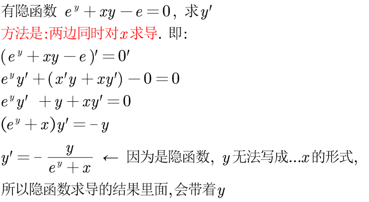
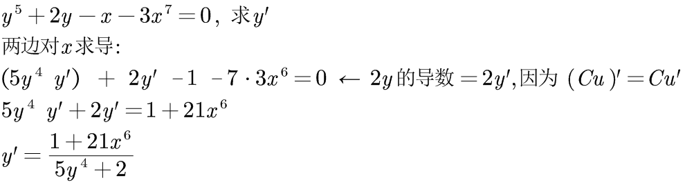
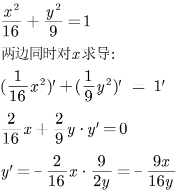
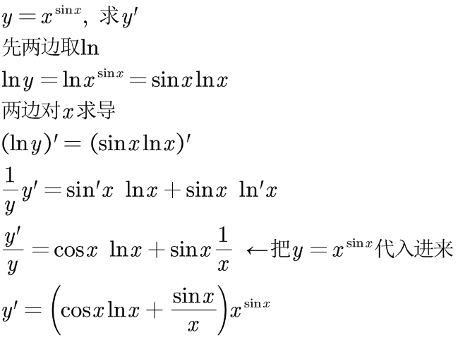
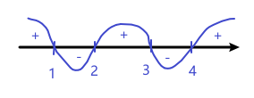
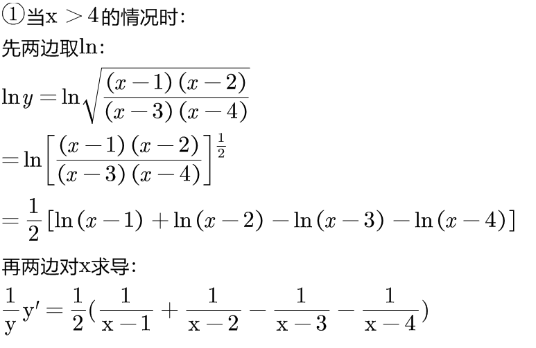
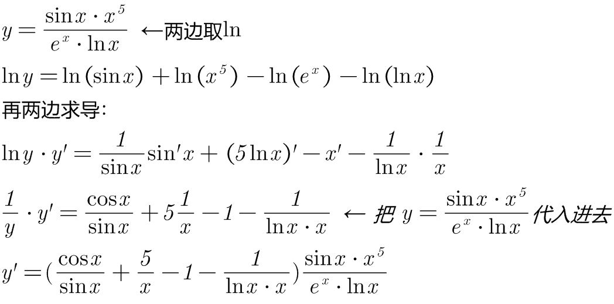
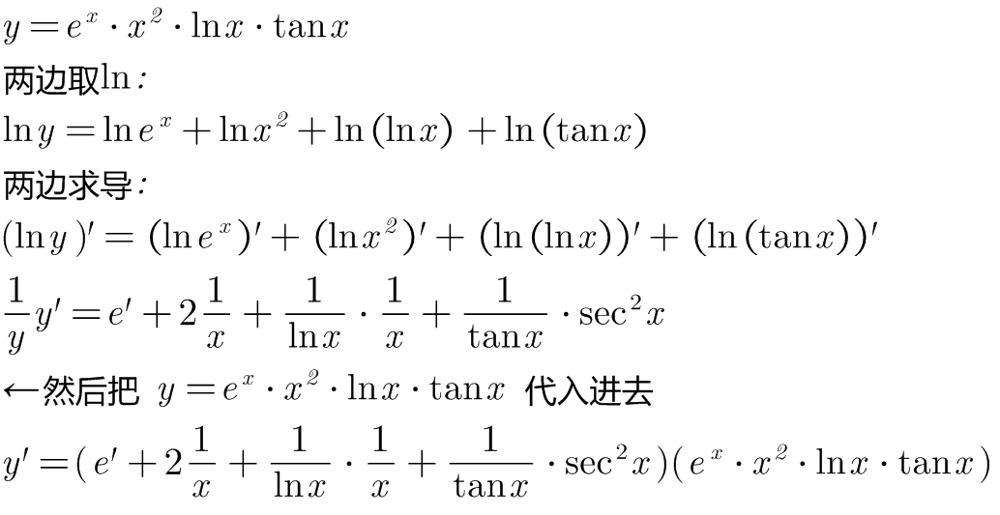

:toc: left
:toclevels: 3
:sectnums:

---

== 隐函数

所谓"隐函数", 是和"显函数"相对而言的.

- 显函数: 能清晰的写成 y= ...x 的形式.
- 而隐函数: 虽然 x和y之间有关系, 但无法写成清晰的 stem:[ y=f(x)] 的形式.

---

== 对"隐函数"求导

.标题
====
例如： +

====

.标题
====
例如： +

====

.标题
====
例如： +

====

.标题
====
例如： +

总结: +
遇到 stem:[ y = u^v] 形式, 就转成 stem:[ = e^{\ln u^v} = e^{v \ln u}] 的形式来做. +
上面的转成以e为底的式子, 使用的是这个重要公式: stem:[ a^b = e^{b \cdot \ln a} ]

记忆法: +
image:img/084.png[350,350]
====

.标题
====
例如： +
\begin{align}
	y=\sqrt[]{\frac{\left( x-1 \right) \left( x-2 \right)}{\text{(}x-3\text{)}\left( x-4 \right)}},\ \text{求}y'
\end{align}

首先,必须要保证根号内的值 >0, 其次,分母上的值 ≠ 0. +
即,我们要保证 stem:[(x-1) (x-2) (x-3) (x-4) >0 ]

这是解高次不等式了, 使用"数轴穿根法"来做. 可知: +
 +
不等式大于0的情况, 只在 x>4, 或 2<x<3, 或 x<1 时发生.

那么 x 就有这三种情况了, 所以我们求 y',也要根据 x 的这三种定义域, 分别来计算y':

====

.标题
====
例如： +

====

.标题
====
例如： +

====

