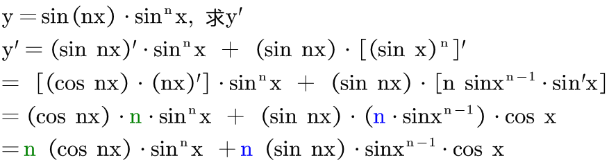

:toc: left
:toclevels: 3
:sectnums:

---

\begin{align}
常数C' &=0 \\
(x^μ)' &= μ \cdot x^{μ-1} \\
\\
(a^x)' &= a^x \ln a \\
(e^x)' &= e^x \\
(\log_a x)' &= \frac{1} {x \ln a} \\
(\ln x)' &= \frac{1} {x} \\
\\
(\sin x)' &= \cos x \\
(\cos x)' &= - \sin x \\
(\tan x)' &=  \sec^2 x \\
(\cot x)' &=  -\csc^2 x \\
(\sec x)' &=  \sec x \cdot \tan x \\
(\csc x)' &=  -\csc x \cdot \cot x \\
\\
(\arcsin x)' &= \frac{1} {\sqrt{1-x^2}} \\
(\arccos x)' &= -\frac{1} {\sqrt{1-x^2}} \\
(\arctan x)' &= \frac{1} {1+x^2} \\
(arccot x)' &= -\frac{1} {1+x^2} \\
\\
(a \pm b)' &= a' \pm b' \\
(常数c \cdot u)' &= c \cdot u' \\
(ab)' &= a'b + ab' \\
(abc)' &= a'bc + ab'c + abc' \\
(\frac{a} {b})' &= \frac{a'b - ab'} {b^2} \\
\end{align}

.标题
====
例如： +

====
