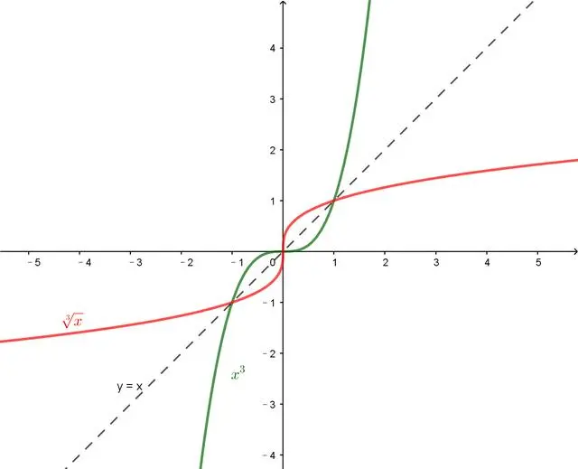
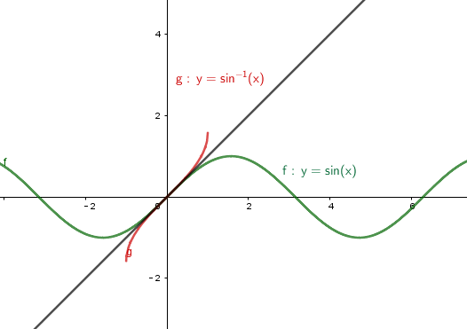
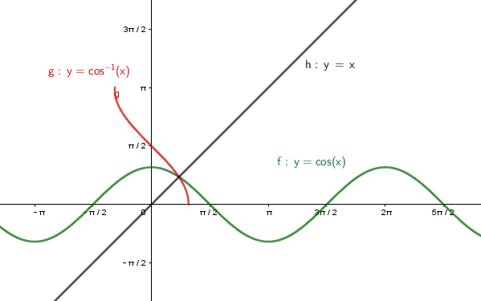
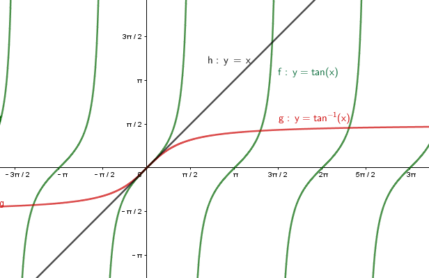
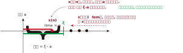
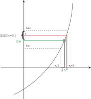
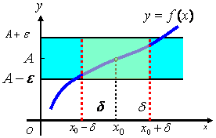
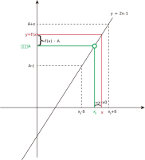
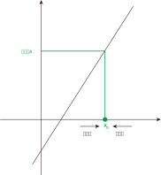

:toc: left
:toclevels: 3
:sectnums:

---

== 基础预备

f:D -> 实数域R  +
表示从D 到 R 的映射.

f(X自变量) = y因变量. +
- f: 是函数规则 +
- f(x) : 就是某个特定的具体的函数值了, 即 y值.

==== [x] <- 表示不超过 x 的最大整数. 如:

- [3.1] = 3
- [5] = 5 <- 后面的5 没有超过前面的5, 它们是相等关系
- [0] = 0
- [-1.6] = -2

---

==== 存在 ∃, 任意 ∀

∀ (Arbitrary, Any) +
∃ (Exist)

---

==== 反函数

- "原函数f", 是从定义域x 向 值域y 映射. 即, 输入x值, 输出y值. +
- 而"反函数stem:[ f^{-1}]", 是倒过来, 从值域y, 向 定义域x 映射. **即, 输入y值, 输出x值. 相当于时间倒流, 把原函数的功能倒过来.** 很像线性代数中的"逆矩阵"变换功能.

f 和 stem:[ f^{-1}] 的图像, 关于 y=x 轴对称

.标题
====
例如：有函数 y = 3x+5, 即输入x, 输出y. 它可以变为:
\begin{align*}
& 3x = y-5 \\
& x = \frac{y-5} {3} <- 这样, 就是输入y, 输出x 的形式了, 即就变成了"反函数".
\end{align*}

但一般我们习惯于将输入值, 用x表示; 输出值 , 用y值表示, 所以上面的反函数, 就索性写成 stem:[ y = \frac{x-5} {3} ], 但你不要混淆这里的x和y的意义. 这里的x是原y值, 这里的y是原x值.
====

---

==== 两个函数的运算

\begin{align}
(f \pm g)(x) &= f(x) \pm f(g) \\
(f \cdot g)(x) &= f(x) \cdot g(x) \\
\frac{f}{g} (x) &= \frac{f(x)} { g(x)} , \quad g(x) \ne 0
\end{align}

---

==== 初等函数

[options="autowidth"]
|===
|Header 1 |例如

|stem:[ y = x^a] +
power function. 幂函数
|\begin{align}
y &= x^2 \\
y &= x^{-1} = \frac{1}{x}, 此时 x \ne 0
\end{align}

|stem:[y=a^x ] (a>0 且 a≠1) +
exponential function 指数函数
|自变量 x 在指数上. 如: +
\begin{align}
y = 2^x
\end{align}

|stem:[y= \log_ax \quad(a>0 and a≠1)] +
Logarithmic Function 对数函数
|\begin{align}
& \log_{10} Y = \lg Y => X  \\
& <- 即从底数a和幂Y, 来倒推出原底数X.  \\
&  即原式为: 10^X = Y\\
\\
& \log_e Y = \ln Y => X \\
& <- 即原式为: e^X = Y \\
\end{align}

意思就是: 如果有 stem:[ a^X = Y], 则有 stem:[ X = \log_aY ] +
-> a是底数 +
-> X是指数 +
-> Y是幂（power）: 是指数运算的结果 +

|三角函数
|
|===

---

==== 反三角函数

[options="autowidth"]
|===
|原函数 |<- 其反函数

| stem:[ y = \sin x]
|对于原函数 stem:[ y = \sin x] 它的反函数其实是 stem:[x = ...y] (即: 输入y值, 输出x值)这种形式的. 但 ... 这块是什么呢? 我们就引入一个符号, 对应于"将 sin 效果反过来的操作(即 时光倒流)". 该符号就取名叫 stem:[\arcsin]. 于是, 就能将 stem:[ y = \sin x] 的反函数, 写成: stem:[x= \arcsin y] 的形式了.

如图, 注意: 为什么反函数, 只有一段? 因为如果像 sin那样(循环)延长的话, 就会造成: 一个x值, 会对应n个y值, 不符合函数的定义. 所以, 我们就只取一段.

|stem:[y = \cos x]
|stem:[x = \arccos y]

|stem:[y = \tan x]
|stem:[x = \arctan y]

|===

---

== 极限

=== ε-δ语言 (epsilon-delta语言)

epsilon-delta 语言, 是数学分析（历史上称为“无穷小分析”）中, 用来严格定义"极限"概念的数学语言.

与 ε - δ 语言类似的, 是 ε - N 语言。它是用来定义"数列极限"的严密化语言.

---

=== 极限

"极限"的定义是: 对于一个数列 x, 假设它的数值不断缩小, 趋近于某个极限a.  在数轴上, 如果存在一个任意小的数ε, 则随着数列x里的item项的增加, 一定会有一个item, 即stem:[x_n], 它与极限a 的距离, 一定会小于 ε与极限a 的距离.   +
换言之, 无论ε离极限a 的距离有多近, 数列 x 一定会有 第item 项 能比 ε与a 的关系更密切! 更接近a.

即: 给定①任意一个极小值ε, ②一个确定的极限值, ③一个数列(里面的元素值不断变小). ->  则随着数列中item的增张, 必定会有一个 item项, 该"item项的值"与"极限值"的距离, 必定会小于 "极小值ε"与"极限值"之间的距离 (这个距离其实就是ε本身).

.标题
====
例如： 有数列 stem:[2, 1/2 , 2/3, 3/4, ...,  \frac{n+(-1)^{n-1}} {n}, ...] 的极限是 1. 问, 数组中取到哪一项item 时(取到第n项, n=?时), 它与极限之间的距离, 就小于"任意最小值ε"了呢?

根据极限的定义, 数列一定存在一个item项, "其值,与极限间的距离", 小于"给出的任意最小值ε".

即:
\begin{align*}
 |数列中必有一项 x_n - 极限值1| &< 任意最小值ε <- x_n 与本例极限1 之间的距离, 要用绝对值表示, 免得它是个负数. \\
& 本例数列的通项是 \frac{n+(-1)^{n-1}} {n} , 把它带入上式\\
|\frac{n+(-1)^{n-1}} {n} -1| &< ε \\
|\frac{(-1)^{n-1}} {n}| &< ε \\
\frac{1} {n} &< ε \\
n &> \frac{1} {ε} \\
\end{align*}

说明数列中的 item 项数n, 只要达到 stem:[n > 1/ε] 这项时,它的值 与极限间的距离, 就小于一开始给出的"任意最小值ε".

不过, 还有个问题, stem:[1/ε] 未必是个整数, 而 item 项是要求整数的. 那么就要把 item项稍微调整一下, 就取 stem:[\[1/ε\]+1] 就行了, 即: 先把 stem:[1/ε] 取整数, 但会小于 stem:[1/ε] (比如, 3.1取整数, 会变成 3), 所以我们还要给它加上1位, 即变成 stem:[\[1/ε\]+1] 项 (即 n = 3+1 = 4, 第4项), 就是整数了.  (数列中取第4项, 就能比ε更小.)
====

.标题
====
例如：有数列 stem:[x_n = \frac{(-1)^n} {(n+1)^2}] , 极限为0.

\begin{align*}
& 根据极限定义, 就应该是 当数列达到某一项item 时, 其值x_n , 与极限0 之间的距离, 必定会小于任意最小值ε. 即: \\
& |x_n - 0| < ε \\
& 将数列的通项公式代入进去 \\
& |\frac{(-1)^n} {(n+1)^2} - 0| < ε \\
& \frac{1} {(n+1)^2}  < ε \\
& (n+1)^2 > \frac{1} {ε} \\
& n+1 > \frac{1} {\sqrt{ε}} \\
& n > \frac{1} {\sqrt{ε}} -1 \\
& 但  \frac{1} {\sqrt{ε}} -1  未必是整数, 所以我们还要处理一下, 把它取整 ,再加上1位 \\
& 即: n 就取 [ \frac{1} {\sqrt{ε}} -1 ] +1 \\
& 只要数列的item项 达到这个n的数值, 它与极限0之间的距离, 就小于 ε 了.
\end{align*}
====

---

=== 函数的极限

用上图来解释: 若"函数输出值y"的极限值是A (即 stem:[ \lim_{x \to x_0} f(x) = A ]), 并我们在y轴上 A的附近给出一个任意小的值ε, 则我们一定能在输入值stem:[ x_0] 的附近, 即在 stem:[ x_0 - δ] 到  stem:[ x_0 + δ] 的这段范围内, 找到一个x值, 它所对应的y值, 能满足 stem:[ f(x) - A < ε].

.标题
====
例如：y = 2x-1, 当输入值stem:[ x 取 x_0=1]时, 输出值y的极限值就是1 (即绿线部分), 问 x轴上的δ 取值是什么?

先看y轴, 从图上可以知道: 看y轴, "绿线"与"红线"间的距离, 小于"绿线"与"ε"的距离. 即: +
\begin{align}
& |f(x)-极限值A| < ε \\
& |(2x-1) - A| < ε <- 本例已知道, 当x_0=1时, y的极限值(A) 是1, 代入进去\\
& |2x-2| < ε \\
& 2|x-1|< ε \\
& |x-1|< \frac {ε}{2}  \quad ①\\
\end{align}

再看x轴, 绿线到δ 间的距离, 要小于绿线(stem:[ x_0]处)到红线(x处)的距离.  即:
\begin{align}
& 0 < |x - x_0| < δ <- 绿线 x_0 就是1 , 代进去\\
& 0 < |x - 1| < δ \quad ②\\
\end{align}

把公式② 和 ① 连起来看, 就能看出: stem:[ δ = ε/2]
====

---

=== 左极限 & 右极限

左极限:: 是从x轴左边, 向"y值极限点 在x轴上的位置"逼近.

写做:
\begin{align}
\lim_{x \to x_0^-} f(x) = y轴上的极限值A
\end{align}

右极限:: 是从x轴右边, 向"y值极限点 在x轴上的位置"逼近.

写做:
\begin{align}
\lim_{x \to x_0^+} f(x) = y轴上的极限值A
\end{align}

当 x 趋近于 -> stem:[x_0] 时, y轴上的极限 (即 f(x))存在的"充要条件"是 <--> 左右极限均存在, 且相等.

---

=== 单调有界数列, 必有极限.

收敛的, 它必有界. +
但反过来则不成立, 即 有界的, 未必收敛. (如sin函数, 永远在上下震荡, 而不会收敛到一个数值上.)

---

=== 一个数列是收敛的, 其必要充分条件是:

有一个数列 stem:[{x_n}], 给出任意小的一个数stem:[ε], 当数列到达某一项 item = N 时, 其后面的任意两项 m 和n (即 m>N , n>N), 若满足这个条件:  stem:[|x_n - x_m| < ε], 则该数列 stem:[{x_n}] 就是收敛的.  +
换言之, 就是说明 这个数列后面的点, 越来越密, 两个点之间的距离永远能达到比 ε 还要小的程度.

---

