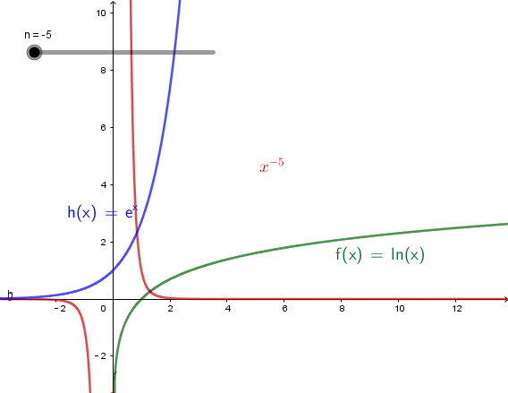
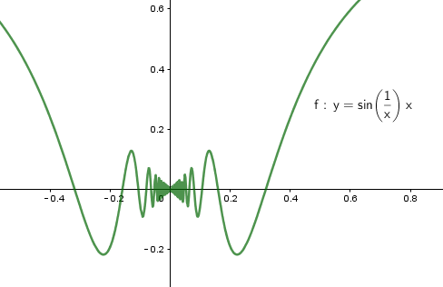
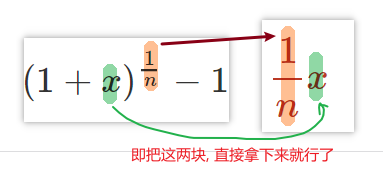
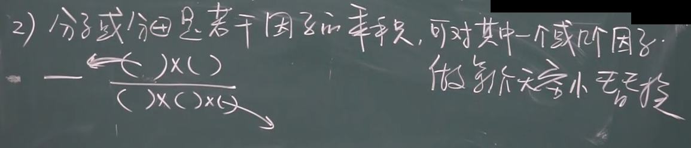

:toc: left
:toclevels: 3
:sectnums:

---

== 无穷大

有规律: stem:[ \lim_{x \to ∞} \ln x < \lim_{x \to ∞}  x^n < \lim_{x \to ∞} e^x]

---

== 无穷小

无穷小是一个趋势, 而不是一个确定的数.

\begin{align}
\frac{无穷小}{无穷小} 未必是个无穷小, 要看分母和分子, 谁缩小地更快.
\end{align}

无穷大∞ : 可以是"正无穷大", 也可以是"负无穷大". 所以:
[options="autowidth" cols="1a,1a"]

|===
|Header 1 |Header 2

| ∞ + ∞ = ?
|结果未必是 ∞, 因为前后的正负号可能相反. 一个是正无穷, 一个是负∞.

| ∞ - ∞ = ?
|结果也是未知的

| stem:[ ∞ \times ∞ = ∞]
|

|stem:[ ∞ /∞ = ?]
|

|stem:[ c \times ∞]
| 如果 常数c=0, 结果就是0

|无穷小 * 无穷大 = ?
|结果未知. 即可能是无穷小, 也可能是0, 也可能是无穷大.
|===

---

=== 性质

==== 有限个"无穷小"的和, 是无穷小.

==== 有界函数 * 无穷小 = 无穷小

什么是"有界函数"? 是说函数的值域是有限区间，这个函数就是有界函数。 如 sin, cos三角函数, 就是有界的.

如:
\begin{align}
\lim_{x\rightarrow 0}\underset{有界函数} {\underbrace{\left( sin\frac{1}{x} \right) }}\underset{无穷小} {\underbrace{x}} = 0
\end{align}

- stem:[sin (1/x) ] 是有界函数.
- 当x趋近于0时, 后面的x就是无穷小了.
- 从下图可以看出, 它们的乘积, 的确趋近于0, 是无穷小.

---

==== 常数C * 无穷小 = 无穷小

常数C可以为0

---

==== "有限个"无穷小的乘积, 依然是无穷小.

---

=== 无穷小的比较

无穷小: 就是以数0为极限的变量。 它是一个"变量". 是指自变量在一定变动方式下, 其极限为数量0. 称一个函数是无穷小量，一定要说明"自变量x"的变化趋势。

两个数都趋向于无穷小 , 但两者趋向于0 的速度有快有慢, 所以它们就能进行比较了.

[options="autowidth"]
|===
|Header 1 |Header 2

|stem:[\lim_{x \to 0} \frac{x^2} {3x} =0]  +
<- 2次方的, 肯定比1次方的, 趋向于0的速度更快. 所以这里分母比分子大.
|若 stem:[\lim β/α = 0 ], 就称: β是α的"高阶无穷小" infinitesimal of higher order. 意思是在某一过程(stem:[x→ x_0]或 x→∞ 这类过程)中，β→0 比 α→0快一些.

记作: stem:[β = ο(α)] <- 中间的ο是 希腊字母 omicron.

|stem:[\lim_{x \to 0} \frac{3x} {x^2} =∞ ] +
<- 同理, 分母比分子趋向于0的速度更快. 所以这里分母比分子小.
|若 stem:[\lim β/α = ∞ ], 就称: β是α的"低阶无穷小" Low order infinitesimal.

|stem:[\lim_{x \to 0} \frac{\sin x} {3x} = 1/3 ] +
<- 指数次数相同.
|若 stem:[\lim β/α = 常数C, \quad C \ne 0 ], 就称: β 和 α 为"同阶无穷小" Infinitesimal of the same order. 意思是两者趋近于0的速度相仿。

|
|若 stem:[\lim β/α^k = 常数C, \quad C \ne 0, k>0 ], 就称:β是关于α的"k阶无穷小".

|
|若 stem:[\lim β/α = 1], 就称:β 与 α 是"等价无穷小".记为 β~α. 等价, 就可以"相互替换"来使用.

如: stem:[\lim_{x \to 0} sinx/ x = 1 ], 即 sinx ~ x (当 x->0 时)
|===

---

=== 等价无穷小 (等价用符号 ~ 表示.)

==== sin x ~ x

---

==== \begin{align*}\sqrt[n]{1+x} -1 \sim \frac{1} {n} x \end{align*}

即:
\begin{align*}
\boxed{
[(1+x)^{\frac{1} {n}} - 1] 等价于 [\frac{1} {n} x]
}
\end{align*}

例如:
\begin{align*}
(1+ x^2) ^{\frac{1} {3}} \sim  \frac{1} {3} x^2
\end{align*}

---

==== "β与α等价" 的充要条件是 <--> stem:[β = α + ο(α)]

---

==== \begin{align*} a \sim α, b \sim β, 且 \lim \frac{α} {β}存在, 则 \lim \frac{a} {b} =  \lim \frac{α} {β} \end{align*} <- 即, 等价的东西, 可以相互替换使用. 但注意, 这个用法是有前提条件的: ① 只有在 x->0 的时候, 才能用"等价无穷小". 如果x 不是趋于0时, 是不能用"等价无穷小"的. ②, 只有在求的是 两个"等价无穷小"的比值 的时候, 才能用"等价物"来替换. 如果求的是 两个"等价无穷小"的相加, 相减, 相乘, 都不能用 "等价物"来替换.

**所以我们做题的"方法论"就是: 把复杂的东西, 用它等价的简单东西, 来替换掉. 即, "以简替繁".**

.标题
====
例：
\begin{align*}
& \lim_{x\rightarrow 0}\frac{\tan 2x}{\sin 5x} ← 因为 \tan x \sim x,\sin x \sim x, 所以\tan 2x \sim 2x, \sin 5x \sim 5x\\
& =\ \lim_{x\rightarrow 0}\frac{2x}{5x}=\frac{2}{5}\\
\end{align*}
====

.标题
====
例：
\begin{align*}
&\lim_{x \to 0} \frac{\sin x} {x^3 + 3x} <- 因为 \sin x 和 x 等价, 就用 x 来替换 \sin x\\
&= \lim_{x \to 0} \frac{x} {x^3 + 3x} \\
&= \lim_{x \to 0} \frac{1} {x^2 + 3} = \frac{1} {3}\\
\end{align*}
====

---

==== 分子或分母, 可拆成若干因子的乘积时, 就可对其中的一个或几个因子, 做等价替换.

注意: 必须是"乘积"才行, 如果只能拆成若干因子的"相加减", 则不能用"等价替换"的方法.

---

