:toc: left
:toclevels: 3
:sectnums:

---

== 洛必达法则  L'Hospital's rule -> stem:[ \lim_{x → a}\frac{f(x)}{F(x)}=\lim_{x\rightarrow a}\frac{f'(x)}{F'(x)}] <- 即对分子分母 同时求导就行了.

洛必达法则, 主要用于求极限, 尤其是 stem:[ 0/0, ∞/∞] 这种的.

两个无穷小之比 stem:[0/0 ], 或两个无穷大之比stem:[ ∞/∞] 的极限可能存在，也可能不存在。因此，求这类极限时, 往往需要适当的变形，转化成可利用"极限运算法则"或"重要极限的形式", 进行计算. 洛必达法则, 便是应用于这类极限计算的通用方法.

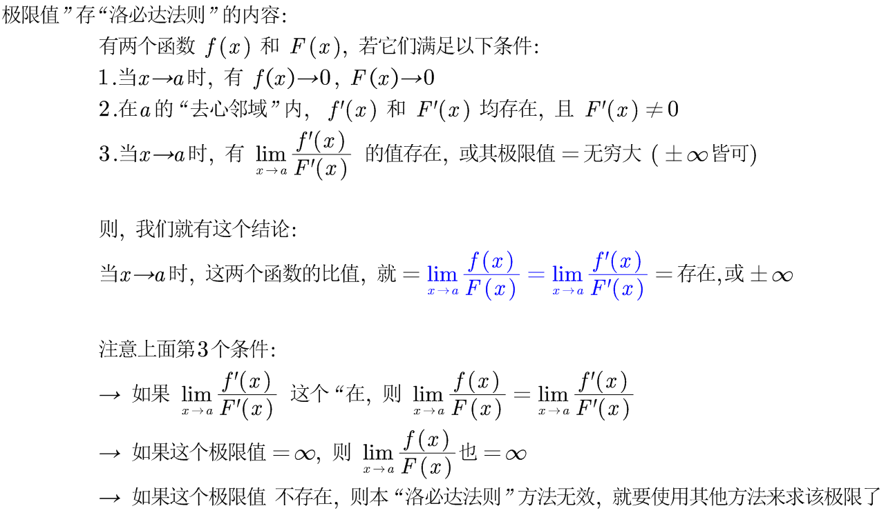

.标题
====
例如： +
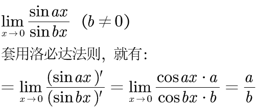

从下图就可以看出, 当 x-> 0时, stem:[ y=\frac{\sin ax} {\sin bx}]的极限值, 就等于 stem:[y= a/b]

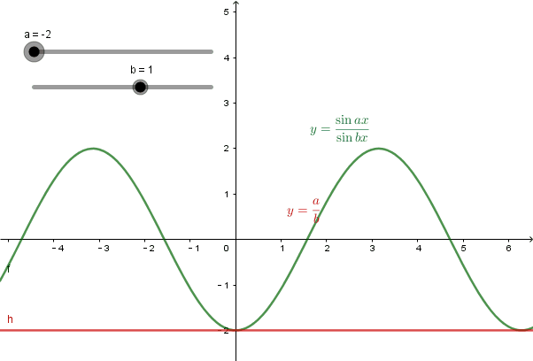
====

.标题
====
例如： +
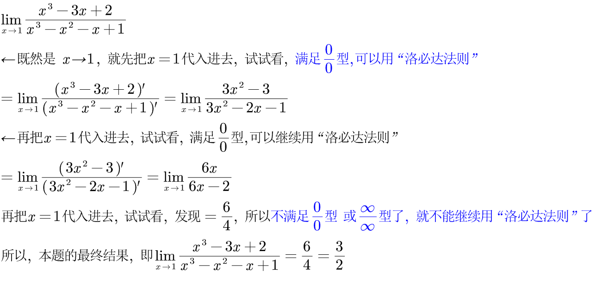
====

所以: 在运用洛必达法则之前，要先验证两个条件:

1. 分子分母的极限, 是否都等于零(或者无穷大).  -> 因为**"洛必达法则"常用于求"不定式极限"。基本的不定式极限为：stem:[ 0/0] 型； stem:[∞/∞ ] 型（ x -> ∞ 或 x -> 0 ）.** 而其他的如 stem:[ 0 \cdot ∞] 型，stem:[ ∞ - ∞ ] 型，以及 stem:[ 1^∞] 型，stem:[ ∞^0]  型和 stem:[ 0^0]  型等形式的极限, 则可以通过相应的变换, 转换成上述两种基本的不定式形式, 来求解.

2. 分子分母在限定的区域内, 是否分别"可导". +

*如果这两个条件都满足，就能使用"洛必达法则"* :分子分母分别求导, 并判断求导之后的极限是否存在： +
-> 如果极限存在，就直接得到答案了. +
-> 如果极限不存在，则说明此种"未定式", 不可用"洛必达法则"来解决. 就应从其他途径求极限, 比如利用"泰勒公式"求解. +
-> 如果极限依然不确定是否存在，即结果仍然为"未定式"，就再在验证前面所说的两个条件的基础上, 继续使用"洛必达法则"来做. -> 即, *若条件符合，洛必达法则可连续多次使用，直到求出极限为止.*

.标题
====
例如： +
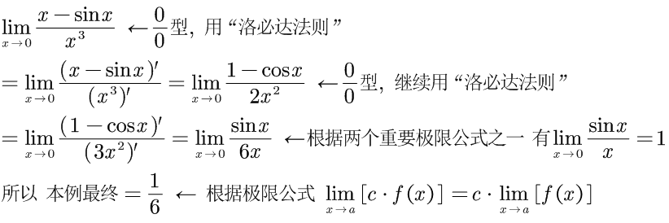
====

极限公式为:

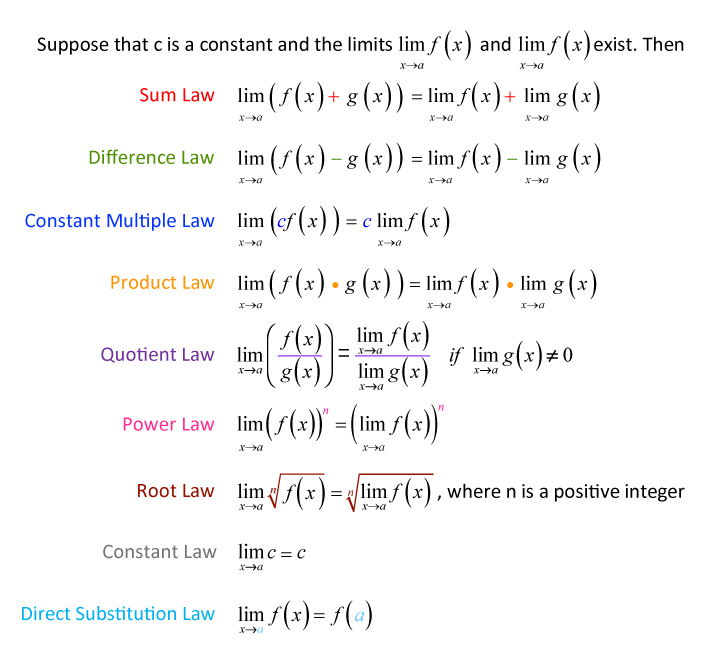

---

== 洛必达法则, 该定理所有条件中，对 x-> ∞ 的情况，结论依然成立.

.标题
====
例如： +
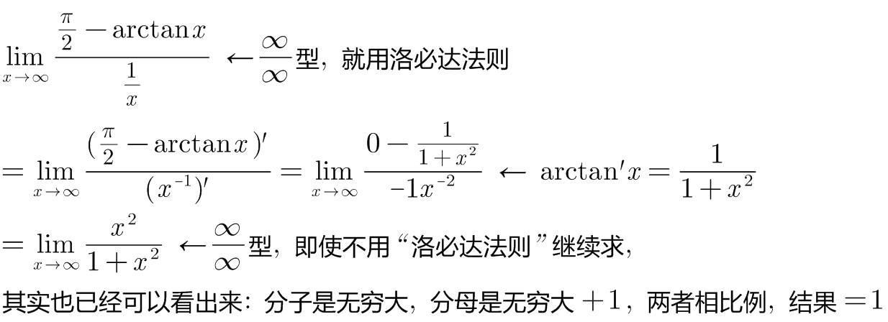
====

.标题
====
例如： +
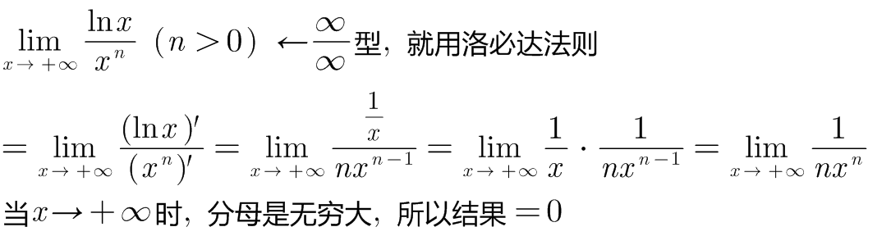
====

.标题
====
例如： +
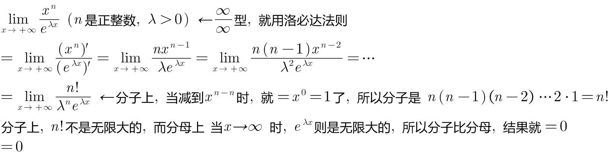

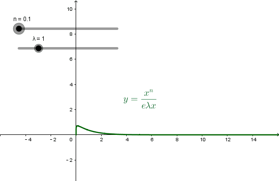
====

.标题
====
例如： +
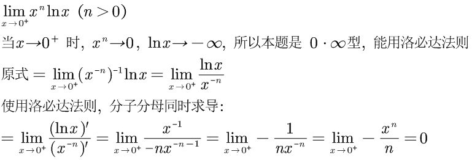

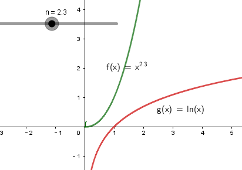
====

.标题
====
例如： +
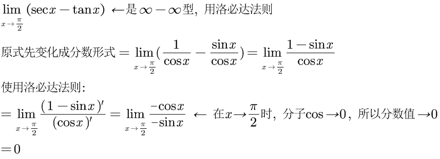

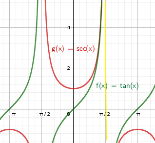

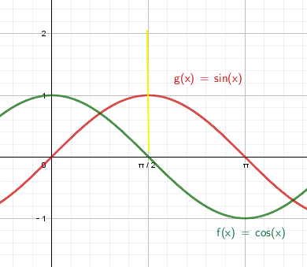

====

.标题
====
例如：
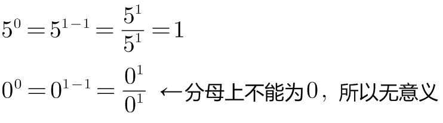

虽然stem:[0^0] 无意义, 但我们可以求它附近的极限处的值.

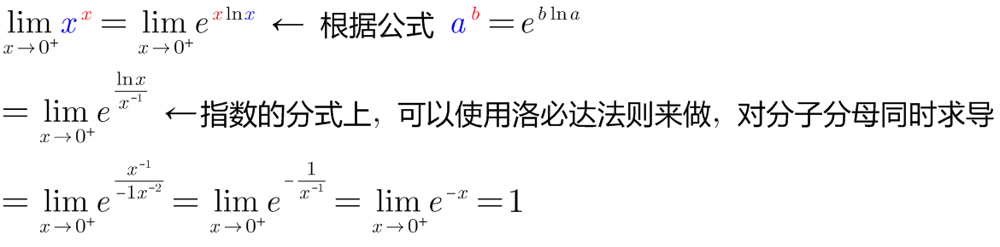

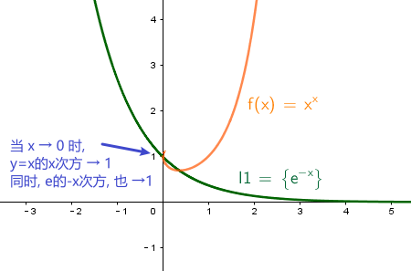
====

---

==== 技巧1: 在乘积中, 可以用 "等价无穷小替换"

.标题
====
下面的例子中, 会用到等价无穷小的替换, *但注意: 只有在乘积中, 才能用"等价无穷小替换", 如果是在加减中, 则不能用替换!*

例如： +
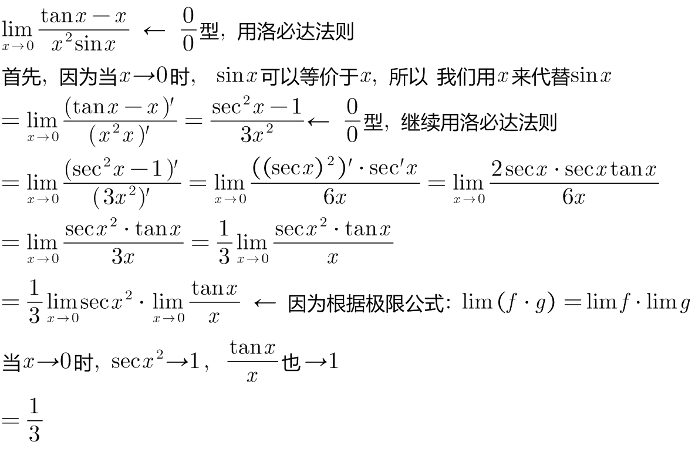

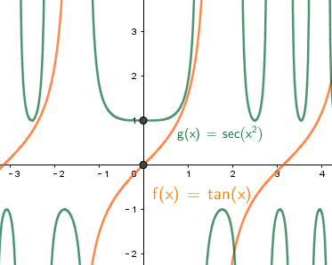
====

---

==== 技巧2: 趋近于"常数"的那些项, 就向外挪出去, 而不要一并进入求导环节

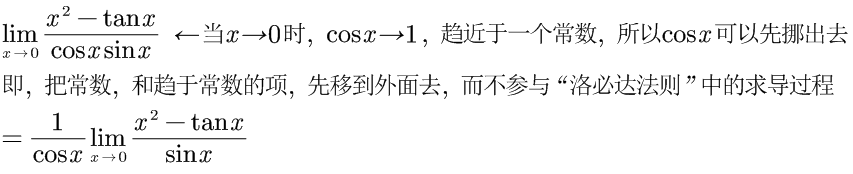

---

