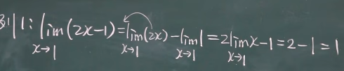
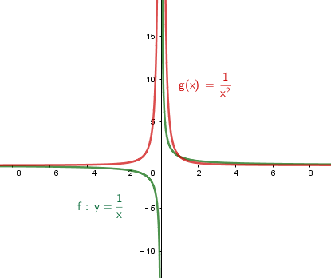
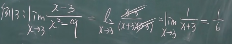
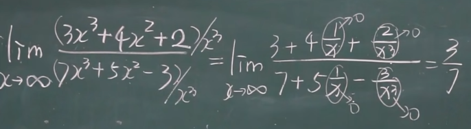
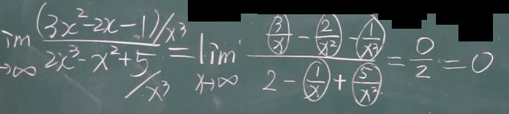
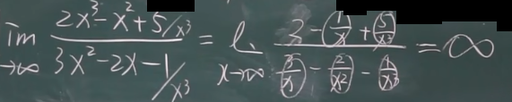

:toc: left
:toclevels: 3
:sectnums:

---

== 若有 stem:[ \lim f(x) = A,  \lim g(x) = B], 则有:

=== stem:[ \lim \[f(x) \pm g(x)\] = \lim f(x) \pm \lim g(x) = A \pm B]

在使用该定理前, 你必须先保证 f(x) 和 g(x) 的确是有极限存在的!

例: +

---

=== stem:[ \lim \[f(x) \cdot g(x)\] = \lim f(x) \cdot\lim g(x) = A  B]

=== stem:[ \lim \frac{ f(x)} {g(x)} = \frac{\lim f(x)} {\lim g(x)}], 注意首先分母上不能等于0.

---

== 若 stem:[ \lim f(x)] 存在的话, 则:

=== stem:[ \lim \[c \cdot  f(x)\] = c \cdot \lim f(x)] <- 常数c 可以提出去.

=== stem:[ \lim \[f(x)\]^n = \[\lim f(x)\]^n]

---

== 若 stem:[ f(x) > g(x)], 则: stem:[ \lim f(x) >= \lim g(x)]

如, 这两个函数: stem:[ \frac{1}{x}] 和 stem:[ \frac{1} {x^2}], 显然: +
\begin{align}
& \frac{1}{x} >  \frac{1} {x^2} \\
& 但它们的极限却是相等的 (当x趋近于无穷大时). 它们的极限值都=0. 即:
\lim_{x \to ∞}   \frac{1}{x}  = \lim_{x \to ∞}  \frac{1} {x^2}
\end{align}

---

== 一个函数是分数, 其极限, 只看它分子分母上的最高次数的情况 stem:[ \frac{a \cdot x^m}{b \cdot x^n}]: ①若 m>n, 则函数极限值=∞. ② 若 m=n, 则函数极限值 = stem:[ a/b], ③ 若 n>m, 则函数极限值=0

做题时, 把x的极限值, 代入进去做就行了. +
当发现分母为零时, 就用因式分解来做.

.标题
====
例:
\begin{align}
\lim_{x \to 1} \frac{2x-3} {x^2 -5x +4} = ∞ \\
\end{align}

因为当你把 x=1 代入进去时, 发现分母为0, 分子为 -1, 其实就是 stem:[ \frac{-1} {0}], 那就是负的无穷大了.
====

.标题
====
例：
\begin{align}
\lim_{x \to ∞} \frac{3x^3 + 4x^2 + 2} {7 x^3 + 5x^2 -3}
\end{align}

如果把x的极限是无穷大, 代入进去, 会发现, 分子分母都是无穷大, 就变成了 stem:[ ∞/∞] 的形式. +
我们这样来处理: 把分子分母, 都除以 stem:[ x^3], 于是就:

**其实你能发现规律了: 当满足 ① x -> ∞, ② 分子分母的最高次的次数相同, 比如本例最高都是 stem:[ x^3]次, 则: -> 极限值, 就取分子分母最高次的系数. 如 本例就取 stem:[ \frac{3 x^3} {7 x^3}] 的系数, 即 stem:[ 3/7], 这个就是极限值了.**
====

.标题
====
例：
\begin{align}
\lim_{x \to ∞} \frac{3x^2 - 2x - 1} {2 x^3 + x^2 +5}
\end{align}

同样, 先分子分母, 都除以 stem:[ x^3], 于是就:

**这里也有规律: 当满足 ① x-> ∞, ②分母的最高次的次数, 要比分子的最高次次数还大时, 比如本例"分母的最高次次数"是 stem:[ x^3], 而"分子的最高次次数"只有 stem:[ x^2], 则: -> 极限就是0. **
====

.标题
====
例：
\begin{align}
\lim_{x \to ∞} \frac{2x^3 - x^2 +5} {3 x^2 - 2x -1}
\end{align}

同样, 先分子分母, 都除以最高次的 stem:[ x^3], 于是就:

**规律就是: 如果 ① x-> ∞, 且 ②"分子的最高次数", 比"分母的最高次数"大, 如本例就是 stem:[ \frac{x^3}{x^2}], 则: -> 极限值 = ∞**

---

