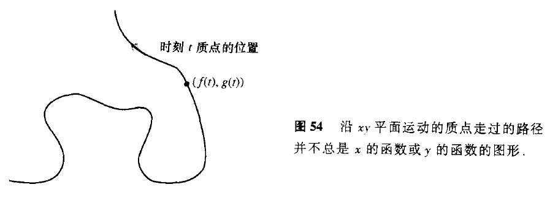
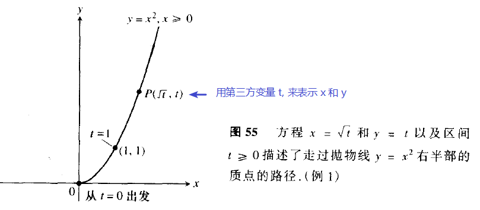
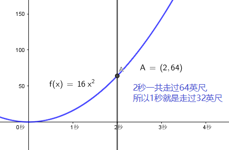
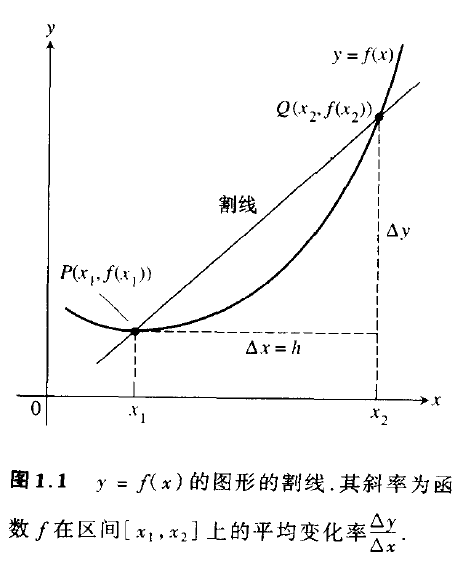
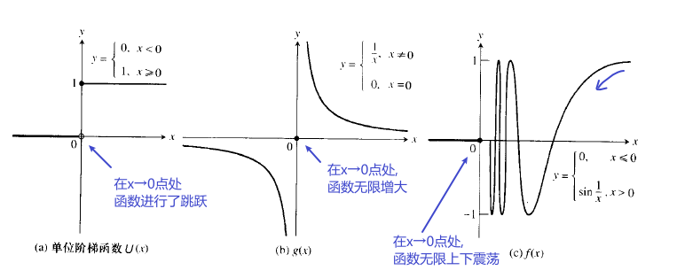

= 参数方程
:toc: left
:toclevels: 3
:sectnums:

---

== 参数方程

为了描述上面的不规则路径, 我们可以用一对方程来描述该路径:
\begin{align}
\begin{cases}
x = fnGetX(time) \\
y = fnGetY(time)
\end{cases}
\end{align}

即: 输入某time时间点, 就输出在该时间点时, 运动质点的 x坐标值和 y坐标值. +
*换言之, 我们把 x,和y 的值, 与另一个第三方变量 time 建立起了联系. 我们只要知道 time 的具体数值, 就能同时知道 x 和 y值 了.* +
所以, 它能告诉我们在任何时刻 t 时, 质点的位置stem:[ (x,y) = (fnGetX(t), fnGetY(t))]

.标题
====
例如： stem:[ y = x^2 ], 如何用一个第三方变量 t 来建立起与 x 和 y 的联系? 即如何用 t 来分别表示 x 和 y ?

我们可以令 t = y, 然后代入 stem:[ y = x^2 ], 即 stem:[t = x^2, \quad x = \sqrt{t} ]

所以, 用 t 来表示x和y, 就是:
\begin{align}
\begin{cases}
x = \sqrt{t} \\
y = t
\end{cases}
\quad (t \ge 0)
\end{align}

====

68 未完

---

== 变化率

.标题
====
例如： 一块石头掉落下来, 头2秒中,它的平均速度是多少?

根据物理公式: 下落的头t秒中, 经过的英尺数为: stem:[距离y = 16 t^2]
\begin{align}
\frac{\Delta y}{\Delta x}
= \frac{16(2)^2 - 16(0)^2} {2-0}
= 32 英尺/秒
\end{align}

====

所以, y = f(x) 关于x 在 区间stem:[\[ x_1, x_2\] ] 上的平均变化率就是:
\begin{align}
\boxed{
\frac{\Delta y}{\Delta x}
= \frac{f(x_2) - f(x_1)}{x_2 - x_1}
= \frac{f(x_1 + horizontal) - f(x_1)}{horizontal}, \quad horizontal \ne 0
}
\end{align}

*在几何上, 平均变化率, 就是割线的"斜率".*

从下图中, 可以注意到: f 在 stem:[\[x_1, x_2 \]] 的变化率, 就是通过点 stem:[ P(x_1, f(x_1)) ] 和 stem:[ Q(x_2, f(x_2)) ] 的直线的"斜率".  +
几何上, *连接曲线上两点的直线, 就是该曲线的"割线". 因此, f 从 stem:[ x_1] 到 stem:[x_2 ] 的平均变化率, 就是割线PQ的斜率.*

瞬时变化率:: 我们把"瞬时变化率", 作为"平均变化率"的极限. 比如, 岩石下落到瞬时 t=2秒处的速度变化率.

---

== 极限

在有些情况下, 重要的是要理解当x变得非常大时(在x → ∞ 和 -∞ 处), 一个函数的行为如何. (换言之, 即预测该函数的未来情况)

---

=== "函数在某点处没有极限"的情况

---

=== 三明治定理(夹逼定理)

普林斯顿
43

托马斯
112
