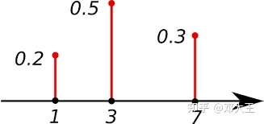
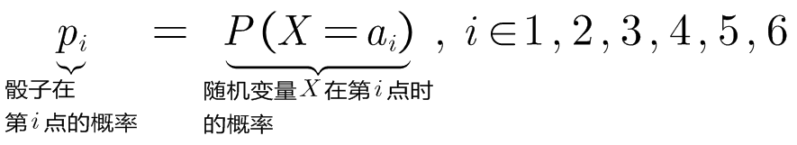
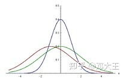
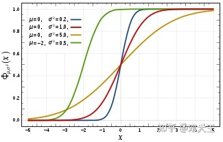
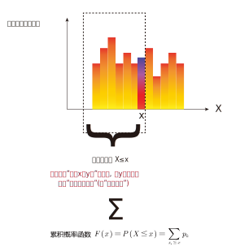
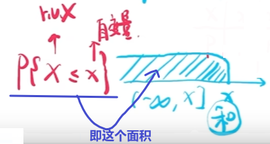
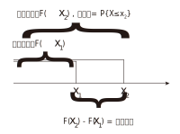
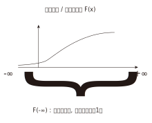

= 概率密度函数 Probability Density Function
:toc: left
:toclevels: 3
:sectnums:

---

== 概率函数 <- 一次只能表示"一个取值的概率"

=== 概率质量函数(PMF) <- 是"离散型数据"的概率分布

"离散型数据"的概率分布, 称为"概率质量函数"（PMF）. +
典型的"离散概率分布"包括: 伯努利分布，二项分布，几何分布，泊松分布等.

.标题
====
例如：
比如，掷骰子不同点朝上的概率为： +

在这个函数里:

- 自变量X 是"随机变量"的取值，
- 因变量 stem:[ p_i]是"自变量X所取到某个值"的概率。

从公式上来看，"概率函数", 一次只能表示一个取值的概率。比如 stem:[ P(X=1)= 1/6], 就表示: 当随机变量X 取值为 1时, 即骰子的点数为1时的概率, 为1/6. 所以说, 它一次只能代表一个随机变量的取值。
====

---

=== 概率密度函数 Probability Density Function (PDF) <- 是"连续型数据"的概率分布

"连续型数据"的概率分布, 称为"概率密度函数"（PDF）.  +
典型的"连续概率分布"包括: 正态分布，指数分布等.

---

==== "概率密度函数"的 某区间上的概率值 = 该区间的函数曲线段, 与x坐标轴之间围成的面积.

实际上就是对'概率密度函数"进行定积分.

---

== ----- -----

---

== 概率分布函数,或叫"累积分布函数" Cumulative Distribution Function (CDF) <- 是对"概率函数"值的累加结果 . 具体说就是: 是对"概率质量函数"的累加, 或对"概率密度函数"的积分

对于随机变量, 我们通常关心的, 并不是它取某个值的概率(即我们并不关心它的分布律), 而是更关心它落在某个区间内的概率. 比如, 某考试, 我们关心的是不及格的人数, 和分数 ≥80分的人数. 这个区间段所占的概率值, 就是用"累加函数(又叫"分布函数")"来表示的, 即:

**P{随机变量X ≤ 自变量x} = F(x) ← 它表示随机变量X 落在 (-∞, x] 这段区间上的概率.** +
既然F(x)是个概率值, 所以它的取值范围, 就是 0-1. 即 stem:[0 \leq F(x) \leq 1].

\begin{align*}
& 对于P\{x_1 < X \leq x_2\}, 即随机变量X 在 (x_1, x_2] 这段区间上的概率, 它的值, 就等于 \\
& =F(x_2)-F(x_1) \\
& = P\{X \leq x_2\} - P\{X \leq x_1\}
\end{align*}

---

=== 单调不减性: 即 对于任意的 stem:[x_1 < x_2], 有: stem:[F(x_1) \leq F(x_2)]

比如, "分数小于等于70分的人" 其概率一定是小于等于 "分数小于80分的人". 即 stem:[F(70) \leq F(80)].

---

=== F(-∞)=0 , F(+∞)=1

\begin{align*}
& F(-∞)= \lim_{x -> -∞} F(x)=0  <- 称之为"不可能事件"\\
& F(+∞)= \lim_{x -> +∞} F(x)=1 <- 称之为"必然事件"\\
\end{align*}

---

=== 右连续性: stem:[\lim_{x -> x_0^+} F(x)=F(x_0)]

https://www.bilibili.com/video/BV1A7411U73s/?spm_id_from=333.337.search-card.all.click&vd_source=52c6cb2c1143f8e222795afbab2ab1b5

34

