= 概率密度函数 Probability Density Function
:toc: left
:toclevels: 3
:sectnums:

---

== ★ Mathematica 和 Geogebra 中, "概率函数 PDF"的用法

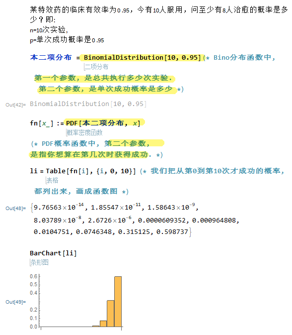

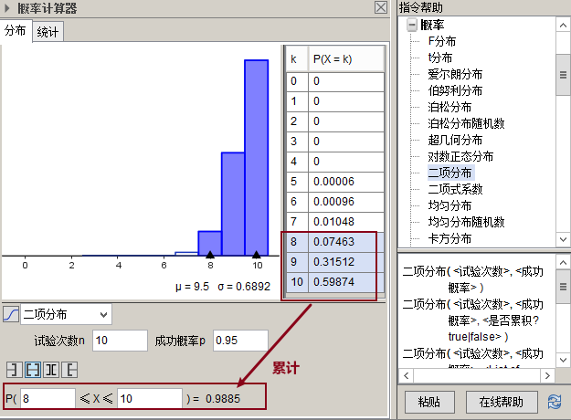

---

== 介绍

=== 解释1 (刘嘉概率讲座)

每一个随机变量(随机事件), 都有自己的概率分布 f(x). 概率分布是有规律可循的. +
常见的"概率分布模型" 有 : 正态分布, 幂律分布, 泊松分布等. 它们分别对应不同的数学公式, 即代表一种独特的变化规律.

有了这些模型，我们解决各种随机事件就简单多了，看看它适用于哪个模型，直接带入公式计算就好了。

现实世界纷繁复杂，**各种随机变量**数不胜数。但**在概率学家眼里，它们只分为两类—— ①已经找到变化规律的，可以用概率分布模型描述的; ② 还没有找到变化规律,无法用概率分布模型描述的。**

**对于规律相似的同一类现象，"概率分布模型"只有一个，只是模型中的参数不同。**比如人的身高和智商，它们的规律就很相似，都服从"正态分布"，只是各自的均值和方差不一样。同样的，地震和个人财富大体上都"服从幂律分布"，只是对应的幂指数不同。

那么对于那些还没找到变化规律的随机变量, 我们如何应对呢? *一般,面对一个无法解释的现象，我们会先假设它服从某个概率分布模型，然后再去验证假设。* 概率分布模型都是被数学证明了的, 但我们在拿模型去描述现实时, 有可能选错模型. 比如, 拿"正态分布"去描述金融资产的风险, 就不是个好的模型.

概率分布 (f(x)函数) , 就好比一个工具箱. 一个个的概率分布模型, 就好比是工具箱里的工具。那么, 目前有多少种工具能帮助我们呢? 常见的有几十种. 这个数字未来还会继续增加, 数学家们一直在努力.

虽然概率分布模型有几十种,但几个常见的, 就已经能帮我们理解大部分现象了. 其中最常见的, 就是"正态分布".

---

=== 解释2

[options="autowidth"]
|===
|Header 1 |Header 2

|"频数"的分布直方图
|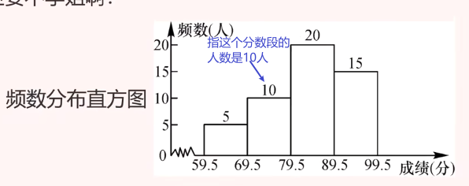

|"频率"的分布直方图
|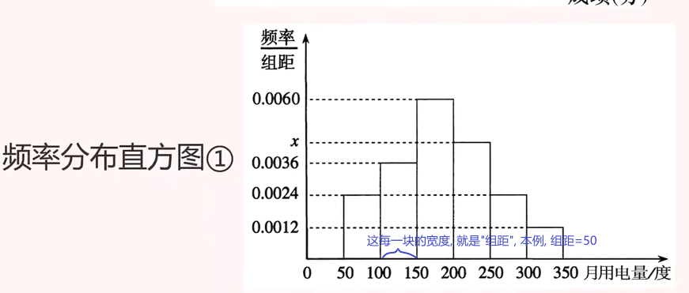

上面"频率"的分布直方图, 我们可以发现: 其y轴是 stem:[ \frac{"频率"}{"组距"}]

那么每一块的面积, 就是"底宽"(即"组距") 乘以"高度"(即y值), 就是 stem:[= "组距" ×  \frac{"频率"}{"组距"} = "频率"="概率"] +
所以, 每一块的面积, 其实就是"频率"="概率".

本例即, 比如落在 "50-100 之间这块区域" 的概率, 就是等于"这块长条的面积".

|"一维随机变量X" 的"概率(密度)函数" f(x)
|对"频率"的分布直方图 , 我们把组距缩小, 缩到无穷小, 就能形成 "概率(密度)函数", 此时, y轴就成为了"概率".

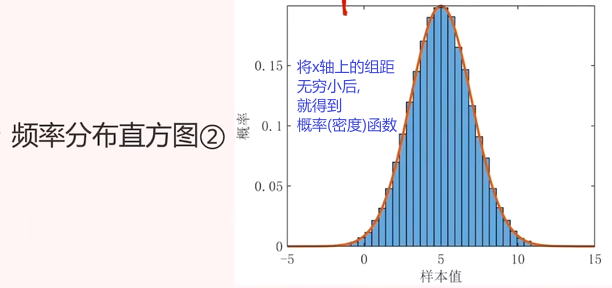

概率(密度)函数, 就是单位时间(长度/面积/空间, 即一维,二维,三维)内, 事件发生的概率.

|"一维随机变量X" 的"累加函数" F(X) (即分布函数)
|函数 stem:[ F(X) = P{X≤x}], 就称为 X 的"累加函数".

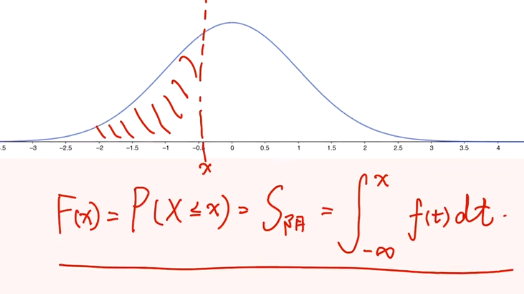

|二维随机变量(X,Y)
|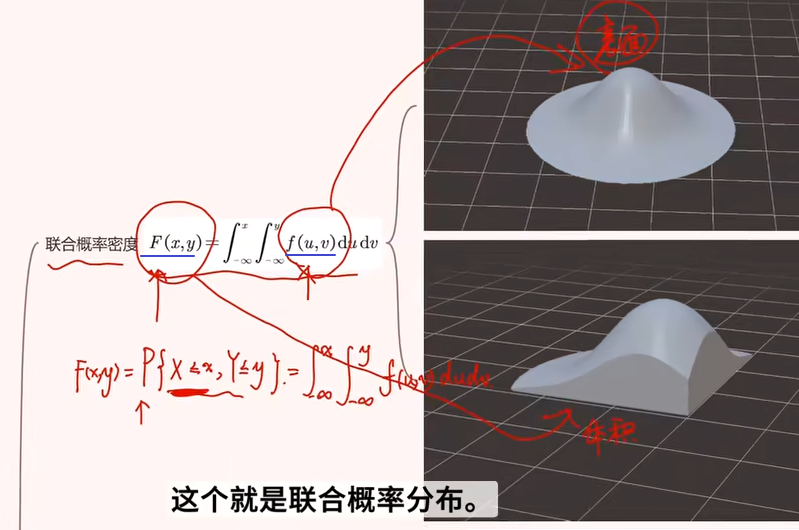

|边缘概率(密度)函数
|

|条件概率(密度)函数
|
|===

https://www.bilibili.com/video/BV1DW4y1r71v/?spm_id_from=333.337.search-card.all.click&vd_source=52c6cb2c1143f8e222795afbab2ab1b5

28

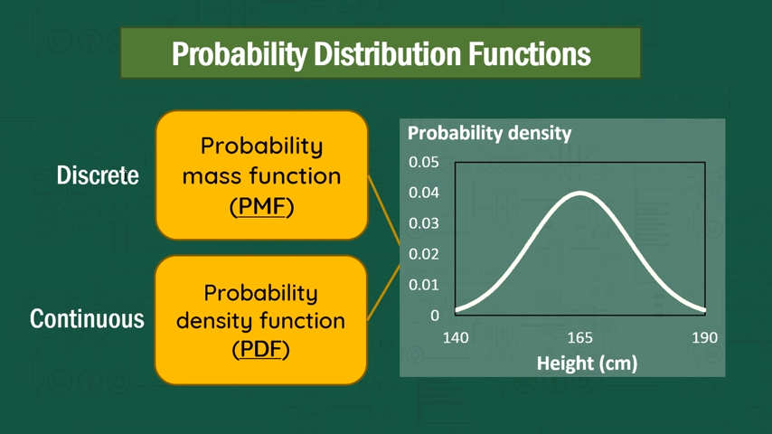

[options="autowidth"]
|===
|Header 1 |"概率函数" 和 "累加函数"

|离散型数据的
|下图, 左边是"概率函数", 右边是"累加函数" +
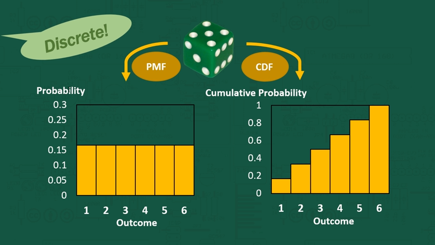

....
- cumulative (a.) :
having a result that increases in strength or importance each time more of sth is added （在力量或重要性方面）聚积的，积累的，渐增的

including all the amounts that have been added previously 累计的；累积的
the monthly sales figures and the cumulative total for the past six months 每月的销售数字和过去六个月的累计总数
....

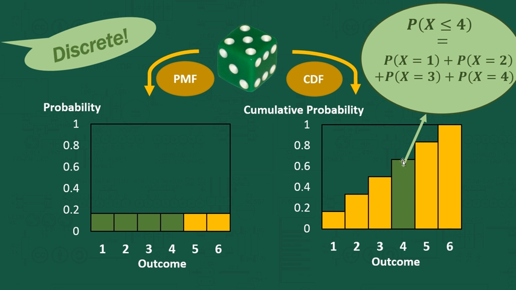

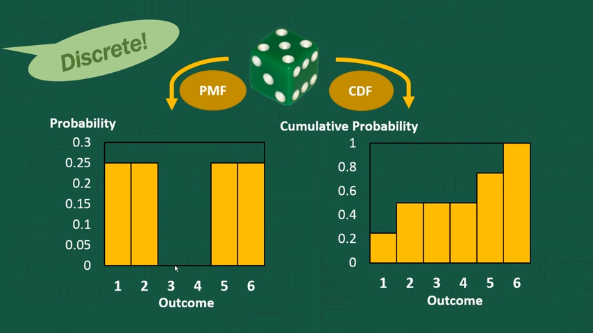

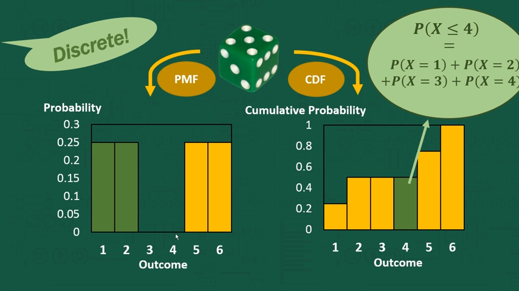

|连续型数据的
|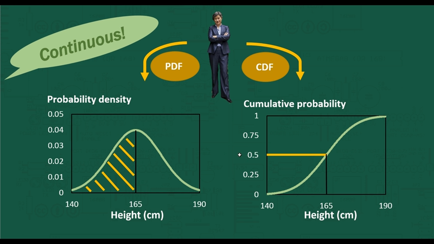

|===

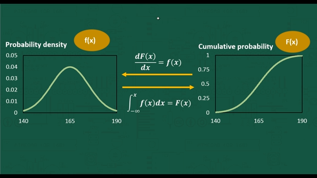

---

== 概率函数 <- 一次只能表示"一个取值的概率"

=== 概率质量函数(PMF) <- 是"离散型数据"的概率分布

"离散型数据"的概率分布, 称为"概率质量函数"（PMF）. +
典型的"离散概率分布"包括: 伯努利分布，二项分布，几何分布，泊松分布等.

image:img/0172.jpg[,]

.标题
====
例如：
比如，掷骰子不同点朝上的概率为： +
image:img/0096.png[,]

在这个函数里:

- 自变量X 是"随机变量"的取值，
- 因变量 stem:[ p_i]是"自变量X所取到某个值"的概率。

从公式上来看，"概率函数", 一次只能表示一个取值的概率。比如 stem:[ P(X=1)= 1/6], 就表示: 当随机变量X 取值为 1时, 即骰子的点数为1时的概率, 为1/6. 所以说, 它一次只能代表一个随机变量的取值。
====

---

=== 概率密度函数 Probability Density Function (PDF) <- 是"连续型数据"的概率分布

"连续型数据"的概率分布, 称为"概率密度函数"（PDF）.  +
典型的"连续概率分布"包括: 正态分布，指数分布等.

image:img/0173.jpg[,]

---

==== "概率密度函数"的 某区间上的概率值 = 该区间的函数曲线段, 与x坐标轴之间围成的面积.

实际上就是对'概率密度函数"进行定积分.

---

== ----- -----

---

== 概率分布函数,或叫"累积分布函数" Cumulative Distribution Function (CDF) <- 是对"概率函数"值的累加结果 . 具体说就是: 是对"概率质量函数"的累加, 或对"概率密度函数"的积分

image:img/0174.jpg[,]

image:img/0175.svg[,]

对于随机变量, 我们通常关心的, 并不是它取某个值的概率(即我们并不关心它的分布律), 而是更关心它落在某个区间内的概率. 比如, 某考试, 我们关心的是不及格的人数, 和分数 ≥80分的人数. 这个区间段所占的概率值, 就是用"累加函数(又叫"分布函数")"来表示的, 即:

**P{随机变量X ≤ 自变量x} = F(x) ← 它表示随机变量X 落在 (-∞, x] 这段区间上的概率.** +
既然F(x)是个概率值, 所以它的取值范围, 就是 0-1. 即 stem:[0 \leq F(x) \leq 1].

image:img/0199.png[,]

\begin{align*}
& 对于P\{x_1 < X \leq x_2\}, 即随机变量X 在 (x_1, x_2] 这段区间上的概率, 它的值, 就等于 \\
& =F(x_2)-F(x_1) \\
& = P\{X \leq x_2\} - P\{X \leq x_1\}
\end{align*}

image:img/0200.svg[,]

---

=== 单调不减性: 即 对于任意的 stem:[x_1 < x_2], 有: stem:[F(x_1) \leq F(x_2)]

比如, "分数小于等于70分的人" 其概率一定是小于等于 "分数小于80分的人". 即 stem:[F(70) \leq F(80)].

---

=== F(-∞)=0 , F(+∞)=1

\begin{align*}
& F(-∞)= \lim_{x -> -∞} F(x)=0  <- 称之为"不可能事件"\\
& F(+∞)= \lim_{x -> +∞} F(x)=1 <- 称之为"必然事件"\\
\end{align*}

image:img/0201.svg[,]

---

=== 右连续性: stem:[\lim_{x -> x_0^+} F(x)=F(x_0)]

https://www.bilibili.com/video/BV1A7411U73s/?spm_id_from=333.337.search-card.all.click&vd_source=52c6cb2c1143f8e222795afbab2ab1b5

34

