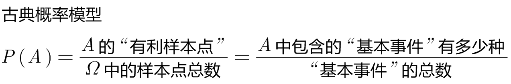
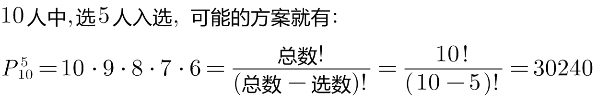
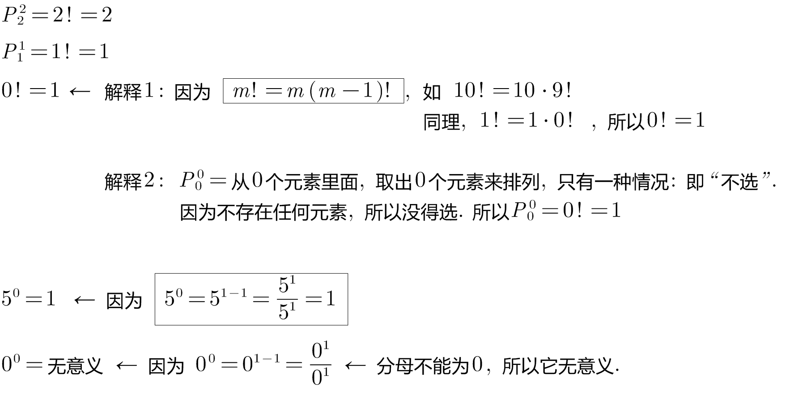
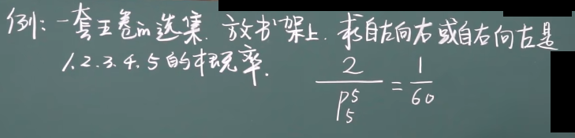
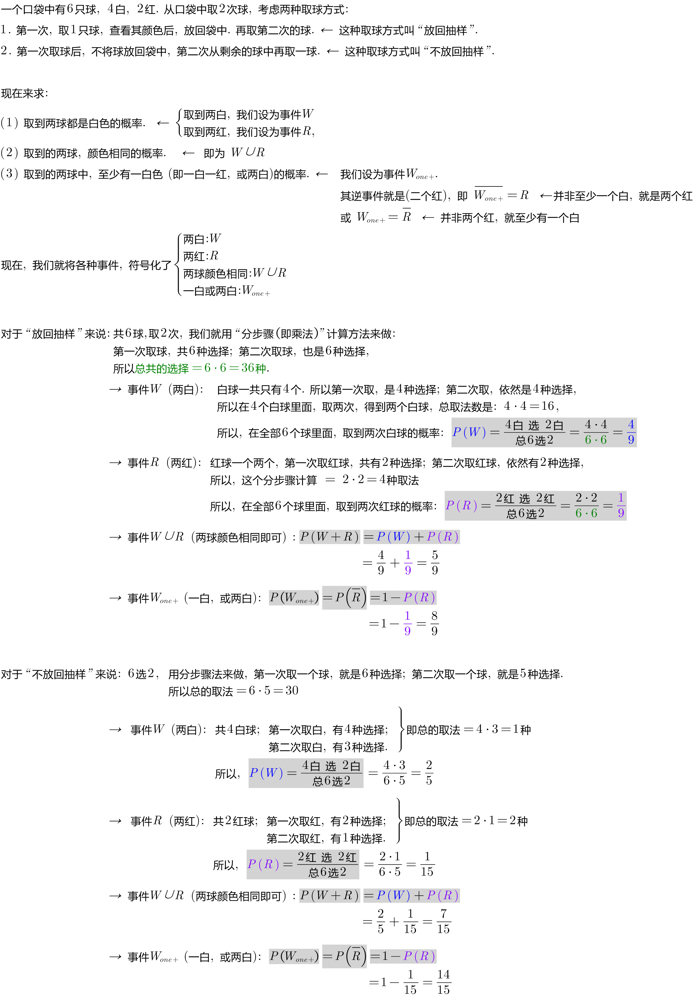
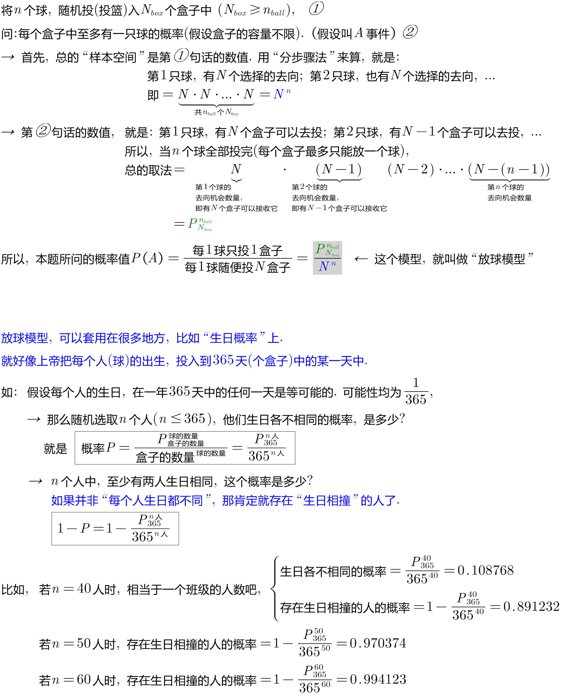
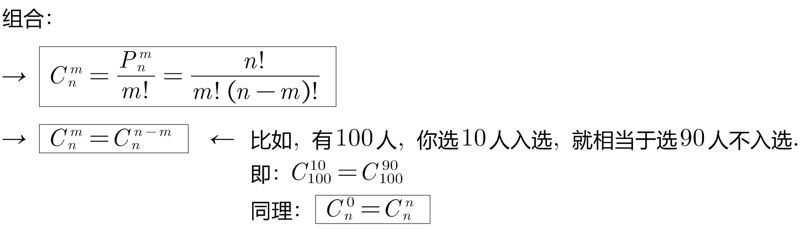
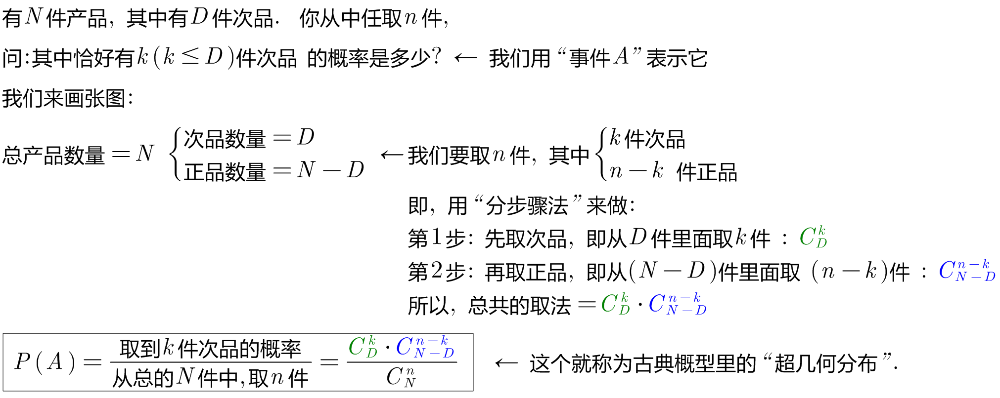
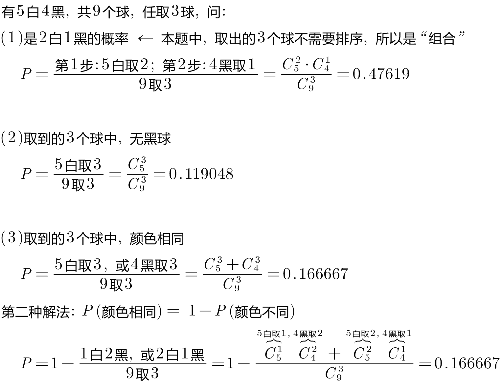
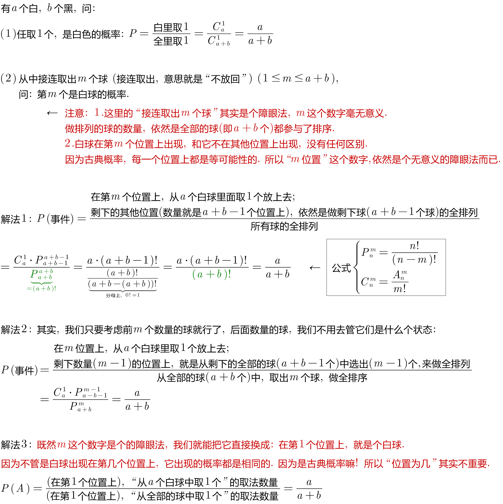

= 事件
:toc: left
:toclevels: 3
:sectnums:

---

== 事件

[options="autowidth"]
|===
|Header 1 |Header 2

|随机试验 E
|随机试验 E (random experiment), 有以下这些性质:

1. 在相同的条件下, 可以重复
2. 结果不止一个
3. 无法预测哪个结果会出现

|事件
| 即每种结果, 就叫一个"事件".

|基本事件
|相对于试验目的来说, 不能再分解的结果, 就称为"基本事件".

|复合事件
|由"基本事件"复合而成.

|样本全集, 或样本空间, 用 Ω 表示
|

|样本空集, 用 Φ 表示
|

|必然事件 Ω
|每次试验中一定会发生的结果, 叫"必然事件". 用 Ω 表示.

|不可能事件 Φ
|一定不会发生的事件, 用 Φ表示

|样本空间 Ω
|即所有"基本事件"的集合. 用 Ω 表示. 相当于"全集"的概念. +
如, 掷硬币的结果"样本空间", 就是 Ω={正, 反} +
扔两个硬币, 其结果"样本空间"就是: Ω={(正,正), (正, 反), (反,正), (反,反)}

|样本点 ω
|就是"样本空间"中的元素, 即"基本事件". 用 ω 表示

|无限可列个
|意思就是: 能按某种规律, 排成一个序列. 如:

- 自然数 0,1,2,3... +
- 整数: 0, 1, -1, 2, -2, 3, -3 ... +
- 有理数(stem:[ p/q]):  stem:[ 0, 1/1, -1/1, 1/2, -1/2, ...]

|互不相容事件
|即 两个事件A,B不同时发生, 它们的交集是空集Φ.

|对立事件
|即非此即彼, 二选一. 换言之, A,B 互不相同, 且 stem:[ A∪B=Ω, \  AB=Φ, \ A+B=Ω] +
记作: stem:[ A = \overline(B)] ← A 等于 B逆 +
或 stem:[ B = \overline(A)]

stem:[ \overline(\overline(A))=A] ← 相当于负负得正,  "A逆"的逆, 就等于A自己

stem:[ A-B =A - AB = A \overline(B)]

image:img/0001.png[,200]

注意: "互不相容事件", 可以都不发生. 但对于"对立事件", 必须有一个发生.

|完备事件组
|collectively exhaustive events. 即: stem:[ A_1, A_2, ... A_n] 两两互不相容, 且 stem:[ ∪_(i=1)^n A_i = Ω] ← 它们所有的并集, 就构成全集本身.

image:img/0002.png[,150]
|===

---

== 事件间的运算律 : ① 加号(+) 代表"或者, 并集 ∪";  ② 乘法代表"交集 ∩"

[options="autowidth"]
|===
|Header 1 |Header 2

|分配率:
|stem:[ (A∪B)∩C =(A∩C) ∪ (B∩C)] +
image:img/0003.png[,150]

stem:[ (A∩B)∪C =(A∪C) ∩ (B∪C)] +
image:img/0004.png[,150]

|对偶律
|stem:[ \overline(A∪B) = \overline(A) ∩ \overline(B)]   ← A并B后的逆, 等于A逆 交 B逆 +
image:img/0005.png[,150]

stem:[ \overline(A_1 ∪ A_2 ∪ ... ∪ A_n) = \overline(A_1) ∩ \overline(A_2) ∩ ... ∩ \overline(A_n)]

stem:[ \overline(A∩B) = \overline(A) ∪ \overline(B)]   ← 长线变短线, 里面的符号(交或并)要改变方向 (原∩变∪, 原∪变∩)

stem:[ \overline(A_1 ∩ A_2 ∩ ... ∩ A_n) = \overline(A_1) ∪ \overline(A_2) ∪ ... ∪ \overline(A_n)]
|===

.标题
====
例如： +
A, B, C 是 试验E 的随机事件.

[options="autowidth"]
|===
|Header 1 |记为

|A发生
| A

|只有A发生
|stem:[ A, \overline(B),  \overline(C)]

|A, B, C 恰有一个发生
|stem:[ A \overline(B) \overline(C) + \overline(A) B \overline(C) + \overline(A) \overline(B) C]

|A, B, C 同时发生
| ABC

|A, B, C 至少一个发生
| A+B+C

|A, B, C 至多一个发生(那就说明"可以都不发生")
|stem:[ A \overline(B) \overline(C) + \overline(A) B \overline(C) + \overline(A) \overline(B) C +  \overline(A)  \overline(B)  \overline(C) ]

|恰有两个发生
|stem:[ AB \overline(C) + A \overline(B) C + \overline(A) BC  ]

|至少两个发生(即, 可以两个, 也可以三个)
|stem:[ AB \overline(C) + A \overline(B) C + \overline(A) BC +ABC + AB(即 "C发不发生, 不用管") + BC + AC ]
|===
====

.标题
====
例如： +
image:img/0006.png[,750]
====

---

== 事件的概率 probability

概率: 用 P(A)表示

性质:

-  stem:[ P(Ω)=1]
- stem:[ P(Φ)=0]
- stem:[ 0 \le P(A) \le 1]

---

== 古典概型

满足这些条件的, 就属于"古典概率模型":

- 样本点是有限的
- 所有样本点出现的可能性, 是相同的. 即"等可能性".

则: +

image:img/0013.png[,450]

古典概率模型的性质:

[options="autowidth"]
|===
|Header 1 |Header 2

|性质1: 非负数性
|stem:[ 0 <= P(A) <= 1]

|性质2: 非负数性
|stem:[ P(Ω)=1, \quad  P(Φ)=0]

|性质3: 有限可加
|stem:[ A_1, A_2, ... A_n] 是互不相容的.

stem:[ P(A_1 +A_2 + ...+ A_n)= P(A_1) +  P(A_2)  + P(A_n) ]
|===

*古典概率模型: +
其优点是: 可以直接套公式来算. +
但其缺点是: ①其结果必须是"有限个"的结果 (如, 掷骰子, 结果就是6个基本事件, 而不是无限个事件.) ②其结果, 必须是"等可能性".*

---

== 排列  & 组合  Permutation and Combination

....
Permutation
/ˌpɜːrmjuˈteɪʃ(ə)n/ [ usually pl.] any of the different ways in which a set of things can be ordered 排列（方式）；组合（方式）；置换
• The possible permutations of x, y and z are xyz, xzy, yxz, yzx, zxy and zyx. x、y和z的可能的组合方式为xyz、xzy、yxz、yzx、zxy和zyx。

-> per-,完全的，-mut,改变，词源同mutual,mutable.用于数学名词置换，排列组合。
....

- 加法原理: 即有几种不同的方案, 可供你选择.
- 乘法原理: 即做一件事, 是分成几步骤来做. 每一步, 又有几种不同的选择方案.

---

=== 不重复排列 → stem:[P_(总数n)^(选数m) = n(n-1)(n-2)...(n-m+1) = \frac{n!} {(n-m)!} = \frac{"总数!"} {("总数-选数")!} ]

不重复排列: 就是从n个不同的元素中, 取出m个来排列, 排过的元素不放回, 没有下次排列资格了. +
则, 所有可能的排列(Permutation)方案, 就是: stem:[ P_(总数n)^(选数m) = n(n-1)(n-2)...(n-m+1) = \frac{n!} {(n-m)!} = \frac{"总数!"} {("总数-选数")!}]

.标题
====
例如： +

====

---

=== 全排列 →  stem:[ P_n^n = n(n-1)(n-1)...3 \cdot 2 \cdot 2 \cdot \1 = n!]

全排列, 就是从n个里面, 取出n个来排列, 即所有的元素都参与了排列.

stem:[ P_n^n = n(n-1)(n-1)...3 \cdot 2 \cdot 2 \cdot \1 = n!]

---

=== 重复排列

排过队的元素, 可以回去, 继续参后面的排队.  +
即: 从n个不同的元素中，每次取出m个元素，但同一元素可以重复取出，排成一列，称为一个可重复排列。(但同一元素的位置交换 不能认为是不同排列。)

image:img/0010.png[,150]

.标题
====
例如： +

====

.标题
====
例如： +

====

.标题
====
例如： +

====

---

=== 组合 combination

组合（combination）: 是从n个不同元素中, 每次取出m个不同元素（stem:[ 0≤m≤n]），合成一组, 而不需要管排队，称为从n个元素中不重复地选取m个元素的一个组合。

即: *有顺序, 就用排列; 无顺序, 就用组合.*

.标题
====
例如： +

====

.标题
====
例如： +

====

.标题
====
例如： +

====

---

https://www.bilibili.com/video/BV1D741147G5?p=7&vd_source=52c6cb2c1143f8e222795afbab2ab1b5

46.59

