= 事件 & 频率
:toc: left
:toclevels: 3
:sectnums:

---

== 事件

[options="autowidth"]
|===
|Header 1 |Header 2

|随机试验 E
|随机试验 E (random experiment), 有以下这些性质:

1. 在相同的条件下, 可以重复
2. 结果不止一个
3. 无法预测哪个结果会出现

|事件
| 即每种结果, 就叫一个"事件".

|基本事件
|相对于试验目的来说, 不能再分解的结果, 就称为"基本事件".

|复合事件
|由"基本事件"复合而成.

|样本全集, 或样本空间, 用 Ω 表示
|

|样本空集, 用 Φ 表示
|

|必然事件 Ω
|每次试验中一定会发生的结果, 叫"必然事件". 用 Ω 表示.

|不可能事件 Φ
|一定不会发生的事件, 用 Φ表示

|样本空间 Ω
|即所有"基本事件"的集合. 用 Ω 表示. 相当于"全集"的概念. +
如, 掷硬币的结果"样本空间", 就是 Ω={正, 反} +
扔两个硬币, 其结果"样本空间"就是: Ω={(正,正), (正, 反), (反,正), (反,反)}

|样本点 ω
|就是"样本空间"中的元素, 即"基本事件". 用 ω 表示

|无限可列个
|意思就是: 能按某种规律, 排成一个序列. 如:

- 自然数 0,1,2,3... +
- 整数: 0, 1, -1, 2, -2, 3, -3 ... +
- 有理数(stem:[ p/q]):  stem:[ 0, 1/1, -1/1, 1/2, -1/2, ...]

|互不相容事件
|即 两个事件A,B不同时发生, 它们的交集是空集Φ.

|对立事件
|即非此即彼, 二选一. 换言之, A,B 互不相同, 且 stem:[ A∪B=Ω, \  AB=Φ, \ A+B=Ω] +
记作: stem:[ A = \overline(B)] ← A 等于 B逆 +
或 stem:[ B = \overline(A)]

stem:[ \overline(\overline(A))=A] ← 相当于负负得正,  "A逆"的逆, 就等于A自己

stem:[ A-B =A - AB = A \overline(B)]

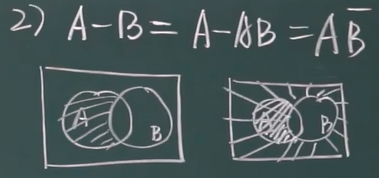

注意: "互不相容事件", 可以都不发生. 但对于"对立事件", 必须有一个发生.

|完备事件组
|collectively exhaustive events. 即: stem:[ A_1, A_2, ... A_n] 两两互不相容, 且 stem:[ ∪_(i=1)^n A_i = Ω] ← 它们所有的并集, 就构成全集本身.

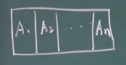
|===

---

=== 事件间的运算律 : ① 加号(+) 代表"或者, 并集 ∪";  ② 乘法代表"交集 ∩"

[options="autowidth"]
|===
|Header 1 |Header 2

|分配率:
|stem:[ (A∪B)∩C =(A∩C) ∪ (B∩C)] +
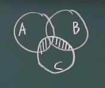

stem:[ (A∩B)∪C =(A∪C) ∩ (B∪C)] +
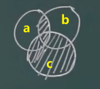

|对偶律
|stem:[ \overline(A∪B) = \overline(A) ∩ \overline(B)]   ← A并B后的逆, 等于A逆 交 B逆 +
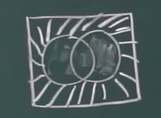

stem:[ \overline(A_1 ∪ A_2 ∪ ... ∪ A_n) = \overline(A_1) ∩ \overline(A_2) ∩ ... ∩ \overline(A_n)]

stem:[ \overline(A∩B) = \overline(A) ∪ \overline(B)]   ← 长线变短线, 里面的符号(交或并)要改变方向 (原∩变∪, 原∪变∩)

stem:[ \overline(A_1 ∩ A_2 ∩ ... ∩ A_n) = \overline(A_1) ∪ \overline(A_2) ∪ ... ∪ \overline(A_n)]
|===

.标题
====
例如： +
A, B, C 是 试验E 的随机事件.

[options="autowidth"]
|===
|Header 1 |记为

|A发生
| A

|只有A发生
|stem:[ A, \overline(B),  \overline(C)]

|A, B, C 恰有一个发生
|stem:[ A \overline(B) \overline(C) + \overline(A) B \overline(C) + \overline(A) \overline(B) C]

|A, B, C 同时发生
| ABC

|A, B, C 至少一个发生
| A+B+C

|A, B, C 至多一个发生(那就说明"可以都不发生")
|stem:[ A \overline(B) \overline(C) + \overline(A) B \overline(C) + \overline(A) \overline(B) C +  \overline(A)  \overline(B)  \overline(C) ]

|恰有两个发生
|stem:[ AB \overline(C) + A \overline(B) C + \overline(A) BC  ]

|至少两个发生(即, 可以两个, 也可以三个)
|stem:[ AB \overline(C) + A \overline(B) C + \overline(A) BC +ABC + AB(即 "C发不发生, 不用管") + BC + AC ]
|===
====

.标题
====
例如： +
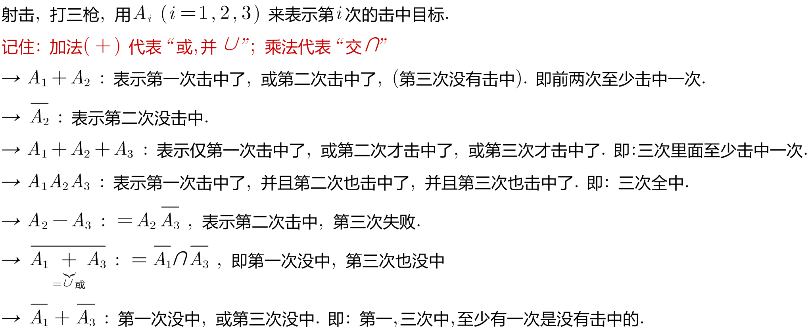
====

---

=== 事件的概率 probability

概率: 用 P(A)表示

性质:

-  stem:[ P(Ω)=1]
- stem:[ P(Φ)=0]
- stem:[ 0 \le P(A) \le 1]

**但注意: 对于 stem:[ P(Φ)=0], 倒过来则不成立. 即, 事实上, 如果一个事件的概率是0, 它不一定是"不可能事件". 即, 概率=0, 它也可能会发生. **

例如, 一个质点随机地落入[0，1]区间内，则落到任何一点的概率都等于0 (因为任何一"点"其实没有面积, 点是0维度的, 是0面积)，但试验结果，这个质点一定会落到某一点上，这样概率为0的事件发生了。

*同样, "必然事件"的概率一定为1，但概率为1的事件, 并不一定是"必然事件Ω"。*

---

== 频率

做n次试验, A事件发生了m次, 我们就把 stem:["A事件发生的次数m" / "共n次试验"] 叫做"频率". 记作 stem:[ ω_n (A)].

比如丢硬币, 丢10次, 丢100次, 丢1000次, 每次的"频率"可能都不一样, 比如结果是 stem:[7/10, 55/100, 508/1000 ]. 所以这就是"频率"和"概率"的区别.

但你可以发现, 随着试验次数n的增大, A事件的"频率"的值, 会接近与"概率"的值. 即: stem:[ \lim_(n→0) ω_n(A) → P ]

频率的性质: +
[options="autowidth"]
|===
|Header 1 |Header 2

|规范性
|stem:[ ω_n(Ω)=1] ← 做n次试验, 里面"必然事件"发生的频率, 是1.  +
既然是"必然事件Ω", 它肯定会发生, 所以频率肯定是1.

stem:[ ω_n(Φ)=0] ← 做n次试验, 里面"不可能事件"发生的频率, 是0.

|可加性:
|比如做1000次试验, 即 stem:[ω_(1000)], 则有: stem:[ω_(1000)(A_1 + A_2) = ω_(1000)(A_1) + ω_(1000)(A_2) ]

即: "和的频率", 就等于"频率的和".

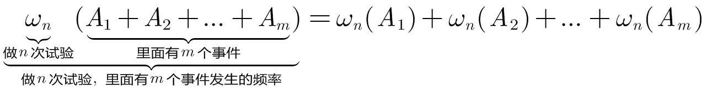
|===

---

== 公理化

==== stem:[ P(A) + P(\overline(A)) = 1]

---

==== 对于"完备事件组"中的所有事件来说: stem:[ P(A_1) + P(A_2) + ... +  P(A_n) =  P(Ω) = 1]

完备事件组 collectively exhaustive events 就是:: 如果事件 B1、B2、B3 … Bn 构成一个完备事件组，即: 1. 它们两两互不相容(即两两的交集=空集)，2. 其"和"为全集 Ω. +
换言之, 若n个事件两两互斥，且这n个事件的并是Ω，则称这n个事件为"完备事件组"。

---

====  stem:[ P(A-B) = P(A) - P(AB)]

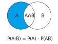

---

==== 若A包含着B, 则有:  stem:[ P(A-B) = P(A) - P(B)], 且 stem:[P(A) >= P(B) ]

---

==== ★ 加法公式: stem:[ P(A+B) = P(A) + P(B) - P(AB)]

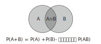

---

==== ★ 加法公式:  stem:[ P(A+B+C) = P(A) + P(B)  +  P(C) - P(AB) - P(AC) -  P(BC) +  P(ABC)]

image:img/0029.svg[,300]

image:img/0030.png[,700]

---

==== 例

.标题
====
例如： +
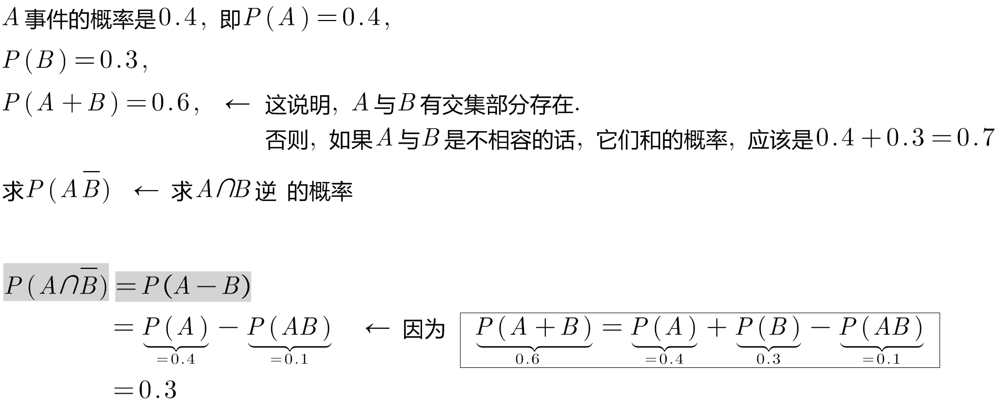

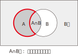
====

.标题
====
例如： +
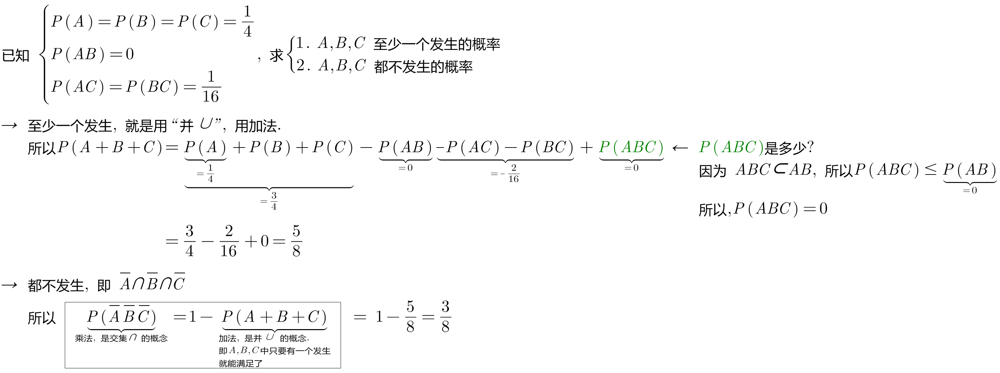
====

.标题
====
例如： +
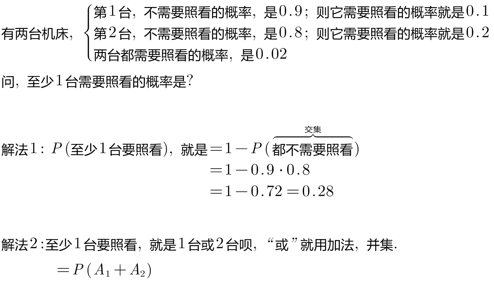

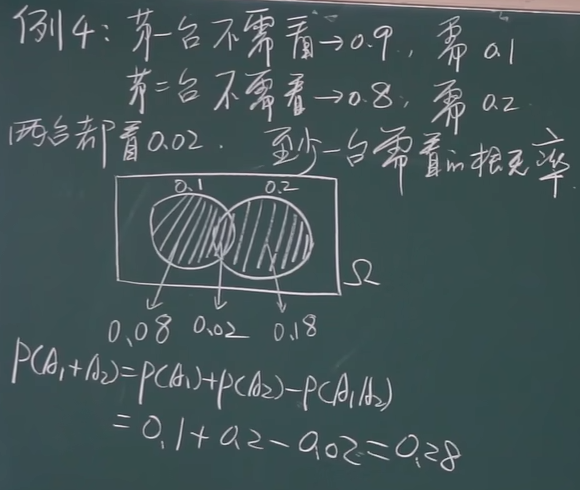
====

.标题
====
例如： +
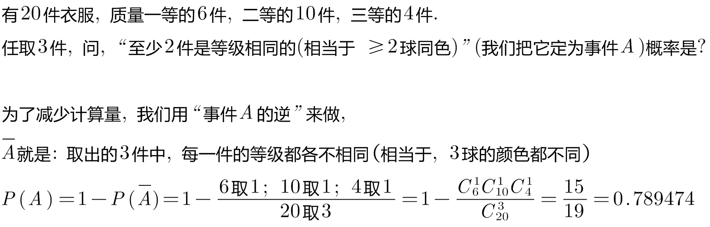
====

.标题
====
例如： +
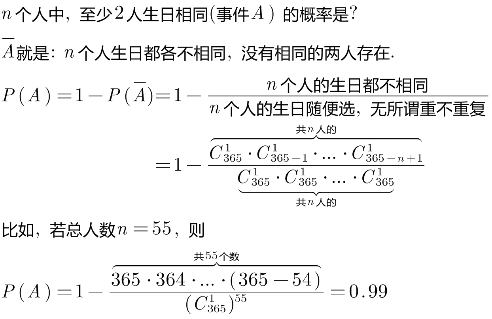
====

---

