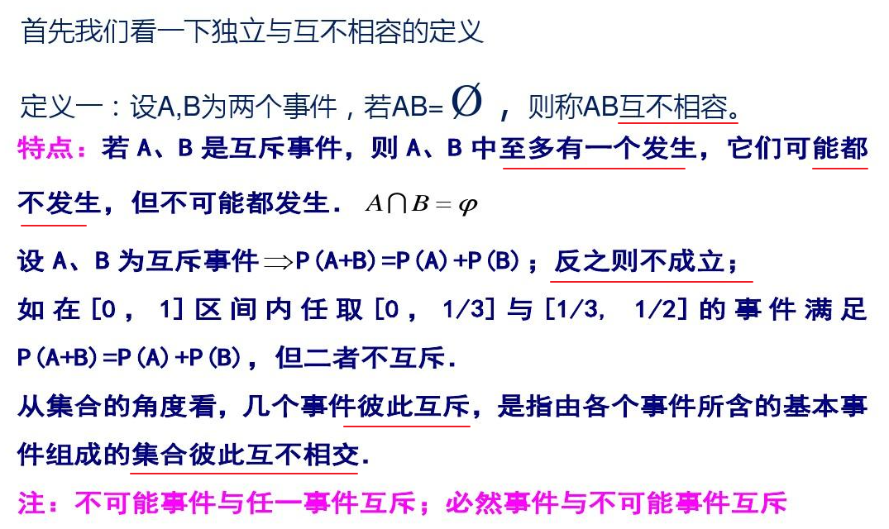
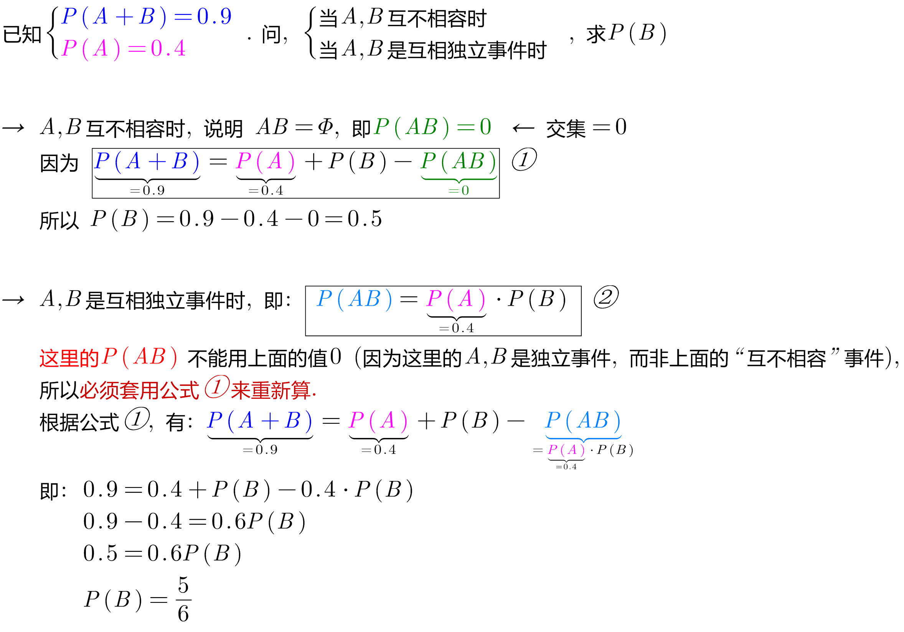
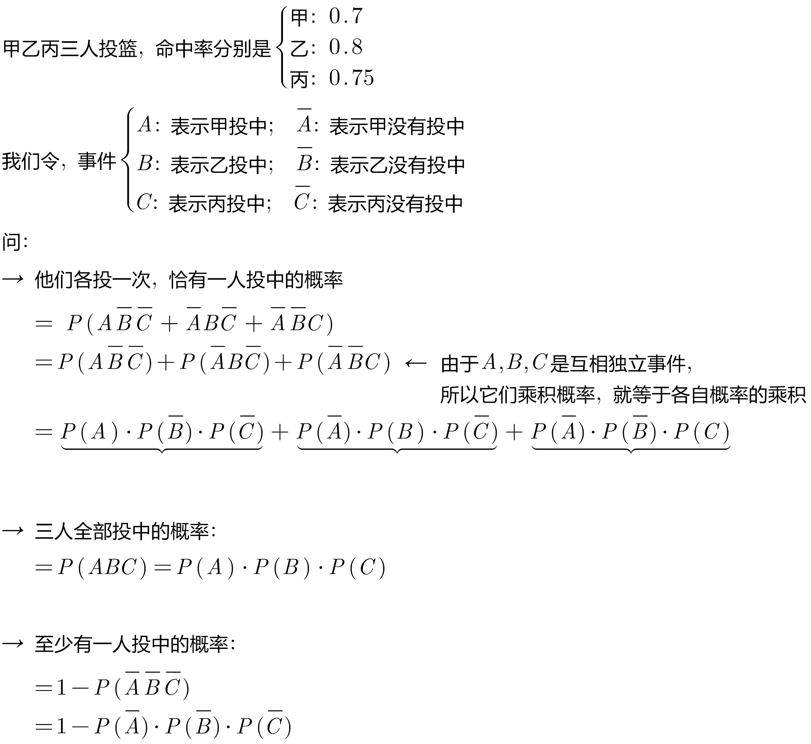
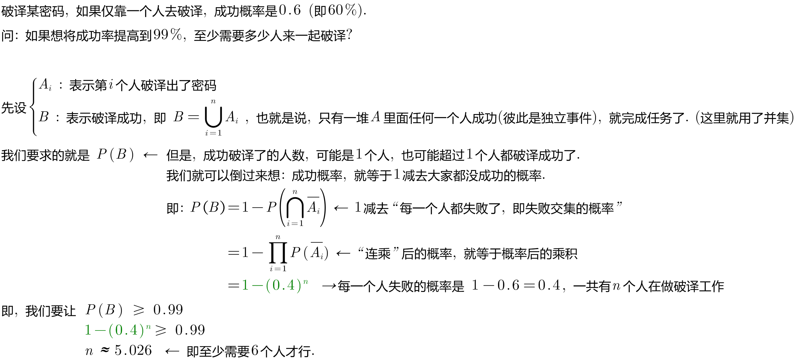
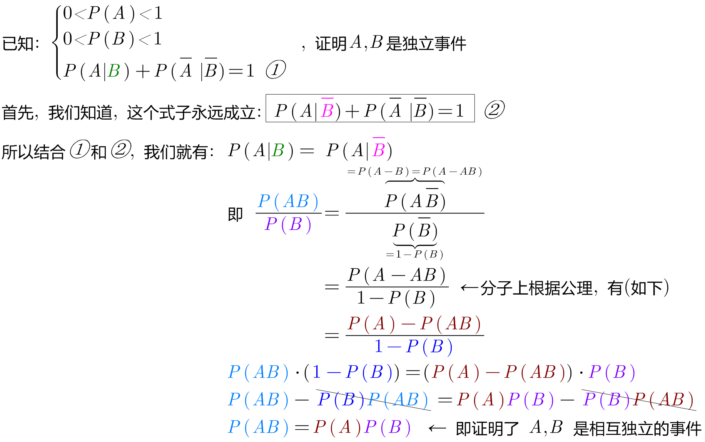

= 事件的独立性
:toc: left
:toclevels: 3
:sectnums:

---

== 事件的独立性

事件的独立性, 是指: A发生的概率, 不受B是否发生的影响. 即: stem:[ P(A|B)=P(A)],  +
即: 即使B发生的条件下, 来看A发生的情况, 其发生概率和A单独自己发生, 没有任何区别. 换言之, 有没有B先发生, 对A的发生概率毫无影响.

事件相互独立: 就是指一个事件发生，不会影响另一个事件的发生或不发生. 两个事件没有相关性，相关系数为0。

从数学语言上（即定义）：stem:[ P(AB)=P(A) \ cdot P(B)]

注意区别: +
[options="autowidth"]
|===
|事件A的"条件概率"stem:[ P(A丨B)] |事件A的"无条件概率" stem:[ P(A)]

|事件B的发生, 改变了事件A发生的概率，也即事件B对事件A有某种“影响”.
|这里, 事件B的发生, 对事件A的发生毫无影响，即有，stem:[ P(A丨B)=P(A)]. +
由此又可推出 stem:[ P(B丨A)=P(B)]，即事件A发生对B也无影响. 可见独立性是相互的。
|===

---

== A,B 是两个相互独立的事件, 则有: stem:[  P(AB)= P(A) \cdot P(B)]

两个相互独立的事件A和B 都发生的概率, 等于每个事件发生的概率的积. 即: stem:[ P(AB)=P(A ∩ B) = P(A) \cdot P(B)]

即, 若有 stem:[  P(AB)= P(A) \cdot P(B)], 则, A,B是两个相互独立的事件.

另外, "Φ 和 Ω" 与"任意事件A" 都独立.

---

== 若A,B是互相独立的事件, 则有: ① A与stem:[ \overline(B)]独立; ② stem:[ \overline(A)]与B独立; ③ stem:[ \overline(A)] 与 stem:[ \overline(B)] 独立

既然A,B 是相互独立的事件了, 所以彼此发生或不发生, 对另一方是毫无影响的, 所以, 比如对A来说, 无论B是 B的状态, 还是stem:[ \overline(B)]的状态, 它们与A都是互相独立的事件.

---

== 若 stem:[ P(A)=0 或 P(A)=1], 则 A与"任意事件"都互相独立.

---

== "独立"与"互不相容"的区别

[options="autowidth"]
|===
|独立 |互不相容(互斥)

|独立: 一个事件(A)的发生概率, 不受另一个事件(B)发生与否的影响.

若 A,B 是互相独立事件, 则: stem:[ P(AB)=P(A) \cdot P(B) > 0]

|互不相容: 是指两个事件没有交集. 即 stem:[ AB=Φ] 空集.  有你没我, 有我没你.

"互不相容"事件也就是"互斥"事件，它指的是: 两个事件不可能同时发生 (至多只有一个发生. 它们可能都不发生, 但不会同时发生)。比如，一个人的性别不是男就是女，不可能同时既是男又是女。

|===

stem:[ P(A)>0, \quad P(B)>0], "独立"与"互不相容"不会同时成立. +
A,B相互独立, 与A,B互不相容, 不能同时成立. 即: 独立必相容,互斥必联系.

.标题
====
例如： +

====

---

== 多个事件彼此独立

若 A,B,C 互相独立, 则有:

- stem:[ P(AB) = P(A) \cdot P(B)]
- stem:[ P(BC) = P(B) \cdot P(C)]
- stem:[ P(AC) = P(A) \cdot P(C)]
- stem:[P(ABC) =P(A) \cdot P(B) \cdot P(C) ]

---

== 什么时候能使用 "独立事件"来做概率题目? -- 比如, 前后投篮, 前后射击问题.

.标题
====
例如： +

====

.标题
====
例如： +

====

.标题
====
例如： +

====

---
