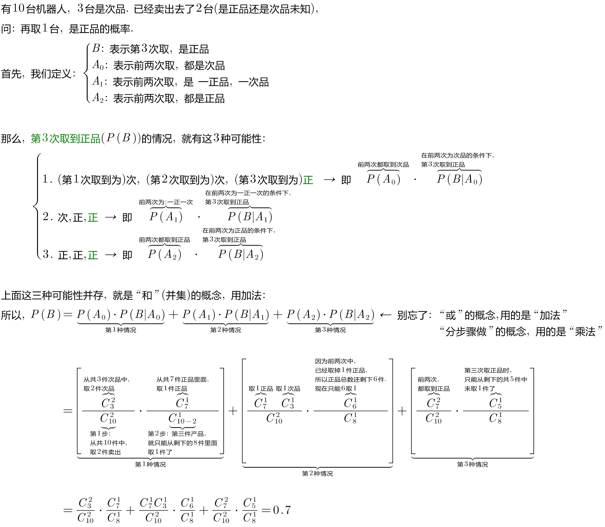
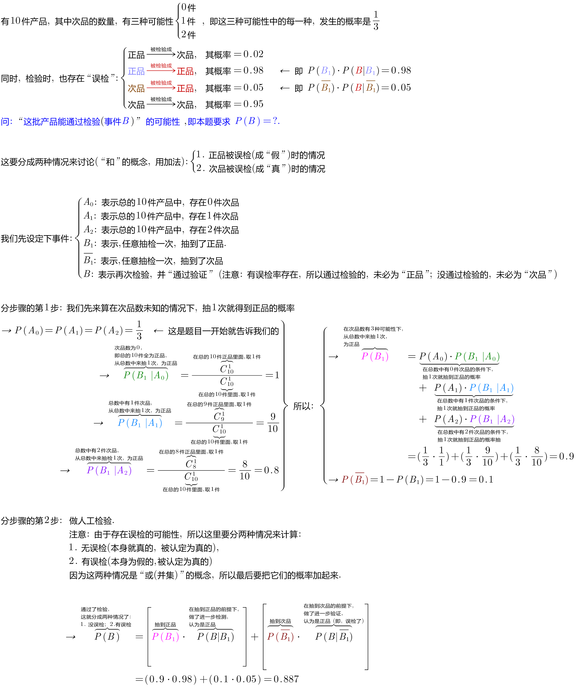
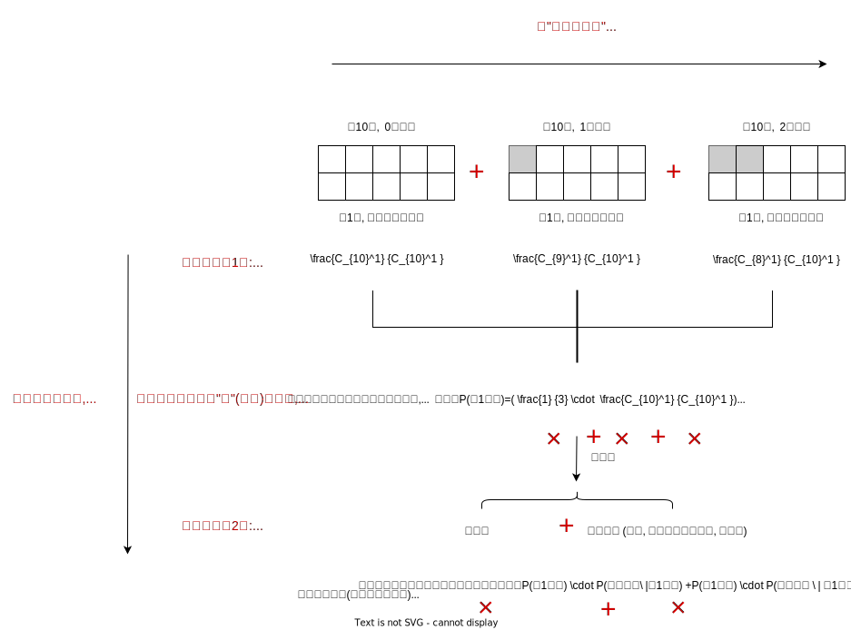

= 全概率公式 Total Probability Theorem
:toc: left
:toclevels: 3
:sectnums:

---

== 全概率公式 Total Probability Theorem

image:img/0050.png[,600]

image:img/0051.svg[,800]

.标题
====
例如： +
image:img/0052.png[,850]
====

.标题
====
例如： +

image:img/0054.svg[,600]
====

.标题
====
例如： +

====

---
