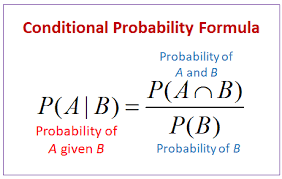
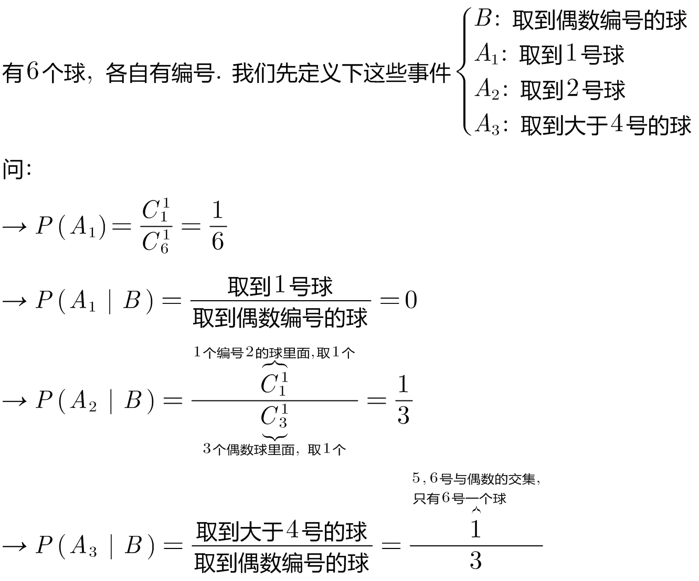
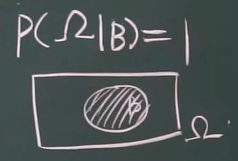
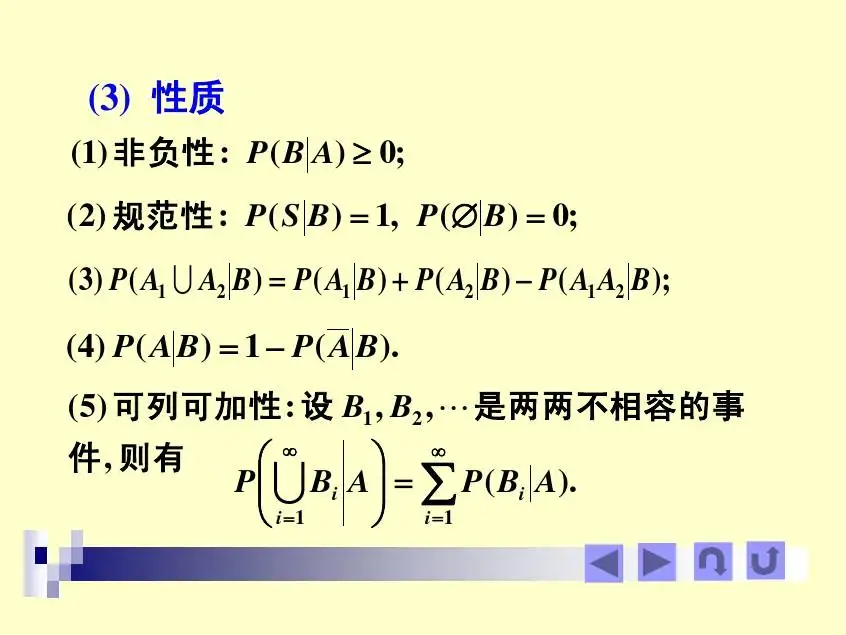
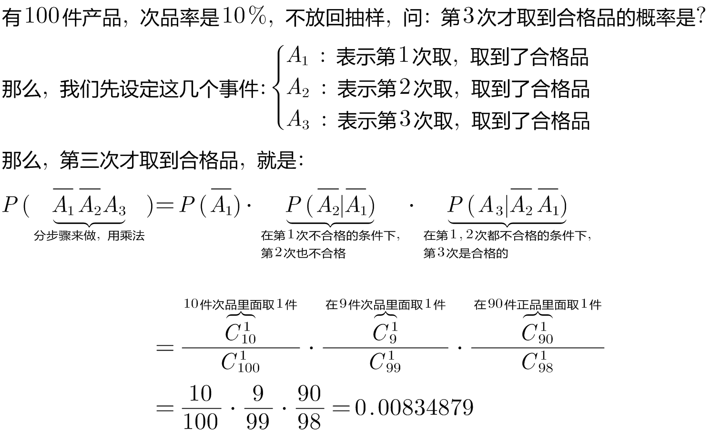
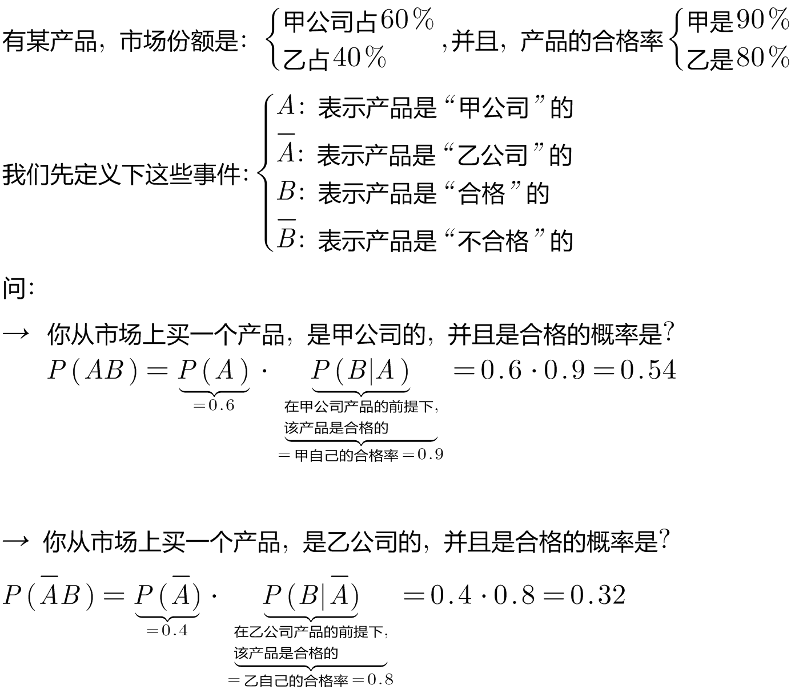
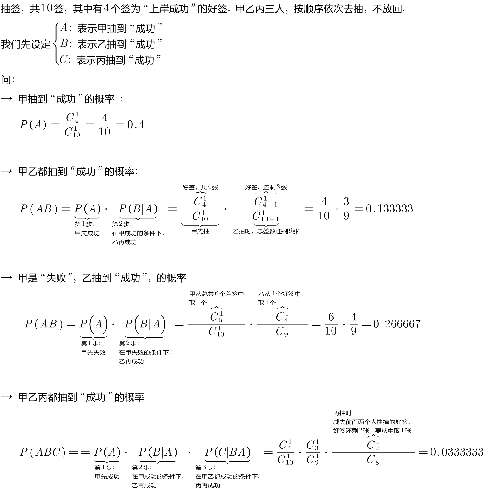
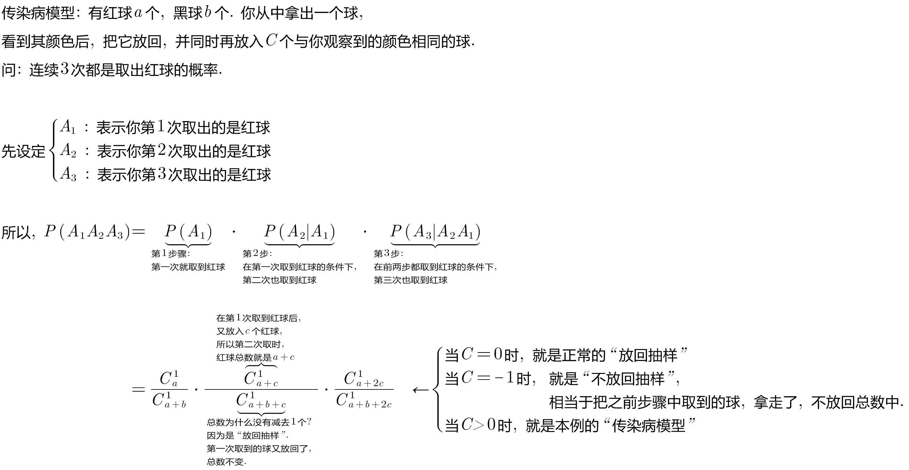

= 条件概率
:toc: left
:toclevels: 3
:sectnums:

---

== 条件概率 Conditional probability

条件概率是: 有样本空间Ω, 并且A, B 是两个事件. 其中 stem:[ P(B) >0], 则, 在B已经发生的条件下, A发生的概率, 就叫做A对B 的"条件概率". 记作: stem:[ P(A| "条件B")]，读作“在B发生的条件下, A发生的概率”.

注意对比:  +
[options="autowidth"]
|===
||样本空间是

|我们以前学的 stem:[ P(A)] 是"无条件概率".
|Ω

|条件概率 stem:[ P(A \| "条件B")]
|条件B, 即 stem:[Ω_B ]
|===

所以, "条件概率"就是 :  +
\begin{align}
 P(A | 条件B) = \frac{在B发生的条件下, A发生的样本点数, 即AB同时发生了} {B里面有多少个样本点} =  \frac{n_{AB}} {n_B}
\end{align}

还可写成: +
\begin{align}
P(A | 条件B) = \dfrac{\dfrac{n_{AB}} {n}} {\dfrac{n_{B}} {n}} = \frac{P(AB)} {P(B)}
\end{align}

image:img/0042.svg[,400]

.标题
====
例如： +

====

---

== 条件概率的性质

=== 性质1: stem:[ P(A \| "条件B") >= 0]

---

=== 性质2: stem:[ P(Ω \| "条件B") = 1]

---

===  性质3: 可列可加性:  若 stem:[ A_1, A_2, ... A_n, ...] 是互补相容的事件, 则有: stem:[ P(\sum_{i=1}^∞ A_i | B) = \sum_{i=1}^∞ P(A_i | B)]

---

== 乘法公式

image:img/0043.png[,500]

image:img/0044.svg[,600]

image:img/0045.png[,]

.标题
====
例如： +

====

.标题
====
例如： +

====

.标题
====
例如： +

====

---

== 传染病模型

.标题
====
例如： +

====

---

