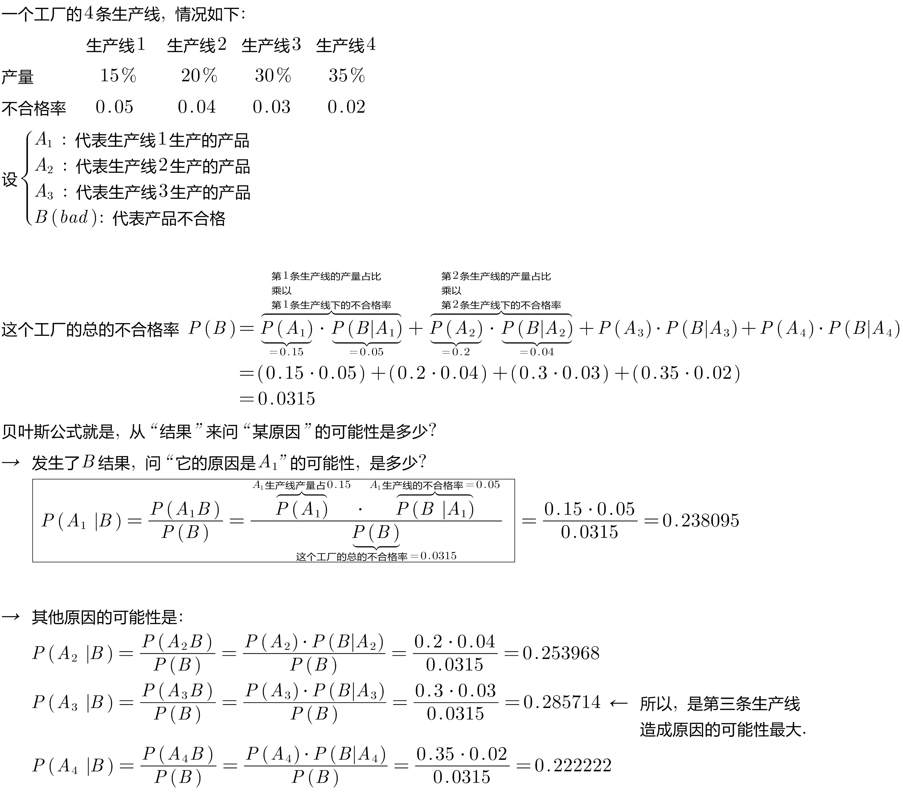
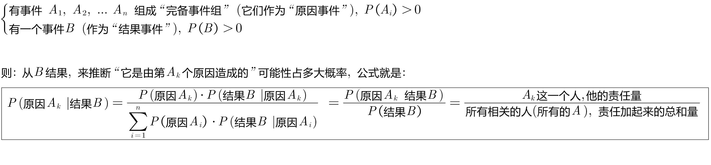
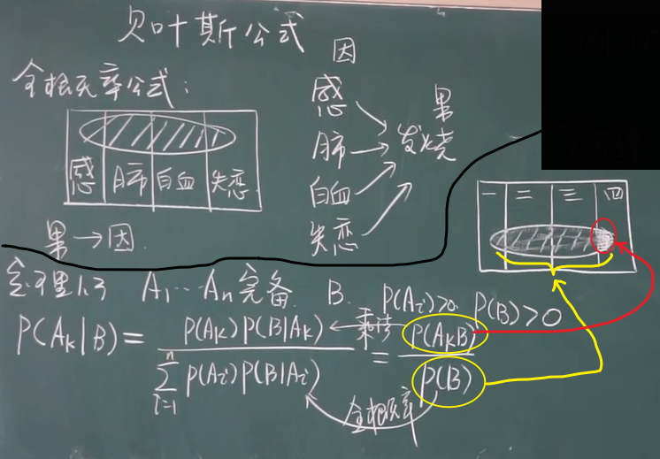
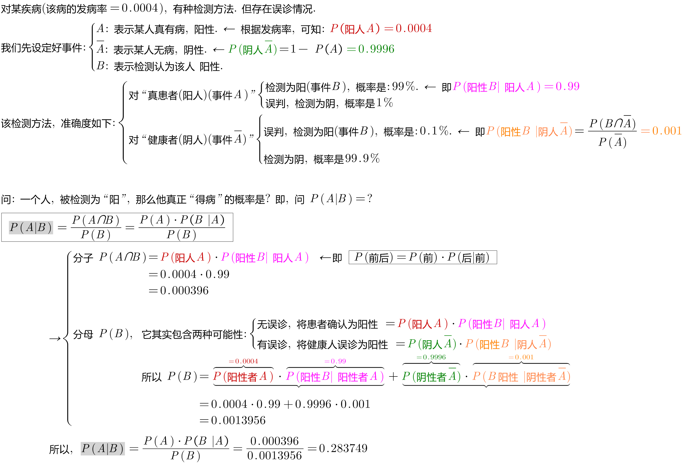
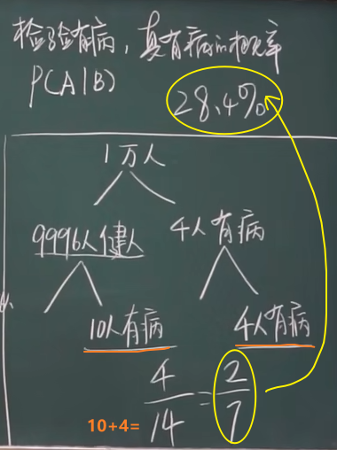

= 贝叶斯公式 Bayes Rule
:toc: left
:toclevels: 3
:sectnums:

---

== 贝叶斯公式 Bayes Rule

全概率公式, 是从"原因"来推"结果的可能性是多少".

贝叶斯公式, 是从"结果"来推其"某种原因的可能性是多少". 即 stem:[P("原因"_i|"某结果")]

.标题
====
例如： +

====

---

== 定理: 从"果", 来推是某"因"的可能性大小: 贝叶斯公式: stem:[ P(A_k | B) = \frac{P(A_k) \cdot P(B | A_k)} {\sum_{i=1}^n \[P(A_i) \cdot P(B | A_i)\]} = \frac{P(A_k B)} {P(B)} ]

.标题
====
例如： +

====

---
