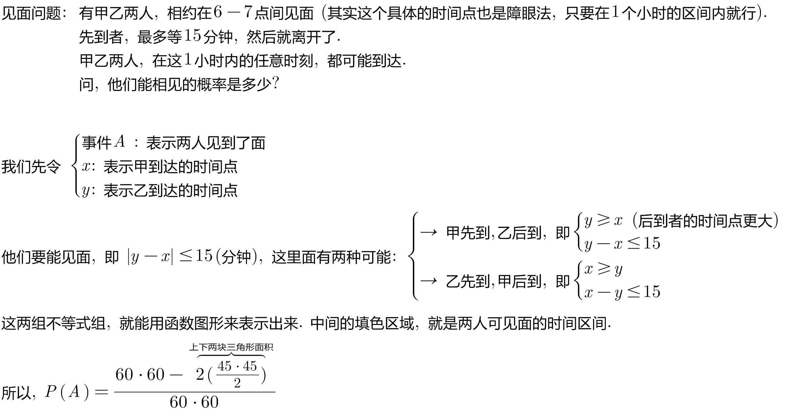
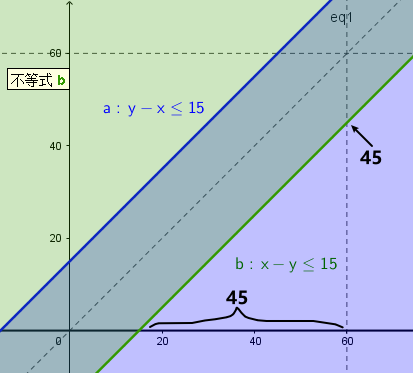
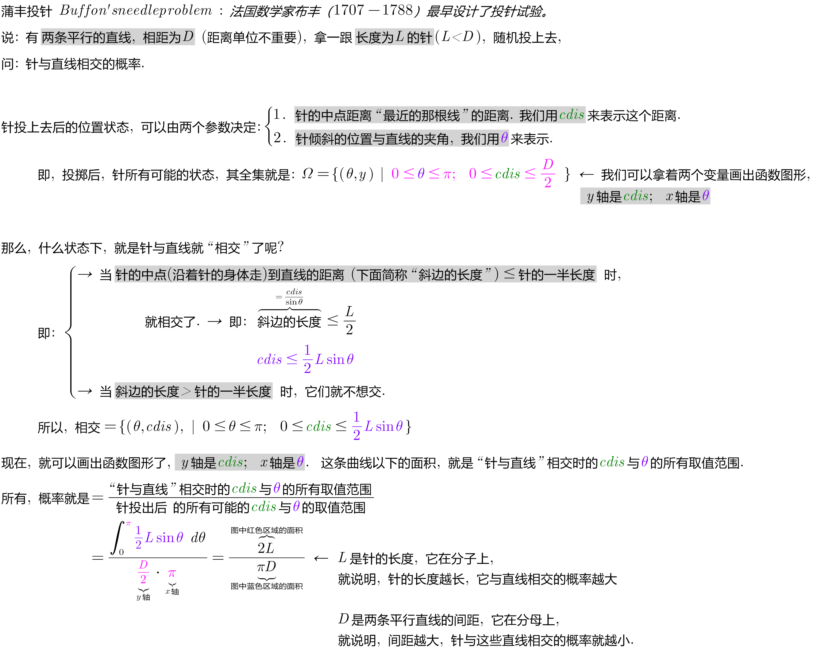
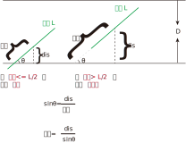
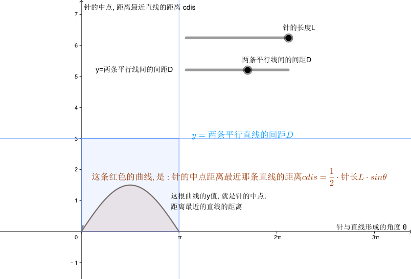
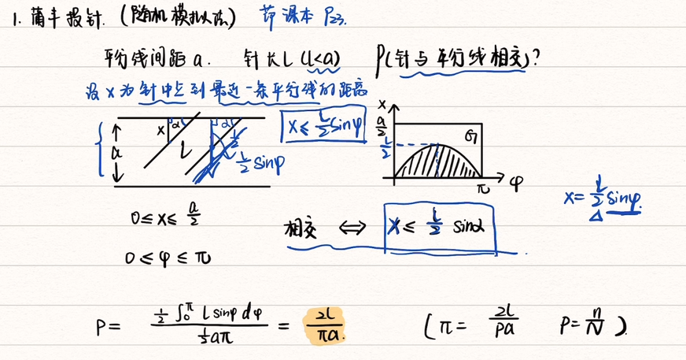
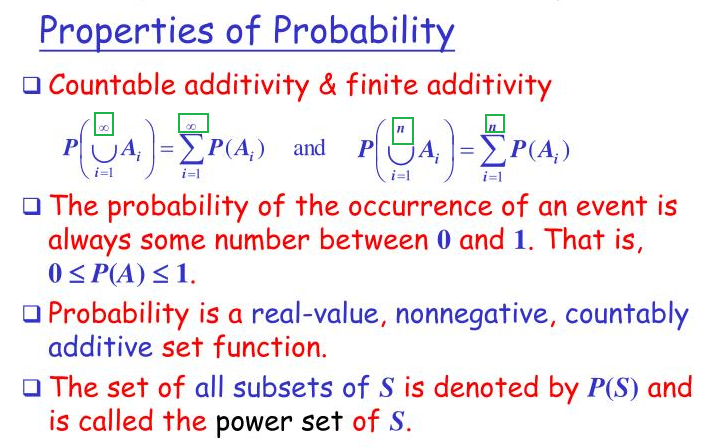

= 几何概型 geometric models of probability
:toc: left
:toclevels: 3
:sectnums:

---

== 几何概型 geometric models of probability

即, 这类概率问题, 能够转换成用"几何问题"来求解.

.标题
====
例如： +

====

.标题
====
例如： +

====

[options="autowidth"]
|===
|古典概率模型 ↓|几何概率模型↓

|有限可加性（finite additivity）: 是指"有限个"两两互不相容事件的"和事件"的概率，等于每个事件概率的和。

 stem:[ P(∪_(i=1)^n A_i) = \sum_(i=1)^n P(A_i)]

|完全可加性: stem:[ P(∪_(i=1)^∞ A_i) = \sum_(i=1)^∞ P(A_i)] +
即, 先求和, 再求概率, 等于 先求每个事件概率, 再求和.
|===

注意两者的区别: 一个是"有限(到n)"的加,  一个是"无限(到∞)"的加.

---

