= 贝叶斯公式 Bayes Rule
:toc: left
:toclevels: 3
:sectnums:

---

== 解释

=== 解释 (刘嘉概率讲座)

学习任何一个数学定理, 都要知道以下三点:

1. 该定理解释了什么规律? what is it saying?
2. 它为什么是对的, 数学证明原理是什么? why is it true?
3. 该定理在什么背景条件下, 我们就能使用它? when is it useful?

==== 条件概率

.标题
====
你的新邻居, Steve is very shy and withdrawn, invariably helpful but with very little interest in people or in the world of reality. A meek and tidy soul, he has a need for order and structure, ant a passion for detail.

你觉得他更可能是 -- 图书管理员, 还是农民?

大多数人可能会说, 他更有可能是图书馆管理员. 其实, 这种判断, 就是"非理性"的. *关键问题不在于人们对图书馆管理员和农民的形象认识, 是否有偏差, 而是说, 在做判断的时候, 你有没有把这两种职业的"人数比例"考虑进去.* 关键不在于你是否知道他们的精确比例数据, 而是你能依此来做出粗略的判断.

即: *理性不是说知道事实数据, 而是认识到: 哪些因素是起到相关作用的.* +
Rationality is not about knowing facts, It's about recognizing which facts are relevant.

在美国, 农民与图书馆管理员的数量之比, 是20:1.

那么在总共300人中, 他们的比例就如下图:

image:img/0633.webp[,600]

假如你听到"彬彬有礼"这类描述, 你的直觉是: 40%的图书馆管理员符合这个描述,而只有10%的农民符合这个描述. 如果这是你的估计, 那就意味着你的样本中, 会有大约 stem:[10 \cdot 40% = 4]个图书馆管理员, 和大约 stem:[200 \cdot 10% = 20] 个农民, 符合这个描述.

image:img/0634.webp[,600]

所以, 从满足这个描述的人群中, 随便抽出一个人. 是图书管理员的概率就是 :

image:img/0635.png[,600]

所以, 即使你认为"符合这个描述的人是一个图书馆管理员的可能性, 是一个农民的4倍", 也抵不过农民的数量很多.
====

.标题
====
例如：
辛普森杀妻案, 一开始, 原告举出了无数证据，证明辛普森常常家暴前妻。他们认为. 长期家暴说明辛普森有杀妻的动机. +
而被告律师则反驳说，家暴和谋杀没有必然关系。并举出数据: 美国有400万被家暴的妻子，但只有1432名被丈夫杀害，这个概率只有 stem:[ \frac{1432} {400万}=] 比1/2500还低。所以，家暴证明不了辛普森谋杀。

**被告律师说的其实是: 在家暴这个前提条件下，一个人谋杀妻子的概率, 并不会大大增加.**

*那么你怎么判断这个说法? 你仔细分析, 其实, 这个概率, 并不能套用在现在这个案子上. 因为现在案子的前提除了家暴外, 还有一个前提也存在: "前妻已经被杀了". 即现在有两个前提了: 1. 家暴存在, 2. 妻子死亡. 即现在问题变成了: 被家暴且"死亡"的妻子里面(而不是在之后"无论生死"的被家暴妻子里面), 有多少是被丈夫杀害的? 所以, 前提变了, 这个"条件概率"的计算公式, 也就跟着变了.*

问题就不再是: 在"家暴"这一个前提条件下，丈夫谋杀妻子的概率是多少?  +
而是变成了 : 在 1.丈夫家暴妻子，且 2.妻子已经死于谋杀, 这两个前提条件下，"杀人凶手是丈夫"的概率是多少?

根据美国1992年发布的数据推算: 每10万个被家暴的妇女中, 有43个会被谋杀。其中40个是被丈夫谋杀, 其他3个是被丈夫以外的人谋杀. 那么, 条件概率就是:

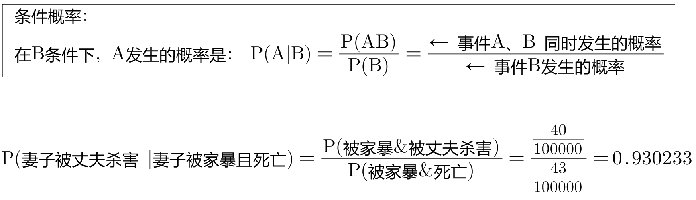

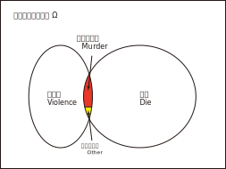

即:

- 辛普森律师一方 的概率公式是: stem:[ \frac{"红色"} {"Violence"} < \frac{1} {2500}] +
- 妻子一方律师 的概率公式是: stem:[ \frac{"红色"} {"红色+黄色"}=93%]

**你仔细体会一下两者的不同:**

- *辛普森方, 是说: 在所有"之后活着和死去"的被家暴的妻子里, 被丈夫杀了的可能性是多大.* 即 stem:[ \frac{"丈夫杀害"} {"条件: 1.被家暴"}]
- *妻子方, 是说: 在所有"死去"的被家暴的妻子里, 被丈夫杀了的可能性是多大?* 即 stem:[ \frac{"丈夫杀害"} {"条件: 1.被家暴 & 2.死亡"}]

不过, 即使概率高达93%，也不能绝对证明辛普森杀了妻子. 因为**"条件概率"只表示统计意义上的"相关性",并不代表"因果关系".** 即只说明: 家暴和谋杀妻子之间有很强的相关性。
====

如果不考虑高额高频支出的交易费的话, "高频交易"是一种盈利策略 (即: 快速的买进卖出, 以图获取远超市场平均值的收益), 其原理是什么呢?  -- **长期来看, 影响股价的因素太多了, **一年、一个月、甚至一星期、一天内都有各种正负面的信息，很难把握。但是，**如果缩小时间片段,在一秒，甚至一毫秒这样短的时间内，影响股价的因素就变得比较单一了。**这时候，再去把握关键因素,难度就会小一些，盈利的概率就会大一些。这就是高频交易的基础。你看，还是条件概率。条件概率就是计算和量化某个条件对随机事件的影响。

==== 1. 正向概率 (由"因", 猜测之后的"结果"是怎样的) &  2. 逆概率 (由"结果", 往前推断其"原因")

概率问题, 其实可以分成两种 :

[options="autowidth"  cols="1a,1a"]
|===
|Header 1 |Header 2

|1.我们知道“原因”，要去推测某个“现象”。这类概率问题叫作“正向概率”
|如:

- 先知道原因是得了流感,问发烧这个现象出现的概率是多少，这就是"正向概率"。

|2.看到了一些“现象”，要去推测背后的“原因”。这叫“逆概率”问题。
|如:

- 看到发烧的现象，推测导致发烧的原因。这就是“逆概率”问题。
- 天气预报明天降雨概率30%，无法像计算"频率"那样重复把明天过100次，然后计算出大约有30次会下雨；而只能用有限的信息（过去的天气测量数据）来预测（Bayes）明天下雨概率。

生活中大部分问题都是“逆向概率”问题。因为现实中我们手中只有有限的信息。这就是 Bayes：根据过去的信息（不全的信息）来预测未来事情发生的概率。
|===

==== ①先验概率 , ②后验概率

[options="autowidth"  cols="1a,1a"]
|===
|Header 1 |Header 2

|*先验概率 : 是指根据以往经验和分析得到的概率*，它往往作为“由因求果”问题中的“因”出现。
|- "先验概率"不是根据有关自然状态的全部资料测定的，而只是利用现有的材料(主要是历史资料)计算的.
- *"先验概率"的计算比较简单，没有使用"贝叶斯公式".*

| *后验概率: 是基于新的信息，修正原来的"先验概率"后, 所获得的更接近实际情况的概率估计。*
|- "后验概率"使用了有关自然状态"更加全面"的资料，既有先验概率资料，也有补充资料.
- *"后验概率"的计算，要使用"贝叶斯公式"*.

"贝叶斯定理 Bayes' theorem "最根本的结论也就是说 : 新证据不能直接凭空的决定你的看法, 而是应该更新你的先验着法(之前的经验).

|===

"先验概率"和"后验概率"是相对的。如果以后还有新的信息引入，更新了现在所谓的"后验概率"，得到了新的概率值，那么这个新的概率值, 就被称为更新迭代后的"后验概率"。

==== 贝叶斯公式

根据新信息, 不断调整对一个随机事件发生概率的判断, 这就是"贝叶斯推理"。 即反复迭代,不断逼近真相 (即人工智能的原理).

贝叶斯公式, 又被称为贝叶斯定理、贝叶斯规则, 是**"用所观察到的现象, 对有关概率分布的主观判断（即先验概率）, 进行修正"**的标准方法。

它的理念是: +
1.起点不重要, 迭代很重要。 +
2.喂投的信息越充分, 输出的结果越可靠。

*通常，"事件A, 在事件B(发生)的条件下的概率"，与"事件B, 在事件A的条件下的概率", 是不一样的. 然而，这两者是有确定的关系, "贝叶斯法则"就是这种关系的陈述。*

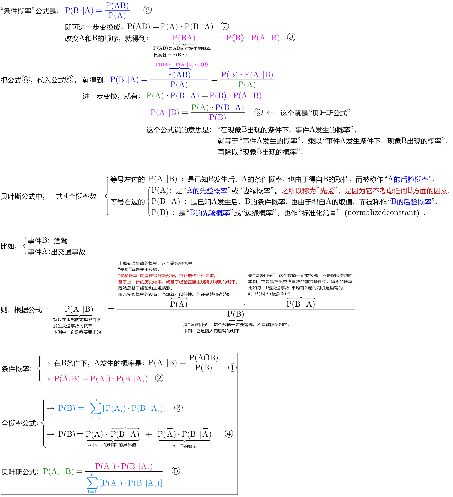

调整因子, P (B|A) 和 P(B)这两个数, 一定要是客观的, 必须找到具体的客观值，而不能拍脑袋随便设定。 所以, 贝叶斯计算的难度不在于计算本身，而在于寻找"调整因子"的客观数据。

如果没有客观数据存在, 那也就没法用"贝叶斯公式"来算了.  +
比如, A代表男的表白成功, B代表女孩一直盯着自己. P(A |B) 就是在女的一直盯着自己的条件下, 你表白成功的概率. 可以算出来吗? 显然, 调整因子, P (B|A) 和 P(B) 都没有客观数据存在, 没人统计过, 所以也就没法算.

总之，贝叶斯公式一共四个数,左边 P(A |B) 就是我们要求的，右边一个P(A) 是可以暂时随意设定的"先验概率",另外两个  P(B|A) 和 P(B) 是必须客观的"调整因子"。查资料确定"调整因子", 是计算的关键，如果瞎猜或者查得不对，就可能越算越错。

.标题
====
例如： +
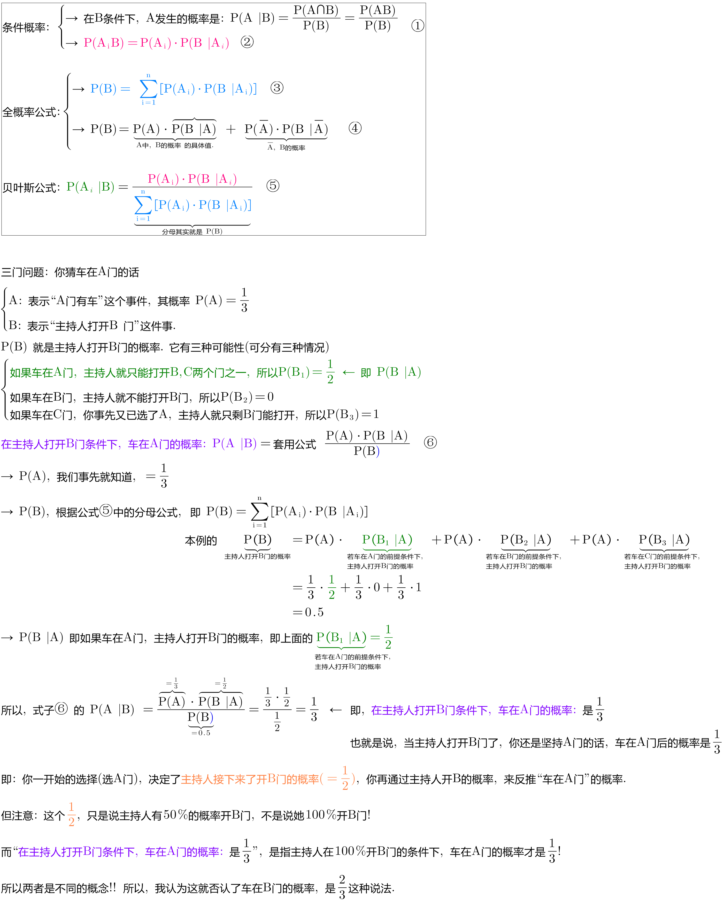
====

其实，"频率法"和"贝叶斯", 两种方法最大的差异, 就是两个方法的假设不一样。

频率法，更像是做题，必须有明确的、严格的前提约束，严格界定好所有的条件。它假设信息是全知的，每道题都有一个对所有人而言都正确的答案。所以会通过反复的试验，不断逼近最终那个客观概率。

而贝叶斯，是个动态的、反复的过程。每个新信息的加入都要重新进行一遍计算，获得一个新概率。贝叶斯没有什么限制条件，只是在这一次次获得新信息、重新计算的过程中, 迭代自己的判断。它甚至不认为现实的事儿都有正确答案，因为所谓答案，也是在不断变化的。

频率法适合解决那些普遍的、通用的、群体性的问题，比如抛硬币、玩德州扑克，或者计算生育率、患病概率、飞机失事率等。

贝叶斯更适合解决变化的、个体的、无法重复的概率问题，比如明天比赛某球队获胜的概率、发生金融危机的概率，以及人工智能这些技术等。它本身就是通过搜集不同的信息,不断调整、不断迭代的。

*两个方法并不是泾渭分明，而是混合着使用的。通常,我们会先用"频率法"获得"先验概率"，再用"贝叶斯"计算某个证据的权重。* 即, "频率法"为"贝叶斯"提供相对靠谱的先验概率。"贝叶斯方法"为"频率法"提供原始的估算.

**但行为经济学家发现，人们在决策过程中, 往往并不遵循"贝叶斯规律"，而是给予最近发生的事件和最新的经验, 以更多的权重值，更看重近期的事件。面对复杂问题，人们往往会走捷径，依据可能性, 而非概率来做决策。**这种对经典模型的系统性偏离, 称为“偏差”。因此, 投资者在决策判断时, 并非绝对理性, 进而影响资本市场上价格的变动.

但长期以来，*由于缺乏有力的"能结合人类决策中的理性和感性因素"的替代工具，经济学家不得不在分析中坚持"贝叶斯法则"。*

---

=== ★ 解释2

先发生的事情(步骤), 用A表示. 后发生的事情(步骤), 用B表示.

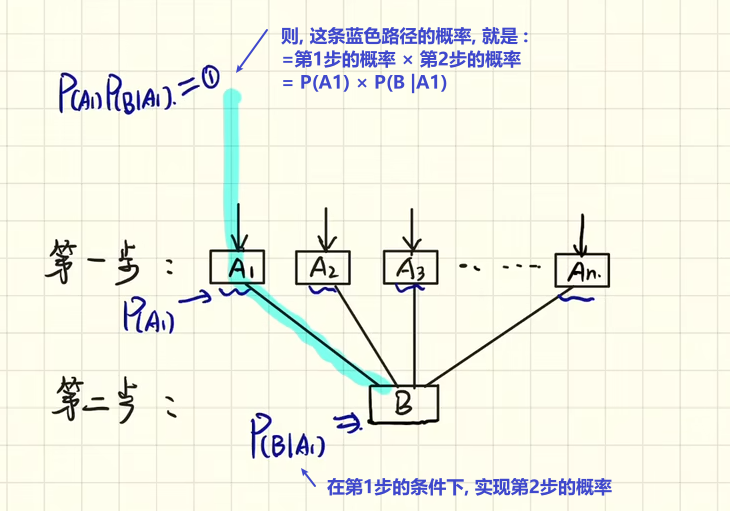

其他路径的概率, 也是同理

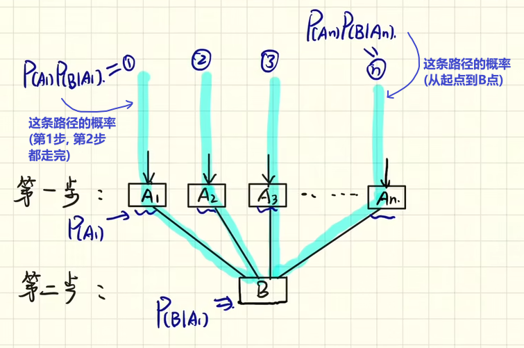

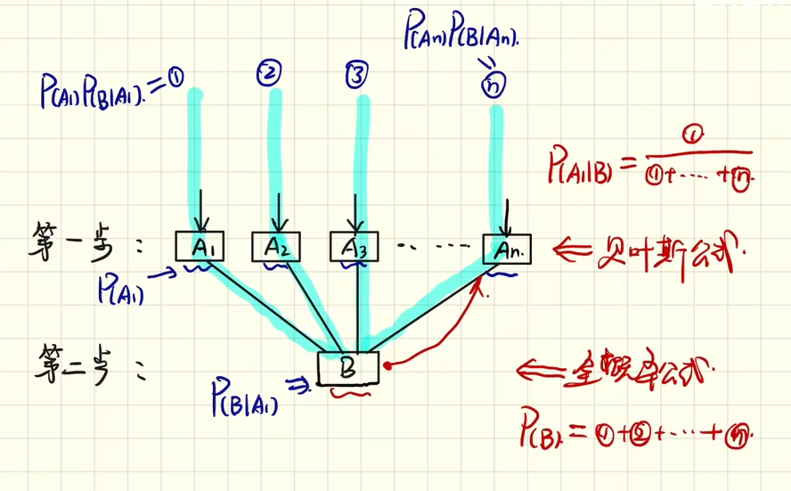

- 到第二步的, 其实就是"全概率公式"

- 到第一步的, 其实就是"贝叶斯公式". 即 已知第二步的结果B, 我们来倒推推测它到底是从哪条路径走过来的 (即在第一步中是从哪个路口过来的). 比如, 如果从第stem:[ A_1] 节点过来, 那么其概率就是: stem:[ P(A_1 |B) = \frac{"路径①的概率"} {"路径①的概率 + 路径②的概率 + ... 路径n的概率"}]

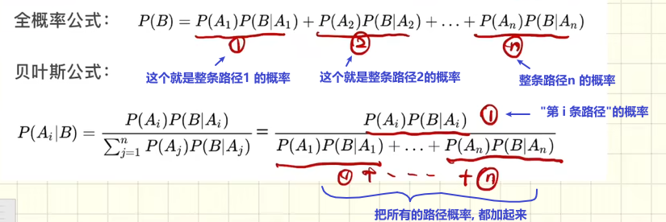

---

=== 解释3

==== 条件概率

条件概率: P(A \|B) : 是在事件B发生的条件下,A发生的概率.
\begin{align}
P(A \|条件B) = \frac{P(AB)} {P(条件B)}
\end{align}

其中, stem:[ P(AB)] 也可写作 stem:[P(A∩B)]

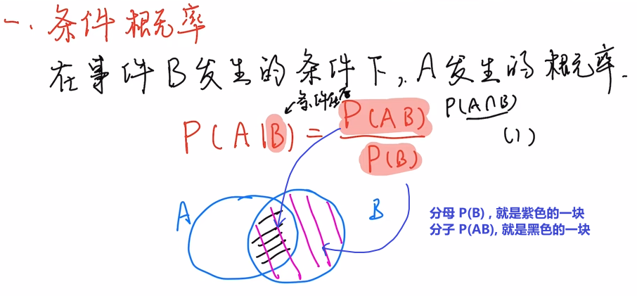

.标题
====
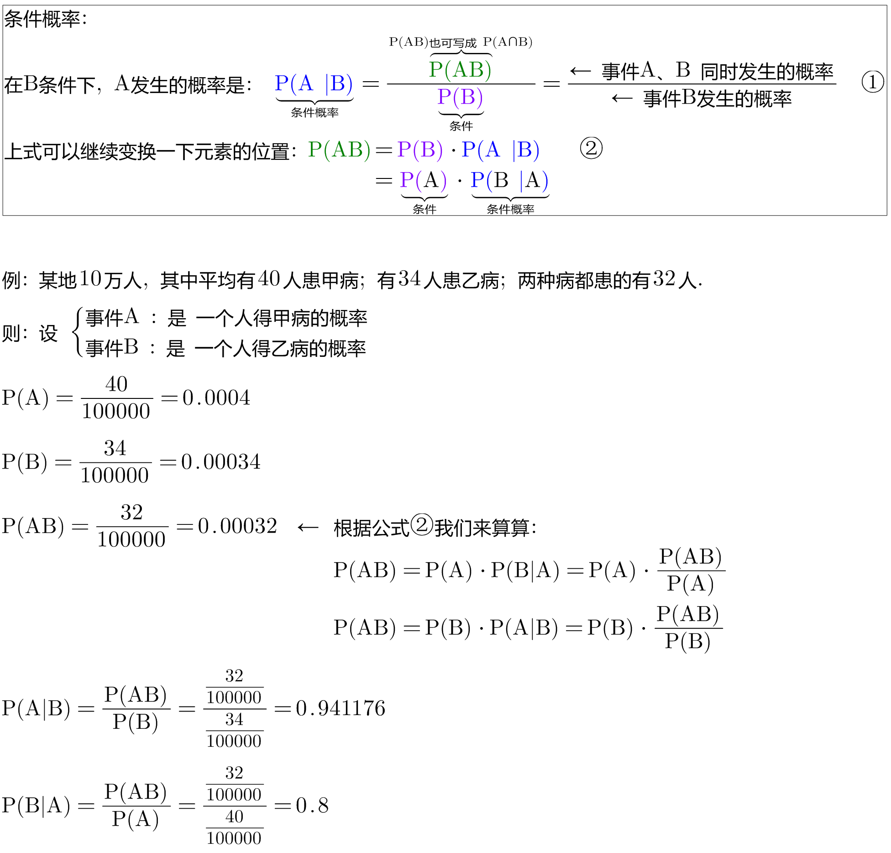

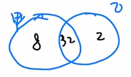
====

==== 全概率公式

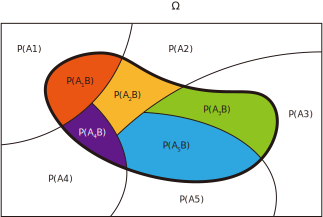

上图, 粗线部分围起来的整块, 就是B.  +
B的概率, 就等于= 每一个彩色块的概率, 加总起来.

比如第1块, 橙色的概率, 就是 A1 和 B 的交集, 即 stem:[ = P(A_1 ∩ B)] +
P(B) = 所有5块彩色的概率 加起来. 即得到下图中的"全概率公式".

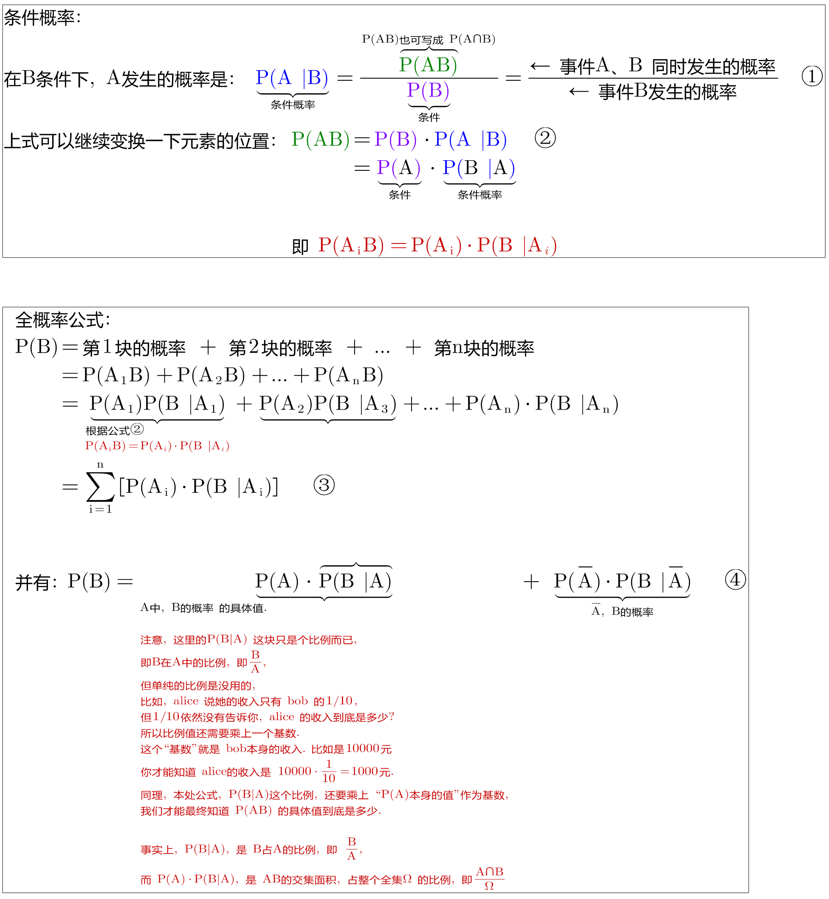

如果我们把 全集分为 两部分: A 和 stem:[ \overline{A}], 则, B的部分, 就是: stem:[ P(B)= P(A) \cdot P(B \|A) +  P( \overline{A}) \cdot P(B \| \overline{A})]

如下图:

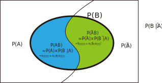

==== 贝叶斯公式

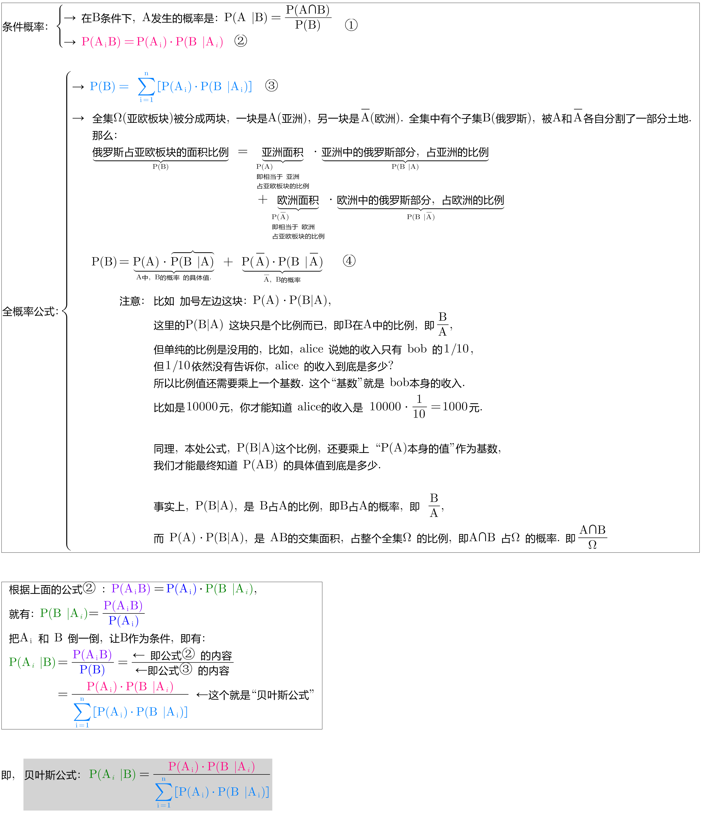

.标题
====
例如： +
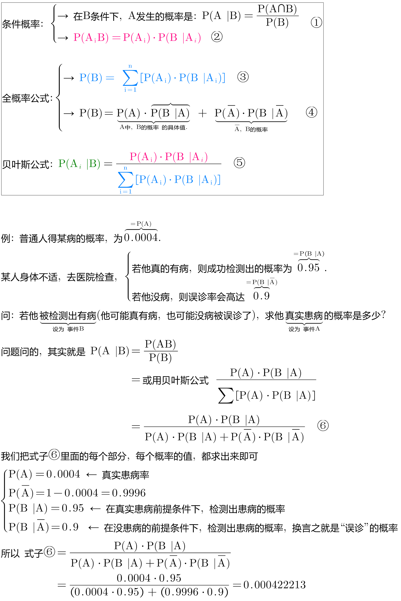
====

---

== 贝叶斯公式 Bayes Rule

全概率公式, 是从"原因"来推"结果的可能性是多少".

贝叶斯公式, 是从"结果"来推其"某种原因的可能性是多少". 即 stem:[P("原因"_i|"某结果")]

.标题
====
例如： +
image:img/0057.png[,850]
====

---

== 定理: 从"果", 来推是某"因"的可能性大小: 贝叶斯公式: stem:[ P(A_k | B) = \frac{P(A_k) \cdot P(B | A_k)} {\sum_{i=1}^n \[P(A_i) \cdot P(B | A_i)\]} = \frac{P(A_k B)} {P(B)} ]

image:img/0058.png[,]

image:img/0059.png[,550]

.标题
====
例如： +
image:img/0060.png[,]

image:img/0061.png[,200]
====

---
