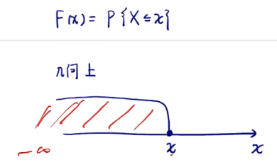
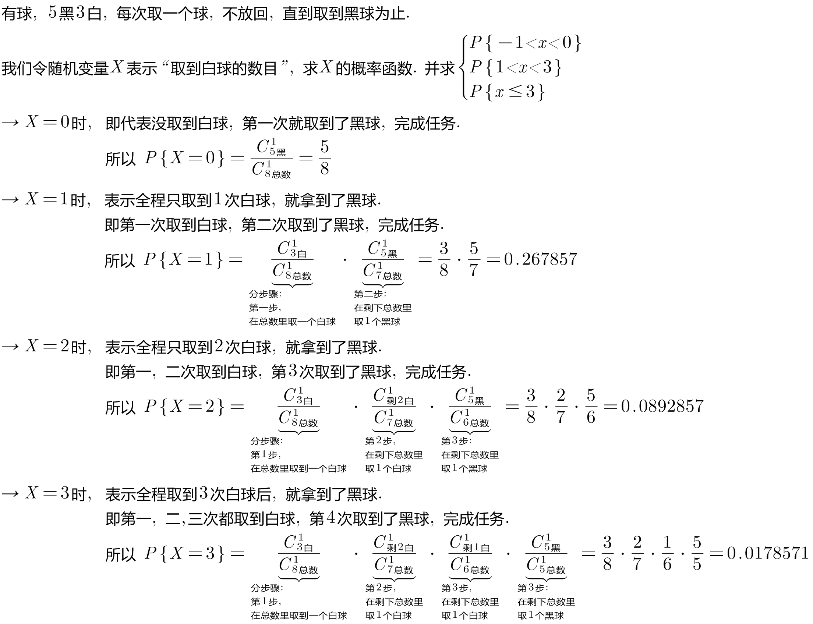
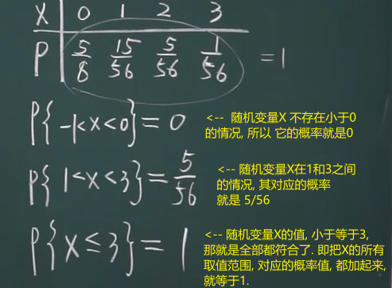
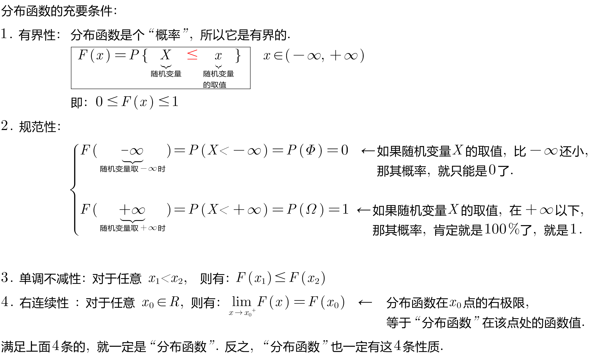
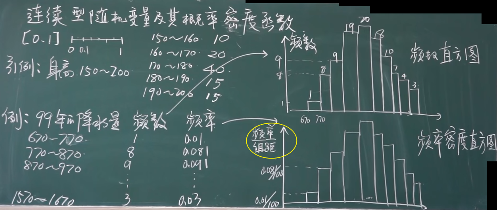
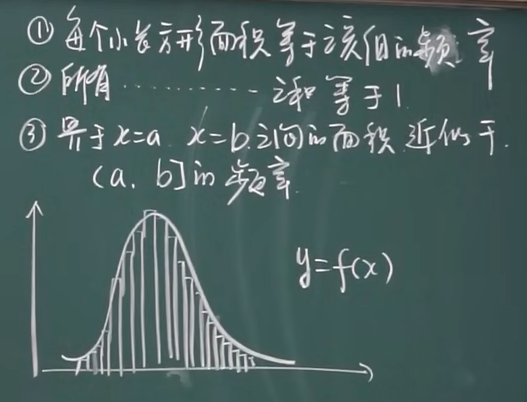
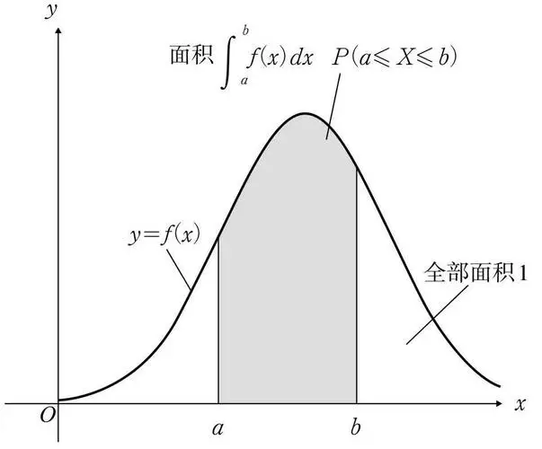
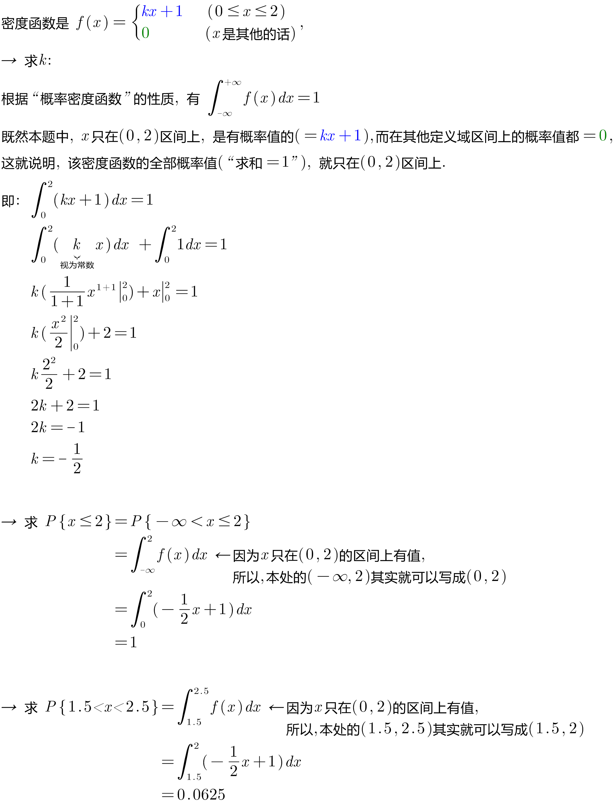
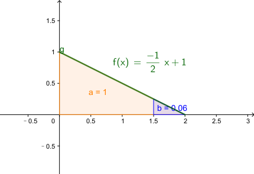
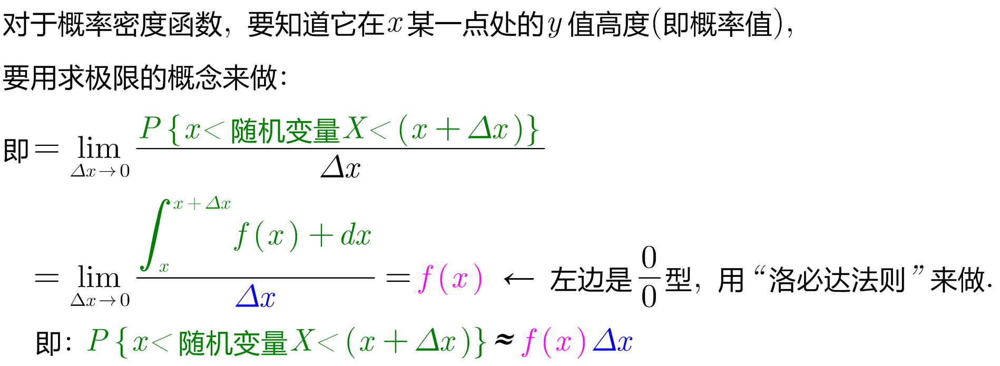

= 随机变量
:toc: left
:toclevels: 3
:sectnums:

---

== 随机变量 random variable

[options="autowidth"]
|===
|Header 1 |Header 2

|随机变量
|假如一个变量, 在数轴上的取值, 依赖随机现象的基本结果，则称此变量为"随机变量"，常用大写字母X,Y,Z 或希腊字母来表示.其取值用小写字母 x,y,z等表示。

|离散随机变量
|假如一个随机变量, 仅数轴上的"有限个"或"可列个"孤立点，则称此随机变量为"离散随机变量"。 即: 随机变量的X值, 都可以逐个列举出来。

比如: 掷一颗骰子，另 X 表示投出的点数，则 X 就是一个随机变量，它的可能取值为1,2,3,4,5,6.  +
stem:[ {x≤4}] 表示掷出的点出不超过4这一随机事件。

|连续随机变量
|假如一个随机变量的可能取值, 充满数轴上的一个区间（a,b），此变量称为"连续随机变量"。

如: 观察某生物的寿命（单位：小时），另Z 表示该生物的寿命，则Z就是一个随机变量. 它的所有可能取值为所有非负实数。 +
stem:[ {Z≤1500}] 表示该生物的寿命不超过1500小时这一随机事件.

连续型随机变量：可以取一个或多个区间任何值，因此, 它所有可能的取值, 是无法逐个列举出来的.

|分布函数
|
|===

比如, 随机变量X,  其=a的话, 我们就把这个事件, 记作 stem:[ {X=a}],  其概率就是 stem:[ P{X=a}], 或写作 stem:[P(X=a)].

---

== 离散型随机变量, 及其概率分布 -- 分布函数

=== 分布函数

分布函数, 就是:  +
\begin{align*}
F(x) = P\{随机变量X \leq 随机变量的取值x\}  ,\quad x \in (-∞, +∞)
\end{align*}

我们就称: F(x) 为 随机变量X 的 "分布函数". +
F(x) 是 关于小x 的函数. 即, 小x 是自变量.

注意: 随机变量X 是一个取值的范围, 如下图, 它从(-∞, x).  当然, stem:[x \in (-∞, +∞)]

.标题
====
例如： +

然后, 我们画出概率分布表:

====

---

=== 分布函数的充要条件:

---

== 连续性随机变量, 及其"概率密度函数"

注意区别:

- "离散型"的随机变量, 其函数叫"分布函数"
- "连续性"的随机变量, 其函数叫"概率密度函数"

概率密度函数（Probability Density Functions，简称PDF）

定义：设X 为一随机变量，若存在"非负""可积"的"实函数" stem:[f(x) \ge 0]，使对任意实数 stem:[a < b]，有：

stem:[P\{ a \le x < b\} = \int_a^b f(x)dx]

则称 X 为"连续随机变量"，f(x) 称为 X 的"概率密度函数"，简称"概率密度"或"密度函数".

概率密度函数具有如下性质：

[options="autowidth"]
|===
|Header 1 |Header 2

|1.非负性：
|stem:[f(x) \ge 0]

|2.规范性：
|stem:[\int_{ - \infty }^{ + \infty } f(x)dx = 1]

|3.连续型随机变量, 取"个别值"的概率, 为0.
|比如, 在一段区间上, 投掷质点(无面积, 0维), 该质点砸中任何一个数值的概率, 就是为0.

你可以倒过来想: 如果"该质点能砸中某个数值"的概率, 是可以给出的, 比如是 0.000001%, 那"一段区间"上是有无穷多的点的, 0.000001% 乘以无穷多, 一定是会超过 100%的, 这就违反了概率不能超过1 的定义. 所以, "质点投中任何位置处"的概率, 都无法给出, 是0.
|===

对于"连续型随机变量", 有没有两端的端点, 无所谓, 不影响概率值(因为它在任何一个"确定点"的概率都是0嘛). 即: +
\begin{align*}
& P \{ a \leq X \leq b \} \\
& = P \{ a < X \leq b \} <- 即, 两端是否有"等于号", 无所谓. \\
& = P \{ a \leq X < b \}  \\
& = P \{ a < X < b \}
\end{align*}

同样, +
\begin{align*}
& P\{X<a\} = P \{X \leq a \} <- 有没有"等于号"无所谓 \\
& P\{X > a\} = P \{X \geq a \} \\
\end{align*}

注意: 概率为0 的事件, 未必是"不可能事件". (如, 扔质子) +
概率为1 的事件, 未必是"必然事件".

.标题
====
例如： +

====

---

=== 连续性概率函数, 在"x=某一点处"的概率求法 -> 要用"极限"的概念来求.

---

