= 分布函数
:toc: left
:toclevels: 3
:sectnums:

---

==  名词解释

=== 离散型随机变量 & 连续型随机变量

[options="autowidth"]
|===
|Header 1 |Header 2

|离散型随机变量
|如果随机变量的值, 可以都可以"逐个列举出来"，则为"离散型随机变量"。

如果随机变量X 所有可能取的值, 为"有限可列举"的，有 n 个有限取值：stem:[ {x_1, x_2, ... , x_n}]，则称 X 为"离散型随机变量"。

|连续型随机变量
|如果随机变量X的取值, 无法逐个列举, 则为"连续型变量"。 比如: 寿命.

与"离散型随机变量"不同，一些随机变量X 的取值, 是不可列举的，由全部实数, 或者由一部分区间组成，比如： +
stem:[X={x \| a \leq x \leq b}, -∞ < a < b < ∞ ] +
则称 X 为"连续随机变量"，"连续随机变量"的值, 是不可数, 或者无穷尽的。
|===

研究一个随机变量，不只是要看它能取哪些值，更重要的是它取各种值的概率如何！

因此, 无论是"概率分布"、"概率函数"、"概率分布函数"、"概率密度函数"等, 都是在描述概率，只不过是角度不同。

---

=== 概率函数 (概率质量函数)  Probability Mass Function PMF （只有离散型有）

概率(质量)函数, 即用函数的形式来描述概率，比如，掷骰子不同点朝上的概率为： +

image:img/0096.png[,400]

在这个函数里:

- 自变量X 是"随机变量"的取值，
- 因变量 stem:[ p_i]是"自变量X所取到某个值"的概率。

从公式上来看，"概率函数", 一次只能表示一个取值的概率。比如 stem:[ P(X=1)= 1/6], 就表示: 当随机变量X 取值为 1时, 即骰子的点数为1时的概率, 为1/6. 所以说, 它一次只能代表一个随机变量的取值。

---

=== 概率分布列表

"概率分布", 即概率的分布，将可能的取, 值和对应的概率, 全都陈列出来。同样还是掷骰子为例：

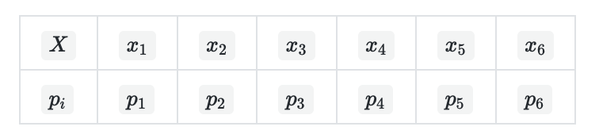

上面这样的列表, 被叫做"离散型随机变量"的“概率分布”。严格来说，它应该叫“离散型随机变量的'值分布', 和'值的概率分布' 列表”. 因为这个列表，上面是"值"; 下面是这个取值, 相应取到的"概率". 而且这个列表, 把所有可能出现的情况全部都列出来了！

注意: 概率分布, 必须将所有可能出现的情况, 都列出来.

---

=== 概率分布函数 (分布函数 Cumulative Distribution Function, 简称CDF) →  就是把"概率函数"的值累加

概率分布函数 F(x), 也称为"分布函数".

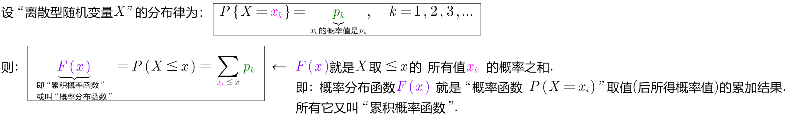

上面的公式中, 等号右边, 即 stem:[ P(x \leq x)] 部分, 是一个长的很像"概率函数"的公式，但是其中的"等号"变成了"大于等于号"。

*而stem:[ P(x \leq x)] 它等于什么呢? 就等于 stem:[ \sum_{x_k \leq x} p_k], 即: 就是一个一个的"概率函数"的累加！*

*所以, 概率分布函数 F(x)的值, 就是"概率函数"取值的累加结果. 所以它又叫"累积概率函数".*

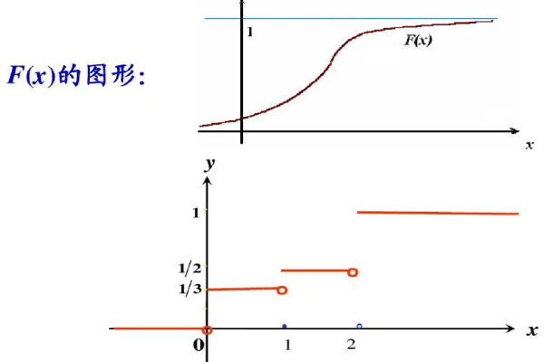

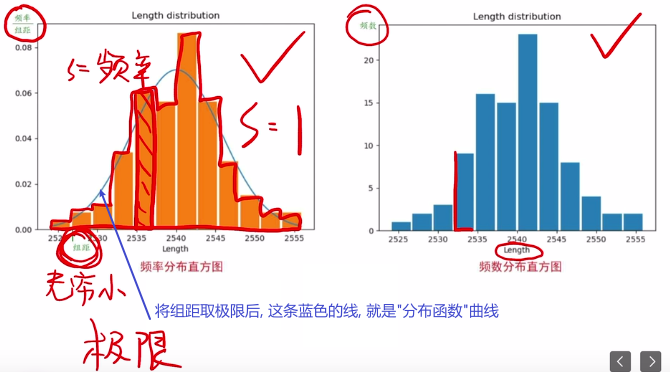

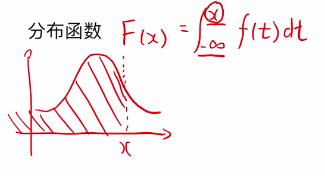

*如果将X 看成数轴上随机点的坐标，那么"分布函数F（x)"在x处的函数值, 就表示点 X 落入区间（-∞,x]上的概率。*

可以这样理解：假设现在, 有全世界所有人的身高的"分布函数"，而你的身高是175cm，那么分布函数在175cm处的y值, 就是所有比你矮, 或者和你一样高的人, 占全世界所有人的比例。

分布函数, 是"随机变量"最重要的概率特征. "分布函数"可以完整地描述随机变量的统计规律，并且决定随机变量的一切其他概率特征。

"概率函数"和"概率分布函数", 就像是一个硬币的两面，它们都只是描述概率的不同手段！

---

=== "连续型随机变量" 的“概率函数(即: 概率密度函数)” 和 “概率分布函数” -> #芬(分布函数) 岛(的导数) 盖(是概率函数),  即: stem:[ F'(x) = f(x)]#

连续型随机变量, 也有它的“概率函数”和“概率分布函数”，但是"连续型随机变量"的“概率函数”换了一个名字，叫做“概率密度函数”！

因为"连续型随机变量"的数值是连续的，求它在某一点处的概率, 会等于0. 这样做就好比一个物体，你在计算它每个点所对应的"质量"一样.

陈希孺在《概率论与数理统计》对"密度函数"的描述:

.标题
====
取定一个点 x ，则按"分布函数(是个累加值)"的定义，事件 stem:[ x<X<x+h] ( h 为常数)的概率就为： stem:[
F(x+h)−F(x) ]，所以比值：stem:[  \[F(x+h)−F(x)\]/h] ，可以解释为 x 点附近
h 这么长的区间 (x,x+h) 内，单位长度所占有的概率.

令 h→0 ，则这个比的极限，即 F′(x)=f(x)，也就是 x 点处(无穷小的区段内)单位长的概率. 或者说，它反映了概率在 x 点处"密集程度".  +
你可以设想一根极细的无穷长的金属杆，总质量为1，"概率密度"去相当于杆上各点的质量密度.

====

image:img/0100.png[,450]

左边是F(x) "连续型随机变量" "分布函数"画出的图形，右边是f(x) "连续型随机变量"的"概率密度函数"画出的图像，它们之间的关系就是: *概率密度函数, 是分布函数的"导函数".*

即: \begin{align}
\boxed{
(分布函数F(x))'= 概率密度函数f(x)
}
\end{align}

口诀: 芬(分布函数) 岛(的导数) 盖(是概率函数)

*两张图一对比，你就会发现，如果用右图中的面积来表示概率，利用图形就能很清楚的看出，哪些取值的概率更大！所以，我们在表示"连续型随机变量"的概率时，用f(x)"概率密度函数"来表示，是非常好的！*

**某点的 "概率密度函数" 即为 "概率在该点的变化率(或导数)"。**

Q: 概率密度函数在某点的函数值，有什么意义？ +
A: 其实 概率密度函数值 即为 概率在该点的变化率.

**千万不要误认为：概率密度函数值是 该点的概率.** 这个就类似于导数的概念. 导数代表着"该点处切线的斜率"!

*分布函数F（x）, 表示随机变量X 落入区间(a，b] 的概率。因此可得等式 stem:[ P（a<X<=b）= F(a) - F(b)].*

---

== 分布函数 <- 离散型, 和连续型 随机变量, 都有"分布函数".

注意: 以下的性质, 对离散型, 和连续型, 都成立!

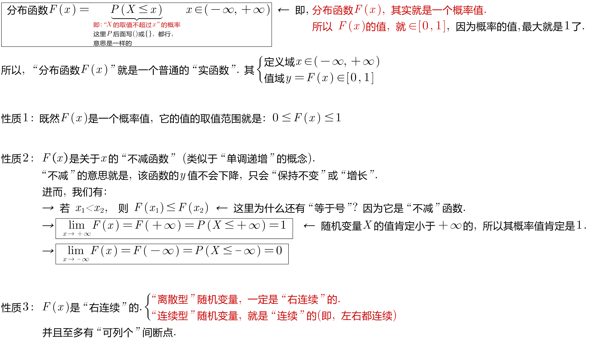

[options="autowidth"]
|===
|Header 1 |Header 2

|右连续
|所谓"右连续", 就是"函数从x在某点的右侧, 逼近该点"的极限值, 就等于"该点处的y值", 即: stem:[\lim_{x -> a^+} F(x) = F(a)]

|左连续
|同理, "左连续"就是: stem:[\lim_{x -> a^-} F(x) = F(a)]

|连续
|同时满足"左连续"和"右连续"的函数, 就称为是"连续"的. 即stem:[\lim_{x -> a} F(x) = F(a)].
|===

---

== 分布函数 Distribution Function 的公式 (对离散型, 和连续型, 都成立)

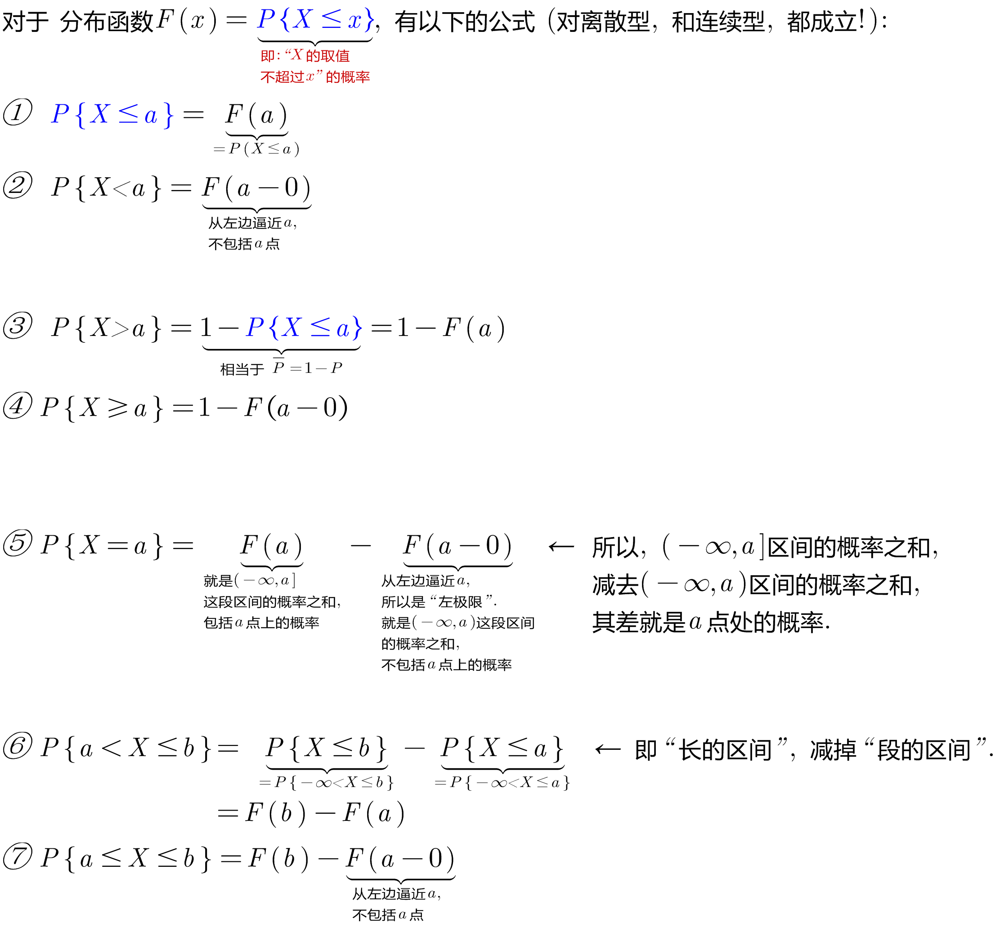

下面用配图来说明, 即:

[options="autowidth"]
|===
|分布函数 stem:[F(x)=P{X \leq x}] 的公式有: |图中, stem:[蓝-绿=橙]

|① stem:[P{X \leq a} = F(a)]
|

|② stem:[P{X < a} = F(a-0)]
|

|③ stem:[P{X > a} = 1- P{X \leq a} = 1- F(a)]
|

|④ stem:[P{X \geq a} = 1- F(a-0)]
|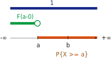

|⑤ stem:[P{X=a} = F(a) - F(a-0)]
|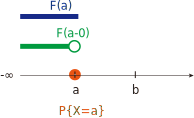

|⑥ stem:[P{a < X \leq b} = P(X \leq b) - P(X \leq a)]
|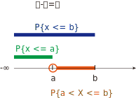

|⑦ stem:[P{a \leq X \leq b} = F(b) - F(a-0)]
|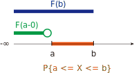
|===

.标题
====
例如： +
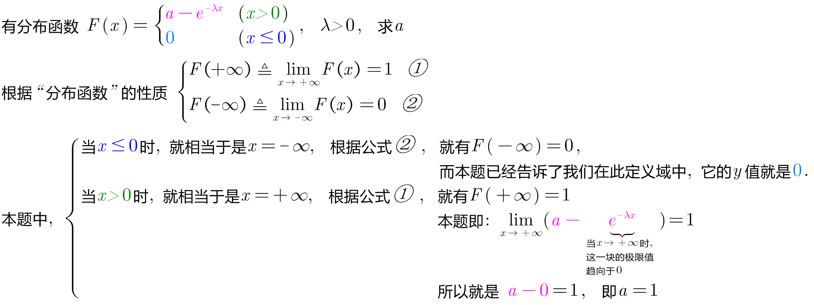
====

.标题
====
例如： +
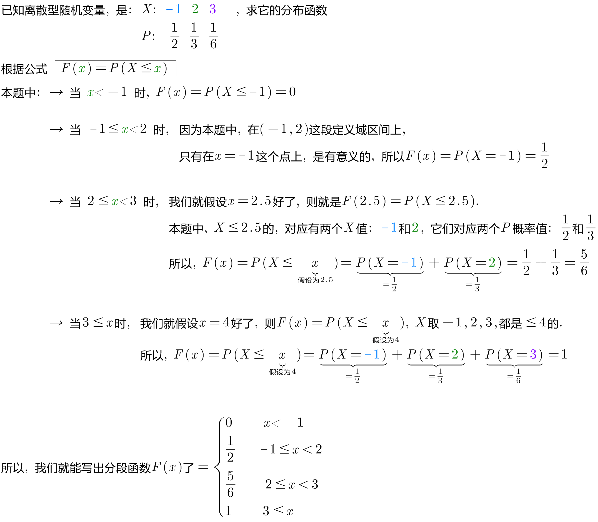

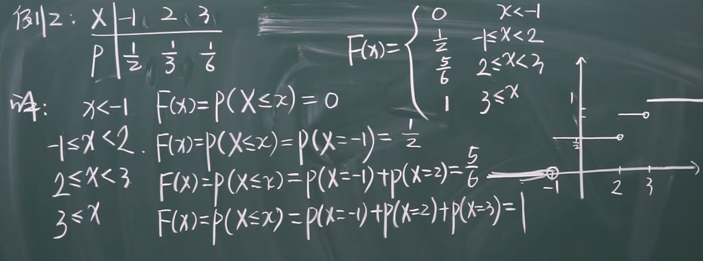

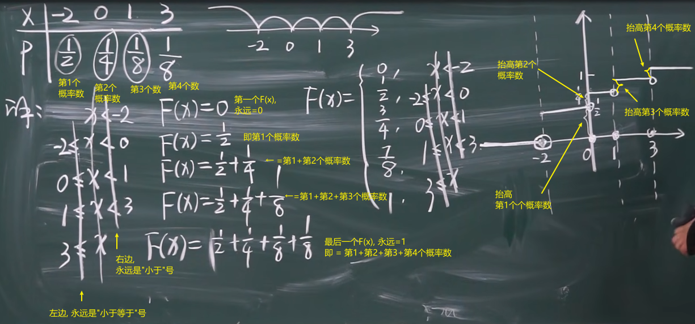

注意: 使用上图中的快速解法时, 表中的X的值, 必须先要从小到大排好. 而不能顺序乱排.
====

---

== "连续型随机变量"的"分布函数"

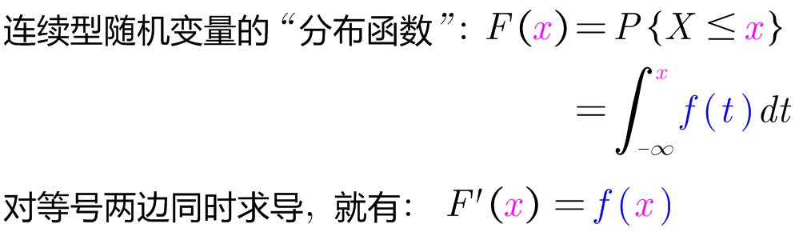

.标题
====
例如： +
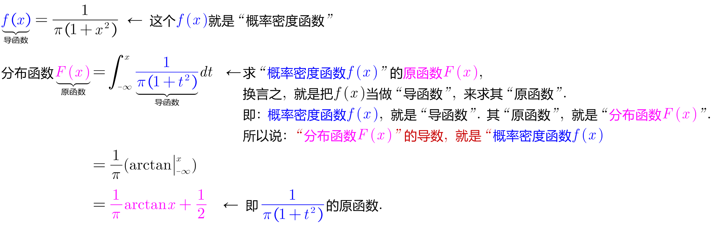

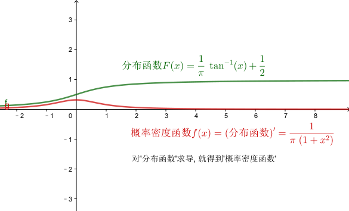
====

.标题
====
例如： +
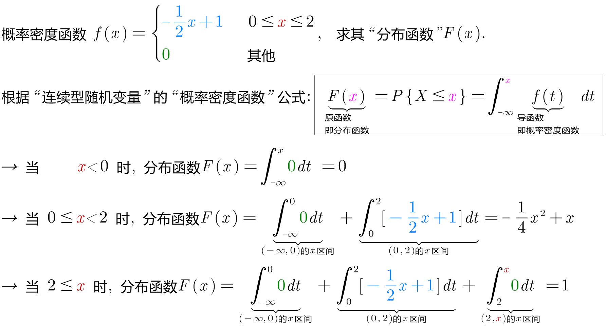

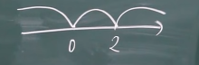

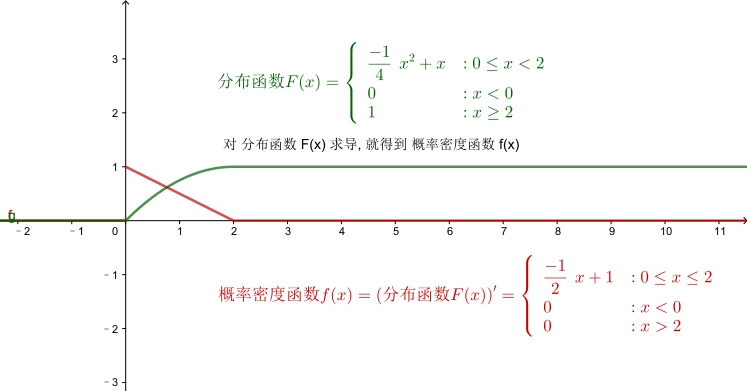
====

.标题
====
例如： +
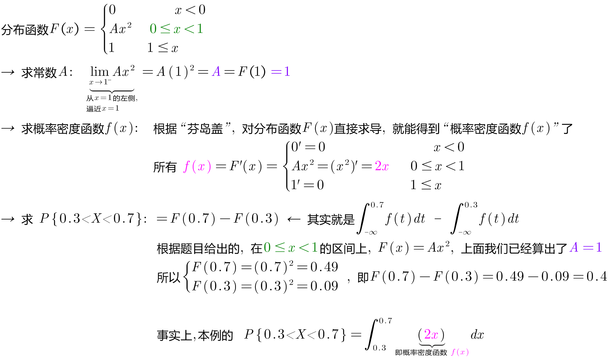

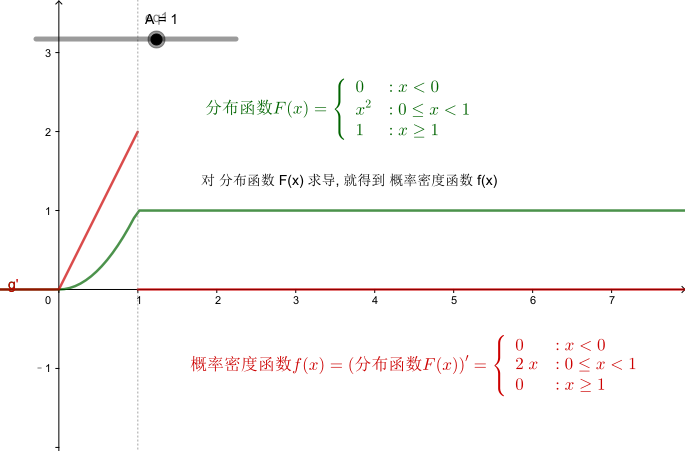
====

---

