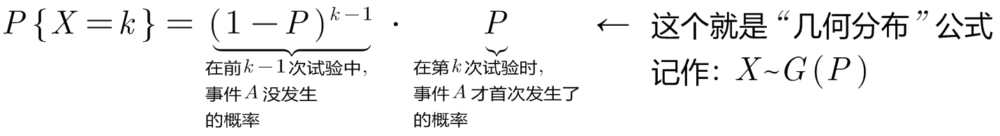
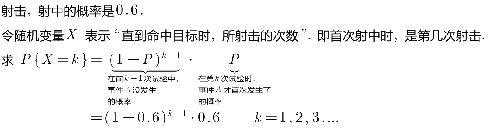

= 常见"随机变量"的分布: 几何分布
:toc: left
:toclevels: 3
:sectnums:

---

=== 几何分布 Geometric distribution  → 只要看到"首次发生"关键词, 我们就要想到使用"几何分布"来做.

即, 某事件A, 发生的概率是P,  即 stem:[ P(A)=P].  我们把试验重复做很多遍, 使得该事件A, 在第k次试验时, 首次发生了. 即前面的 k-1 次试验中, 都没发生事件A. 则:

几何分布（Geometric distribution）是离散型概率分布。其中一种定义为：**在n次伯努利试验中，试验k次才得到第一次成功的机率。**详细地说，**是：前k-1次皆失败，第k次成功的概率。**

"几何分布"是"帕斯卡分布"当 r=1 时的特例。

.标题
====
例如： +

====

---
