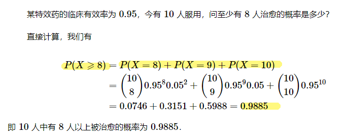
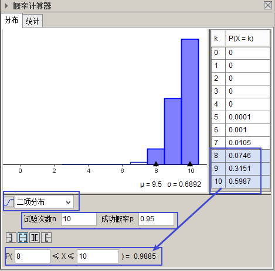
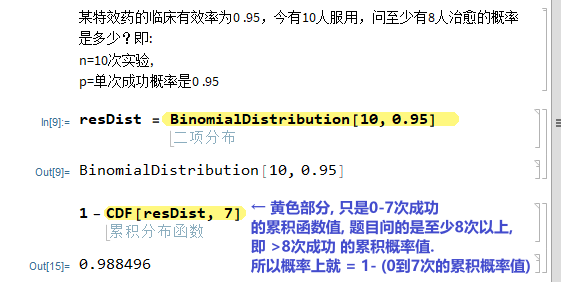
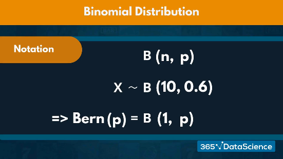
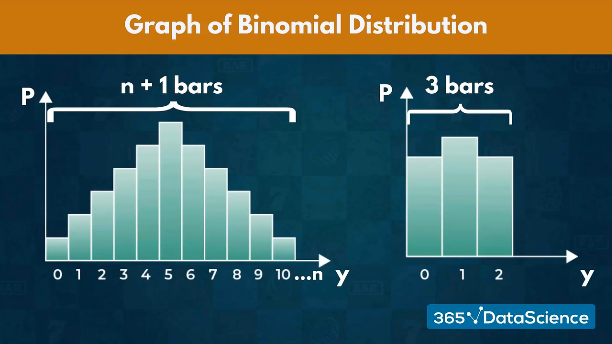
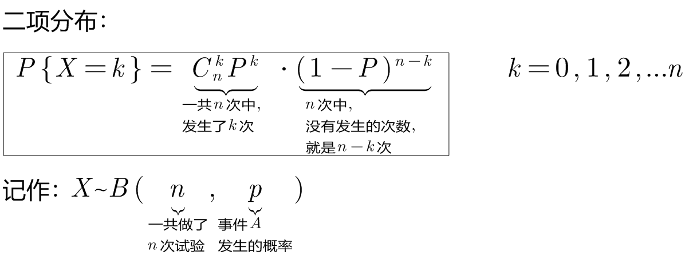
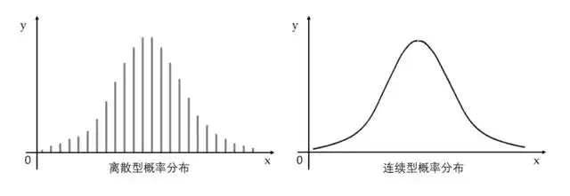
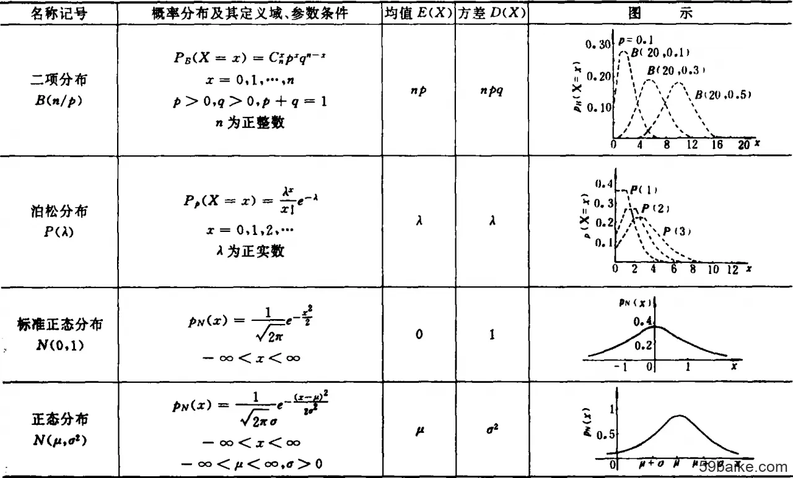
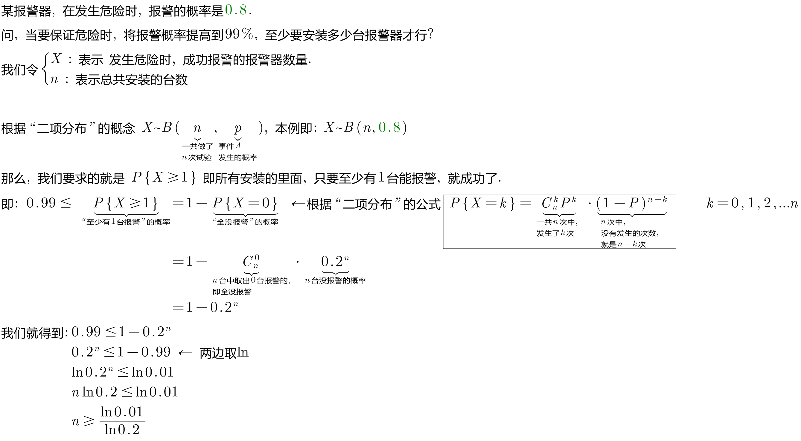
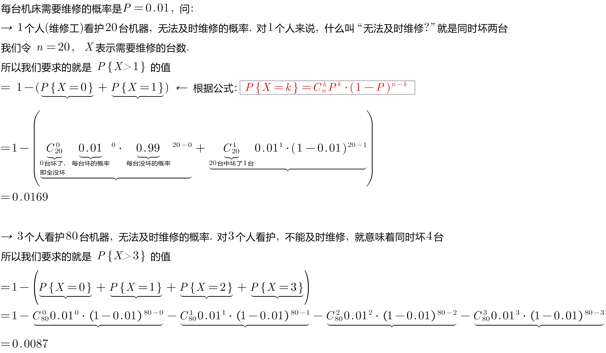

= 常见"随机变量"的分布: 二项分布
:toc: left
:toclevels: 3
:sectnums:

---

== ★ Mathematica 和 Geogebra 中, "二项分布"的用法

---

=== 二项分布 binomial distribution

二项, 代表“有两个结果”. 比如, 一个为"成功", 另一个为"失败".

又比如, 投硬币10次，让X表示“正面向上的次数”，那么X 就是一个服从"二项分布"的随机变量 -- 每投一次硬币只有两种结果: 要么是"正面朝上", 要么是"反面朝上".

本质上，"二项事件"是一系列相同的"伯努利事件"。

我们用字母“B”来表示二项分布， 即: stem:[ B("试验次数"n, "每项试验成功的概率"p)].

比如, 我们将 stem:[ X ~ B(10, 0.6)] 读作: 变量“X”遵循10次试验中, 每项试验成功的可能性为0.6的 二项分布。  +
Variable “X” follows a Binomial distribution with 10 trials /and a likelihood of success of 0.6 /on each individual trial.

此外，我们可以通过一次试验, 将"伯努利分布", 表示为"二项分布"。

假设, 你的教授给全班同学来了一个惊喜的突击测验，考试是10个判断题. 你对某一道题的猜测, 这就是属于"伯努利事件" a Binomial Event  (只有两种选择, "对"或"错"). 而整个测验, 是属于一个"二项事件"。 the entire quiz is a Binomial Event.

其中，"伯努利分布"的期望值, 表明我们对单个试验的预期结果。 +
the expected value of the Bernoulli distribution /suggests(v.) which outcome we expect for a single trial.

现在，"二项分布"的期望值, 是我们期望获得特定结果的次数。 +
the expected value of the Binomial distribution /would suggest(v.) the number of times we expect to get a specific outcome.

*二项分布表示, 在特定的次数内, 能达到我们期望结果的可能性。* +
the graph of the binomial distribution /represents(v.) the likelihood of /attaining(v.) our desired outcome /a specific number of times.

例如， 我们来投掷一个正反面重量不平衡的硬币。如果我们投掷两次, 就需要三种不同的结果: 0个,1个, 或2个正面. 所以, 如果我们进行n次测试, 我们的图表将需要由“n+1”栏组成.

如果我们希望在n次试验过程中, 精确地找到获得给定结果的相关可能性，就需要引入"二项分布的概率函数" stem:[ p(y)]. the probability function of the Binomial distribution.

首先，每个单独的试验, 都是伯努利测试.

- 我们把得到期望结果的概率, 表示为“p”,
- 其他结果的可能性, 表示为"1-p".
- 为了在n次试验中, 获得y次我们喜欢的结果
- 我们就会有多次(“n-y”次), 得到另一个不喜欢的结果。 或者, 我们会估计"至少y次获得预期结果"的可能性。

\begin{align}
二项分布的概率函数
\end{align}

https://www.bilibili.com/video/BV1Wu411k7wq?spm_id_from=333.999.0.0&vd_source=52c6cb2c1143f8e222795afbab2ab1b5

3.59

---

某事件A发生的概率是P, 我们在做了n次试验后, 得到该事件A, 发生了k次, 则:

之前说过的"0-1分布", 其实是本"二项分布"的一种特例而已.

我们还关心这个问题: 当随机变量X取什么值时, 其概率P最大? 即求k, 使stem:[ P(X=k)=C_n^k P^k \cdot (1-P)^{n-k}] 最大.

- 当 (n+1)p 为整数时, 满足最大值的k, 有两个: 即: ① stem:[ (n+1)p-1], 或 ② stem:[ (n+1)p]
- 当 (n+1)p 不为整数时, 则k为这个区间内的唯一正整数. 即, 将 stem:[ (n+1)p] 取整, 即变成 stem:[ \[ (n+1)p \]] , 能达到最大值.

.标题
====
例如： +

====

.标题
====
例如：

[source, python]
----
from scipy.special import comb, perm

'''
# print(perm(3, 2))
# print(comb(3, 2))
pow(a, 1.0/2)，等价于a开2次根号
pow(a, 2)，等于a的2次方
'''

n=80 # n代表总的机器台数
p=0.01 # p代表每台机器会出故障的概率

def fn_概率二项分布(k): # k代表坏了的台数, 即有多少台数机器出了故障
    res= comb(n,k) * pow(p,k) * pow((1-p), n-k)
    return res

resAll = 1-fn_概率二项分布(0)-fn_概率二项分布(1)-fn_概率二项分布(2)-fn_概率二项分布(3)
print(resAll) # 0.008659188892861415
----
====

---
