= 常见"随机变量"的分布 : 泊pō松分布
:toc: left
:toclevels: 3
:sectnums:

---

== ★ Mathematica 和 Geogebra 中, "泊pō松分布"的用法

50年一遇的大雨.  你就以50年为时间段 (即平均会发生一次这种大雨, 即 μ=1), 在这50年中, 你遇到0次, 1次, 2次, ... 这种大雨的真实概率, 是多少?

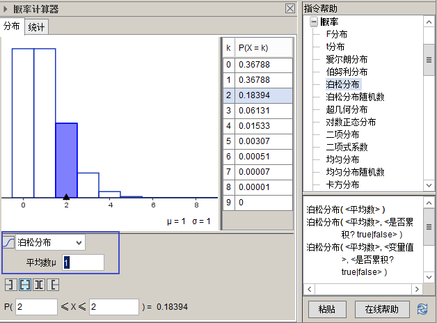

Mathematica中, 这个"均值"到底是"哪种时间长度"中的发生均值, 由你自己来确定. 比如, 本例就以 50年为时间段, 均值就是1.  如果拉长到100年为时间段, "50年一遇的大雨"在"100年时间段"中的发生均值, 就是2.

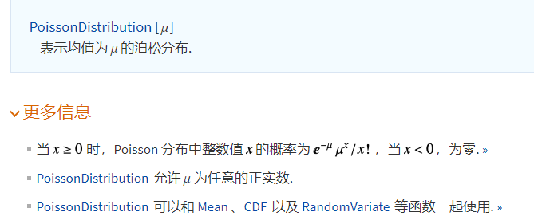

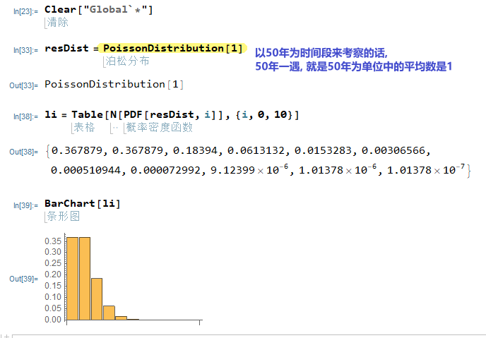

---

== 解释

=== 解释 (刘嘉概率讲座)

==== 泊松分布, 用于描述"单位时间内, 随机事件的发生次数"

"50年一遇"的大雨, 结果三年之内下了两场, 这是怎么回事?  “五十年一遇”，转化为数学语言是指，长期来看，这样的大暴雨是平均50年发生一次。**注意,这里的关键词, 即时空范围是“长期”。长期是多长? 很长很长。** 所以对"长期"的理解不到位，是概率问题的结果经常反直觉的关键。

平均50年发生一次，也可以是: 前4年每年都发生一次，之后的196年一次都没有，200除以4，还是50年一次，与“五十年一遇”并不冲突。

所以, 我们更想知道的是: 在任何一段具体的、有限的时间内,比如5年之内，发生1次大暴雨的概率是多少? 发生2次大暴雨的概率是多少?

即: 当我们知道了一个随机事件发生的整体概率，也知道这个随机事件发生的概率符合"正态分布"之后，那么在某一段时间或者空间间隔内,这个随机事件"发生的次数"的概率分布, 是怎样的呢? 这个问题, 能用"泊松分布"来解决.

泊松分布的公式是:
\begin{align}
P(X=你希望发生k次)=\frac{λ^k} {k!} e^{-λ}
\end{align}

其中,  +
k : 为随机事件发生次数. 比如,  +
入: 为单位时间内, 随机事件的平均发生次数. 比如, 50年一遇的大雨 :  +
如果以50年为单位的话, 发生次数就是: 1次.  ( 进一步, 我们可以算出即 每年发生 stem:[ 1/50] 次).  +
如果以100年为单位的话, 发生次数就是 : stem:[ 100年 \cdot  每年1/50次 = 2次 ] +
如果以5年为单位的话, 发生次数就是 : stem:[ 5年 \cdot  每年1/50次 = 1/10次 ] +

那么套用"泊松分布公式", 来算一下, 50年中, 一次上面的大雨也不发生的概率: 即 k=0次 :

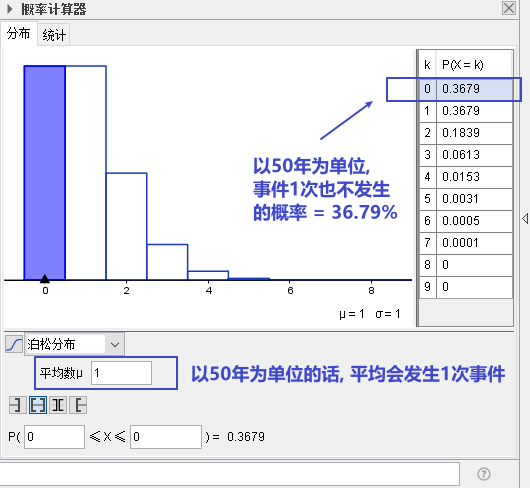

K=2，就是接下来的50年为单位的话, 在其中发生2次大暴雨的概率。代入公式一算，答案是18%。 如下图

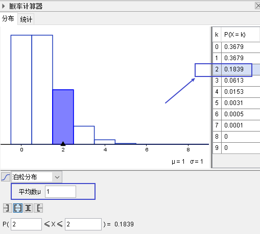

50年中, 发生2次和2次以上 的概率是: 用1 减去发生0次和发生1次的概率.= 1 - (0.3679*2) = 26%, 说明这并不是很小的概率事件.

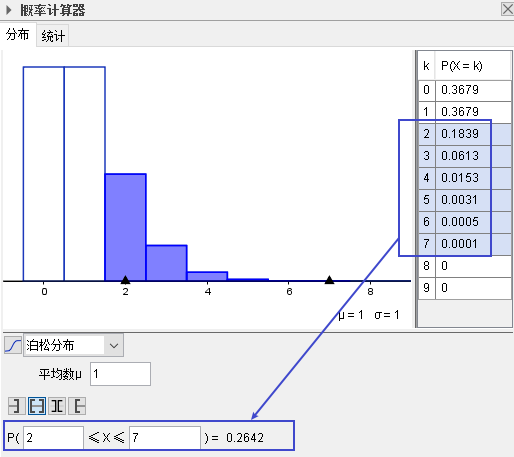

==== 泊松分布的两个数学性质

[options="autowidth"]
|===
|Header 1 |Header 2

|1. 随着我们把"时间单位"拉长, 我们会发现: "泊松分布"的曲线越来越像"正态分布".
|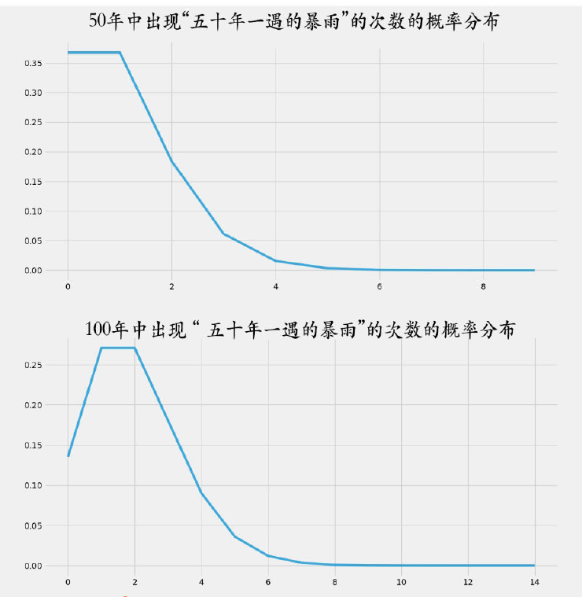

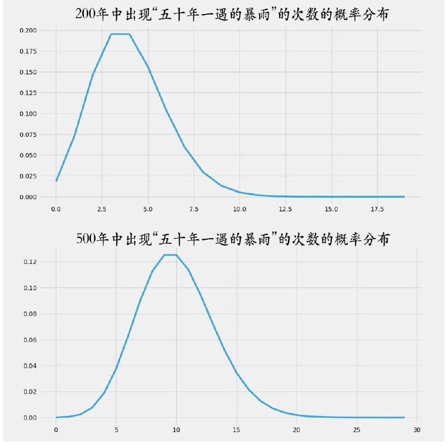

|2. 泊松分布中, 事件对两次发生的时间间隔, 是无"记忆性"的.
|即 : 后一次事件不会记得"距离它前一次发生, 时间隔了多久". 换言之, 事件之间是相互"独立"的关系.

正因此, 就一定存在一些"短间隔"和"长间隔"，而很难"一长一短、一长一短"这样有规律的出现. 否则就不叫"随机"了。
|===

泊松分布, 为我们开启了"统计推断"的大门.

连续2年大暴雨, 是不是正常的? 这个问题的困难在哪儿呢? 数据太少。我们没有1000年的降雨资料. 即便有，在长期、无限面前也是个渣渣，还是太少。

同样，物理学家要研究放射性物质的半衰期, 可绝大多数物质, 衰变期极长，长到我们没法直接测量. 连一个完整的衰变周期都观测不到, 那怎么办呢? 用"泊松分布"解决.

找一堆铋209原子，统计一下在几个确定的时间间隔中，这堆原子有多少个发生了衰变。只要这个数字服从"泊松分布"，反过来就证明铋209原子的衰变, 也服从"正态分布". 就可以用"正态分布"来直接计算。

利用同样的原理，科学家们成功完成了像DNA的突变次数、外太空某个区域内恒星的数量, 等一系列科学问题的计算.

在这些问题的解决中，统计数据, 和概率论的"概率分布 f(x)", 就被连在了一起。 *在"泊松分布"之前, 概率和统计是两个不同的学科。"概率"研究"未发生"的随机事件, "统计"描述"已发生"的现实。那会儿只有描述统计, 没有推断统计。 泊松分布开启了"推断统计"的大门, 第一次把概率和统计连接在一起.*

---

=== 泊pō松分布 poisson distribution = stem:[ P{事X=想}=\frac{均^想 \cdot e^{-均}} {想!}]

泊松分布, 研究的是 在一段时间内, 某事件发生的平均次数λ.

它需要首先满足这几个性质:

1. 该事件在这一段时间内发生的次数, 与在另一段时间内发生的次数, 彼此独立. 互不影响.
2. 该事件在一段时间内的平均发生次数, 与时间段的长短, 成正比.
3. 该事件在极短的时间内, 发生的几率接近0

其实, 泊松分布, 就是"二项分布"的一种特殊情况, 即: 当二项分布中的 stem:[ n → ∞;  \ p→ 0] 时, 就能用泊松分布, 来近似该二项分布.

二项分布的"期望值", 是stem:[ E(X)=np=λ], 所以也就是泊松分布中, λ=np

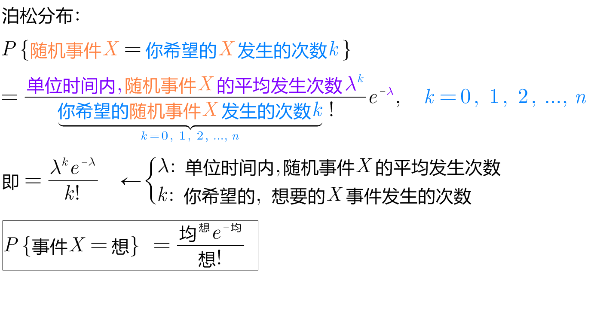

.标题
====
例如： +
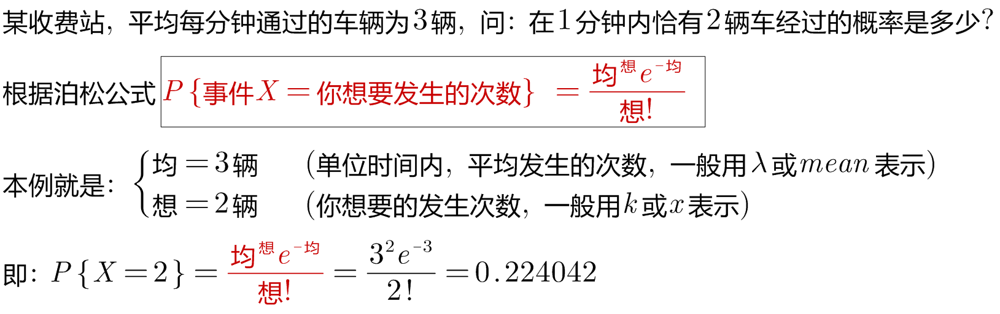

其中, 你想要的在单位时间内, 事件发生的次数, 一般用λ表示, 也可用 mean 表示.  +
在excel表格中, poisson()函数, 就是用mean来代表λ的.
....
excel 表格中:
POISSON(x,mean,cumulative)

x : 即你主观上想要的, 期望的 该事件发生的次数, 即 k

mean : 为该事件 在单位时间内, 客观上平均发生的次数, 即 λ

cumulative : 是否累积.   +
-> 为TRUE时，就使用"泊松累积分布概率"，即，随机事件发生的次数在0到x之间（包含0和1）；
-> 如果为FALSE，则使用"泊松概率密度函数"，即随机事件发生的次数恰好为x。
....

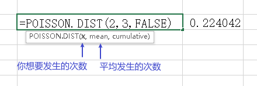
====

.标题
====
例如： +
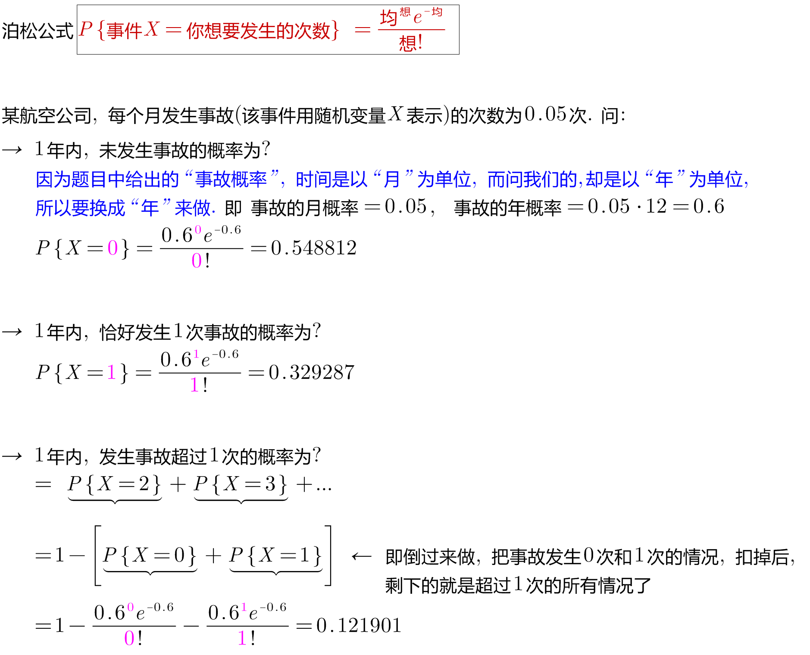
====

.标题
====
例如： +
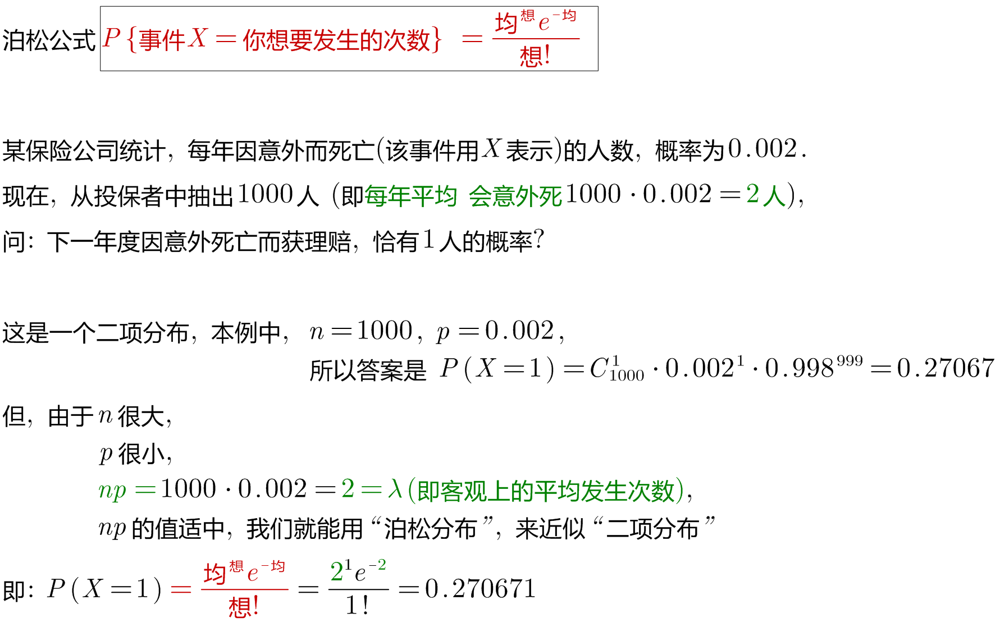
====

.标题
====
例如： +
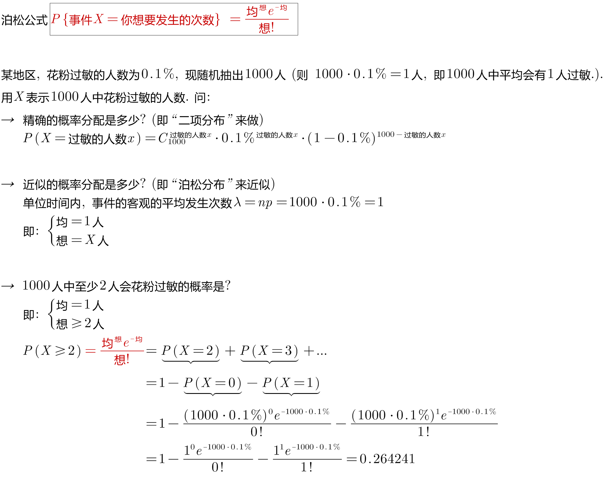
====

https://www.bilibili.com/video/BV1NE41117c2?spm_id_from=333.337.search-card.all.click&vd_source=52c6cb2c1143f8e222795afbab2ab1b5

---

[options="autowidth"  cols="1a,1a"]
|===
|Header 1 |Header 2

|满足"泊松分布"的模型:
|- 一件事在一定时间内发生的次数, 是随机的
- 每次事件的发生, 相互独立
- 该事件要么发生，要么不发生
- 一段时间内, 该事件发生的概率已知

|即, "泊松分布"是为了解决这样的问题的：
|**单位时间内, 随机事件发生的次数. 即: 一件事发生的概率P已知，但它的发生与否是随机的，想要求它发生k次（至少发生k次/至多发生k次等问题）的概率。 **

*当一个随机事件, 以固定的"平均瞬时速率λ"（或称"密度"）随机且独立地出现时，那么这个事件在"单位时间（面积或体积）"内出现的次数或个数, 就近似地服从"泊松分布P(λ)".*

例如:

- 某一服务设施在一定时间内到达的人数
- 来到某公共汽车站的乘客
- 某电话交换台收到的呼叫次数
- 机器出现的故障数，
- 一块产品上的缺陷数
- 自然灾害发生的次数，
- 某放射性物质发射出的粒子
- 显微镜下某区域中的白血球

|λ
|泊松分布的**参数λ, 是单位时间(或单位面积)内, 随机事件的平均发生次数. ** +
"泊松分布" 的期望和方差, 均为λ.

|用 "泊松分布", 来作为"二项分布"的近似.
|*当"二项分布"的n很大(比如 stem:[ n >= 100] ), 而p很小时，即 stem:[ n \cdot p<=10] 的话, 就适合用 "泊松分布", 来作为"二项分布"的近似.  其中λ为np.* +
通常当n≧20, p≦0.05时，就可以用"泊松公式"近似得计算.

事实上，"泊松分布"正是由"二项分布"推导而来的.

泊松逼近定理：在n重伯努利试验中，事件A在每次试验中发生的概率为p，出现A的总次数K, 服从"二项分布" B（n,p），当n很大p很小，λ=np大小适中时，"二项分布"可用参数为 λ=np 的"泊松分布"来近似。

|geogebra 关于 "泊松分布"的命令
|https://wiki.geogebra.org/en/Poisson_Command
|===

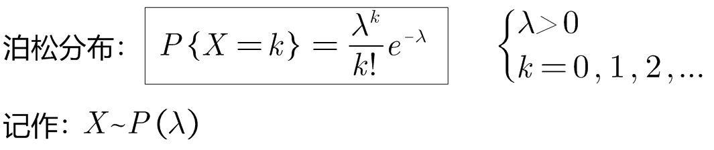

即: 我们用 Po(λ) 来表示"泊松分布". λ是一个参数. 比如, 我们将 stem:[ Y ~ Po(4)] 读作: "变量Y" 遵循 "λ等于4" 的泊松分布.

泊松分布, 涉及特定时间间隔内, 事件发生的"频率", 而不是事件发生的概率. 泊松分布, 需要知道它在特定时间段, 或距离内, 发生的"频率"。  +
The Poisson Distribution deals with the frequency with which an event occurs in a specific interval. Instead of the probability of an event, the Poisson Distribution requires knowing how often it occurs for a specific period of time or distance.

例如，已知一只萤火虫可能在10秒内, 平均点亮3次. 如果我们想确定它在20秒内点亮8次的可能性, 我们就应该使用泊松分布来预测: stem:[ Y ~ Po(3)]

泊松分布图, 描绘了实例的数量. *事件发生在一个标准的时间间隔内，每个时间间隔的概率, 都是相同的。* 因为任何事件的发生次数, 不可能为负, 因此，我们的图表总是从0开始. **但在一段时间间隔内, 可能发生的次数却是没有上限的。
**

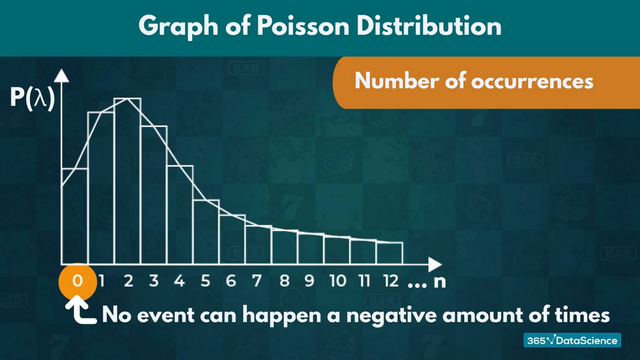

.标题
====
例如, 假设你创建了一个关于概率的在线课程。通常，你的学生每天问你大约4个问题，但昨天他们问了7个。你想知道他们问了7个问题的可能性有多大, 即 stem:[P(y=7)=?]

在这个例子里:

[options="autowidth"]
|===
|Header 1 |Header 2

|单位时间里, 平均的发生次数: λ
|你预期的**平均**问题是4个，所以，λ等于4 (因为** λ 表示单位时间(或单位面积)内, 随机事件的"平均"发生次数**).

|你感兴趣的发生次数: y 或 k 表示
|*你感兴趣的某发生次数, 用y表示.* 即 y=7

|单位时间
|时间间隔为一整个工作日.
|===

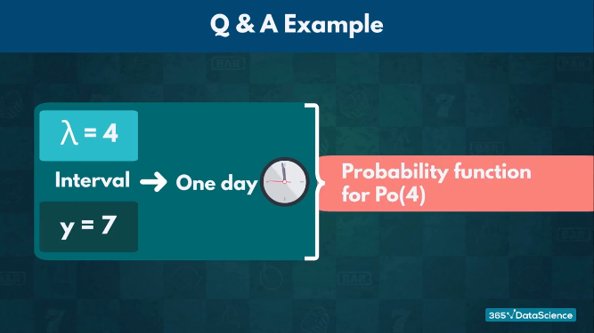

P(Y)的公式就是: +
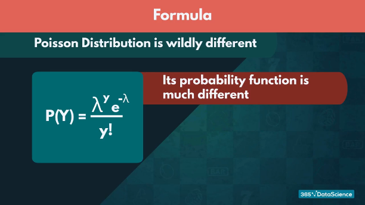

将具体的变量值代入上面的公式中, 即: +
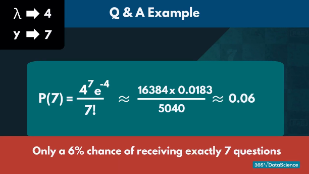

因此，收到7个问题的几率, 只有6%。

知道了概率函数 stem:[ P("你感兴趣的发生次数"y)]，我们就能计算出"期望值 the expected value" stem:[ E(y)].

根据定义，Y的期望值，等于样本空间中所有"不同值"及其"概率"的乘积之和。 +
the expected value of Y, equals the sum of all the products of a distinct value in the sample space and its probability.

\begin{align}
期望值 E(y) & = y_0 \cdot P(y_0) + y_1 \cdot P(y_1) + ...  \\
& = y_0 \frac{λ^{y_0} e^{-λ}}  {y_0 !} + y_1 \frac{λ^{y_1} e^{-λ}}  {y_1 !} + ... \\
& = λ
\end{align}

同样, 其方差 the variance, 最终也等于λ。
====

.标题
====
例如： +
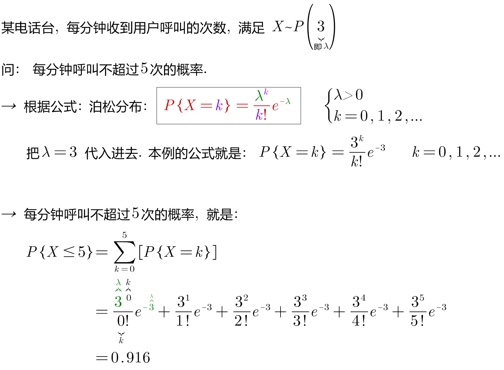

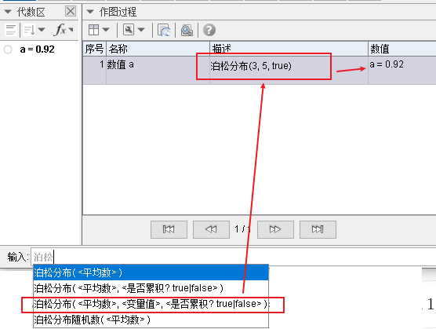
====

.标题
====
例如： +
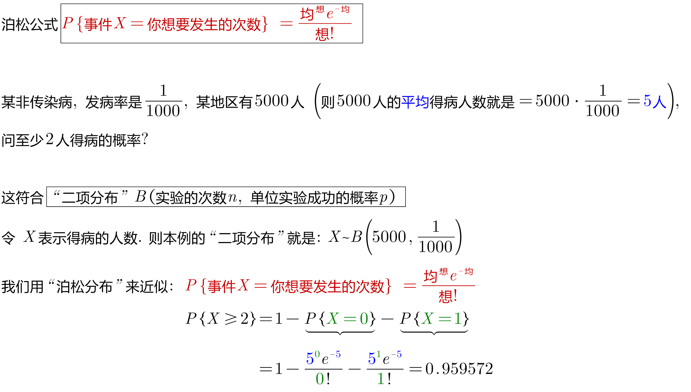
====

---
