= 常见"随机变量"的分布 : 超几何分布
:toc: left
:toclevels: 3
:sectnums:

---

== ★ Mathematica 和 Geogebra 中, "超几何分布"的用法

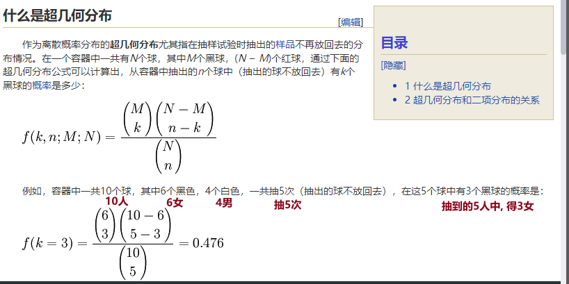

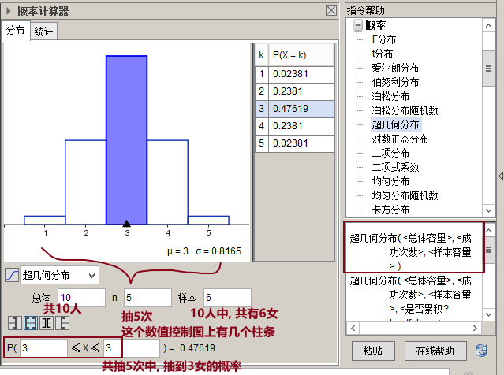

下面是 Mathematica 中的写法

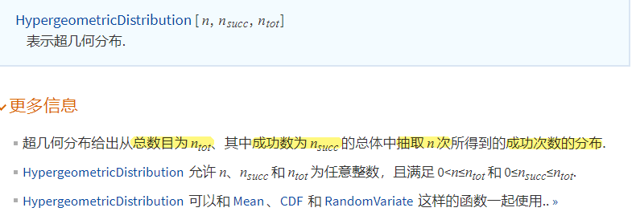

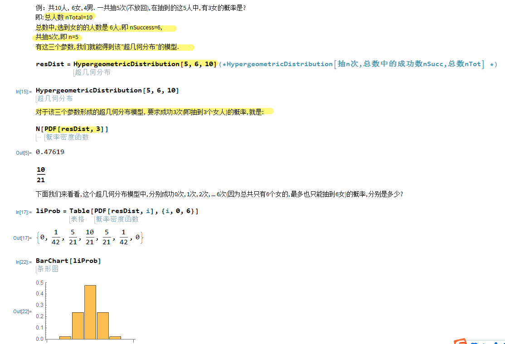

---

== 超几何分布 Hypergeometric Distribution

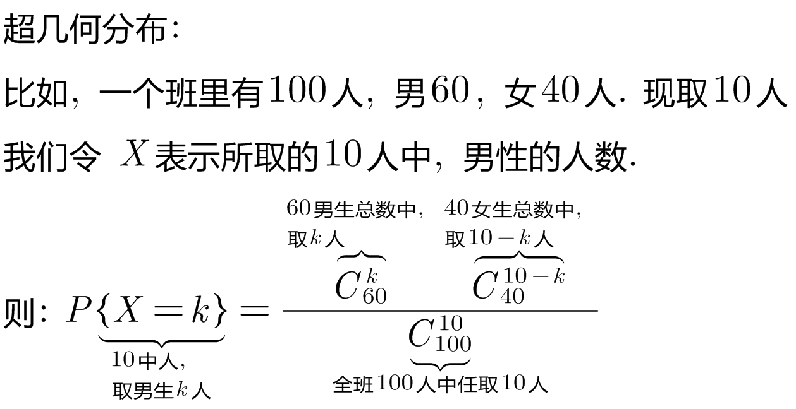

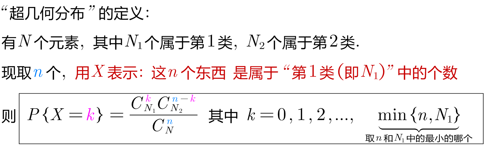

超几何分布, 是统计学上一种离散概率分布。它描述了: 从有限N个物件（其中包含M个"指定种类的物件"）中抽出n个物件(不放回)，这n个物件中, 含有k个"指定种类的物件"的概率。

*简单记忆就是: 从总数N个人中(其中包括了总数M个女人, 则男人数量就是 N-M), 抽出n人, 能取到k个女人的概率.*

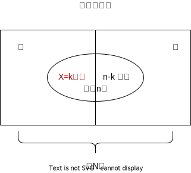

.标题
====
例如： +
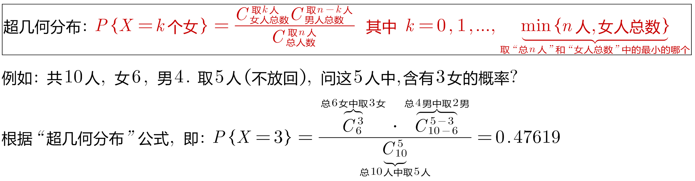
====

.标题
====
例如： +
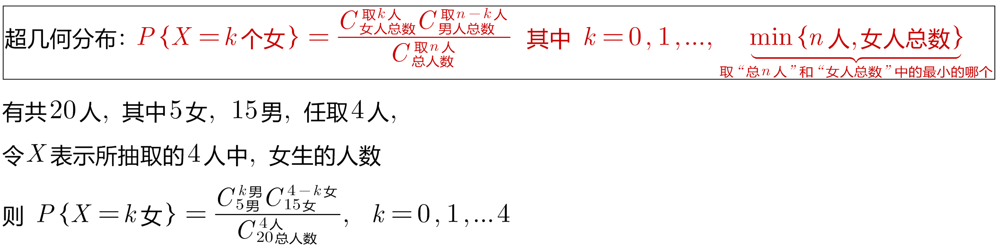
====

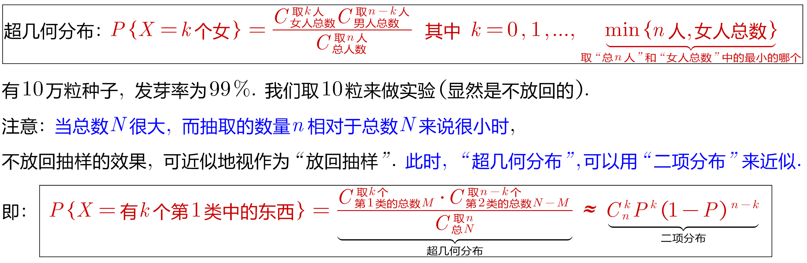

.标题
====
例如： +
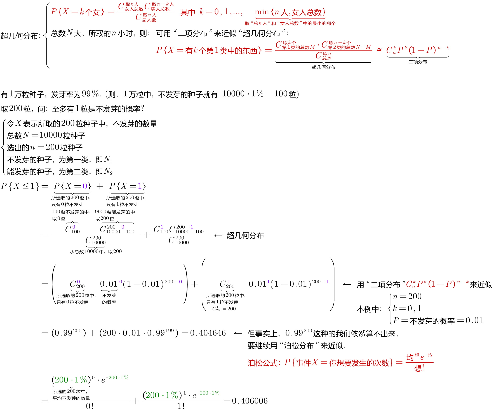
====

总结:

- 对于"超几何分布", 当总数N很大, 而 stem:[\frac{"所选的n"} {"总数N"}]很小时, 我们就能用"二项分布", 来近似该"超几何分布".
- 对于"二项分布", 当所选出的数量n很大, 而概率P很小时, 就能用"泊松分布"来近似该"二项分布".

---

