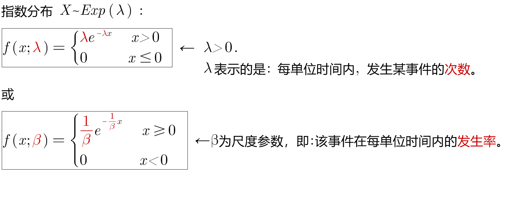
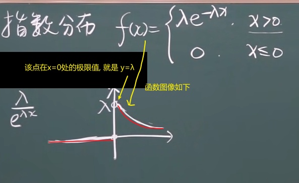

= 连续概率分布 : 指数分布
:toc: left
:toclevels: 3
:sectnums:

---

== 指数分布 Exponential distribution

指数分布（英语：Exponential distribution）是一种连续概率分布。*"指数分布"可以用来表示: 独立随机事件发生的时间间隔，比如旅客进入机场的时间间隔、电话打进客服中心的时间间隔、中文维基百科新条目出现的时间间隔、机器的寿命等。*

许多电子产品的寿命分布, 一般服从"指数分布"。

但是，由于指数分布具有缺乏“记忆”的特性．因而限制了它在机械可靠性研究中的应用. *所谓缺乏“记忆”，是指它假设: 某种产品或零件经过一段时间t0的工作后,仍然如同新的产品一样,不影响以后的工作寿命值*，或者说，经过一段时间t0的工作之后，该产品的寿命分布与原来还未工作时的寿命分布相同，*显然，指数分布的这种特性，与机械零件的疲劳、磨损、腐蚀、蠕变等损伤过程的实际情况是完全矛盾的，它违背了产品损伤累积和老化这一过程。所以，指数分布不能作为机械零件功能参数的分布形式。* 但是，它可以近似地作为高可靠性的复杂部件、机器或系统的失效分布模型.

"指数分布"（也称为负指数分布） , 是"几何分布"的连续模拟，它具有"无记忆"的关键性质。

如果一个随机变量X呈"指数分布"，则可以写作：X~ E（λ）.

其中λ > 0是分布的一个参数，常被称为"率参数"（rate parameter）。即**每单位时间内, 发生某事件的次数。**

指数分布的区间是[0,∞).

[options="autowidth"]
|===
|Header 1 |Header 2

|指数分布
|

|其"分布函数":
|\begin{align}
F(x) = \begin{cases}
  1- e^{-λx} & \quad x>0 \\
  0 &  \quad x \leq 0  \\
\end{cases}
\end{align}
|===

https://www.bilibili.com/video/BV1ot411y7mU?p=31&spm_id_from=pageDriver&vd_source=52c6cb2c1143f8e222795afbab2ab1b5

7.30
