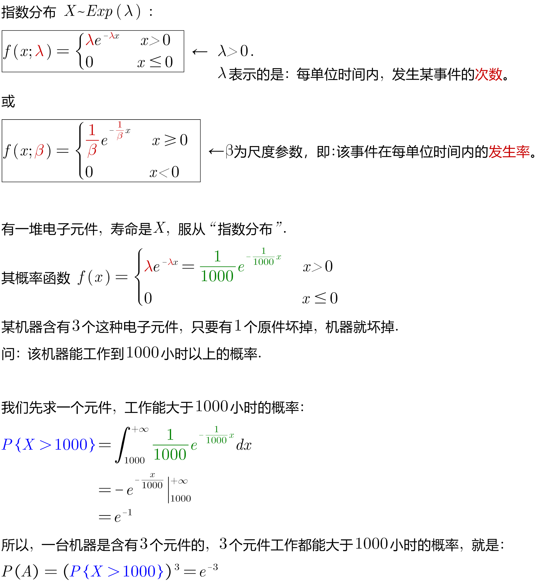
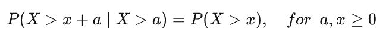
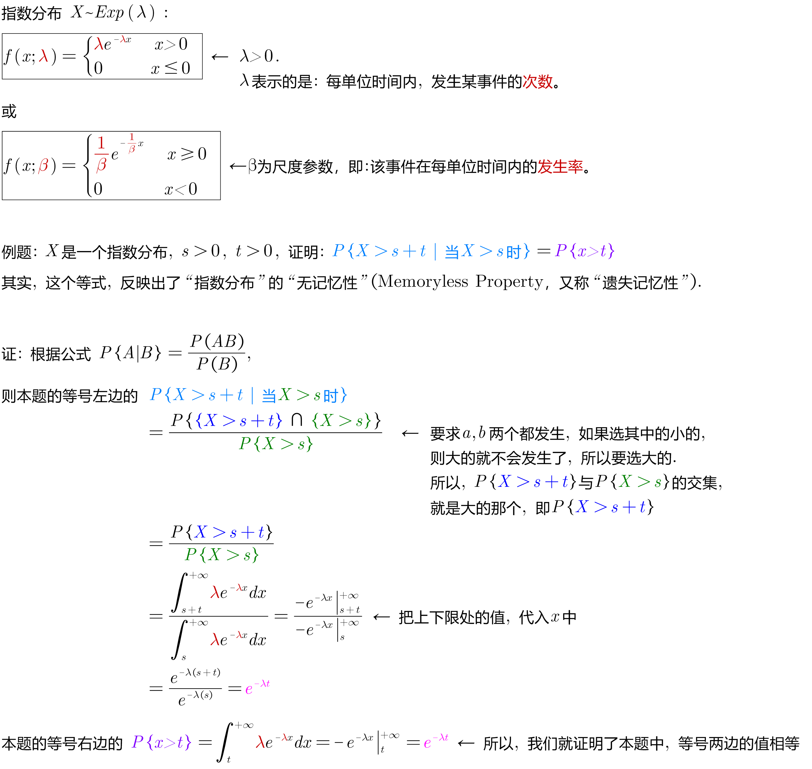
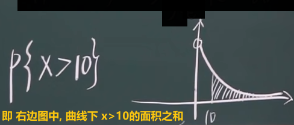
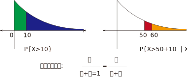

= 连续概率分布 : 指数分布
:toc: left
:toclevels: 3
:sectnums:

---

== 指数分布 Exponential distribution

指数分布（英语：Exponential distribution）是一种连续概率分布。*"指数分布"可以用来表示: 独立随机事件发生的时间间隔，比如旅客进入机场的时间间隔、电话打进客服中心的时间间隔、中文维基百科新条目出现的时间间隔、机器的寿命等。*

许多电子产品的寿命分布, 一般服从"指数分布"。

但是，由于指数分布具有缺乏“记忆”的特性．因而限制了它在机械可靠性研究中的应用. *所谓缺乏“记忆”，是指它假设: 某种产品或零件经过一段时间t0的工作后,仍然如同新的产品一样,不影响以后的工作寿命值*，或者说，经过一段时间t0的工作之后，该产品的寿命分布与原来还未工作时的寿命分布相同，*显然，指数分布的这种特性，与机械零件的疲劳、磨损、腐蚀、蠕变等损伤过程的实际情况是完全矛盾的，它违背了产品损伤累积和老化这一过程。所以，指数分布不能作为机械零件功能参数的分布形式。* 但是，它可以近似地作为高可靠性的复杂部件、机器或系统的失效分布模型.

"指数分布"（也称为负指数分布） , 是"几何分布"的连续模拟，它具有"无记忆"的关键性质。

如果一个随机变量X呈"指数分布"，则可以写作：X~ E（λ）.

其中λ > 0是分布的一个参数，常被称为"率参数"（rate parameter）。即**每单位时间内, 发生某事件的次数。**

指数分布的区间是[0,∞).

[options="autowidth"]
|===
|Header 1 |Header 2

|指数分布
|image:img/0150.png[ ,600]

image:img/0151.png[ ,400]

|其"分布函数":
|\begin{align}
F(x) = \begin{cases}
  1- e^{-λx} & \quad x>0 \\
  0 &  \quad x \leq 0  \\
\end{cases}
\end{align}
|===

.标题
====
例如： +

====

---

== "指数分布"的"无记忆性" Memoryless Property

X表示某种设备的寿命, 则, 设备在时刻s 仍活着, 并且它再活t时间长度的概率, 和它现在的年龄s 没有关系. 即, 设备对它的已使用时间s, 没有记忆性.

即, "无记忆性"就是说:  一个灯泡, 你用了15年后, 它能再用1年的概率, 和它刚买时, 能再用1年的的概率, 是相等的.  即, 在"指数分布"里, 一个东西的寿命, 对"已使用时间"是没有记忆的.

指数分布的"无记忆性"的定义如下： +
如果X是服从指数分布的，则X是一种无记忆性的变量，也就是说: +

比如投硬币, 你想投到正面朝上. 如果该实验是具有"无记忆性"的, 则就意味着: 无论你是刚开始投, 还是已经投了3分钟, 10分钟 (用a表示投硬币这个重复动作已经做了多少秒),... 你第一次得到"正面朝上"所需花费的时间x 的概率, 都是一样的. *也就是说，过去的实验, 不影响未来事件发生的概率。*

如果用投硬币次数 （几何分布）来理解，对于同一个硬币，为了得到硬币"正面朝上"还要投x次的概率, 与你已经投过了多少次是没有关系的。 *因为硬币没有记忆性, 它不会记忆之前自己是正面还是反面. 每一次投对它来说都是第一次投.*

以客服电话的例子来理解无记忆性。假设该客服8点开始上班接客服电话。她在刚上班时要等x秒才接到下一个客服电话的概率, 与已经等了半小时、或者1小时，或者 2小时后，还要等待x秒，才接到下一个客服电话的概率, 是一样的。

经济学上，有一个概念是"沉没成本"，指的是已经付出的、且不可收回的成本。有一个说法是：沉没成本不是成本. 它的论证是: 既然沉没成本不可收回，那么在做选择的时候就不应该考虑它。

比如, 你在等人, 前面等的三个小时是沉没成本，不会影响之后的来客概率，所以你该上厕所就去上厕所。

."无记忆性"的证明过程:
====
例如： +

====

---

