= 正态分布 - t 检验
:toc: left
:toclevels: 3
:sectnums:

---

== 正态分布 - t 检验

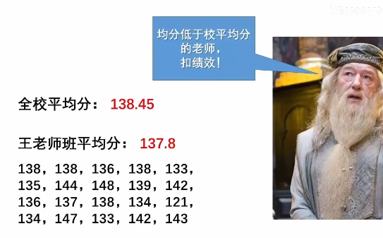

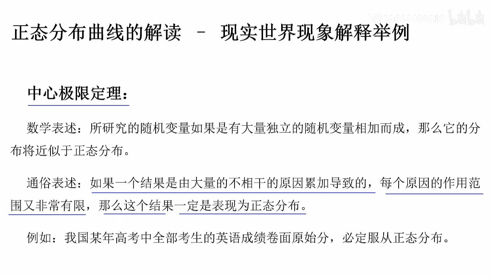

.标题
====
例如, 一个学校有5000名学生, 某次学科考试, 我们无法获得到全部学生的成绩, 只能抽样获取部分人的成绩. 那我们能从部分人的成绩的平均值中, 来推测出全部5000人平均成绩吗?

比如, 我们每次抽取20个学生的成绩, 算出20人成绩的平均数.

第一次抽20人, 算出平均成绩是 138分, 我们就在坐标轴的 x=138处, 放一个高度为1的矩形. 这里的高度1, 就代表"频数", 即目前, 138分, 出现1次.

频数（Frequency），又称“次数”。指变量值中代表某种特征的数（标志值）出现的次数。

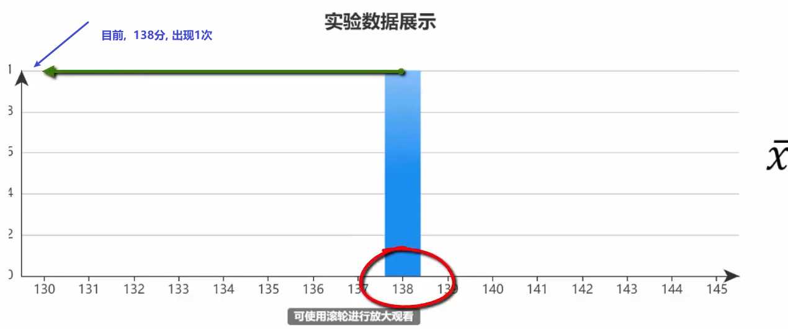

第二次抽20人,  算出平均成绩依然是 138分, 现在, 138分就出现两次了, 这个值的频数就变成了2.

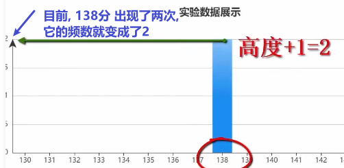

我们抽样1000次, 每次20人, 并算出这20人的平均数, 放在坐标系上. 不同的平均分, 要统计相应的频数(该平均数出现的次数).

1000次后, 我们就得到了一个呈现"正态分布"的坐标系结果. 我们把这条曲线的轮廓, 叫做"抽样分布". 这条曲线的对称轴, 在 137-138分之间.

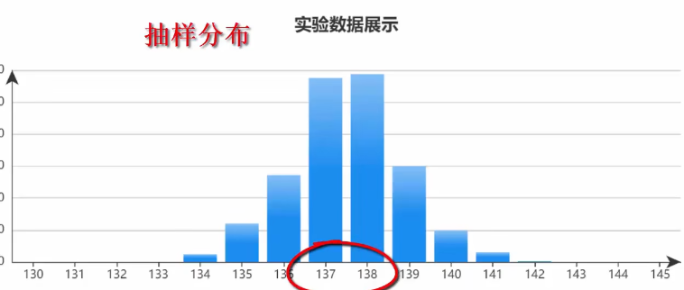

我们在excel表里面, 实际计算一下5000人的分数的平均值, 是 137.41分. 这表明, 我们从"抽样分布"中得到的对称轴处的数字, 非常精确于实际的平均值的数字.

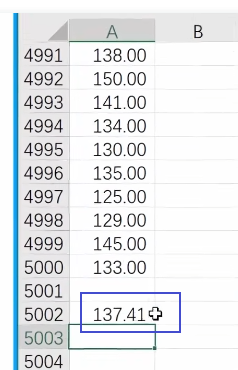

这个规律表明:

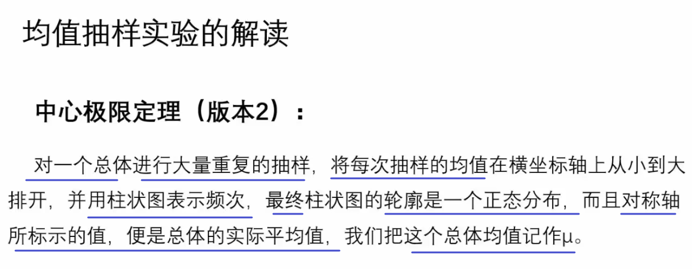

如果把"抽样分布曲线"下放的面积, 记作100%. 则有:

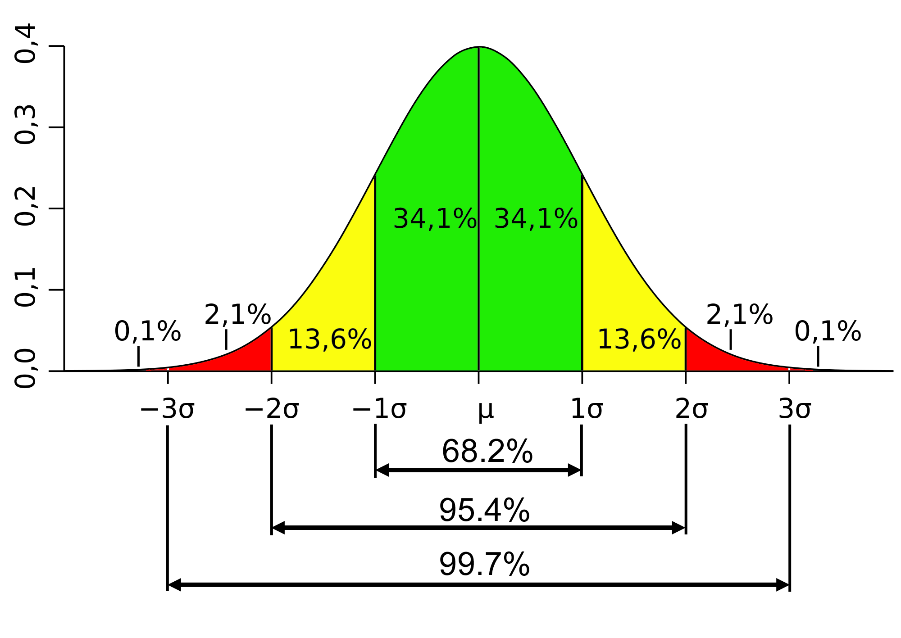

这些曲线下各段面积, 就是区间的概率.

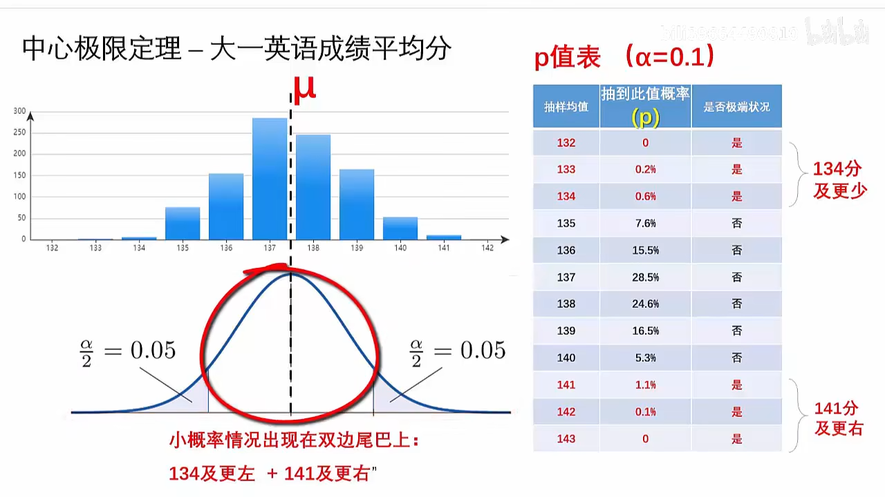
====

.标题
====
例如： +
我们有大一5000名学生的成绩表, 并知道 平均值μ=137.41分 +
但我们不知道大四5000名学生的成绩表. 只能从中抽样, 并且只能抽样一次. 那么, 我们如何知道大四的平均成绩呢?

首先, 我们假设, 大四的平均分, 和大一的平均分是一样的. 我们把这个假设, 称为"原假设", 记为 stem:[H_0],  H 就是 hypothesis 的首字母.

也就是说, 大四成绩的分布情况, 我们先假设和大一的曲线形状, 是一样的正态分布. 这样, 虽然我们只抽检一次, 但依然会有90%多的可能性, 落在平均值左右两侧的面积区域中.

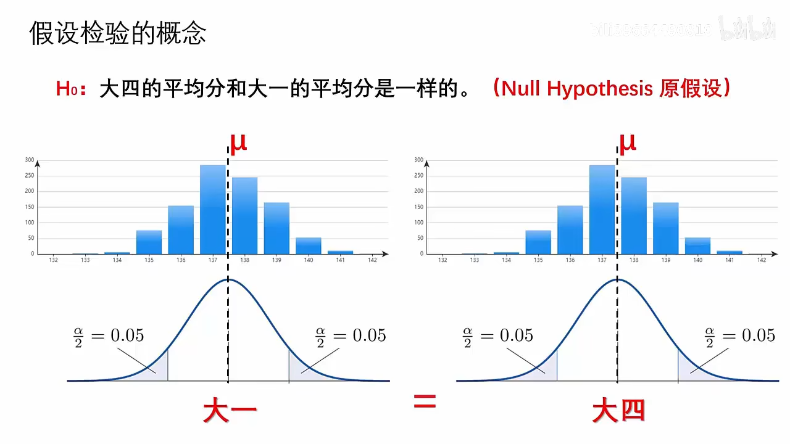

现在, 我们对大四的成绩, 抽样一次, 得到平均值是 141.3分. +
*接着, 我们来寻找 141.3分, 在大一"抽样分布"曲线上的位置. 它在曲线右边的尾巴上.  141往右的面积, 总共只占整体的大约 1.2%.  +
换言之, 这就意味着, 如果大四的成绩分布, 是和大一是一样的话, 那么 大四的平均分是 141.3 的概率, 只有 1.2%左右.  这是极其小的概率事件. 所以我们可以从这个概率结果倒推出, 大四的"正态分布曲线"形状, 是完全不同于大一成绩的"正态分布曲线"的.**

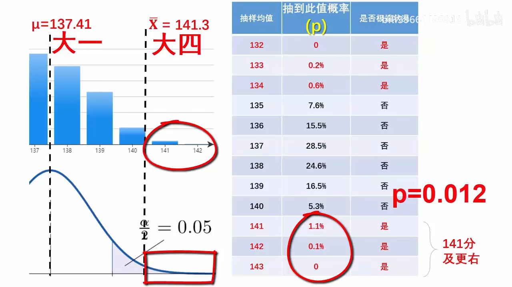

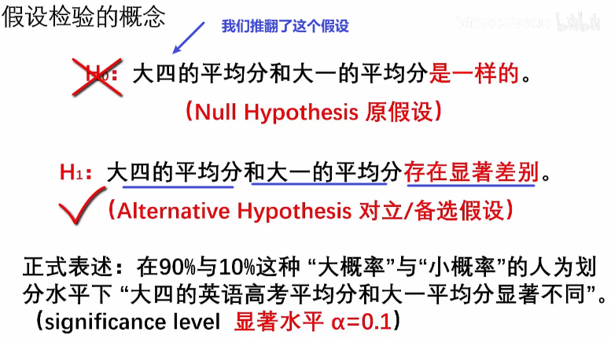

这个"假设检验", 离"t检验" 只有一步之遥了.

.标题
====
假设, 有两个校区, 我们知道A校区, 总共1000人的每人每月的耗电量, 但不知道B校区的数据, B校区的总体人数也未知. 即, B校区的数据空白.

我们先对A校区, 抽样1000次, 每次5人的数据, 来绘制出"抽样分布"曲线. 直方图显示, 均值μ = 40单位的耗电量.

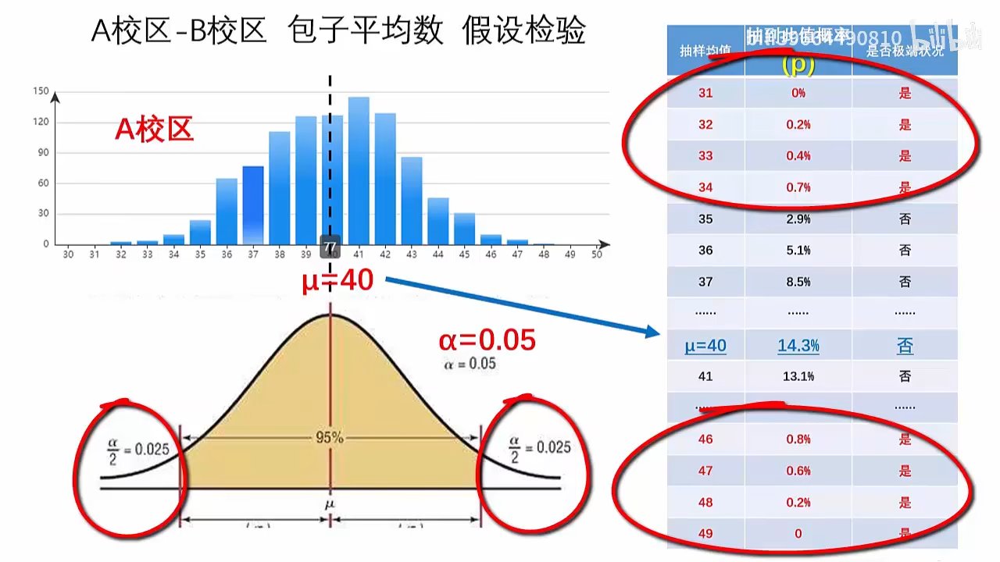

我们先假设, B校区和A校区的分布是一样. ** 然后对B校区做一次5人抽样, 得到均值是 33.  这个33在A校区的曲线上, 只有不到 2.5% 的发生概率 (即, 相当于你一次性买彩票, 买到了中奖率只有2.5%的中奖彩票). 是个极小概率事件. 因此, 这反过来证明, 我们的先验假设 "B校区和A校区的分布是一样" 大概率是错误的.** 这说明, B校区的"正态分布"曲线形状, 和A校区的完全不同.

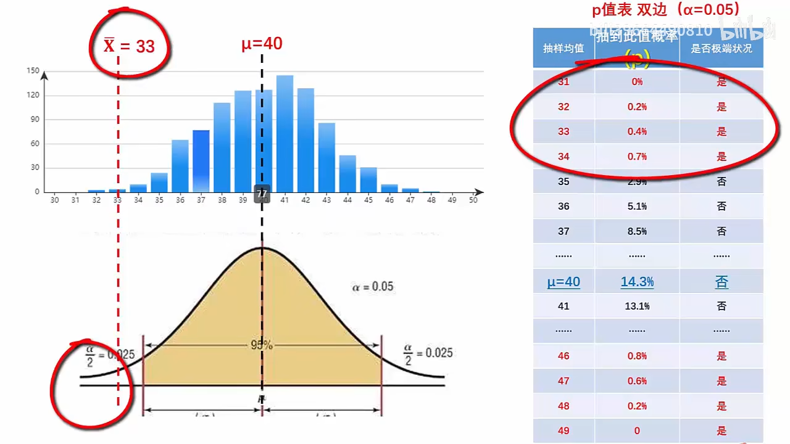
====

我们来比较上面两个案例, 从中找出共通的规律.

它们的相同点, 在: 都是"正态分布" +
它们的不同电, 在: 抽样的样本容量不同, 均值μ不同, 正态分布曲线的形状不同.

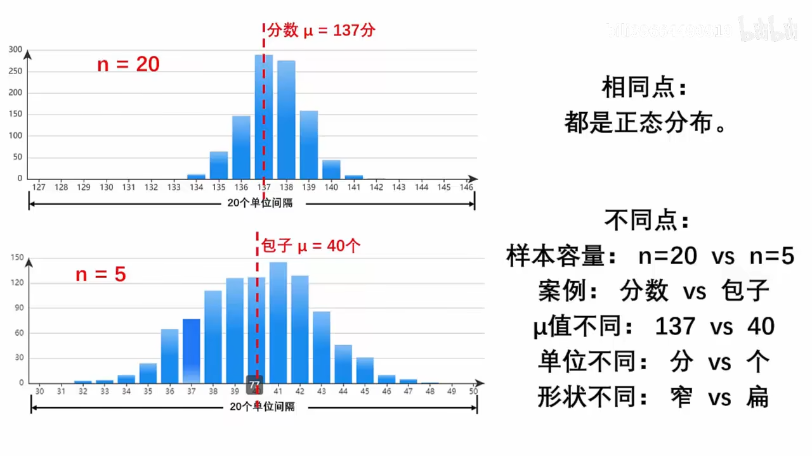

其实, 可以经过公式转换, 来让这些案例用统一的公式来做, 即 t值公式 :

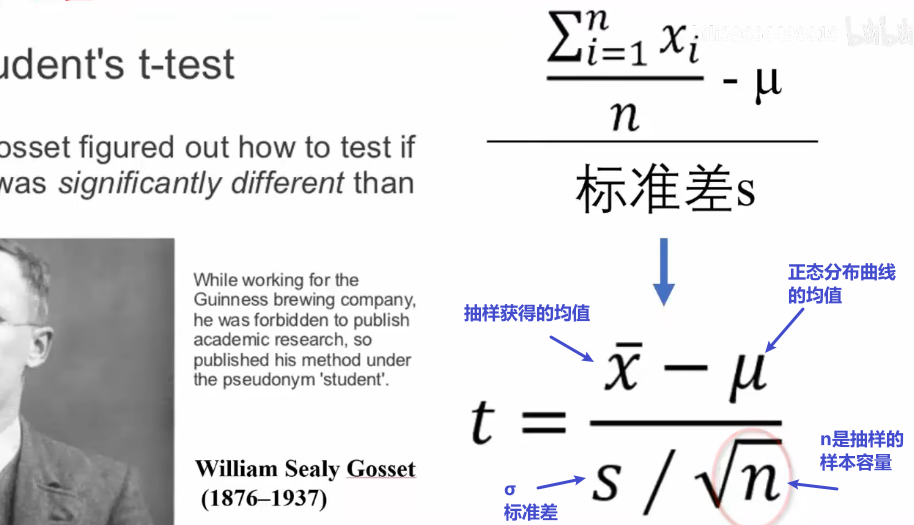

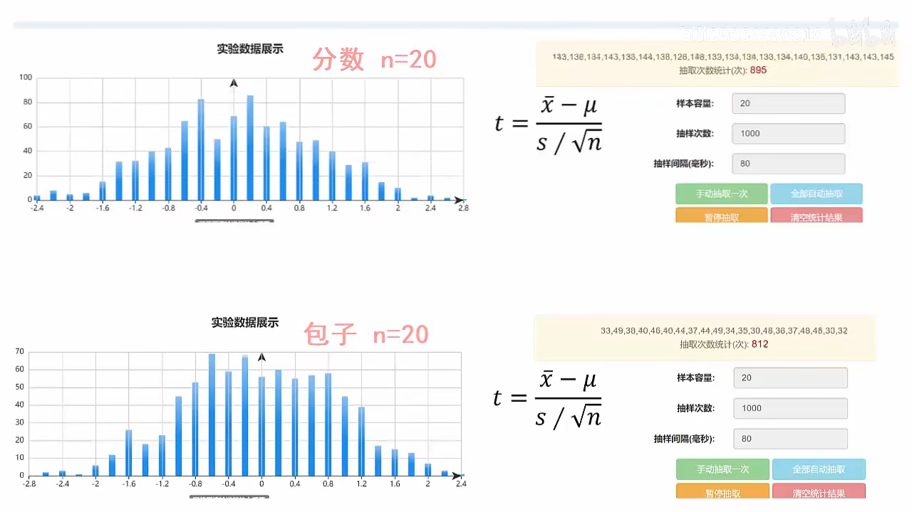

我们最终会得到 "t分布曲线" :

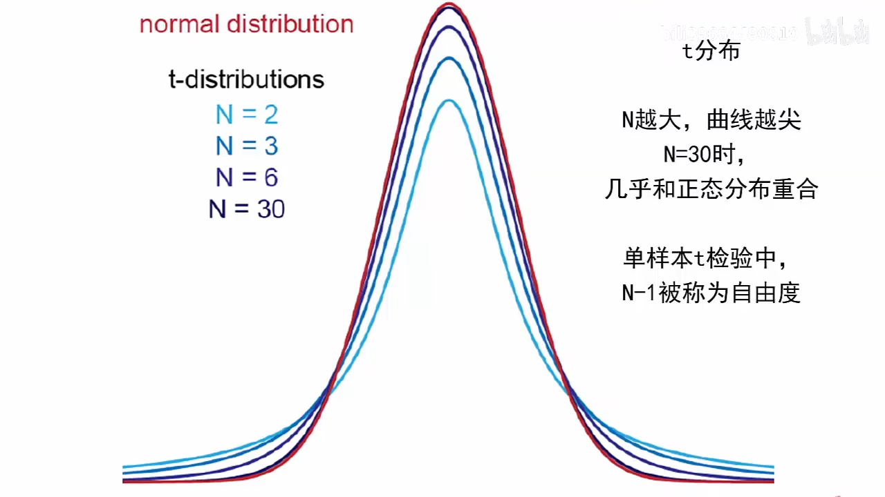

单样本t检验, 就是用一个抽样样本, 来计算出t值. 然后根据此 t值在"t分布曲线"上的位置是否极端(即处在小概率区间上), 来倒推退判断 : "此样本告诉我们的均值结果", 是否符合"全样本中真相的μ值".
====

*为什么要做 t 检验？ 因为我们需要对某些计算结果的"可信度"进行评价。我们必须找到客观的方法,来让我们评价这个实验计算结果的可信度. 而t检验就是一种可以利用的方法.*

t 分布告诉我们，小样本体系的随机误差分布, 也是呈现"钟形对称分布"的。 +
以标准的 t分布来看， **t 统计量是围绕着 0 值对称分布的，出现大的 t 值, 和小的 t 值的概率, 均较低。** +
t 检验, 简单地说就是: 根据计算出来的 t 值在分布中的位置, 进行的一种统计检验。

*现在，我们通过抽样检测, 得到了一组(抽样)测量值的均值stem:[\overline{x}]，需要判定它能否作为对"真值μ" 的一个好的估计。从统计学角度看，就是要判定 stem:[\overline{x}] 与 μ 之间是否存在显著性差异*，可以构造统计量：

stem:[t = \frac{\overline{x} - μ} { \frac{σ} {\sqrt{n}}}]

*这个统计量的核心部分显然是  stem:[\overline{x} - μ]. 如果 stem:[\overline{x}]  与 μ 之间不存在显著性差异，则可视为： stem:[\overline{x} - μ ≈ 0].    也就是说，此时计算的 t值 应该在 0 值附近。*

“t 值应该在 0 值附近” 究竟是什么意思？ t值究竟多大, 才能被认为是在 0 值附近？

下图是"标准 t 分布"示意图 +
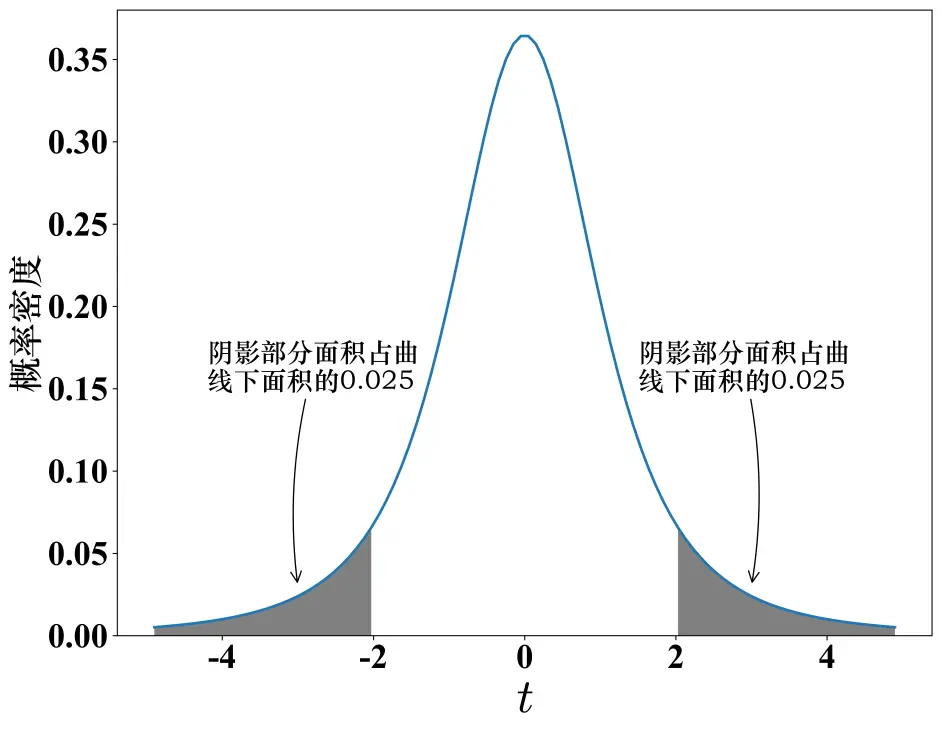

从 "t 分布"的角度来看，**如果是由随机误差产生的变动，那么 t 值偏大、或者偏小的事件, 都是小概率事件，在单次测量中是不应该出现的。所以，t 值不能太大 或者太小。**另一方面，由于我们认为实验条件已经得到了完善的控制，因而 *t 值应该出现在"大概率事件"的范围内。*

所以，我们就能下定决心说：*我有  95% 的把握认定,  t 值应该出现在包含 0 值的 95% 的分布范围内！ 这样，我们可以在 t 分布图上, 以 0 值为中心, 画出一个区间 使得它包含  95% 的概率。这样的区间, 也等同于设置了两个称为"临界值"的边界分割点，就是图中划分两端阴影部分的分割位置。*

*只要计算的 t 值的绝对值, 小于临界值，则我们就认为: "均值 stem:[\overline{x}]" 与"真值 μ"之间, 不存在显著性差异。*

.标题
====
现在, 我们回到本页最开头的问题, 王老师班级的成绩均值, 是否和全校的均值有显著不同吗?

我们先提出"原假设", 假设王老师班级的平均分, 和全校的没有不同.  +
然后, 对王老师班随机抽取20个学生的成绩, 做一次 t检验.

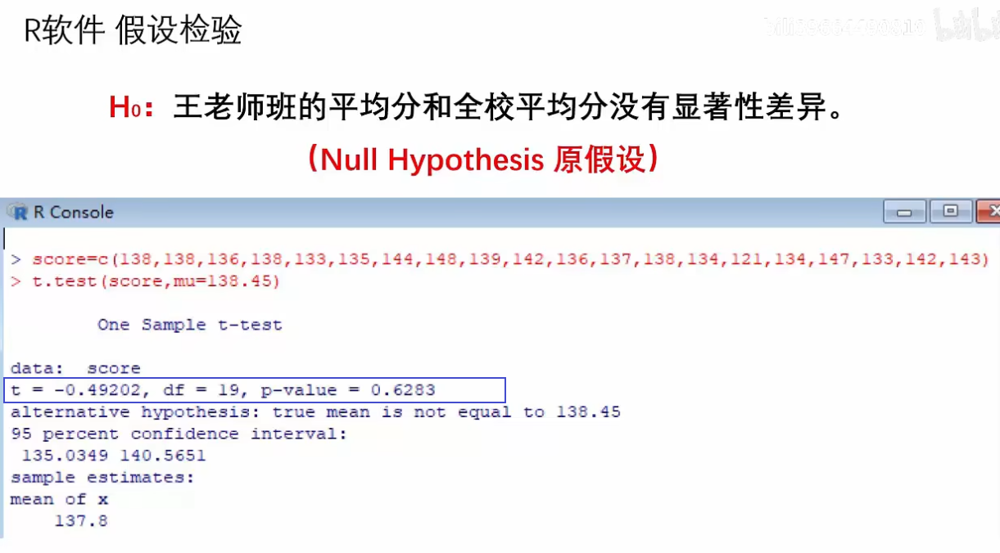

t值表示, 在 "t分布"曲线上, 本例 抽到比 t=-0.49292 更小, 或 t=+0.49292更大的t值的总概率, 为 p=0.6283. 显然, 我们的t值 没有落入极端小概率区间中.

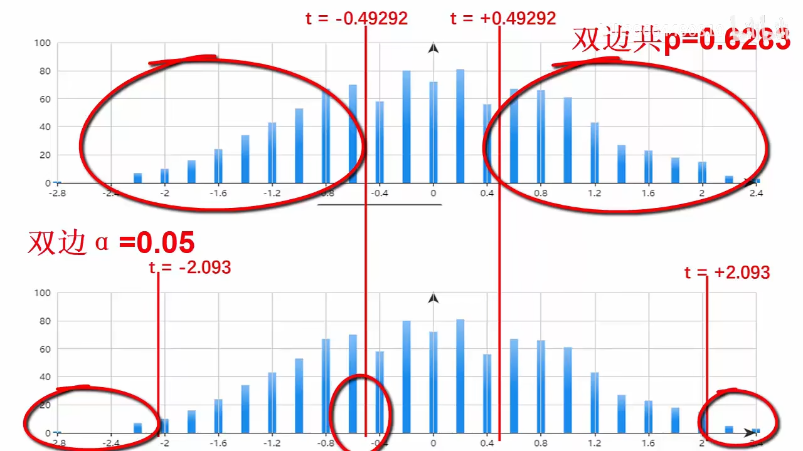

因此, 我们无法推翻原假设, 即, 虽然王老师班级的平均分, 和学校整体的平均分有差异, 但不能说明有"显著差异".

====

https://www.bilibili.com/video/BV1x64y1B71k/?spm_id_from=333.788&vd_source=52c6cb2c1143f8e222795afbab2ab1b5

4.51
