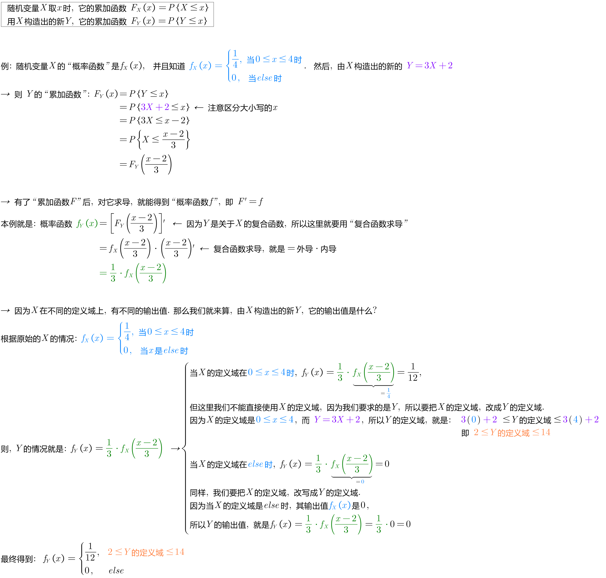

= 随机变量函数的分布
:toc: left
:toclevels: 3
:sectnums:

---

==  "离散型" 随机变量函数的分布

意思就是说, 假如我们已经知道 某个X 是某种类型的分布了, 比如 X 它是几何分布的, 二项分布的等. 则进一步, 而我们还想知道, 用这个X 来构造出的其他函数, 会是什么类型的分布呢? 比如, Y=3X-5,  这个Y是由X构造出来的, 那么这个Y, 也是和X相同类型的分布吗? 还是说, Y是其他类型的分布?

.标题
====
例如： +
比如, 有这个离散型的随机变量 X:

[options="autowidth"]
|===
|X |7 |8 |9 |10 |

|P
|0.1
|0.3
|0.4
|0.2
|← 所有概率值加起来 =1
|===

我们用上面的X, 来构造出新的函数: Y=4X

[options="autowidth"]
|===
|Y=4X |7*4=28 |8*4=32 |9*4=36 |10*4=40 |

|P
|0.1
|0.3
|0.4
|0.2
|← 所有概率值加起来 =1
|===

再用X 构造出这个新函数: stem:[Z=X^2]

[options="autowidth"]
|===
|stem:[Z=X^2] |stem:[7^2=49] |stem:[8^2=64] |stem:[9^2=84] |stem:[10^2=100] |

|P
|0.1
|0.3
|0.4
|0.2
|← 所有概率值加起来 =1
|===
====

.标题
====
例如： +
又比如: 有这个离散型的随机变量 X, 它每个结果的概率值如下表:

[options="autowidth"]
|===
|X |-1 |0 |1 |2 |

|P
|0.2
|0.3
|0.4
|0.1
|← 所有概率值加起来 =1
|===

我们用这个X, 来构造出新的函数: stem:[Y=X^2]

[options="autowidth"]
|===
|stem:[Y=X^2] |stem:[(-1)^2=1] |stem:[0^2=0] |stem:[1^2=1] |stem:[2^2=4] |

|P
|0.2
|0.3
|0.4
|0.1
|← 所有概率值加起来 =1
|===

注意, 上表中, 有两个 Y=1 的列, 即有重复的实验结果, 所以我们要把它们合并起来, 于是就有

[options="autowidth"]
|===
|stem:[Y=X^2] |0 |1 |4  |

|P
|0.3
|0.2+0.4 =0.6
|0.1
|← 所有概率值加起来 =1
|===
====

---

==  "连续型" 随机变量函数的分布

记住这两个公式: +
-> 随机变量X, 它取x时, 其"累加函数"是: stem:[F_X (x)=P{X \leq x}]

-> 由随机变量X, 构造出的一个新 Y (比如 Y="多少倍的X, 再加上某个数"之类), 这个Y 的"累加函数", 是: stem:[F_Y(x)=P{Y \leq x}]  <- 等号左边的 stem:[F_Y(x)] 意思是: Y是从X构造出来的.  累加函数(用F表示), 所以 stem:[F_Y(x)] 就是指 "由X构造出来的新的Y"的累加函数.

.标题
====
例如： +

====

若 X 服从 [a,b] 均匀分布, 则 Y=kX+c (k ≠0) 也服从"相应区间"上的均匀分布. 这个"相应区间"是什么? 即把X代入Y的表达式中得到的结果. 即: +
当 k>0时, 这个"相应区间"就是 [ka+c, kb+c] +
当 k<0时, 这个"相应区间"就是顺序倒过来的 [kb+c, ka+c] +

即有: +
\begin{align}
k>0时, 即 f_Y(x)=\begin{cases}
\dfrac{1} {kb-ka}  & ka+c \leq x \leq kb+c \\
0  & else \\
\end{cases}
\\
k<0时, 即 f_Y(x)=\begin{cases}
\dfrac{1} {ka-kb}  & kb+c \leq x \leq ka+c \\
0  & else \\
\end{cases}
\end{align}

---

---

https://www.bilibili.com/video/BV1ot411y7mU/?p=34&spm_id_from=pageDriver&vd_source=52c6cb2c1143f8e222795afbab2ab1b5

456.08
