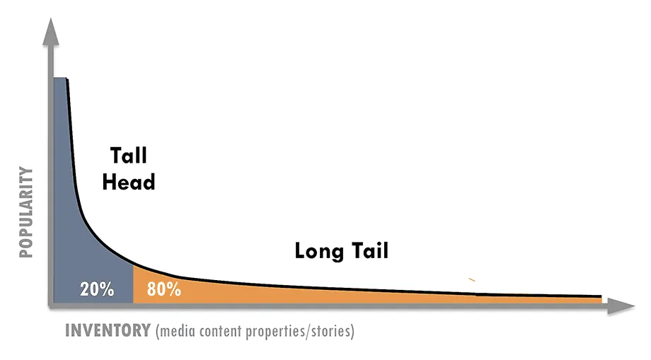
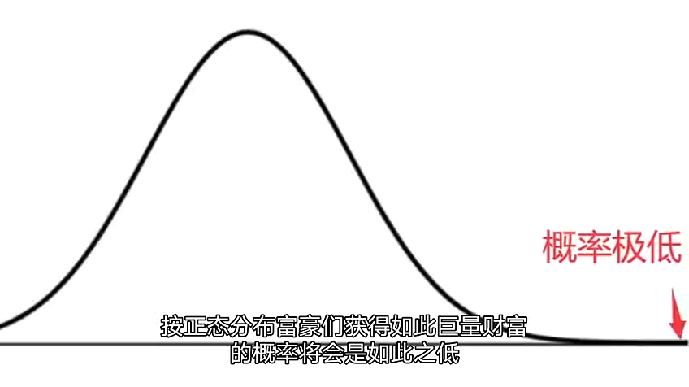
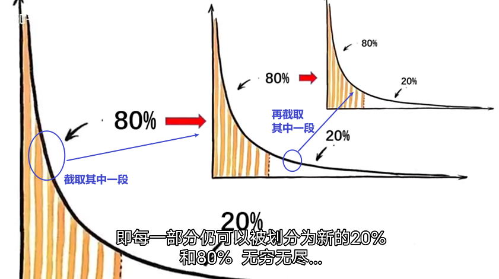

= 幂律分布 Power law distribution
:sectnums:
:toclevels: 3
:toc: left

---

== 解释

=== 解释 (刘嘉概率讲座)

==== 幂律分布: 在随机变量中，越小的数值，出现的概率越大; 越大的数值，出现的概率则越小。

假设变量x, 服从参数为 α 的幂律分布，则其"概率(密度)函数 f(x)"可以表示为:  +
stem:[ f(x)= cx^{-α-1}, \quad  x -> ∞] +
即 其 f(x) 是幂函数.

其互补累积分布函数 F(x)（complementary cumulative distribution）为:  +
stem:[P(X≥x)=cx^{-α}, \quad  x -> ∞ ]

在统计学中，幂律 power law 表示的是两个量之间的函数关系，*其中一个量的相对变化, 会导致另一个量的相应幂次比例的变化，且与初值无关*.

曲线的横坐标，代表随机变量的取值; 纵坐标，代表发生的概率。 *幂律分布曲线的含义非常明确 : 在随机变量中，越小的数值，出现的概率越大; 越大的数值，出现的概率则越小。*

幂律分布有很多其他的形式，例如“长尾”分布就是幂律分布的一种。

我们很难用"正态分布", 去解释为什么富豪的财富会如此之高的概率, 会那么大. 就好比自然状态下, 一个人的身高长到数公里.

==== 无标度 -- 分形效果

无标度，也叫“无尺度”, “尺度无关”。意思是: 在任何观测尺度下，幂律分布都呈现同样的分布特征。即, 无论你从曲线上截取哪一段, 是长是短, 它都含有二八定律存在. 就相当于"分形"效果.

*一般的分布, 都会有个尺度范围，在这个范围内服从这个分布，超过这个尺度可能就不服从这种分布了。而幂律分布没有尺度的限制，不管截取任何一个部分，都仍然呈现幂律分布的特征。*

比如，图书销量是服从"幂律分布"的. 最畅销那本书的销量在前10名销量中占的比例，和前10名的销量在前100名的销量中占的比例，和前100名在前1000名的总销量中占的比例，大体都是相同的。 这就是幂律分布唯一的数学特征——无标度。

==== 幂律分布让"均值"失去意义

"正态分布"是一种均匀对称分布, 大多数数据都集中在"平均值"附近,所以平均值非常有用,因为它代表大多数。

而**"幂律分布"呢? 它的数据变化幅度非常大，平均值毫无意义。比如个人收入，有穷人，也有富豪，把这两群人的资产平均 (人均收入)，完全没有意义。**

==== 幂律分布中的"波动性(方差)"失去意义

*幂律分布，随机变量波动的范围非常大，常用的"平均值"、"标准差"到这里都没用了。*

==== 幂律分布, 会让原本不会发生的极端事件发生

在数学上，这个叫“长尾”，也叫肥尾、厚尾。 就是说:**虽然极端数据出现的概率很低，但这个概率永远不会趋近于0，永远不会小到可以忽略不计。**

这也和"正态分布"不同。*在"正态分布"里, 数据非常集中，非常极端的数据几乎不可能出现，可以直接忽略不不计。而在"幂律分布"里,再极端的数据都有出现的可能。*

你在街上不会看到有到身高5米的巨人(正态分布), 但一本书在畅销榜上盘踞30年, 一个人的资产超过3000亿,这些小概率事情(幂律分布)是可能发生的。 超大规模的自然灾害, 虽然发生概率极低, 但我们知道它一定会发生. 在幂律分布里，极端数据往往意味着极端事件 (如极端自然灾害).

==== 幂律分布完全不可预测

符合幂律分布的事件, 必定发生大事件, 但无法对其进行预测. +
*到目前为止，幂律分布还完全无法预测。即便是在简单的模型里，我们也完全无法做出任何有效的预测。*

如“沙堆模型”，随着沙堆高度的增加，新添加的沙粒会带动沙堆表面其他沙粒滚落，产生“沙崩”。经过统计沙崩的规模和发生的频率，人们发现它服从幂律分布。但是, 我们既不知道在什么条件下，再放一粒沙子就会导致沙崩，也无法预测这粒沙子导致的沙崩规模会有多大。

同理, 我们对于幂律分布的事物，比如各种自然灾害，预报上基本还是束手无策。

我们知道大灾难影响很大,而且一定会来, 但不知道下一场大地震、下一场战争、下一次金融危机会什么时候发生，以及会带来多大的损失.

你可能会说，**不是有“二八法则”吗? 我们抓重点，抓住重要的20%不就好了吗? 但这是个"存量思维"，可以总结"过去"，却对"未来"没有用。虽然我们知道80%的生意来自于20%的客户，但你永远不知道下一个客户是属于重要的20%，还是不重要的80%。**还是那句话，幂律分布不可预测。

==== "幂律分布"产生的原因, 目前没有统一的答案

各种解释众说纷纭.

其中一个解释, 是1982年诺贝尔物理学奖得主 肯尼斯·威尔逊 的观点. 他发现，水在变成冰的过程中，存在一个临界温度—— 在临界温度之前, 水分子里原子的自旋, 都是随机指向不同的方向的; 可一旦到了临界温度，就会非常有序地指向同一个方向。

为什么在那一瞬间, 突然就从混乱变成了有序呢? 威尔逊收集了很多临界态 一 "瞬间"的关键数据. 结果发现: **每个指标都在临界态附近, 涌现出了幂律分布。** 我们知道，*无序是嫡值最大，有序是嫡值最小，这说明，从无序到有序这个"减嫡"的过程, 和"幂律分布"有着相关关系。* 这可能意味着,幂律分布是我们对抗"熵增"的经过状态.

---

== 幂律分布 Power law distribution -- 二八法则

