= 二维随机变量, 及其"累加函数"(即"分布函数")
:sectnums:
:toclevels: 3
:toc: left

---

== 基础

[options="autowidth"]
|===
|离散型的 二维随机变量 |Header 2

|累加函数 (联合分布函数)
|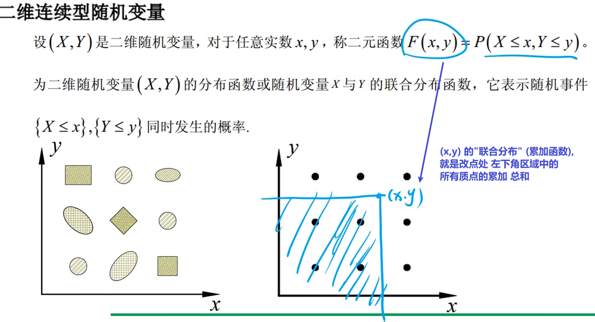

|边缘累加 (即"边缘分布函数")
|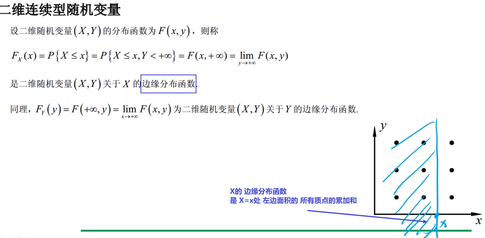

也即: +
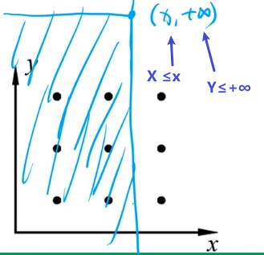
|===

[options="autowidth"]
|===
|连续型的 二维随机变量 |Header 2

|累加函数 (即"联合分布函数")
|Column 2, row 1

|边缘累加 (即"边缘分布函数")
|这块板上, 每一个坐标点, 代表x,y取"特定值结果", 它的概率值.  所以, 这个板上的每一个点的概率值都是不同的.

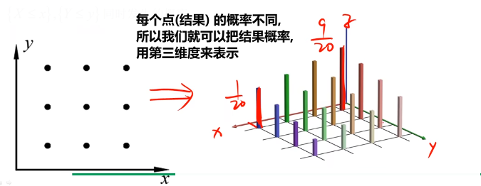

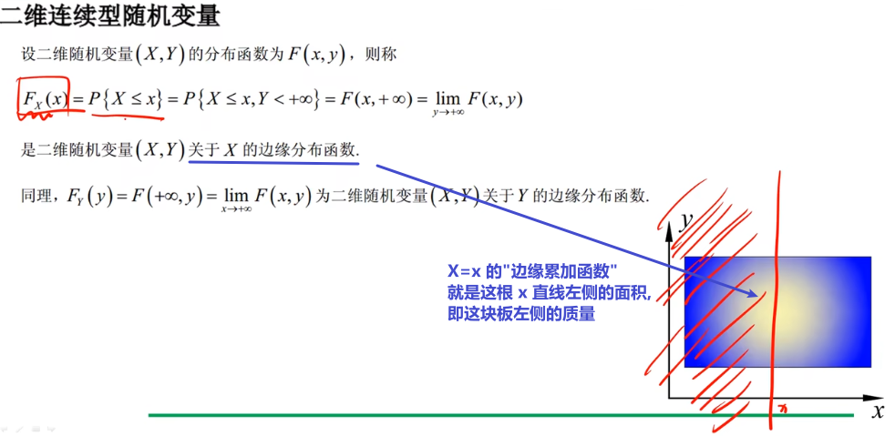

|边缘概率函数 (即:边缘概率密度函数)
| 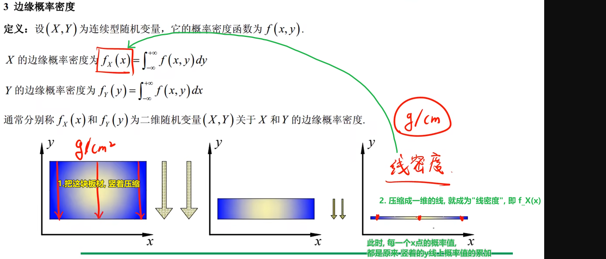

事实上, 对于连续型数据来说, 把每个x点处的 y线 叠加起来, 就是做"积分".
|===

比如, 人的身高和体重, 是一个"连续型数据的随机变量", 则, 大多数人, 这两个变量的结果, 都处于均值附近. 所以中间区域的概率值是最大的. 四个角落是偏离均值的, 出现的概率是最小的. +
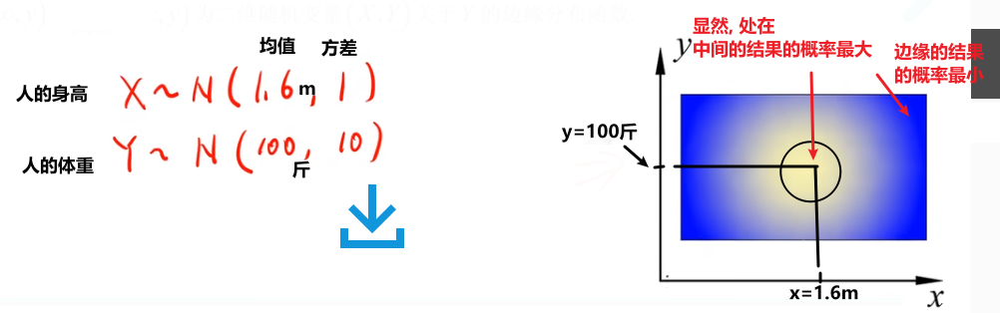

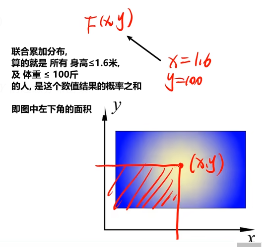

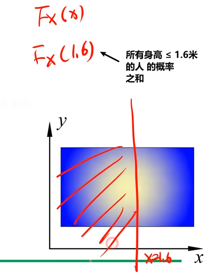

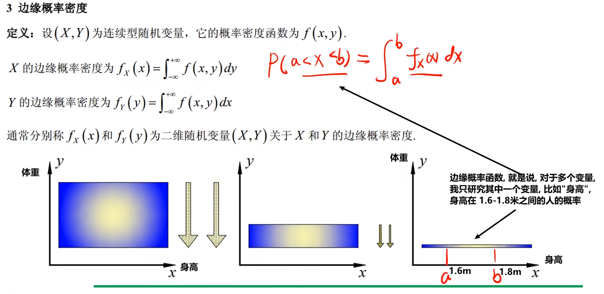

---

=== 条件概率密度, 是研究单独一条水平线 或 垂直线 的密度(概率之和).

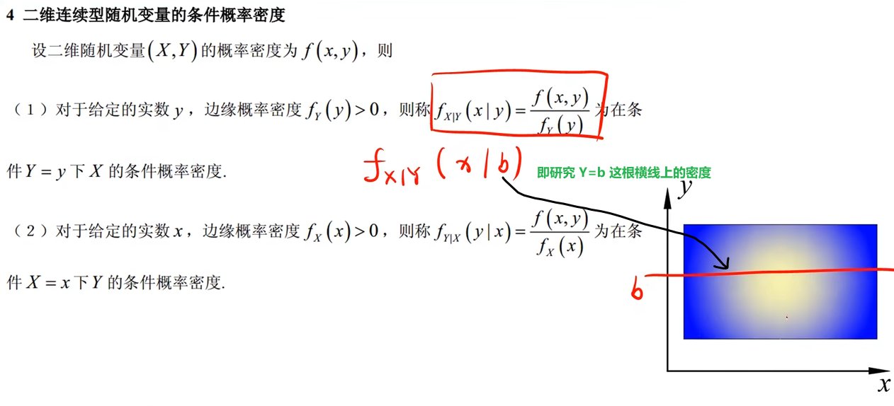

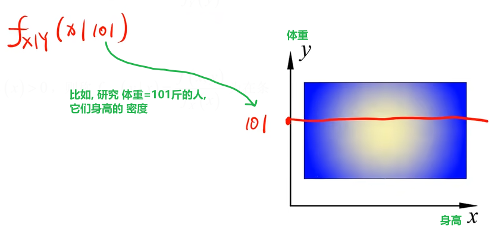

比如: stem:[P(1.6m < X < 1.7m | Y=110g)]  ←  就是求 体重Y在110斤的人, 身高在1.6-1.7m 之间 的概率.  这个问题, 无法直接用"条件概率"来做, 因为 比如你写成 stem:[\frac{P(...)} {P(Y=110g)}], 首先, 分母上的概率就是=0 的, 因为我们这个随机变量是"连续型数据".

所以, 这个问题的解法, 只能用 : stem:[= \int_{1.6m}^{1.7m} f_{X|Y}(x|110g) dx] 这样求积分来做.

---

== 二维随机变量 Two-dimensional Random Variable

X,Y 是来自于"同一个样本空间Ω" 中的两个变量.  "二维随机变量"就写成 (X,Y), 它也可以称为"二维随机向量".

二维随机变量的"累加函数", 就写成: stem:[F(x,y)=P{X \leq x, Y \leq y}], 叫做 X,Y的"联合累加函数" (即"联合分布函数"). 所谓"联合",  是因为其概率, 是由多个变量共同决定的.

对于"一维随机变量"来说: +
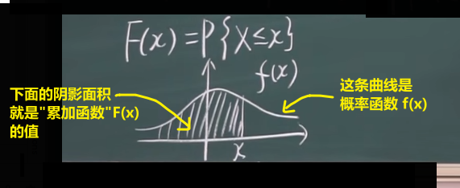

对于"二维随机变量"来说: +
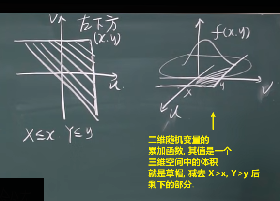

类似下图的意思:

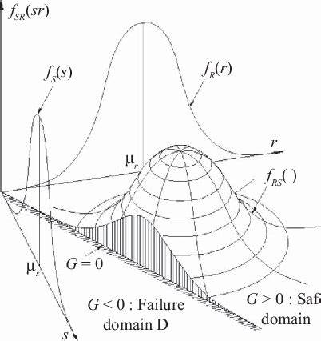

---

== 性质 (以下性质, 对"离散型数据" 和"连续性数据"都成立)

=== 把y固定的前提下, 若 stem:[x_1 < x_2], 则 stem:[F(x_1, y) \leq F(x_2, y)]

---

=== stem:[F(-∞, y)=0]

\begin{align*}
& F(-∞, y) \\
& = P\{X \leq -∞, \quad Y \leq y\}\\
& = 0
\end{align*}

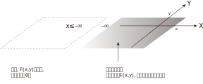

---

=== stem:[F(x, -∞)=0]

\begin{align*}
& F(x, -∞) \\
& = P\{X \leq x, \quad Y \leq -∞\}\\
& = 0
\end{align*}

---

=== stem:[F(-∞, -∞)=0]

\begin{align*}
& F(-∞, -∞) \\
& = P\{X \leq -∞, \quad Y \leq -∞\}\\
& = 0
\end{align*}

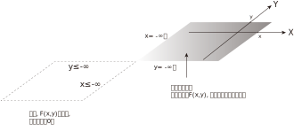

---

=== stem:[F(+∞, +∞)=1]

\begin{align*}
& F(+∞, +∞) \\
& = P\{X \leq +∞, \quad Y \leq +∞\} \\
& = 1
\end{align*}

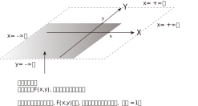

---

=== F(x,y) 是分别关于 x 和 y "右连续"

---

=== stem:[P{x_1 < X ≤ x_2, \quad y_1 < Y ≤ y_2} = F(x_2, y_2) - F(x_2, y_1) - F(x_1, y_2) + F(x_1, y_1)]

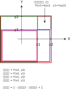

---

== 边缘"累加函数", 即 x 和 y 的"边缘分布"

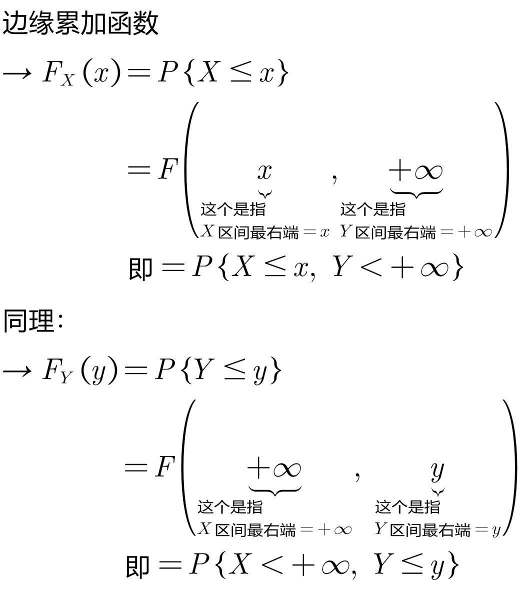

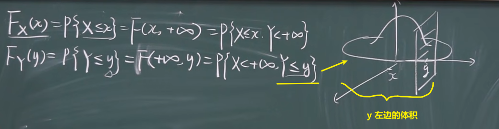

---

== ----- -----

---

== 二维"离散型数据" 的"联合概率分布" 和"边缘概率分布"

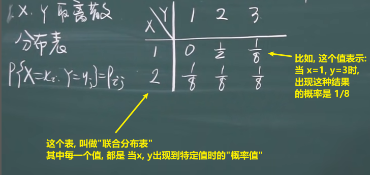

有: +
[options="autowidth"]
|===
|Header 1 |Header 2

|stem:[P_{ij} ≥0]
|由X 和Y 的每个特定值, 共同构成的结果, 的概率是大于等于0的

|stem:[ΣΣP_{ij} =1]
|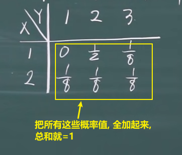
|===

---

=== 二维"离散型数据" 的"累加函数" stem:[F(x,y)= P{X≤x, Y≤y } = \sum_{x_i ≤ x} \sum_{y_j ≤ y} P_{ij}]

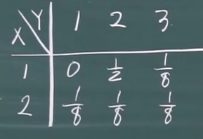

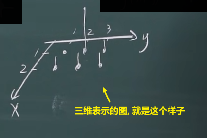

[options="autowidth"]
|===
|根据上表的例题 |Header 2

|stem:[F(-1,-2)=P{X ≤ -1,  \quad Y ≤ -2}=0]
|<- 因为根据上表, X 和 Y的最小值都是从1开始的, 比1还小的话, 概率就只能是0了.

|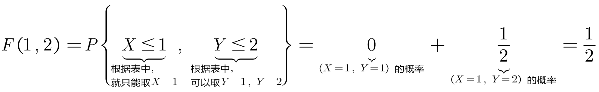
|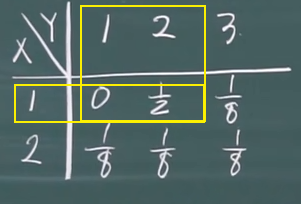

|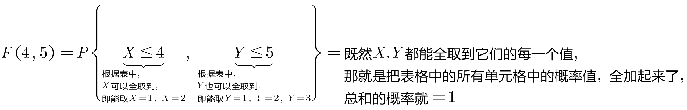
|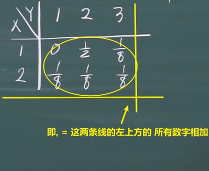

|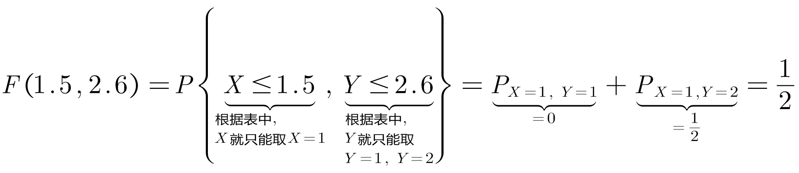
|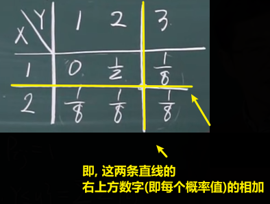
|===

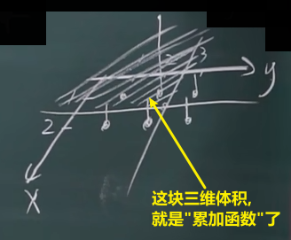

---

=== 二维"离散型数据" 的"边缘分布"

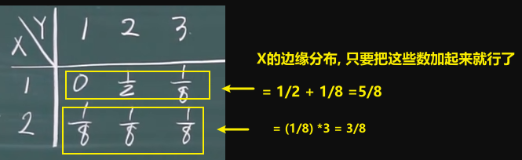

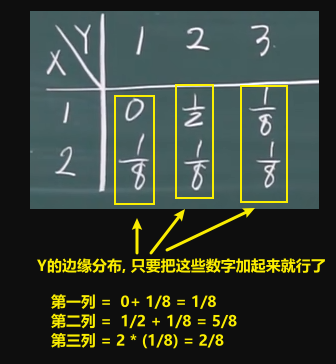

即 : 对于"X放在行上, Y放在列上"的表:  +
-> 对"行"求和, 就得到"X的边缘分布" +
-> 对"列"求和, 就得到"Y的边缘分布" +

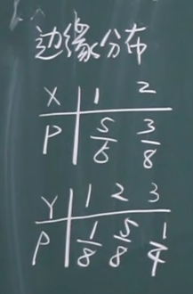

有了"联合分布"的表格数据, 就可以唯一确定 其 X, Y "边缘分布"的值. (即, 知道单个元素的值后, 就能知道它们的"和")

但反过来, 只知道"边缘分布"的值的话, 是不能从中倒推出"联合分布"的表格数据的. (即, 只知道一堆数据的总和的话, 是无法知道组成它的每个元素, 具体是什么值的.)

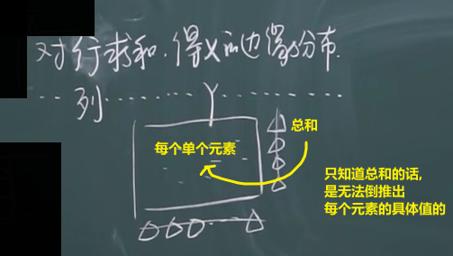

---

== ---------- ----------

---

==   二维"连续型数据" 的"概率函数" (即"概率密度函数) 和 "边缘密度函数"

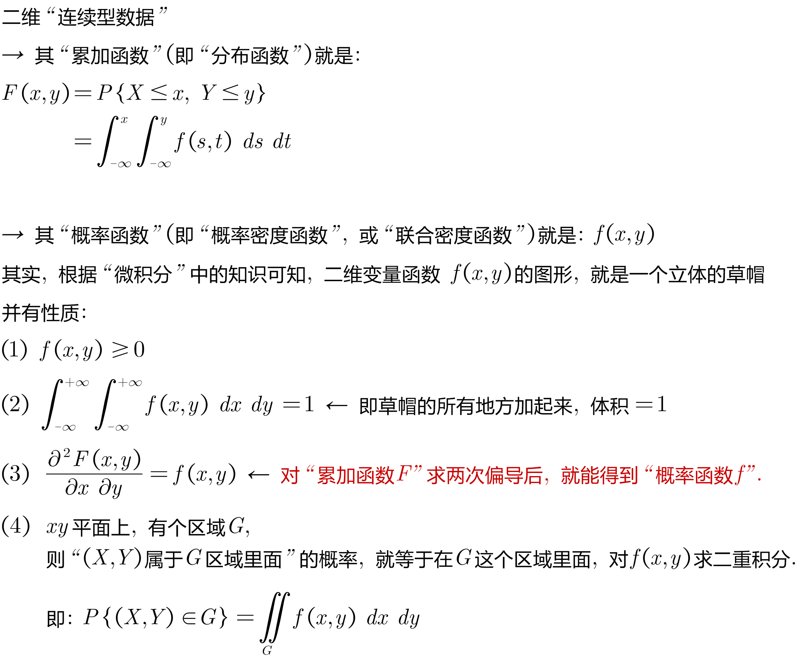

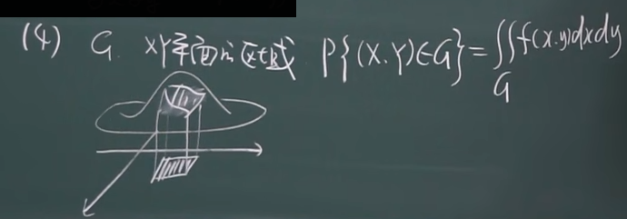

.标题
====
例如： +
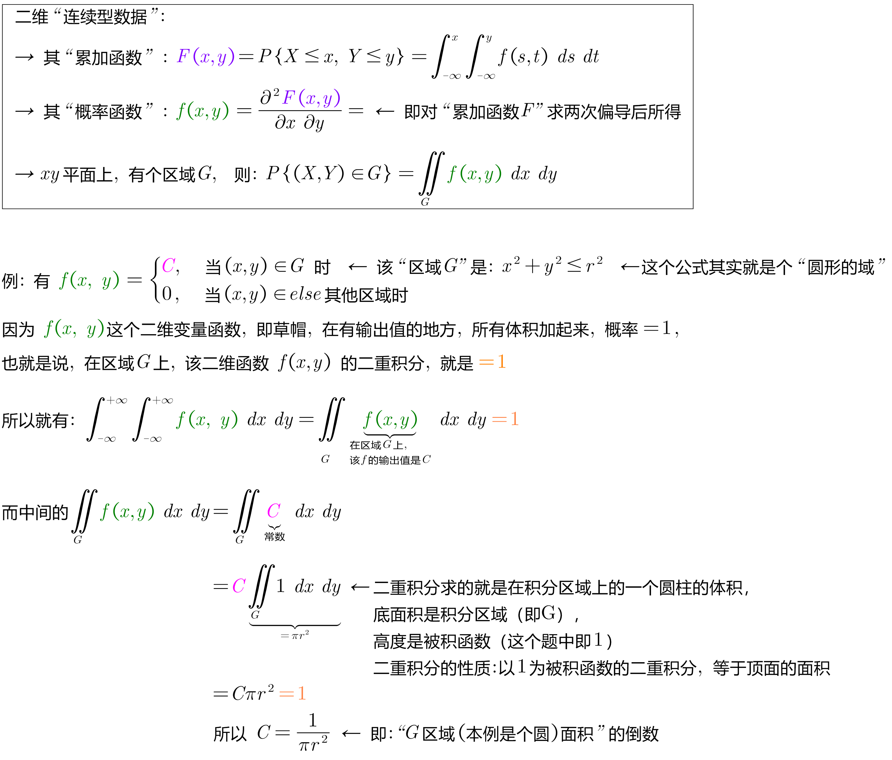

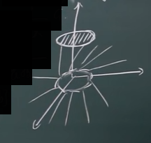
====

即:
\begin{align*}
f(x,y)= \left\{ \begin{array}{l}
\dfrac{1} {S(G)}	,   \quad (x,y) \in G \\
0, \quad else	\\
\end{array} \right.
\end{align*}

上面的 S(G) 是指 "G区域的面积".

.标题
====
例如： +
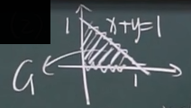

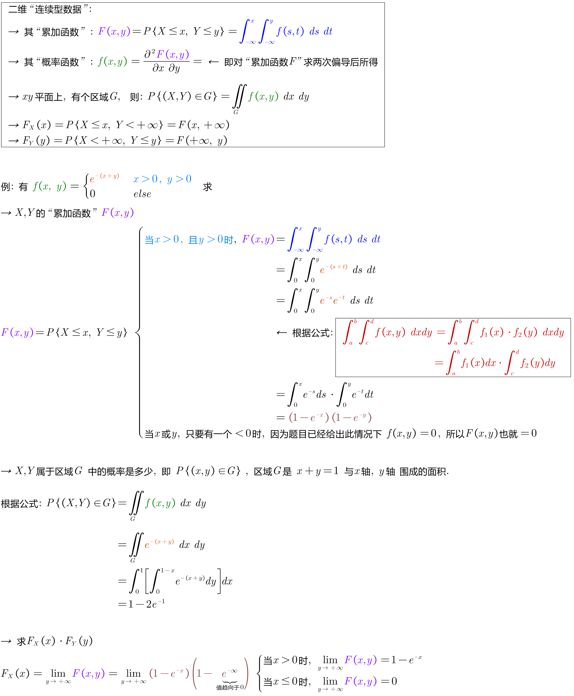

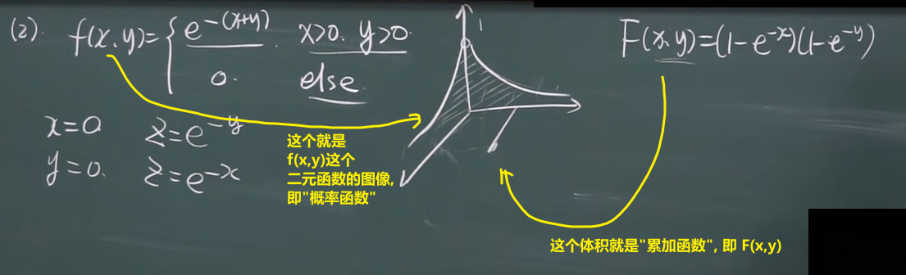

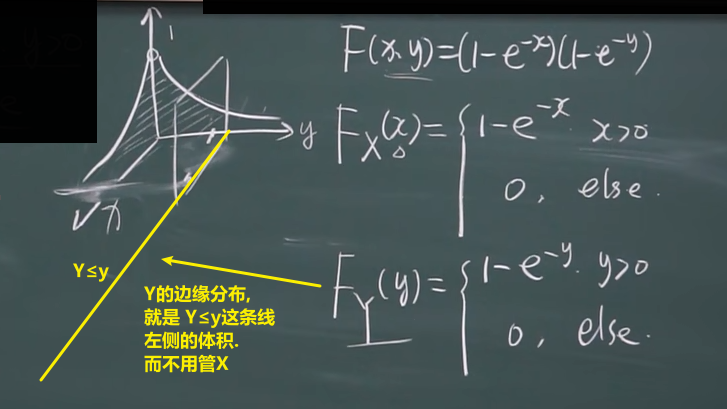

====

---

== 二维随机变量的"边缘概率函数"(即边缘密度函数)

X的"边缘累加(即分布)函数"是: stem:[F_X(x)= F(x,+∞)=\int_{-∞}^{x}\[ \int_{-∞}^{+∞} f(s,t) dt\] ds]

对"边缘累加函数"stem:[F_X(x)] 求导, 就能得到"边缘概率函数(即边缘密度函数)".

所以, stem:[f_X(x)=\int_{-∞}^{+∞} f(x,t) \ dt = \int_{-∞}^{+∞} f(x,y) \ dy ]

stem:[f_Y(y)=\int_{-∞}^{+∞} f(s,y) \ ds = \int_{-∞}^{+∞} f(x,y) \ dx]

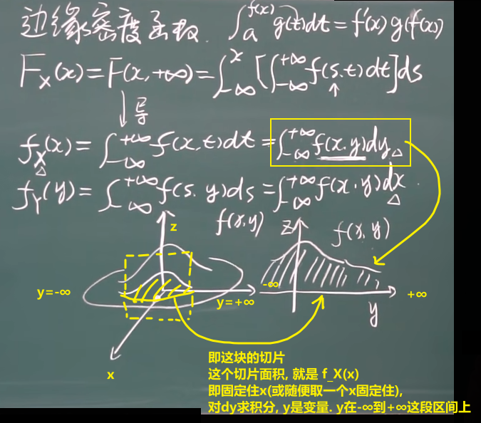

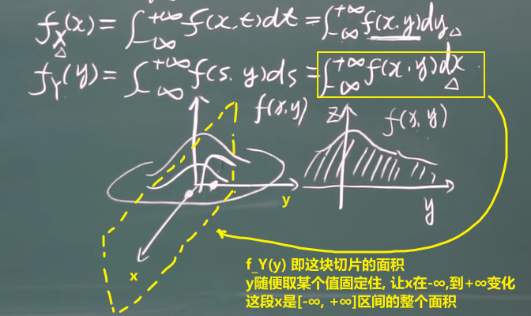

.标题
====
例如： +
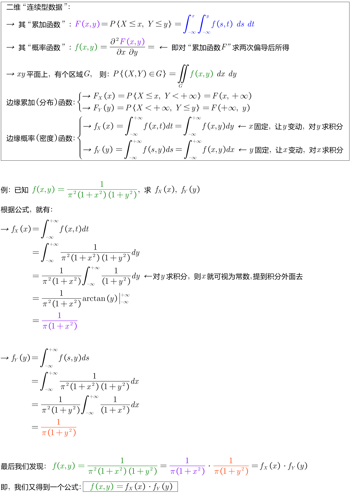
====

.标题
====
例如： +
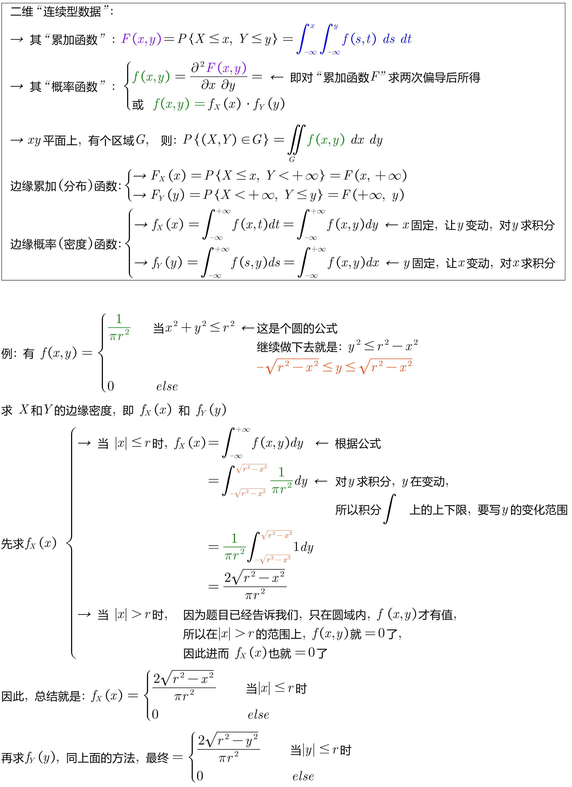

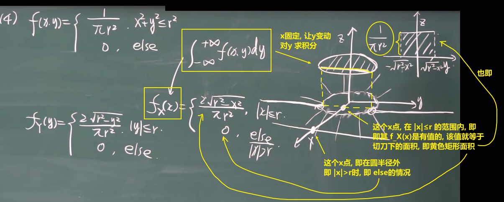
====

.标题
====
例如： +
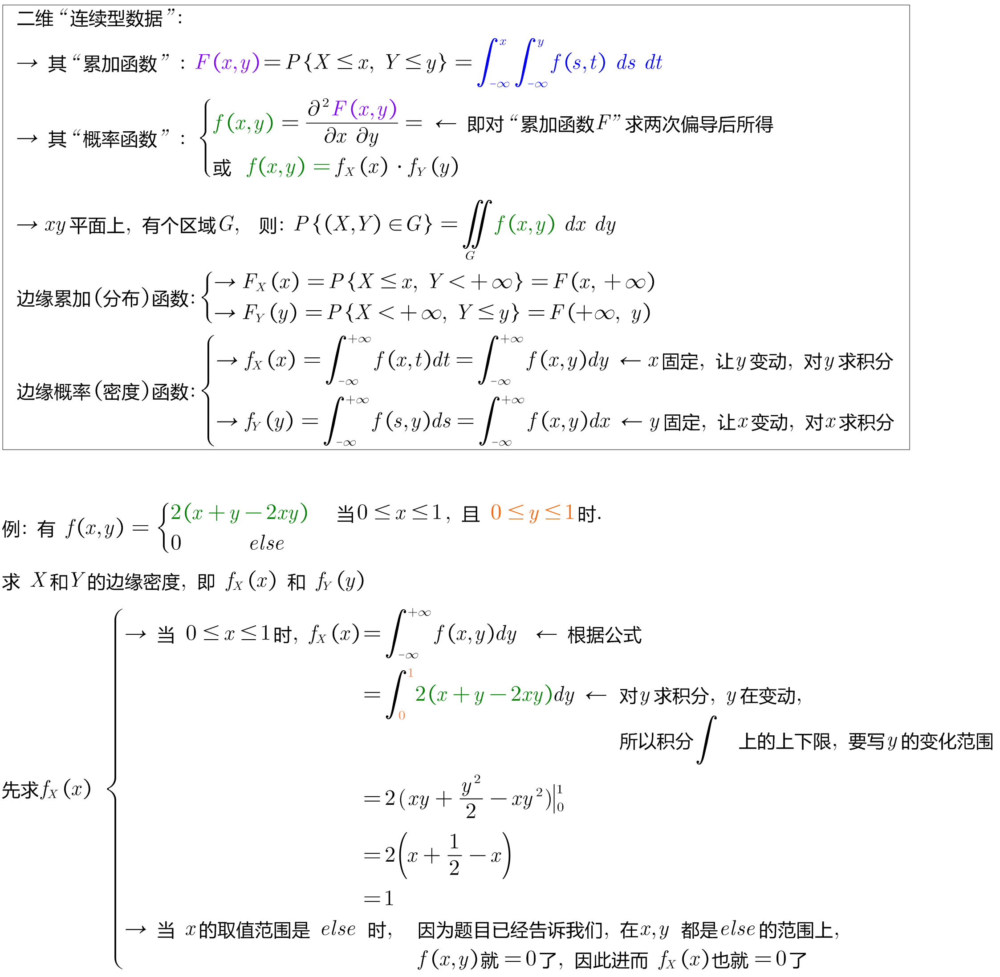
====

有这个规律:

- "二维正态分布"的"边缘分布", 也是 "正态分布".
- 两个"边缘分布"是"正态分布"的话, 它们组成的"二维随机变量", 并非一定是"二维的正态分布"

---
