= 条件分布 conditional distribution
:sectnums:
:toclevels: 3
:toc: left

---

对于二维随机变量(X，Y)，可以考虑在其中一个随机变量取得(可能的)固定值的条件下，另一随机变量的概率分布，这样得到的X或Y的概率分布, 就叫做"条件概率分布"，简称"条件分布"。

*二维随机向量 (X,Y) 中，X 与 Y 的相互关系除了"独立"以外，还有"相依关系"，即随机变量的取值, 往往彼此是有影响的，这种关系用"条件分布"能更好地表达出来。*

对于二维随机向量 (X,Y)，**所谓 "随机变量X的条件分布"，就是在 Y=y 的条件下, X的分布函数。** 比如，记X为人的体重，Y为人的身高，则X与Y一般有"相依关系"，如果限定 身高Y=172(cm)，在这个条件下, 体重X的分布, 显然与"X的无条件分布"有很大不同。

---

== 一维变量的 条件分布 conditional distribution

我们已经知道: stem:[ F(x) = P{X ≤ x}]

"条件分布"就是: 在一个事件A已经发生的条件下, x 的分布. 即: stem:[ F(x|A) = P {(X ≤x) | A}]

.标题
====
例如： +
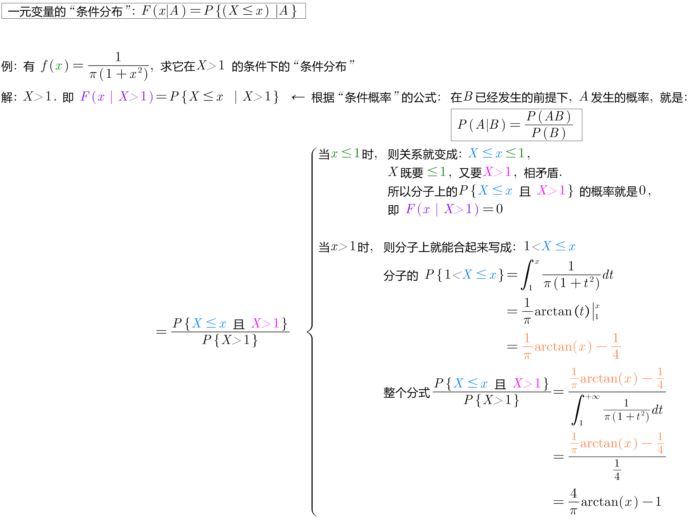

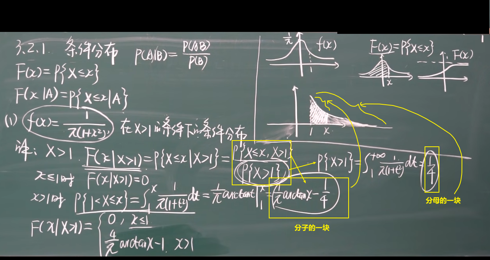
====

---

== 离散型数据的"条件分布"

.标题
====
例如： +
如 设 (X,Y)的概率分布为:

[options="autowidth"]
|===
| |Y= -1 |Y= 0 |Y= 2

|X= 0
|0.1
|0.2
|0.1

|X= 1
|0.4
|0.1
|0.1
|===

|===
|Header 1 |Header 2

| stem:[ P {X=0 \| Y=0} = \frac{P{X=0, Y=0}} {P{Y=0}} = 红/蓝 = \frac{0.2} {0.2+0.1} = \frac{2} {3}]
|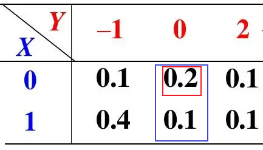

|stem:[ P {X=1 \| Y=0} = \frac{P{X=1, Y=0}} {P{Y=0}} = 红/蓝 = \frac{0.1} {0.2+0.1} = \frac{1} {3}]
|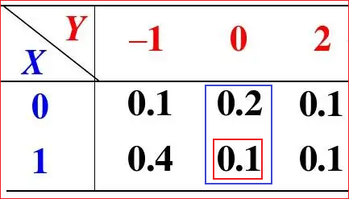
|===

https://www.51wendang.com/doc/1b2e04bf8cd05590feb03c1a

====

.标题
====
例如： +
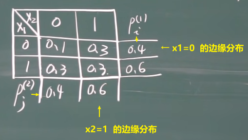

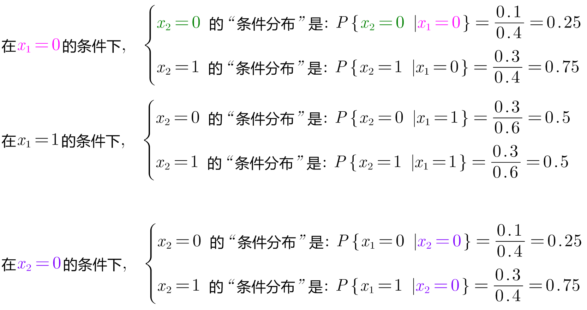

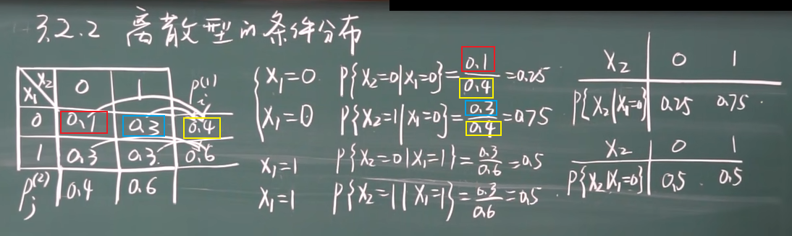

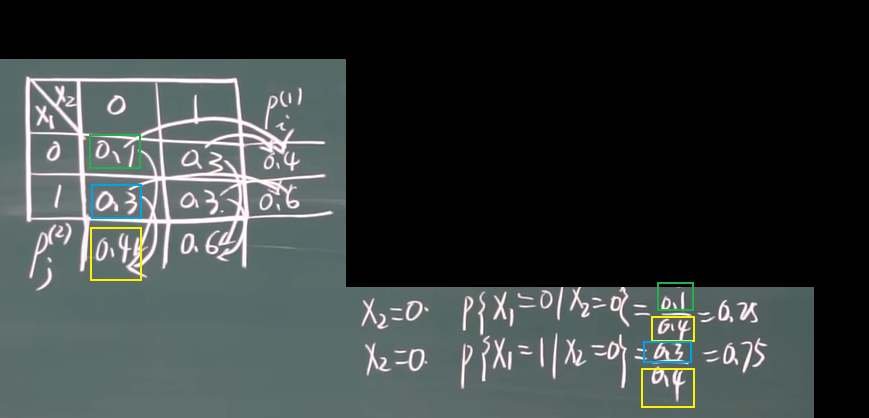
====

---

== 连续型数据的"条件分布"

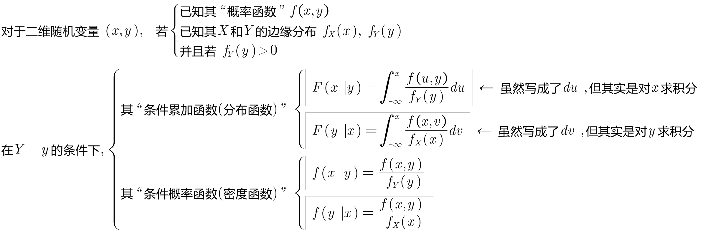

.标题
====
例如： +
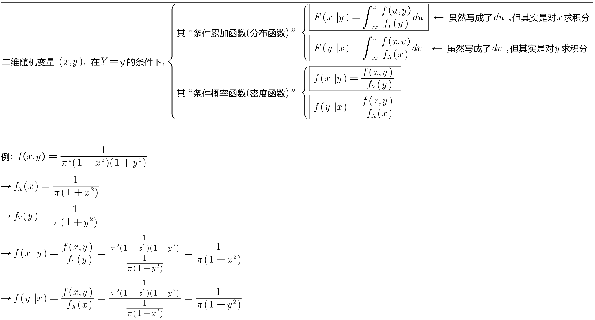
====

.标题
====
例如： +
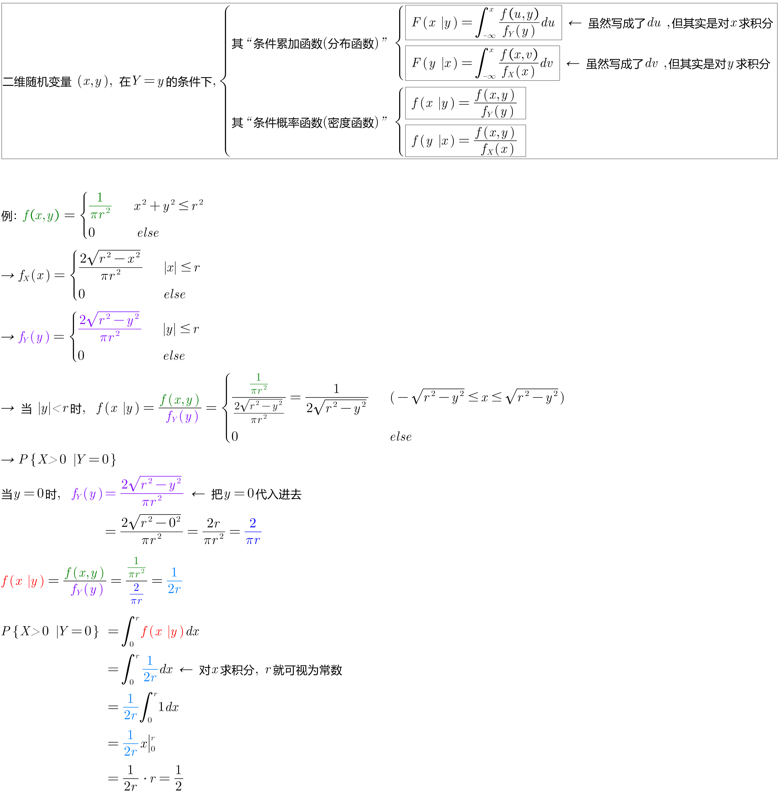

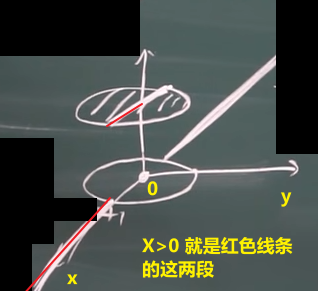
====

.标题
====
例如：
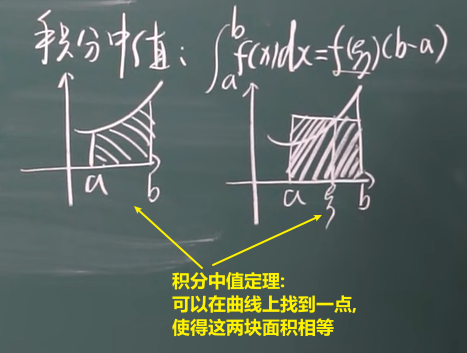
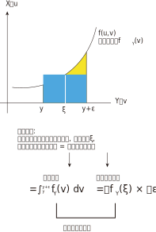

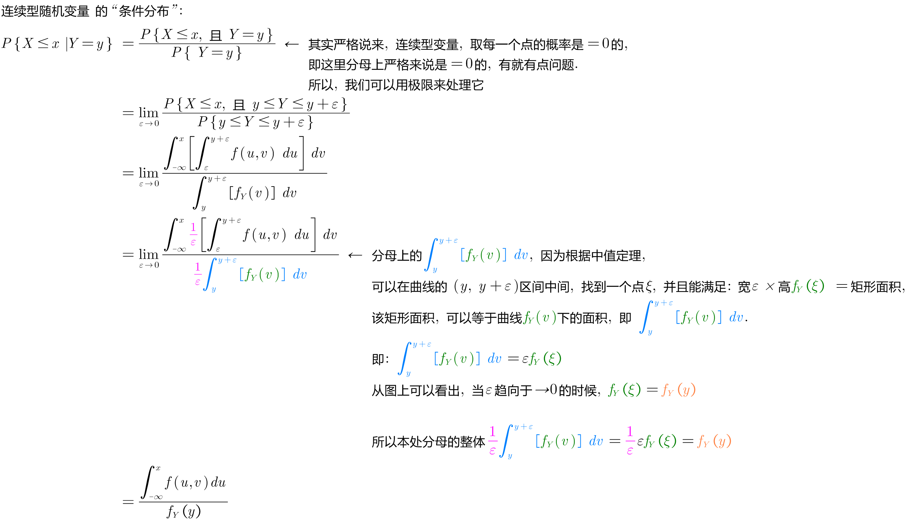
====

---
