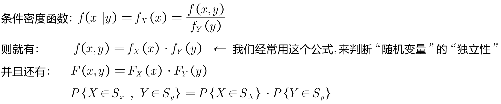
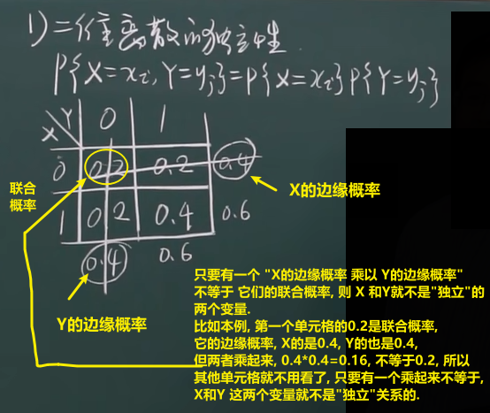
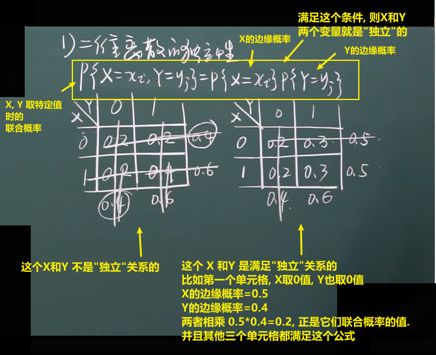
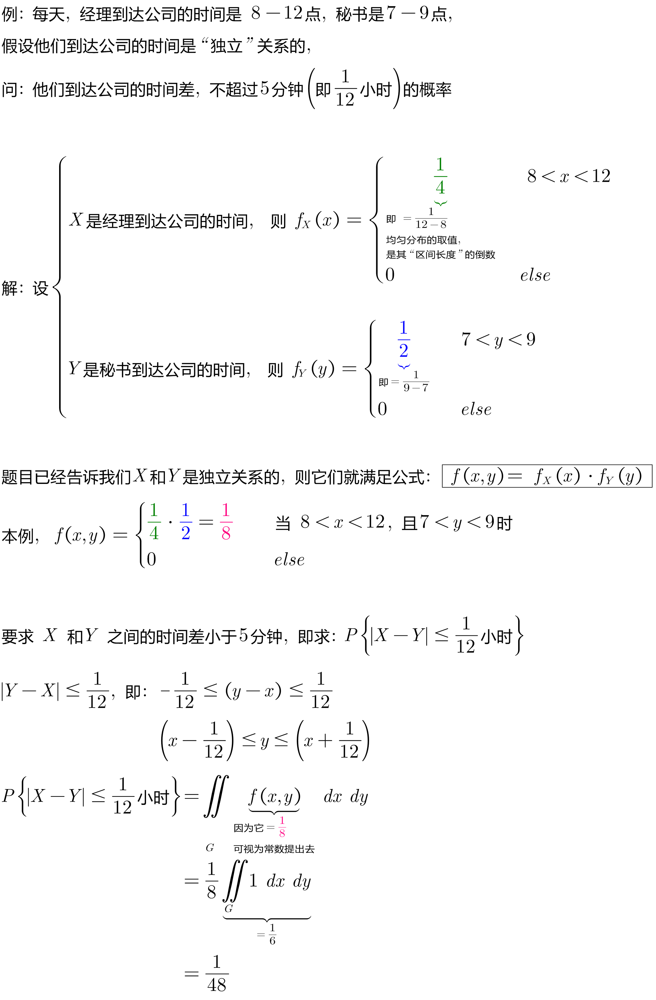
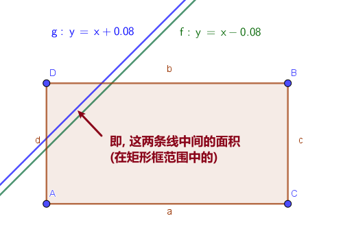

= 随机变量的独立性
:sectnums:
:toclevels: 3
:toc: left

---

== 随机变量的独立性

---

==  "二维离散型"随机变量, 如何判断其两个变量的"独立性"关系? -> 必须满足这个条件: stem:["联合概率" P{X=x_i, Y=y_i} = "X的边缘概率" P{X=x_i} \cdot "Y的边缘概率" P{Y=y_i}]

对于"二维"离散型随机变量, 判断其"独立性", 就用下面的公式:

stem:[P{X=x_i, Y=y_i} = P{X=x_i} \cdot P{Y=y_i}] +

即, 如果 这两个变量的"联合概率密度函数", 等于这两个变量各自的"边缘分布函数"的乘积, 那它们就是"独立的", 两个变量之间没有相关关系. 一个变量的变化, 对另一个变量的发生概率没有影响.

上例, 每个单元格中的数字, X和Y取不同值时的"联合概率值". 怎么判断 X 和Y 两个变量, 是"独立"关系的呢?
就看每个单元格各自对应的 X 和 Y 的边缘概率, 乘起来, 是否等于单元格中的值.  +

-> 只要有一个单元格不符合这个条件, 则 X 和 Y 就不是"独立"关系的. +
-> 但反过来则很严格, 要证明 X 和 Y 是"独立"关系的, 必须它们的所有单元格都满足这个条件 (即 X的边缘概率 × Y的边缘概率 = X和Y的联合概率), 才行.

---

==  "二维连续散型"随机变量, 如何判断其两个变量的"独立性"关系? -> 满足 stem:[f(x,y)=f_X(x) \cdot f_Y(y)] 即 独立

.标题
====
例如： +

====

*由"独立的随机变量"构造出的新函数, 仍然是"独立"的. 即: X, Y 是独立的, 则由它们构造出的新函数 stem:[g_1(x), g_2(x)], 它们也是"独立"关系的.*

比如: 如果 X, Y 是"独立关系"的, 则 由它们构造出的新函数: stem:[X^2, Y^2] 彼此也是"独立关系"的. 同样, stem:[a_1 X + b_1,  和 a_2 Y + b_2] 也是"独立关系"的.

---
