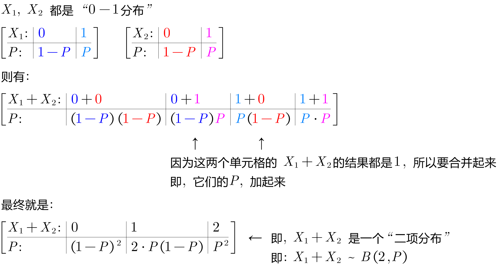

= 由"二维随机变量"构造的新函数 的分布
:sectnums:
:toclevels: 3
:toc: left

---

== 由"二维离散型 随机变量"构造的新函数 的分布

.标题
====
例如：

[options="autowidth"]
|===
| |stem:[Y_1=4] | stem:[Y_2=4.2]

|stem:[X_1=5]
|0.2
|0.4

|stem:[X_2=5.1]
|0.3
|0.1
|===

由上面的 X 和Y 构造出的新函数: Z=XY, 其概率分布表就是:

[options="autowidth"]
|===
|stem:[Z=X*Y] |stem:[X_1 * Y_1=5*4=20] |stem:[X_1 * Y_2=5*4.2=21] |stem:[X_2 * Y_1=5.1*4=20.4] |stem:[X_2 * Y_2=5.1*4.2=21.42]

|P -> 直接把上表中的对应单元格中的概率值, 抄过来就行
|0.2
|0.4
|0.3
|0.1
|===

又比如: stem:[Z=X^2 - Y]

[options="autowidth"]
|===
|stem:[Z=X^2 - Y] |stem:[(X_1)^2 - Y_1=5^2-4] |stem:[(X_1)^2 - Y_2=5^2-4.2] |stem:[(X_2)^2 - Y_1=(5.1)^2-4] |stem:[(X_2)^2 - Y_2=(5.1)^2-4.2]

|P -> 直接把上表中对应的单元格中的概率值, 抄过来就行
|0.2
|0.4
|0.3
|0.1
|===
====

.标题
====
例如： +
stem:[X_1, X_2] 独立,  并且它们的概率符合"0-1分布", 求 stem:[X_1 + X_2] 的概率

这两个变量都满足"0-1分布", 即:

[options="autowidth"]
|===
|stem:[X_1=] |0 | 1

|P=
|1-P
|P
|===

[options="autowidth"]
|===
|stem:[X_2=] |0 | 1

|P=
|1-P
|P
|===

[options="autowidth"]
|===
|stem:[X_1 + X_2] |stem:[(X_1=0)+(X_2=0)=0+0=0] | stem:[(X_1=0)+(X_2=1)=0+1=1] | |

|P
|stem:[(1-P)*(1-P)]
|stem:[(1-P)*P]
|
|
|===

完整的即:

====

https://www.bilibili.com/video/BV1ot411y7mU?p=43&vd_source=52c6cb2c1143f8e222795afbab2ab1b5

07.18

---

