= 数学期望 mathematic expectation
:sectnums:
:toclevels: 3
:toc: left

---

== 数学期望 mathematic expectation

*各个股票的价格有涨有跌, 那你怎么判断它们各自的价值, 到底几何? 方法就是 -- "数学期望".*  +
*"期望" 是对长期价值的数字化衡量.*

数学期望的计算公式是: 先把每个结果各自发生的概率, 和带来的影响相乘，再把算出来的数相加。

.标题
====
例如： +
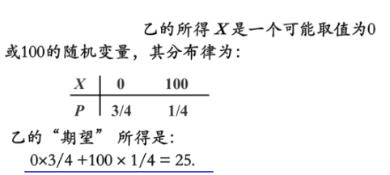
====

.标题
====
比如, 某股票, 现在价格50元. 它有40%的概率涨到60块, 有30%的概率保持不变， 还有30%的概率跌到35块。  即:

[options="autowidth"]
|===
|收益 X |60-50元 | 50-50 | 35-50

|P
|0.4
|0.3
|0.3
|===

那么它未来涨跌收益 的"数学期望"就是: +
E(X) = (60-50)0.4 + (50-50)0.3 + (35-50)0.3 = -0.5

*这个收益的期望, 是负数, 说明长期来看, 这只股票趋向于是亏钱的, 不值得买.*
====

.标题
====
例如： +

[options="autowidth"]
|===
|投篮得分X | 近距离篮下投, 得2分| 中距离投篮, 得2分 | 远距离投三分球, 得3分

|命中概率
|55%
|45%
|35%

|数学期望
|↑

stem:[2 \cdot 0.55=1.1分 ]

|↑

stem:[2 \cdot 0.45=0.9分 ]

|↑

stem:[3 \cdot 0.35=1.05分 ]
|===

*每种进攻方式的价值, 原本没办法比较，有了"数学期望"后, 就可以进行比较了.* 所以要多采用"近距离"和"远距离"投篮, 少投"中距离". 事实上, 在NBA 篮球联赛中, 不少球队就是照这个思路制定策略的.
====

要判断一件事情的长期价值, 我们就用"数学期望"来看. 注意: 是"长期价值".

"数学期望"之所以有效, 也是因为"大数定律"在背后起作用。 +
大数定律把"随机变量x"在局部上的"随机性数值变化", 固定到"整体上的确定性"，也就是概率; +
而数学期望, 又把概率代表的长期价值, 变成了一个具体的数字，方便我们比较。

对于游戏开发者来说, 如何保证游戏的平衡性? 即不让某些游戏中的职业过强或过弱? 方法就是衡量每个角色职业能活下来的"数学期望". 然后调整参数, 达到"数学期望"上的平衡.

*几乎所有的金融产品的价值, 如基金, 股票, 都可以用"数学期望", 来衡量它们是否值得投资.* 如果赢的期望超过输的期望，即**数学期望是正的, 它们就值得长期投资.**

*因为每个人, 对同一样事物赋予的"价值高低"的判断不同, 所以不同个体的数学期望, 也不一样.* 比如, 俄罗斯轮盘赌, 那些把赢钱看得比自己生命更重的人, 他们赋予这个游戏的数学期望就更高.

---

[options="autowidth"]
|===
|Header 1 |Header 2

|加权平均数
|加权平均值 : 即将各数值乘以相应的权数，然后加总求和 得到总体值，再除以总的单位数。

比如: 某人的考试成绩是: 平时测验 80分 (权重占20%), 期中考试 90分(权重占30%), 期末考试95分(权重占50%). +
那么, 其成绩的"加权平均值" 

如果权重未知（隐含）的话, 比如, 有两只股票:  +
股票A,价格10元/股, 你买了1000股 +
股票B, 价格15元/股, 你买了2000股 +
那么, 股票占总股数的比重, 就能视为权重.

则, 其加权平均值（所有拥有股票的平均价格） 

所以, 用公式来表示"加权平均值"就是: +
若n个数 stem:[ x_1, x_2, ..., x_n] 的"权重", 分别是 stem:[ w_1, w_2, ..., w_n] ，那么, 这n个数的"加权平均值"就是:  

|普通的平均数
|
|===

数学期望, 也叫"均值", "期望". 是试验中每次可能结果的概率, 乘以其结果 的总和。它反映随机变量平均取值的大小。

期望, 是指实验中"每个可能出现的结果, 乘以其概率"的总和，反应随机变量"平均取值"的大小，*即在多次试验的情况下, 预测能取得的结果为何。*

比如, 在一个打靶游戏中，打中区域对应得到的分值, 与其概率, 如下图所示：（如果没能打中靶子，则为“其他”，对应概率为 0.35. 没打中靶子, 就得0分）

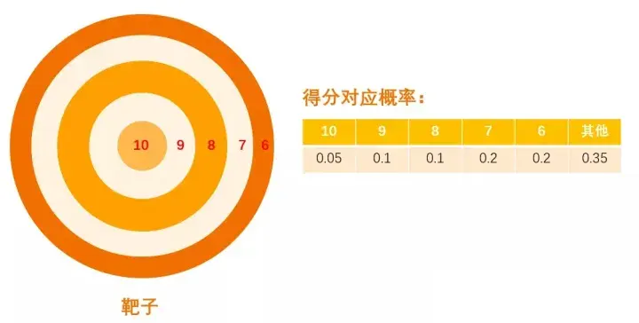

其期望值就是:  stem:[ E(x)=(10分×概率0.05) + (9分×概率0.1) + (8×0.1) + (7×0.2) + (6×0.2) + (0×0.35)=4.8分] +
意为在多次打靶之后，期望的打靶得分为4.8分。

注意: 不是所有的"随机变量X" 的"数学期望"都存在.

---

=== "离散型"随机变量 的数学期望 : stem:[ E(X)= \sum_{k=1}^∞ x_k P_k] ← 即它的每个"取值"乘以"相应的概率", 的总和

"离散型随机变量"的一切可能的取值, 与对应的概率乘积之和, 称为该"离散型随机变量"的"数学期望". (若该求和, 绝对收敛），记为stem:[ E(x)]。它是简单算术平均的一种推广，类似"加权平均"。

公式是: +
离散型随机变量X 的取值为: stem:[ X_1, X_2, ... X_n]， 每个X的取值, 对应的概率为 stem:[ p(X_1), p(X_2),..., p(X_n)]， 这些概率, 也可理解为数据 stem:[ X_1, X_2, ... X_n] 出现的频率 stem:[ f(X_i)]，则：

即:    ← 公式和"加权平均数"的公式很像, 只不过是把"权重"换成了"概率".

.标题
====
例如: 城市中任一个家庭中, 孩子的数目是一个随机变量，记为X。它可取值 0，1，2，3。

[options="autowidth"]
|===
|Header 1 |孩子数量 X=0 |X=1 |X=2 |X=3

|
|X取0的概率为0.01
|取1的概率为0.9
|取2的概率为0.06
|取3的概率为0.03

|某城市(共有10万个家庭)
|没有孩子的家庭, 有1000个
|有一个孩子的家庭, 有9万个
|有两个孩子的家庭, 有6000个
|有3个孩子的家庭, 有3000个
|===

\begin{align}
& E(X)= \sum_{k=1}^∞ x_k P_k \\
& = (0个孩子*概率0.01) + (1个孩子*概率0.9) + (2个孩子*概率0.06) + (3个孩子*概率0.03) \\
& =1.11
\end{align}

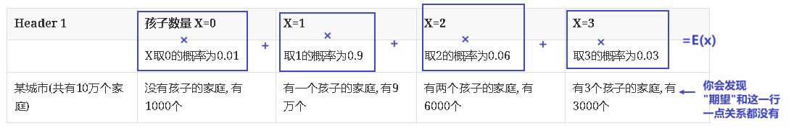

即此城市中, 每个家庭平均有小孩1.11个。
====

.标题
====
例如： +
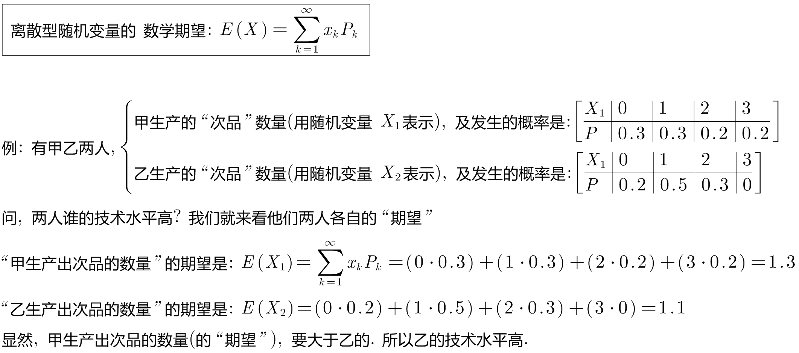
====

.标题
====
例如： +
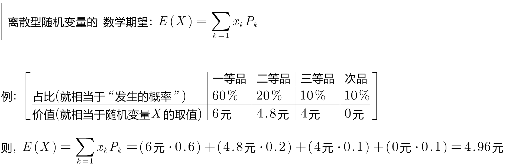
====

---

=== "连续型"随机变量 的数学期望 : stem:[ E(X) = \int_{-∞}^∞ \[x f(x)\] dx]

连续性随机变量X, 它的"概率函数"(即概率密度函数)是: f(x) +
如果 这个积分: stem:[ \int_{-∞}^∞ \[x f(x)\] dx] 的值, 是绝对收敛的, 则, 该积分的值, 就是"连续性随机变量X"的 "数学期望".

即: stem:[ E(X) = \int_{-∞}^∞ \[x f(x)\] dx]

.标题
====
例如： +
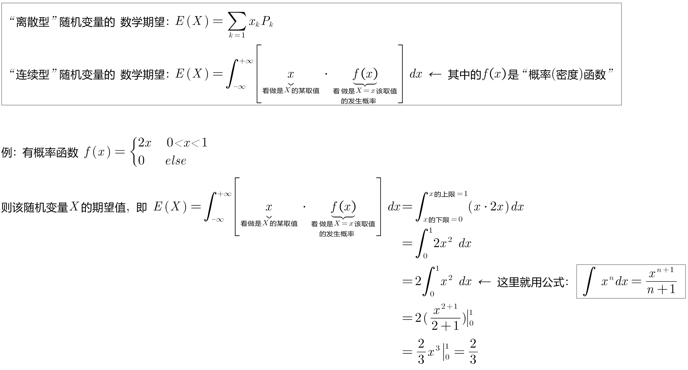

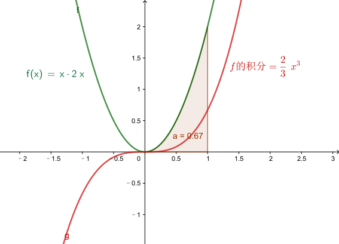
====

.标题
====
例如： +
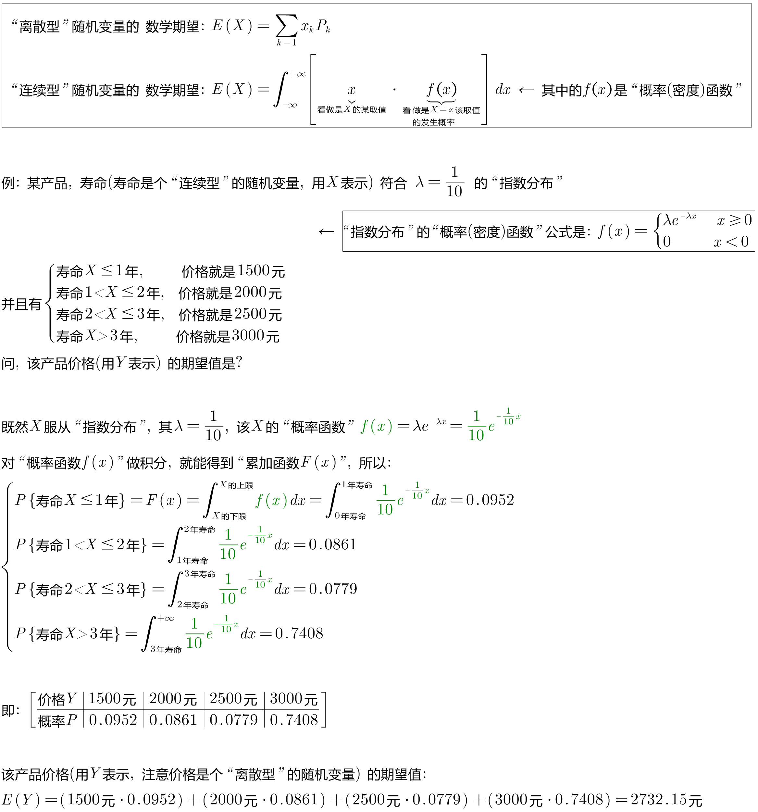

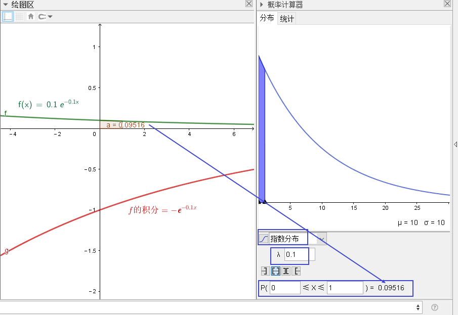

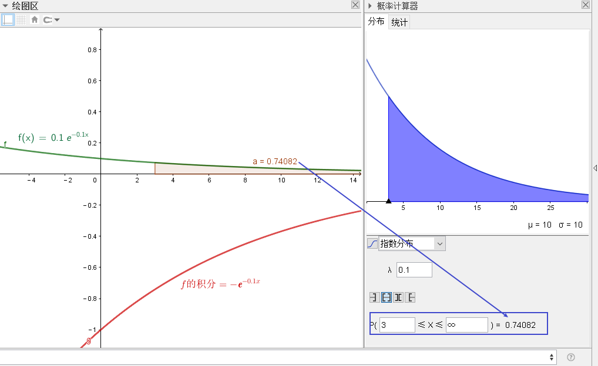
====

---

== "随机变量函数"的 "数学期望"

即 用随机变量X 构造出新的函数 Y=g(X), 来求这个"新函数Y"的数学期望.

[options="autowidth"]
|===
|Header 1 |数学期望

|"离散型"的随机变量 X
|stem:[ E(X)= \sum X_i P_i]

|由 "离散型随机变量X" 构造出的新函数 Y=g(X)
|stem:[ E(Y)= \sum g(x_i) P_i]

|"连续型"的随机变量 X
|stem:[  E(X)= \int_{-∞}^∞ \[x f(x)\] dx ]

|由 "连续型随机变量X" 构造出的新函数 Y=g(X)
|stem:[  E(Y)= \int_{-∞}^∞ \[g(x) f(x)\] dx ]
|===

.标题
====
例如： +
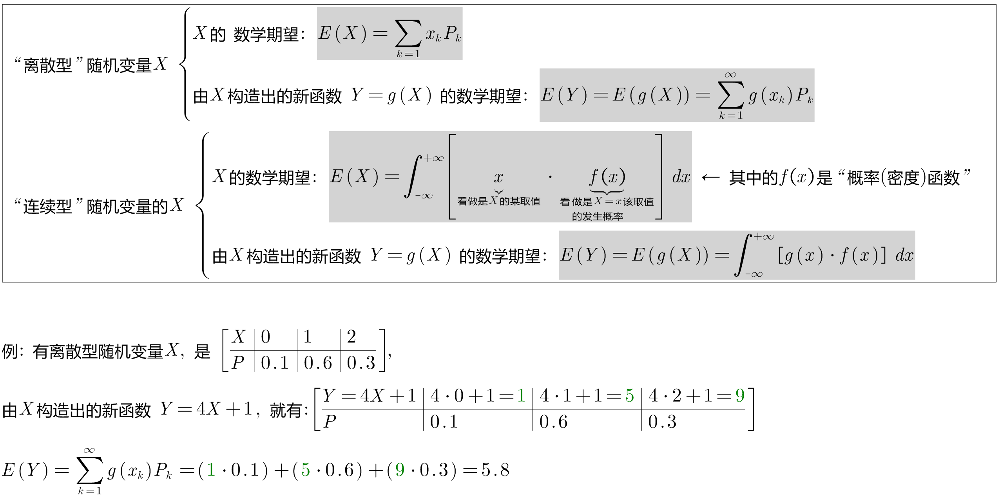
====

.标题
====
例如： +
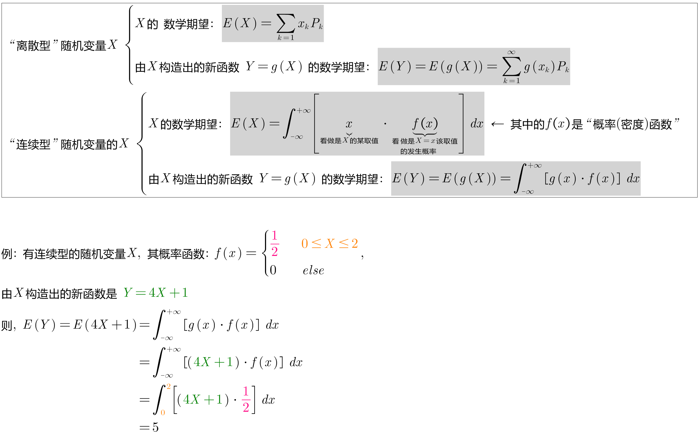
====

.标题
====
例如： +
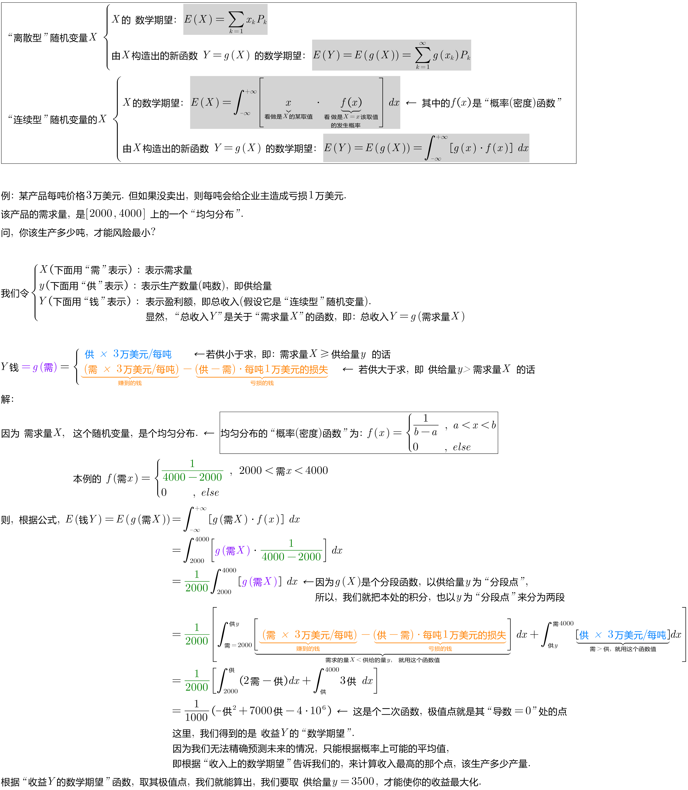

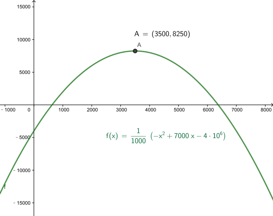
====

---

== 二维变量, 构成的新函数 的数学期望

由二维随机变量 (X,Y) 构造的新函数 Z=g(X,Y), 该Z 的数学期望:

[options="autowidth"]
|===
|二维随机变量 (X,Y) 构造的新函数 Z=g(X,Y) |Z 的数学期望

|(X,Y)是"离散型"二维随机变量的话
|stem:[E(Z)=\sum_i \sum_j g(x_i, y_i) P_{ij}]

连续两个Σ是什么意思? +
比如这个式子: stem:[\sum_{i=1}^{n-1} \sum_{j=i+1}^n 1]

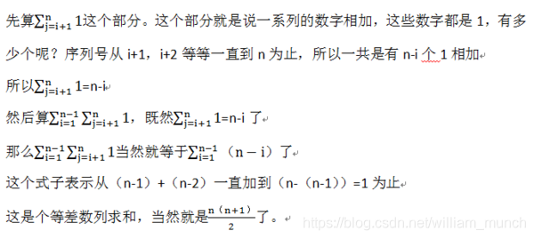

|(X,Y)是"连续型"二维随机变量的话
|stem:[E(Z)=E\[g(X,Y)\]=\int_{-∞}^{+∞} \int_{-∞}^{+∞} g(x,y) f(x,y) dxdy]
|===

.标题
====
例如： +
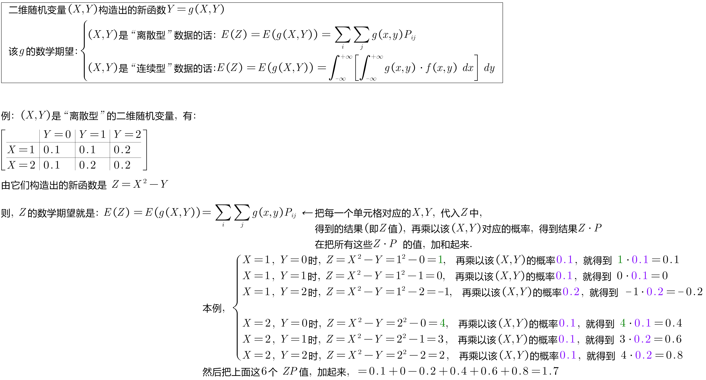
====

.标题
====
例如： +
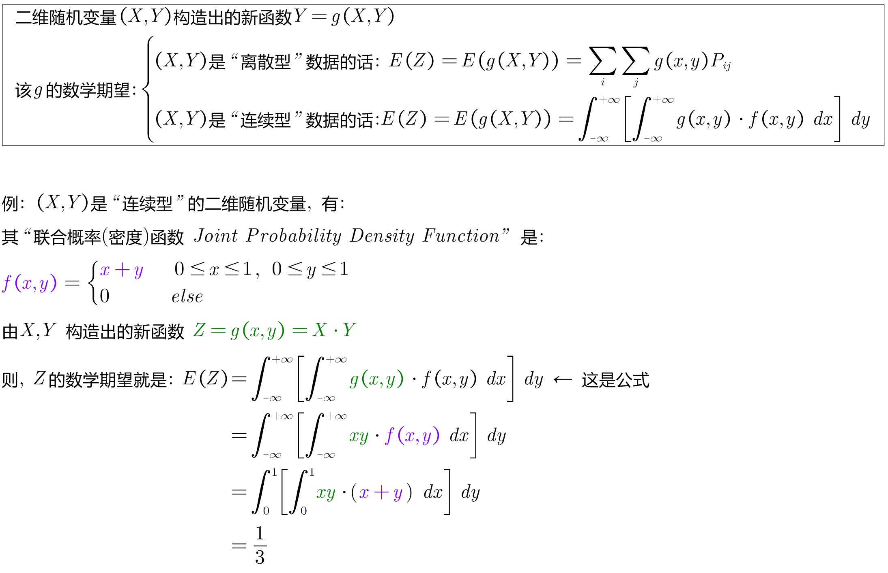
====

.标题
====
例如： +
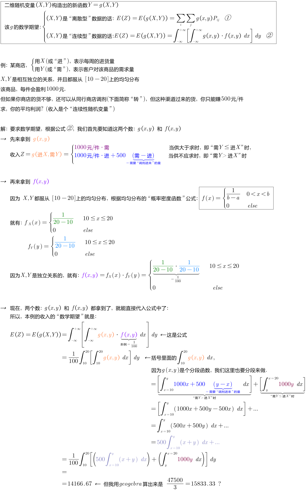

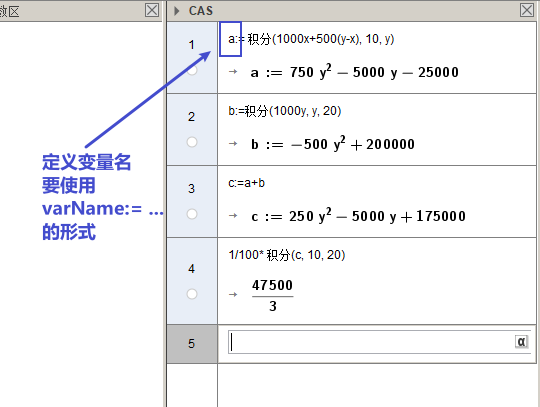

====

---

== "数学期望"的性质

=== E\(C)= C  ← 即: 常数的期望值, 就等于常数本身

因为期望值是个"均值"的概念, 常数的均值,肯定就是常数自己了.

---

=== E(X+常数C) = E(X)+常数C

"每个人的身高(E(X))加上砖头高度(C)"的平均值 (即 E(X+C)), 就等于"每个人的平均身高E(X)"再加上踩着的砖头C高度.

"随机变量X与常量C之和"的数学期望, 等于"x的期望"与"这个常量c"的和.

---

=== stem:[E(C \cdot X)=C \cdot E(X)]

"把每个人的身高X乘以C倍"的平均值, 即 stem:[E(C \cdot X)], 就等于"每个人的平均身高 E(X) "乘以C倍.

"常量C与随机变量X的乘积"的期望, 等于这个常量C与"此随机变量X的期望"的乘积.

---

=== stem:[E(kX+b)=k \cdot E(X) +b]

"随机变量X的线性函数(即 kX+b)"的数学期望, 等于这个"随机变量期望"的同一线性函数.

---

=== stem:[E(X \pm Y) = E(X) \pm E(Y)]  ← 任何时候都成立

"两个随机变量之和"的数学期望, 等于"这两个随机变量数学期望"之和.

---

==== 推论: stem:[E(\sum (C_i X_i))= \sum (C_i \cdot E(X_i))]

如: stem:[E(2X_1 - 3X_2 + 4X_3)=2E(X_1)-3E(X_2)+4E(X_3)]

---

==== 推论: stem:[E(\frac{1} {n} \sum(X_i))= \frac{1} {n} \sum (E(X_i))]

---

=== X,Y 相互独立时, stem:[E(X \cdot Y)=E(X) \cdot E(Y)]

"两个相互独立随机变量乘积"的数学期望, 等于"它们数学期望"的乘积.

.标题
====
例如： +
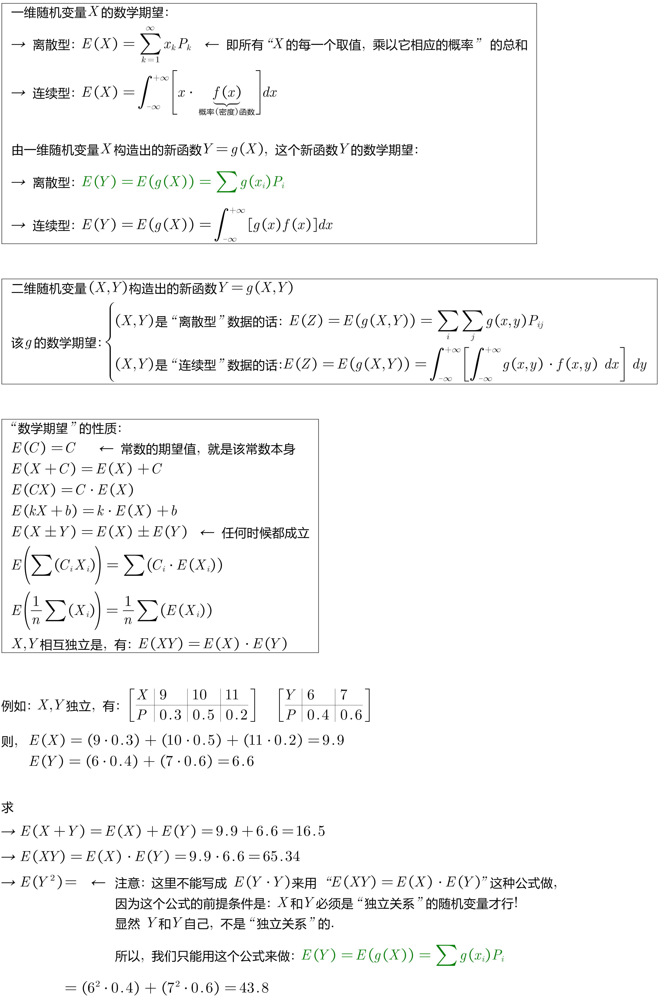
====

.标题
====
例如： +
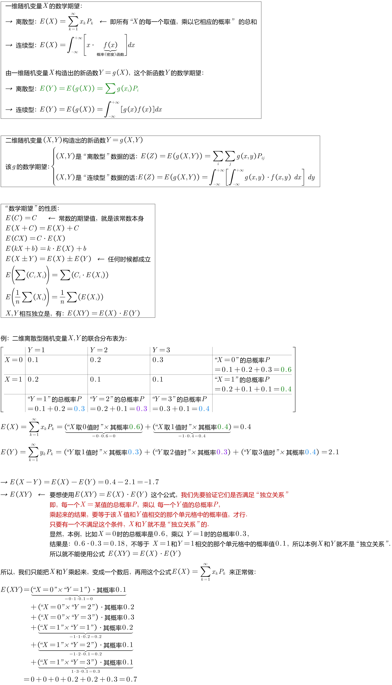
====

.标题
====
例如： +
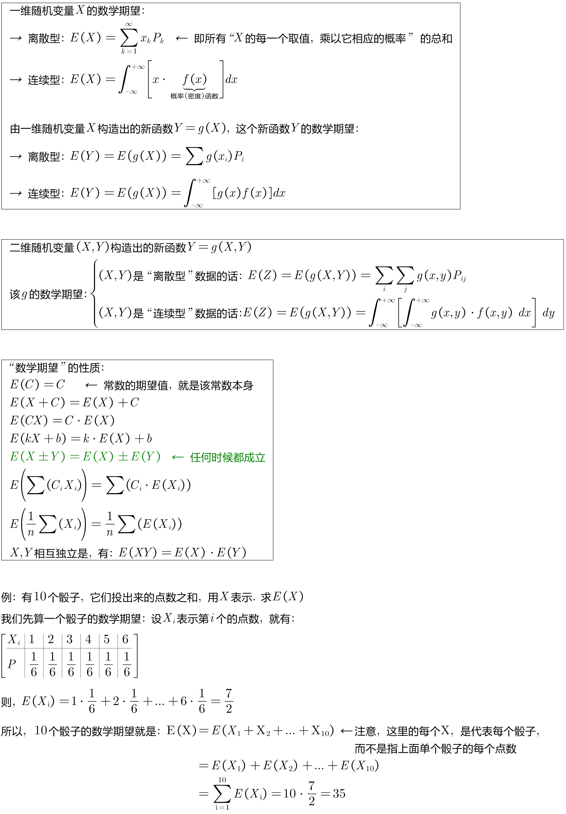
====

---

== 条件期望

条件变量就是说: 在一个变量取了某个值的前提下, 另一个变量的期望.

离散型数据 的条件期望:

- stem:[ E(X\| Y=y_j) = \sum (x_i \cdot P(X=x_i \| Y=y_j)) ]  ← 即在Y取了某个值的前提下, X的期望
- stem:[ E(Y\| X=x_i) = \sum (y_j \cdot P(Y=y_j \| X=x_i)) ]

连续型数据 的条件期望:

- stem:[ E(X \|Y=y) = \int_{-∞}^{+∞} \[x \cdot f(x\|y)\] dx ]
- stem:[ E(Y \| X=x) = \int_{-∞}^{+∞} \[y \cdot f(y\|x)\] dy ]

.标题
====
例如： +
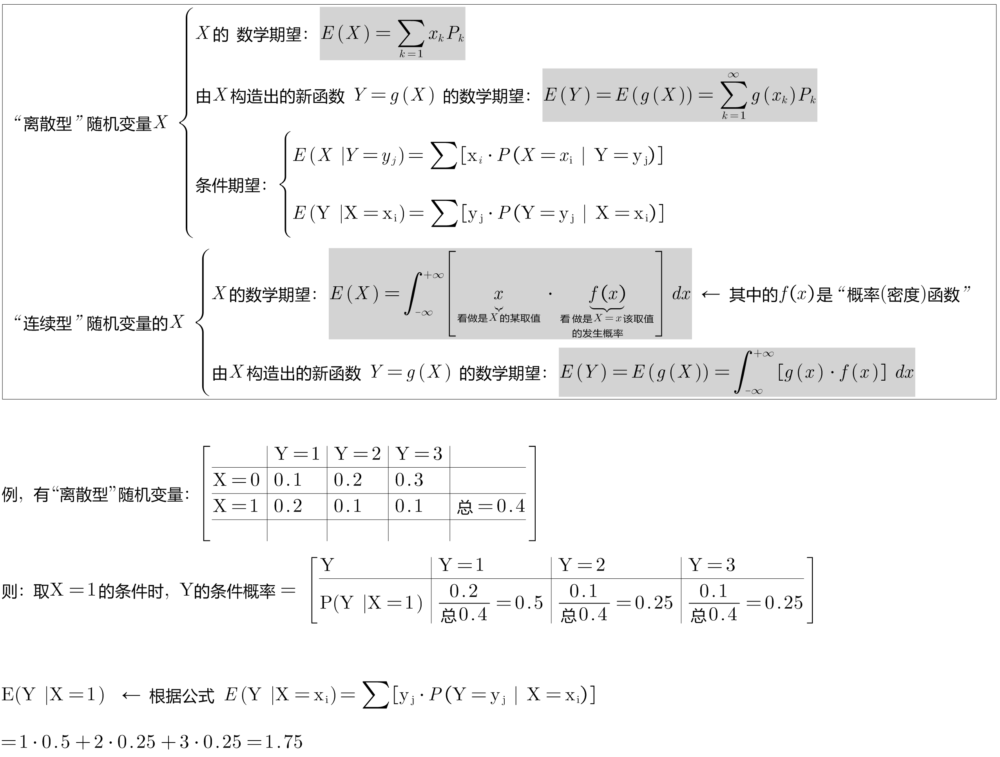

即: +
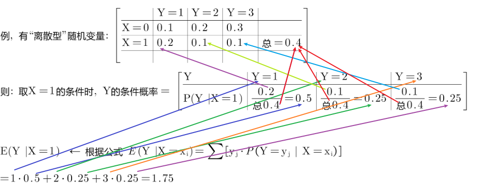
====

---

