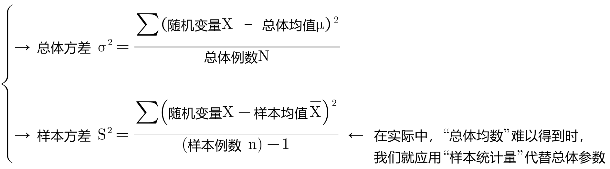
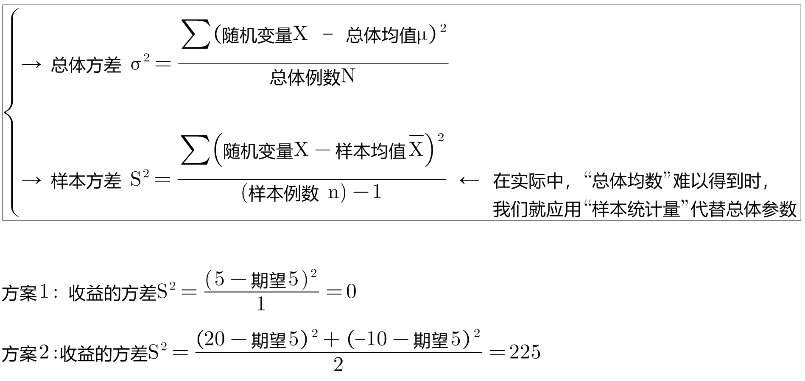
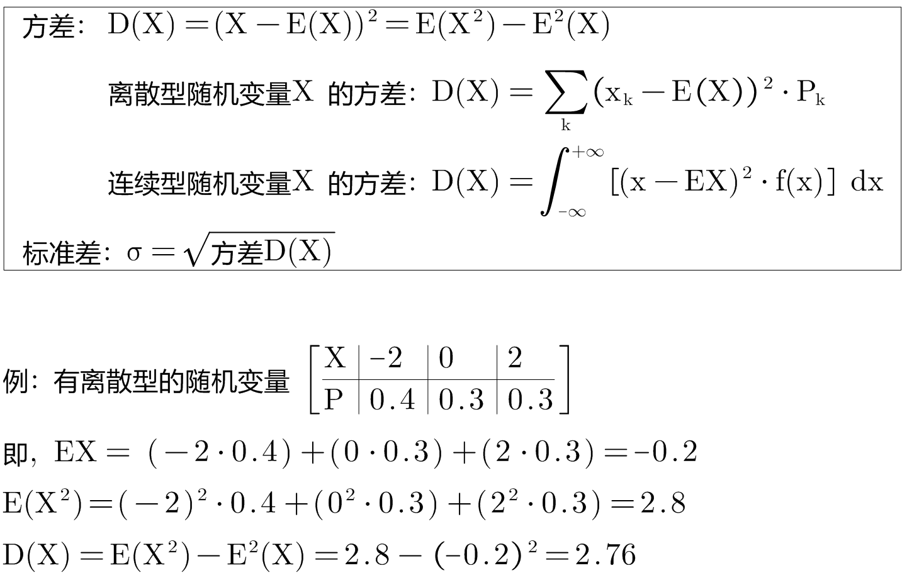
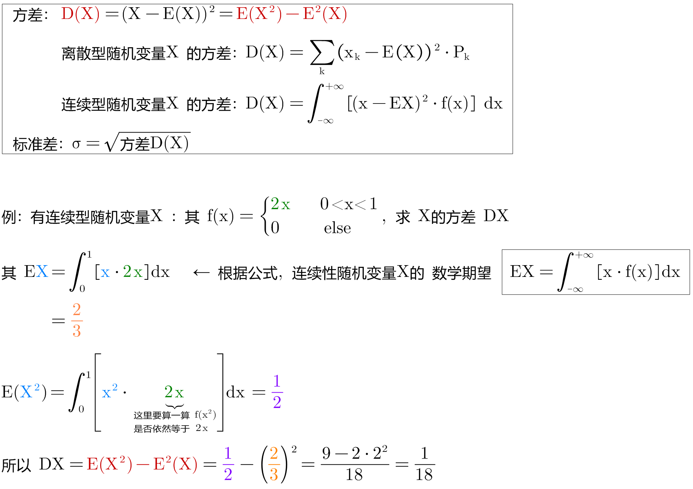
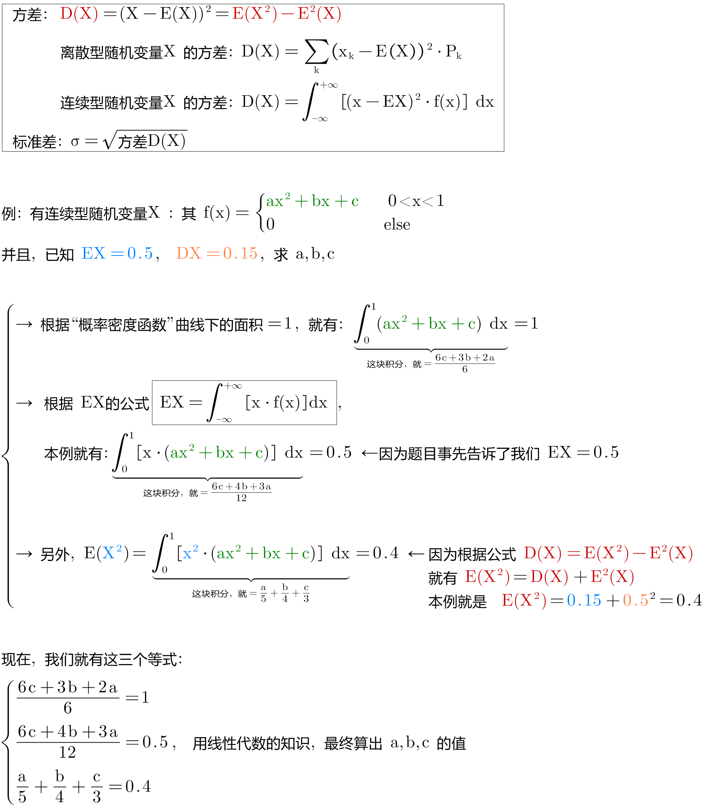
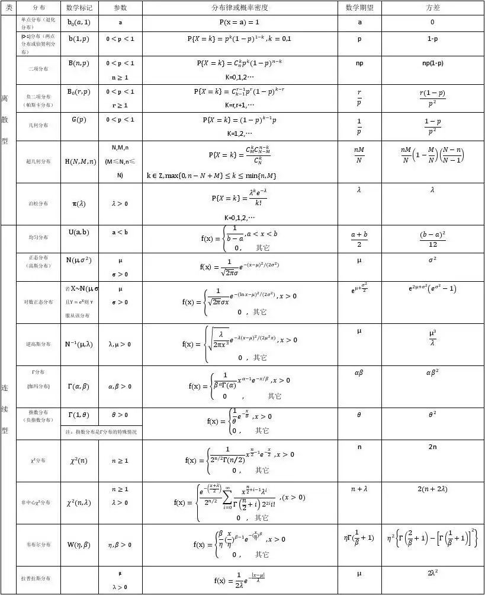
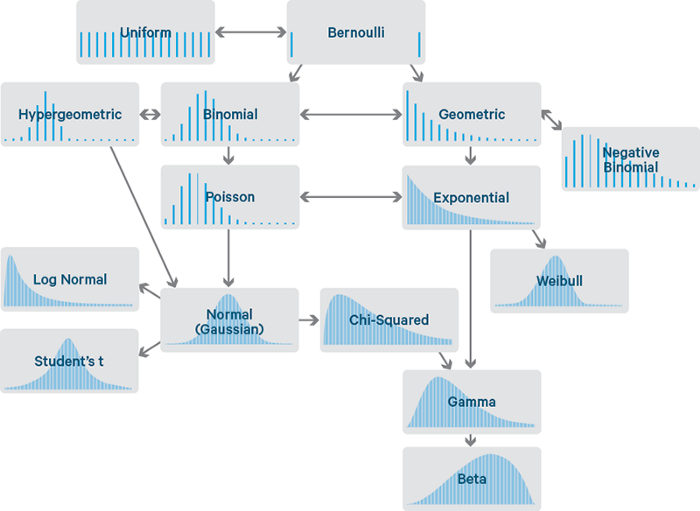
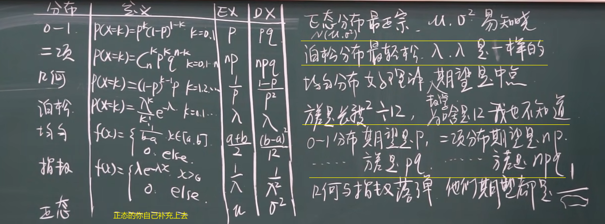

= 方差 variance/deviation Var
:sectnums:
:toclevels: 3
:toc: left

---

== 方差 variance/deviation Var & 标准差 Standard Deviation (常用 σ 表示)

=== 解释1 (刘嘉概率讲座)

==== 方差，反映的是"随机结果" 围绕"数学期望(即均值)"的波动范围。方差的本质是对"风险"的度量.

知道了"数学期望"的价值, 就能帮我们清楚衡量一件事的价值, 指导我们的决策了吗? 还不能. 因为"数学期望"无法帮我们衡量另一个重要的指标 -- "波动性".

现在, 有两个投资选择:
[options="autowidth"]
|===
|方案 |收益的"期望"

|选择1: 100%能净赚5万元, 收益非常稳定.
|stem:[ 5 \cdot 100% = +5万元]

|选择2: 有50%的几率赚20万, 还有50%的几率赔钱10万.
|stem:[ 20 \cdot 0.5 + (-10) \cdot 0.5 = +5万元]
|===

它们的数学期望相同, 但你选哪个? 显然, 你还要考虑另一个重要因素 -- 风险波动, 即收益的稳定性.  第一个方案稳赚不赔, 可以长期执行;  第二个方案盈亏波动性很大, 根本没法长期执行.

这种**随机结果的波动性, 就由"方差"来衡量的. "方差"描述的, 就是随机结果围绕"数学期望"的波动范围.** "数学期望"因为描述的是长期价值, 所以无法反映这种"波动性"，但"方差"可以。

"方差"的计算公式: "结果的值, 与数学期望之差"的平方, 加总起来, 再求均值.

那么, 我们就来算算上面两个投资方案的各自"方差" (衡量一下它们具体的收益波动性)

显然, 方案2的"方差"要大得多, 说明它的波动性很大. *方差，反映的是"随机结果" 围绕"数学期望(即均值)"的波动范围。* 换言之, *方差的本质是对"风险"的度量.*

**风险, 本质上就是"波动性". 一个随机事件的"方差"越大,可能的结果离"期望值"越远，就说明它的风险越大.
**

股票的投资回报率(即数学期望)更高, 但它的波动性也更大(即"方差"太大, 风险太高). +
基金和国债的投资回报率(即数学期望)更低, 但它的波动性也更小(即"方差"很小, 风险低).

同理, *公务员, 事业单位工作, "方差"更小, 波动性更小, 饭碗更稳定.*

*将"方差"开平方, 就是"标准差", 也能对波动性进行衡量.*

====  本钱越多, 越能把游戏进行下去, 去博长期"数学期望"的可能. 而不是第一局就被扫地出门, 活不到长期.

本钱越多, 就越能对抗波动性, 能把游戏进行下去, 去博长期"数学期望"的可能. 否则, 本钱很少的话, 你第一局输了, 就会被赶出游戏, 根本没办法等到长期.

---

==== 人为扩大方差(波动性), 能让玩家更刺激.

我们能反其道而性质, 利用"方差"(扩大波动性) 来操纵人性, 达到自己的某些目的.

比如, 彩票, 如果人人有奖(即"方差"设置为0), 但奖金只有几毛钱, 肯定就没人买了. 所以你要扩大方差, 增加盈利的波动性, 极少数人有巨奖, 那么这件事就会变得很刺激.

---

=== 解释2

方差（variance)：衡量一组数据的离散程度。概率论中方差, 用来度量随机变量和其数学期望（即均值）之间的偏离程度.

[options="autowidth"  cols="1a,1a"]
|===
|Header 1 |Header 2

|方差 E(X) 或 stem:[ σ^2]
|方差, 衡量的是随机变量的实际值X 与它们的"期望值"(E(X)) 偏离的程度. 即: \|X- E(X)\|, 但为了把这个绝对值去掉, 我们就再写成 stem:[ (X-E(X))^2]

所以: "方差"公式就是: stem:[ D(X)= E(X-E(X))^2 = E(X^2)-(E(X))^2]

- "离散型随机变量X" 的"方差"公式是: stem:[ D(X)= \sum_k (x_k - E(X))^2 P_k]
- "连续型随机变量X" 的"方差"公式是: stem:[  D(X)=\int_{-∞}^{+∞} \[(x-E(X))^2 f(x)\] dx]

离散型随机变量X, 其"方差"可记为: stem:[ D(X), Var(X), 或 DX]

|标准差 σ
|把方差 D(X), 开平方, 就得到"标准差", 即: stem:[ σ=\sqrt(D(X))], 它与X有相同的"量纲".

**"标准差"是用来衡量一组数据的离散程度的统计量.**

标准差能反映一个数据集的离散程度 （或理解为数据集的波动大小）。

既然都能反映数据集的离散程度，既生瑜何生亮？因为我们发现，方差与我们要处理的数据的量纲是不一致的（单位不一致），虽然能很好的描述数据与均值的偏离程度，但是处理结果是不符合我们的直观思维的。

比如一个班男生的平均身高是170cm，标准差是10cm，那么方差就是100cm^2。可以简便的描述为本班男生身高分布在170±10cm，方差就无法做到这点。

衡量基金波动程度的工具就是"标准差"（StandardDeviation）。标准差是指基金可能的变动程度。标准差越大，基金未来净值可能变动的程度就越大，稳定度就越小，风险就越高。
|===

.标题
====
例如： +

====

.标题
====
例如： +

====

.标题
====
例如： +

====

---

== 方差的性质

=== D(常数C)=0

常数的方差, =0.  因为"方差"是表示数据的波动性的, 常数没有波动, 自然其方差=0.

---

=== D(X+C)=DX

=== stem:[  D(CX)=C^2 DX]

=== stem:[  D(kX+b) = k^2 DX]

=== 如果 X,Y是独立关系的, 则有: stem:[ D(X \pm Y)=DX+DY] ← 注意: 分开后就是只是加号了

=== D(X)=0 的充要条件是: P(X=E(X))=1

=== 对于这个式子(取变量名叫 stem:[ X^*]): stem:[ X^* = \frac{X-E(X)}{\sqrt{D(X)}}], 则有: stem:[ E(X^*)=0, \ D(X^*)=1]

---

== ---------- ----------

---

== 总结:

从上图可知, 方差D(X)的量纲, 都是平方. 你能发现方差的公式里面有很多"二次方"存在.

---
