= "离散型随机变量 分布" 的方差 variance/deviation Var
:sectnums:
:toclevels: 3
:toc: left

---

常见"离散型"数据的 "E期望"与"D方差"

== 0-1 分布 : stem:[ ① E(X)=P, \ ② D(X)=p(1-p)]

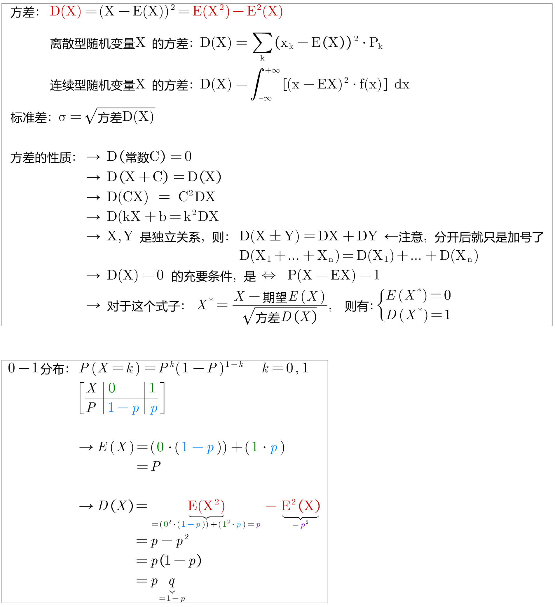

---

== 二项分布 stem:[ ① E(X)=nP, \ ② D(X)=np(1-p)]

[options="autowidth"  cols="1a,1a"]
|===
|Header 1 |Header 2

|伯努利试验
|"伯努利试验"的特点是：

1. 每次试验中, 只有两种可能的结果，而且两种结果发生与否, 互相对立，并且相互独立
2. 每次试验中, 事件发生的概率是相同的
3. 各次试验的事件, 相互之间独立

伯努利试验的例子有: 投硬币, 看其结果是正面还是反面. 应聘, 看其结果是成功还是失败. 生男孩或者生女孩.

|二项分布
|"二项分布"(binomial distribution), 就是在重复n次独立的"伯努利试验"(Bernoulli experiment)中，"所期望结果出现次数"的概率分布。

重复n次独立的伯努利试验, 就形成"二项分布"（比如, 高尔顿板）

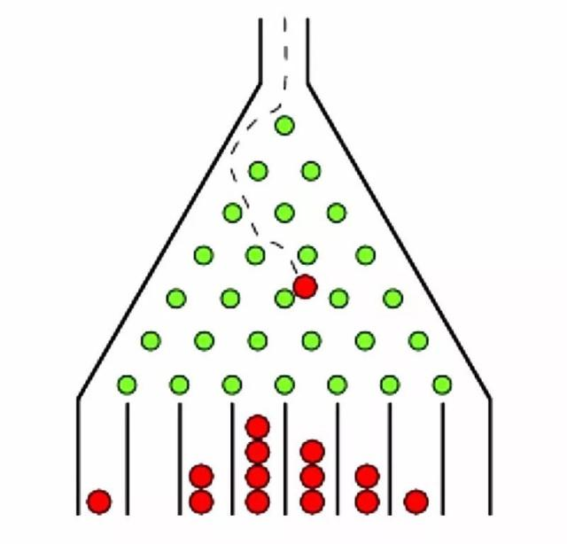

高尔顿板, 从入口扔下的小球, 撞上下面任何一个钉子，就像触网的乒乓球一样，弹向左边和右边的概率相等。 +
最上方只有一种可能。下降之后，左右两边比例变成1:1. +
继续这个步骤，第n行的"比例系数", 其实就是n次二项式的展开系数，或者表现为杨辉三角的第n行数值。

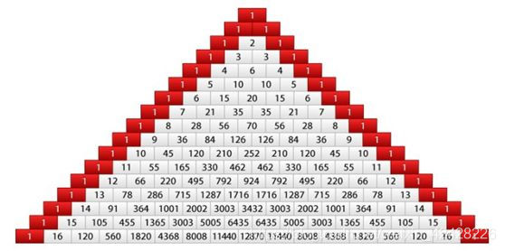

*上图的最底部一行中, 可以发现, 中间的数值最高(即小球落在中间的数量最多, 概率最高), 越往两边去,数值约低(即小球会落到最边上的数量最少, 概率最低).*

杨辉三角上的数字排列, 和高尔顿板上的数字排列, 是一样的.

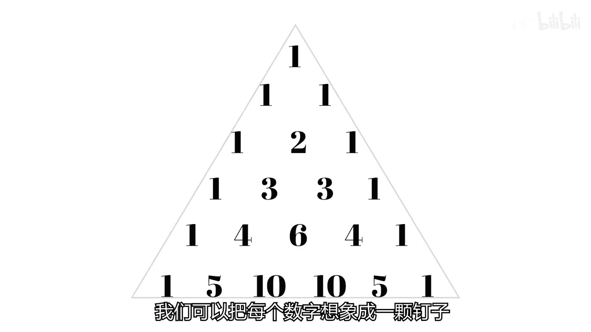

*数字, 就代表了小球要到达这一处的钉子, 一共有多少条可能的路线能够到达.* 比如, 第二行左边的数字1, 代表了小球要到达这里, 只有一条路线可走.

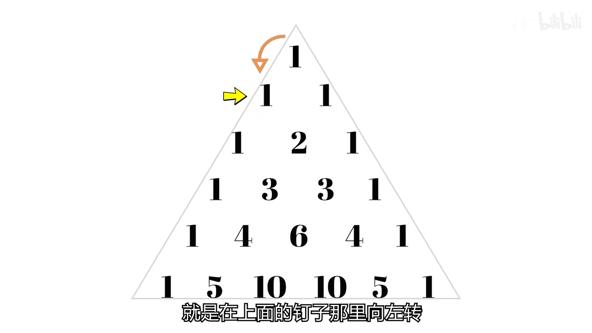

第三排的中间数字2, 代表到达这里, 能有两条路线可走.

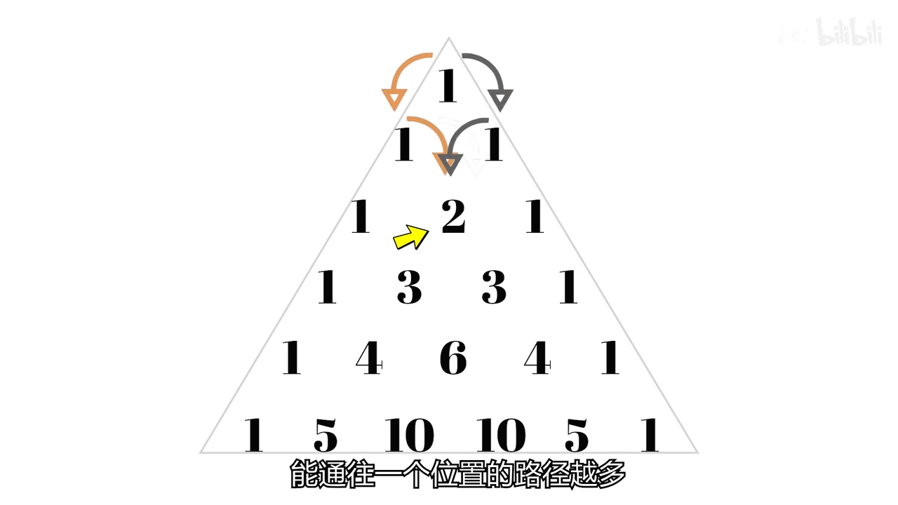

*能通往一个位置的路径越多, 自然就代表小球出现在这里的可能性越大.*

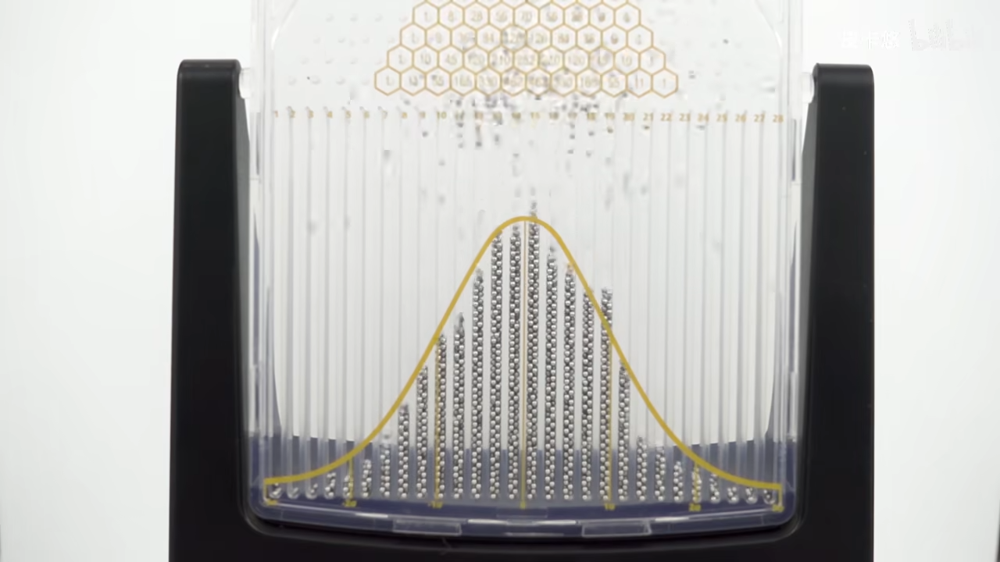

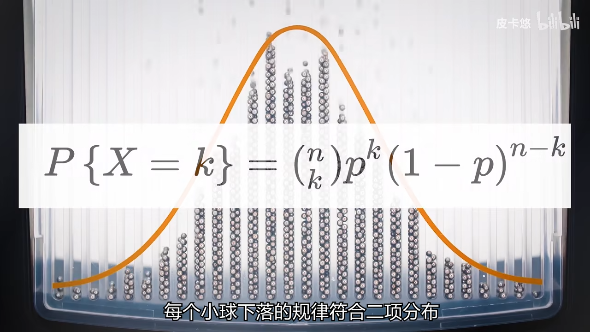

每个小球下落的规律, 是符合"二项分布"的.   +
所有小球下落后, 整体最终的结果, 是趋近于"正态分布"的.

如果随机变量X 服从二项分布, 则 n次试验中, 正好得到 k次成功的概率, 就能由"概率(质量)函数"给出:

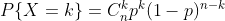

其中, k=0,1,...,n,   +
stem:[ C_n^k] 就是"二项式系数".

不同 n, k 参数下的"二项分布的概率函数f(x)", 如下图：

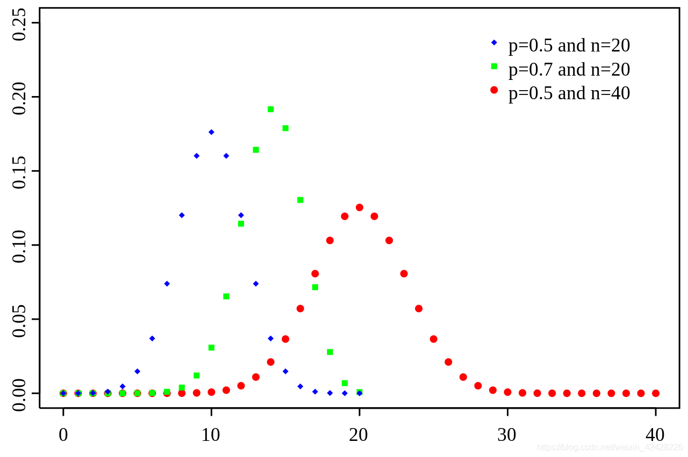

杨辉三角另一个特性, 是"二项式系数",

stem:[(x+y)^2 ] 展开后的系数, 刚好和杨辉三角 第二行的三个数字一样.

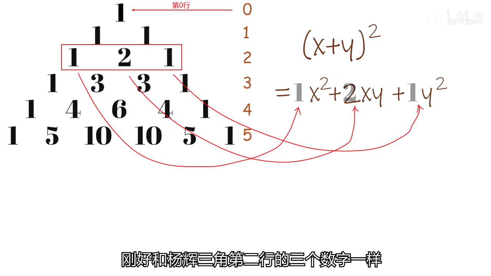

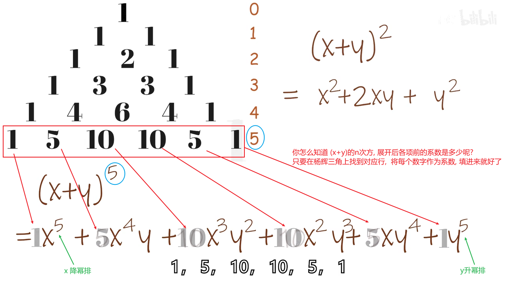
|===

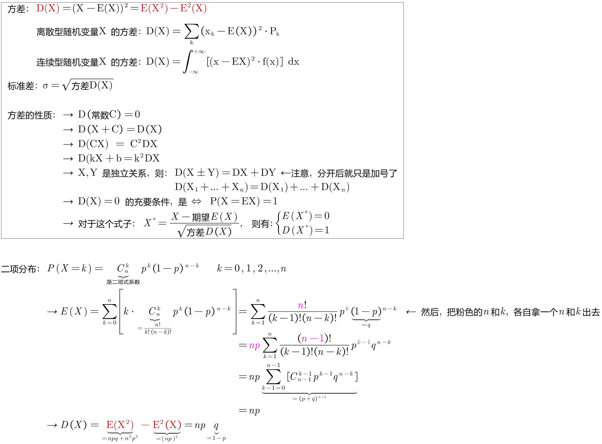

---

== 几何分布 (即"首次发生"分布) : stem:[ ① E(X)= 1/P, \ ② D(X)=\frac{1-p} {p^2}]

几何分布（Geometric distribution）是离散型概率分布。其中一种定义为：*在n次伯努利试验中，试验k次才得到第一次成功的机率。具体说就是：前 k-1次皆失败，在第k次时成功的概率。*

如, 射箭第几次能够正中靶心、有放回的情况下第几次能取到期望颜色的小球等等，求这种多次进行的试验下, 第几次能够达到想要的目的。

"几何分布"是"帕斯卡分布"当r=1时的特例。

在伯努利试验中，成功的概率为p，若 *X表示出现"首次成功时"的试验次数*，则 X 是离散型随机变量，它只取正整数，且有:

stem:[P(X=k)=(1-p)^{k-1} \cdot p]    +
其中, stem:[ k=1,2,...] +
这个式子的比较好理解，意为在失败(q)了 k-1 次之后，终于在第 k 次 迎来了成功(p)。

此时称: 随机变量X 服从几何分布. 记为: X～Geo(p）

比如, 如，某生产线上的产品不合格率为0.05，则首次查到不合格品时 的检查次数r, 就是满足几何分布的, 记为: r～Geo(0.05) 。

几何分布是"伯努利分布"的推广，不断重复伯努利试验，直到首次成功为止，*随机变量X 表示首次成功时, 已经完成的试验次数*，我们称 X 是一个服从"几何分布"的随机变量.

几何的期望 = 1/p， +
方差 = (1-p)/(p的平方)

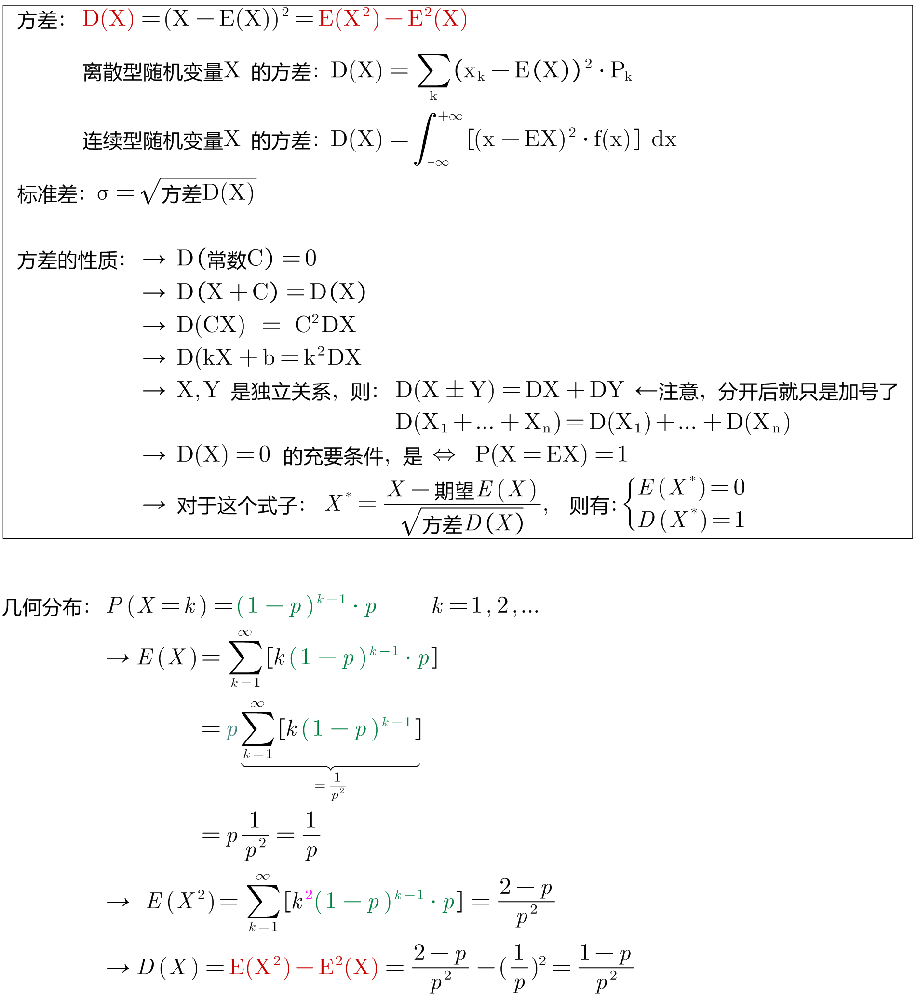

.标题
====
例如： +
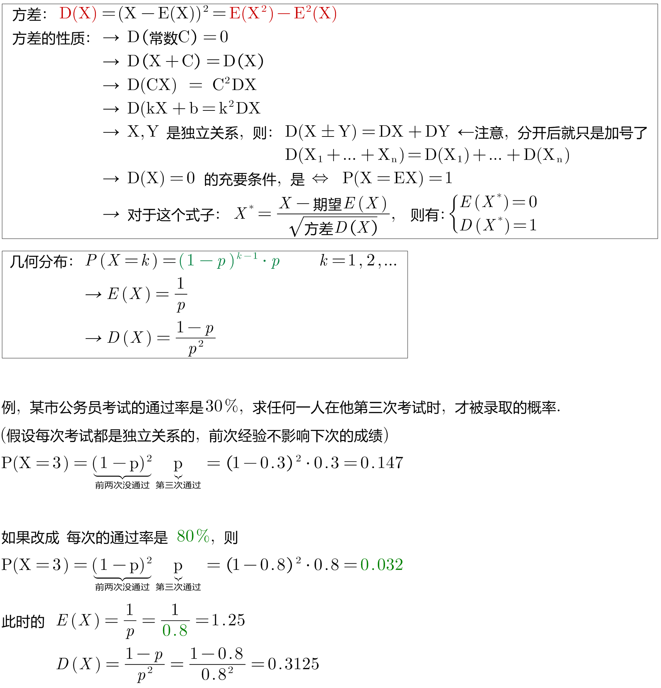

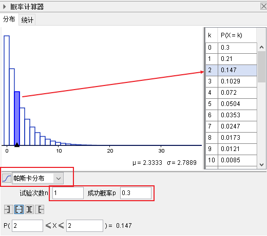

上图是递减的曲线, 说明每次是 30% 的通过率的话, 能上岸的概率还是很高的, 表明一个人会在最开始几次尝试就能通过, 几乎不可能考了十几次后还没通过. 正如上图曲线所示, 越往后, "不通过"的可能性越低.

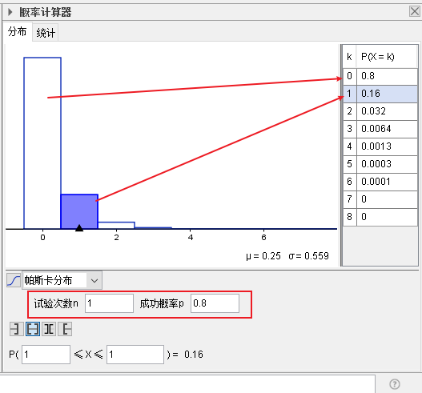

如上图, 如果改成 每次是 80%的通过率的话, 第一次考能上岸的概率是0.8,  第二次考才上岸的可能性, 迅速下降到 0.16, 同样可见你没有那么差的运气要考多次才能上岸.
====

为什么这个概率分布, 叫"几何分布"? +

比如, 现实中, 江苏的公务员考试, 录取比率大约是 1/50, 假设是2%的通过率. 则就有: +
第1次考就上岸的概率, 是2% +
第2次考才上岸的概率, 是1.96% +
... +

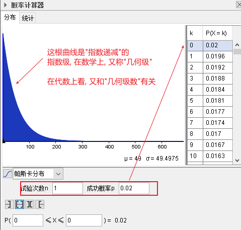

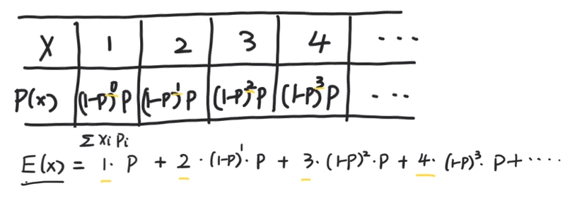

---

== 泊松分布 : stem:[ E(X)=  D(X)= λ]

泊松分布适合于描述: 单位时间, 内随机事件发生的次数。 如, 自然灾害发生的次数.

泊松分布的 概率(质量)函数为： stem:[ P(X=k)=\frac{λ^k} {k!} e^{-λ}] +
参数λ : 是单位时间(或单位面积)内, 随机事件的平均发生率. +
k: 为我们想要的事件发生的次数.

*即, 如果随机事件A发生的概率是p，进行n次独立的试验，恰巧发生了k次，则相应的概率, 就可以用上面的 泊松分布的"概率公式", 来计算.*

.标题
====
例如： +
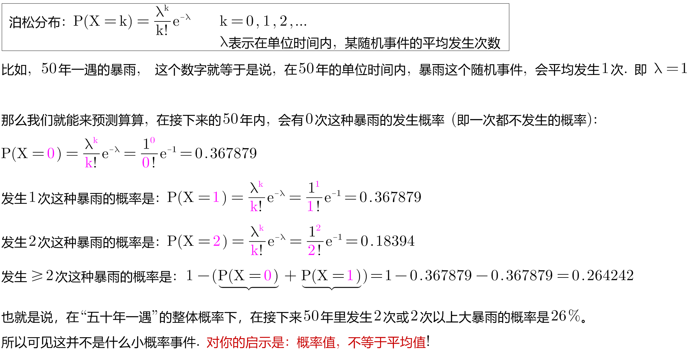

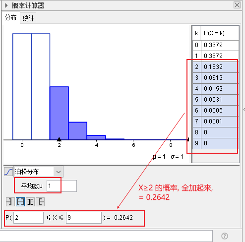
====

事实上, 泊松分布, 只是"正态分布"的一种微观视角。 比如, 在上面的大暴雨的案例中，如果我们不断地计算"各种时间间隔, 和大暴雨不同发生次数"的概率，把这些画在一起，你就会看到, 泊松分布的曲线, 越来越像"正态分布". 如下图：

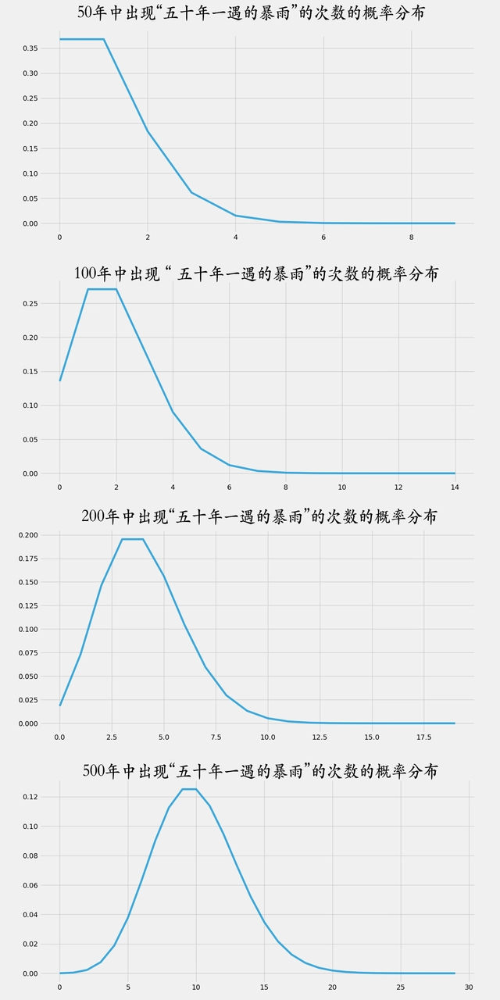

另外, 要注意, 泊松分布的间隔是随机的, 也是无记忆的。意思就是说: 之前的情况, 对之后的情况没有影响。

比如, 如果去年发生了一次大暴雨，那今年发生大暴雨的概率会变成多少？*一般人可能会觉得，既然大暴雨是平均50年才发生一次，之前发生过了，接下来一年就不会再发生了，概率是0。 但事实上, 下一场雨不会记得上一场雨发生的时间, 两场雨之间相互没有影响，即它们是“相互独立”的. 所以, 如果恰好它们短间隔又发生了，我们就会觉得这事好像扎堆出现了。*

*这带给我们什么启示呢? 由于随机性(存在"短间隔"可能性)的作用，在需要应对可能的危机时，我们在准备资源的时候，达到平均值还是不够的，需要的冗余要比你想的要大。*

比如考大学，你的水平是600分，正负20分的波动都在正常范围之内。那么如果你想要考600分水平的学校，就需要平时稳定地比分数线高出个20分。如果平时就是在600分上下浮动，还硬要报考600分的学校，我们可能会说这是有风险的。

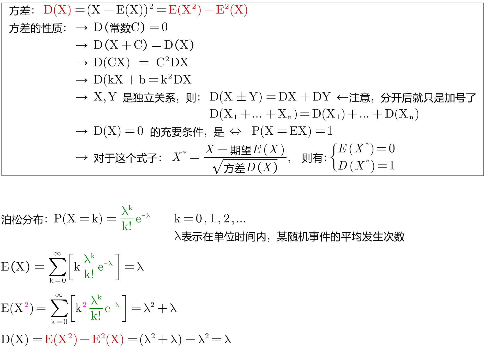

---
