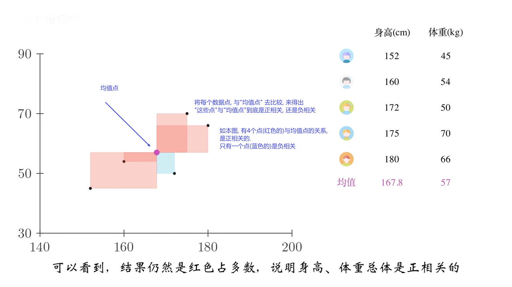
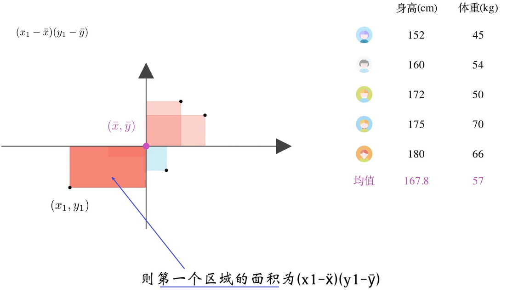
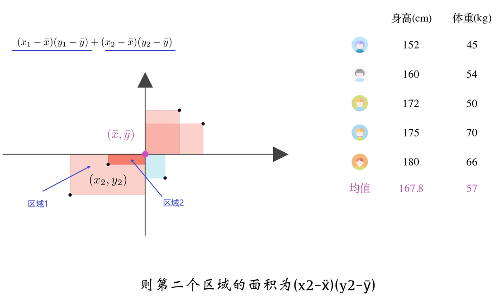
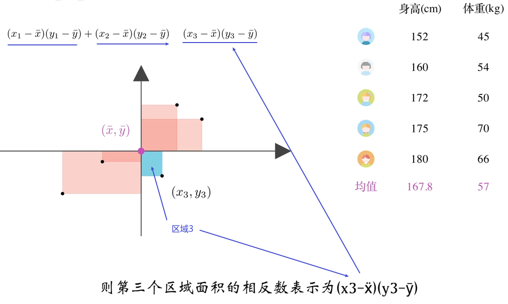
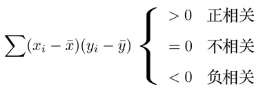
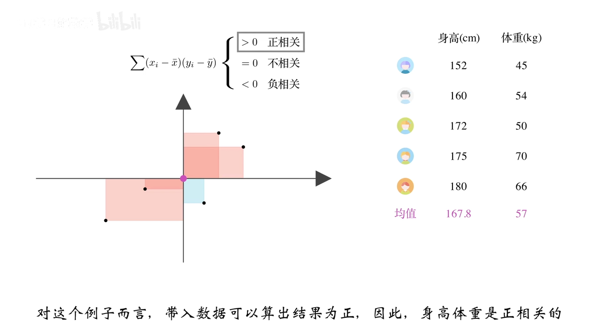
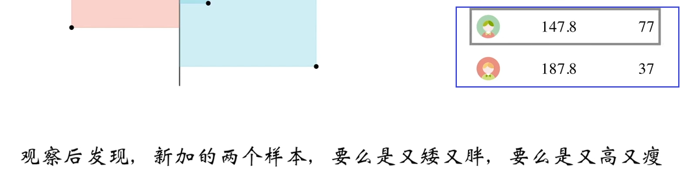
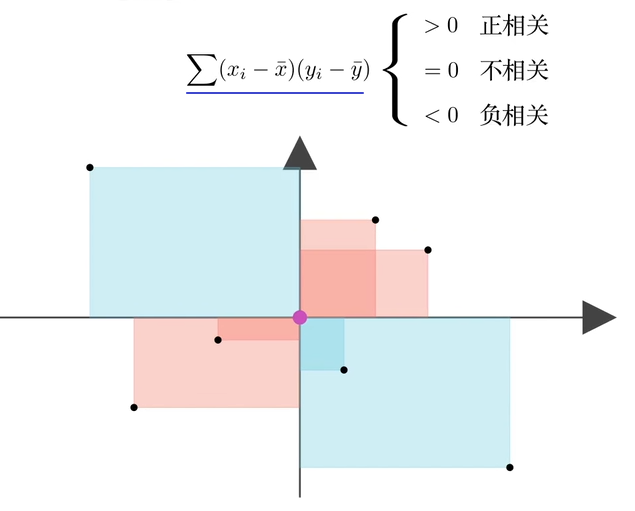
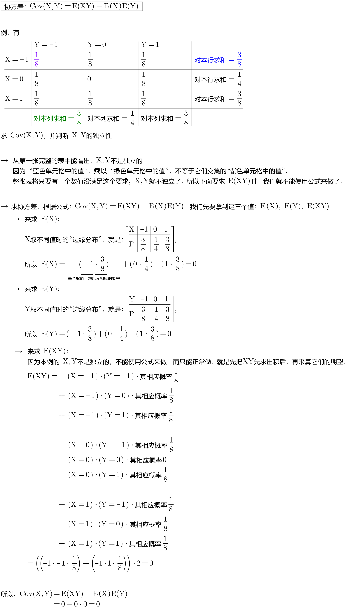

= 协方差 Covariance
:sectnums:
:toclevels: 3
:toc: left

---

== 协方差的几何意义

协方差, 就是用来描述两个随机变量的相关性.

[cols="1a,2a"]
|===
|Header 1 |Header 2

|随机变量的相关性, 可分为三种:

1. X,Y 正相关
2. X,Y 负相关
3. X,Y 无相关关系
|image:img/0356.png[,500]

|如果把坐标原点, 移到"均值点"处的位置, 就能很容易知道, 一,三象限是"正相关"的; 二,四象限是"负相关"的.
|image:img/0358.png[,]

|将"身高,体重表"中, 第一个样本点(第一行上的数据), 用 stem:[ (x_1, y_1)] 表示, 均值用 stem:[ (\overline(x), \overline(y))] 表示.  则, 第一个区域的面积, 就 stem:[= (x_1 - \overline(x)) \cdot  (y_1 - \overline(y)) ]
|

|同理, 把其他的面积也加上去
|

最终, 我们就是让 所有"正相关的红色区域面积", 减掉 "负相关的蓝色区域面积".

image:img/0362.png[,]

将上面这个式子, 用连加符号 Σ 改写成如下图, 则通过其的结果值, 就能知道 X,Y 两个数据点, 到底是何种相关关系了 : +

|不过, 上面的还不是"协方差"
|我们再加入两个样本点, 此时, 蓝色总面积, 大于红色总面积, 得出的结论是变成了"负相关"?

image:img/0365.png[,]

原因是, 新加入的两个样本点, 在现实中, 出现的概率极低. +
所以, 我们还需考虑概率问题, 即必须对每个样本点, 加入"权重分". 来重新得到"加权平均数".

然后将坐标原点, 移动到"加权平均值"的位置.  +
同时, 连加公式里的"均值", 也要替换成"加权平均值".

image:img/0368.png[,]

所以, 通过下面这个式子, 我们就能判断出随机变量的"相关性"了. +
stem:[ \sum p_i (x_i - μ_X) (y_i - μ_Y)]

这个式子, 可以改写为"期望"的形式, 就是: +
stem:[ E((X-μ_X)(Y-μ_Y)) = Cov(X,Y) ]  ← 这就是"协方差"公式. 里面的 stem:[μ_X = E(X)], 即X的期望. 同样,  stem:[μ_Y = E(Y)]
|===

---

== 协方差 Covariance : stem:[ Cov(X,Y)= E(XY)-E(X) \cdot E(Y)]

....
Covariance  /koˈve-rɪəns/

N a measure of the association between two random variables, equal to the expected value of the product of the deviations from the mean of the two variables, and estimated by the sum of products of deviations from the sample mean for associated values of the two variables, divided by the number of sample points. Written as Cov (X, Y) 协方差
....

"方差"和"标准差", 是用来度量数据的离散程度的. 但它们只能用来描述一维数据的（或者说是多维数据的一个维度）. 而现实中, 我们常常会碰到多维数据，因此人们发明了"协方差"（covariance），用来度量两个随机变量之间的关系。

"协方差"如果为正值，说明两个变量的变化趋势一致； +
如果为负值， 说明两个变量的变化趋势相反； +
如果为0，则两个变量之间"不相关"（注意：协方差为0不代表这两个变量相互独立。 "不相关"指的是两个随机变量之间没有近似的线性关系; 而"独立"是指两个变量之间没有任何关系）。

但是"协方差"也只能处理二维关系，如果有n个变量X1、X2、···Xn，那怎么表示这些变量之间的关系呢？解决办法就是把它们两两之间的协方差, 组成"协方差矩阵"（covariance matrix）。

image:img/0354.png[,]

回到协方差, 它的定义是: stem:[ Cov(X,Y)=E\[ (X-EX)(Y-EY)\]=E(XY) - E(X) \cdot E(Y)]

.标题
====
例如： +

====

.标题
====
例如： +
image:img/0418.png[,900]
====

---

== 协方差的性质

=== stem:[Cov(X,Y) = Col(Y,X)]

===

https://www.bilibili.com/video/BV1ot411y7mU?p=56&vd_source=52c6cb2c1143f8e222795afbab2ab1b5

16.24
