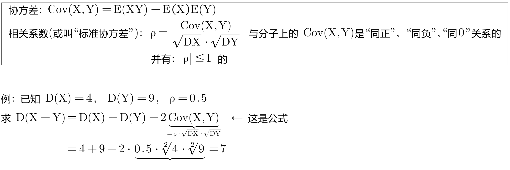
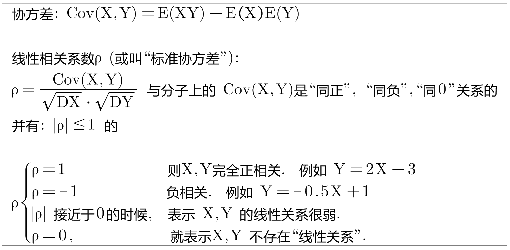
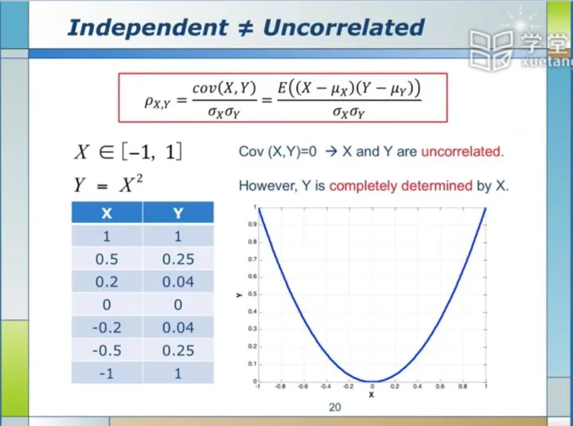

= 相关系数 Correlation coefficient
:sectnums:
:toclevels: 3
:toc: left

---

== 相关系数 Correlation coefficient

.标题
====
例如： +

====

|ρ|=1 的充要条件是: X,与Y 以概率P=1 成"线性关系". 即: stem:[ P(Y=aX+b)=1]

---

== 不相关 & 独立关系

[options="autowidth"]
|===
|X,Y 不相关 |X, Y 是独立关系

|指"线性关系"上不相关. +
这里“不相关”的“相关”, 指的是"线性相关性"，"相关性"除了"线性相关性"之外, 还有"非线性相关性".

|指没有任何关系, 包括"线性上"的关系, 和 "非线性上"的关系. 所以, "独立"的, 一定就是"不相关"的.
|===

独立：没有任何关系. +
不相关：没有线性关系. +
没有任何关系, 就一定也没有线性关系.  但是反过来, 没有"线性关系", 则不一定没有"其他的关系"。

如下图, X和Y肯定不是独立的（Y＝X^２,即Y完全由X确定），但经过计算X与Y线性无关.

https://www.bilibili.com/video/BV1ot411y7mU?p=57&vd_source=52c6cb2c1143f8e222795afbab2ab1b5

24.45
