= 大数定律
:sectnums:
:toclevels: 3
:toc: left

---

== 大数定律 Law of Large Numbers

大数, 即"大量重复试验" 它们的平均结果 (主要指"期望"), 具有稳定性.

大数定理简单来说，指得是: 某个随机事件在单次试验中可能发生也可能不发生，但在大量重复实验中, 往往呈现出明显的规律性，即该随机事件发生的频率, 会向某个"常数值"收敛，该"常数值"即为该事件发生的概率。

另一种表达方式为: *当样本数据无限大时，"样本均值"趋于"总体均值".*

因为现实生活中，我们无法进行无穷多次试验，也很难估计出总体的参数。大数定律告诉我们, 能用"频率"近似代替"概率"；能用"样本均值"近似代替"总体均值". 这个定律就帮我们很好得解决了现实问题。

大数定理严格的数学定义分为两种，一是**"弱大数定理"：即"样本均值"会随着n的不断增大，"依概率收敛"**（简称i.p.收敛 converge in probability,）到真正的总体平均值。

*什么叫"依概率收敛"呢？意思是，当n越来越大时，随机变量x落在 (c-ε, c+ε) 外的概率, 趋近于0. 即还是有可能落在外面的，只不过可能是很小，且会随着n的增大，这种可能越来越小。*

二是**"强大数定理"：**我们仍可这样定义，*只不过这里不再是"依概率收敛"，而是几乎必然收敛*(简称a.s.收敛converge almost surely)，*可以理解为此时 p=1，以确定的为1的概率收敛，即没有x会落在
（c−ε，c+ε） 外面，就算有，这些点在测度下也是可以“忽略”的。*

*弱大数定律证明了：随着n的增大，"平均值"接近"真实期望值"的可能性也在增大。* +
*强大数定律证明：随着n的增大，"平均值"基本上就接近"真实期望值"了。*

---

== 依概率收敛

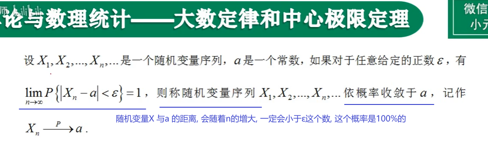

*记住: ε 是一个极小的正数 (无论它多么小). 相当于说, ε是一个无穷小的数.*

*"两个数的差"的绝对值, 意思就是这两个数的距离! 即它们相隔有多远*

---

== 伯努利大数定律

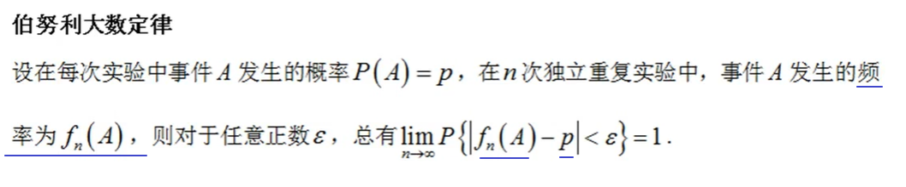

所谓"频率", 是指: 在相同的条件下，进行了n次试验，在这n次试验中，事件A发生的次数m, 就称为事件A发生的频数。比值 stem:[ m/n] 称为事件A发生的频率。

比如, 你射击的理论命中概率, 是0.9: +
10次射击, 打中8次, 频率就是 8/10 +
100次射击, 打中92次, 频率就是 92/100 +
1000次射击, 打中916次, 频率就是 916/1000 +
随着你射击次数(即 重复试验次数n)的增加 (n -> ∞), 大数定律就会显示出其作用, 你的命中"频率"会越来越接近与你的实际命中"概率".

但我们实际生活中, 没有人能对一件事重复很多次 (比如高考, 考公等), 更谈不上 n -> ∞次, 所以, "大数定律"就不会展现在你身上. 你得到的结果, 就可能是和你的"均值, 期望值μ" 会偏离很远的.

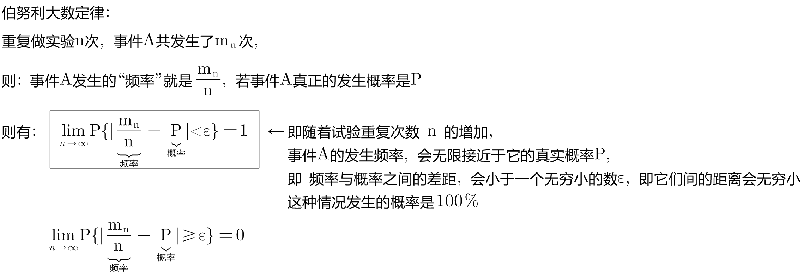

该定律其实是"切比雪夫大数定律"的特例，其含义是，当n足够大时，事件A出现的"频率", 将几乎接近于其发生的"概率"，即频率的稳定性。

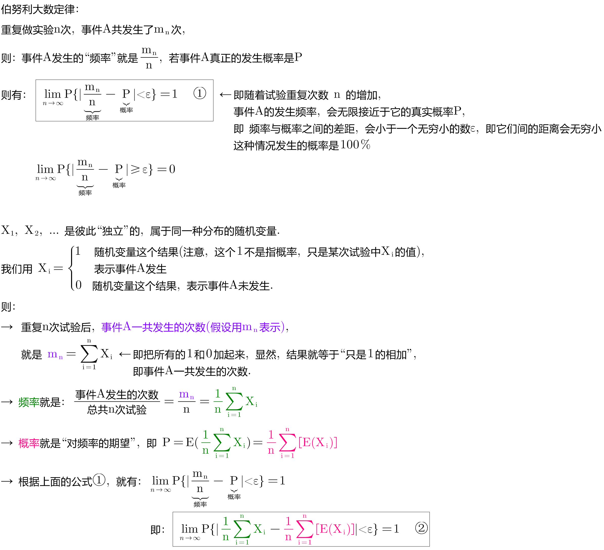

---

== 切比雪夫不等式 chebyshev's theorem

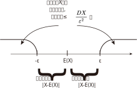

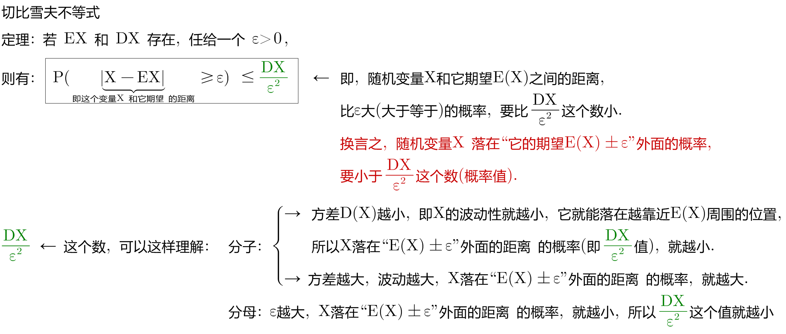

.标题
====
例如： +
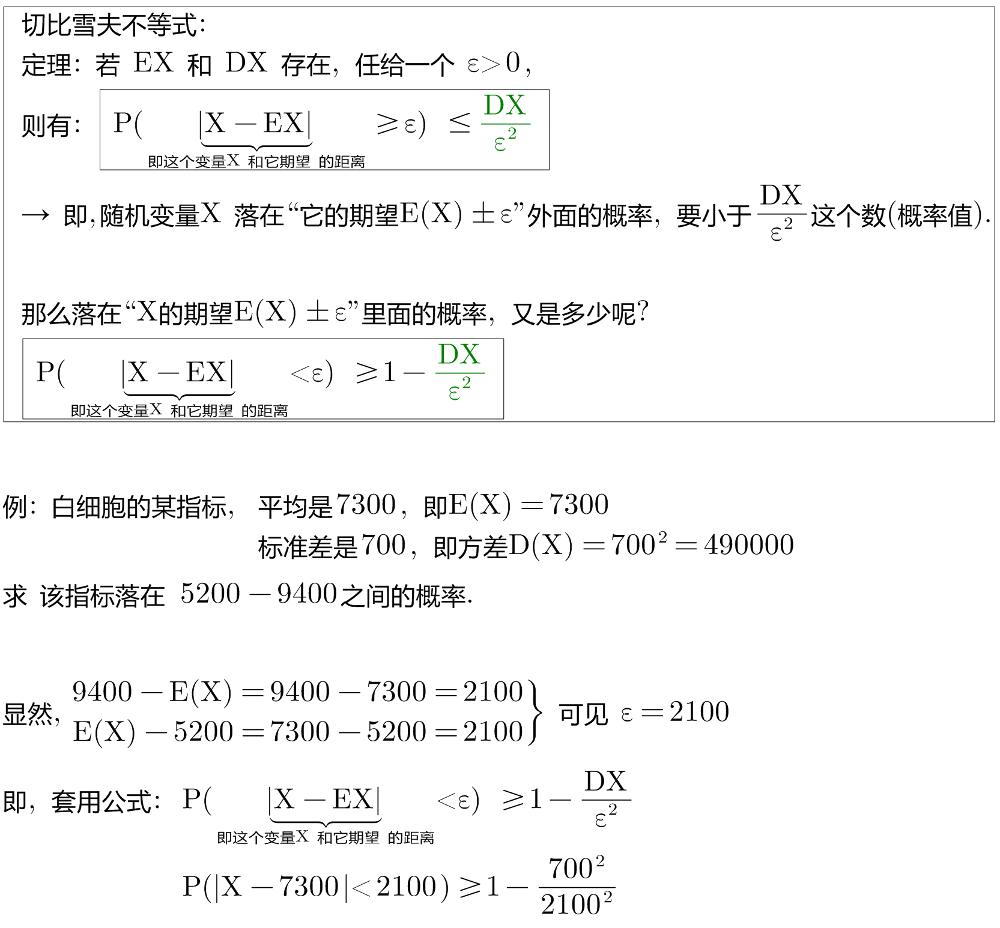

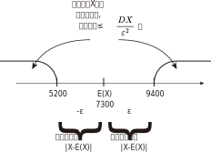
====

.标题
====
例如： +
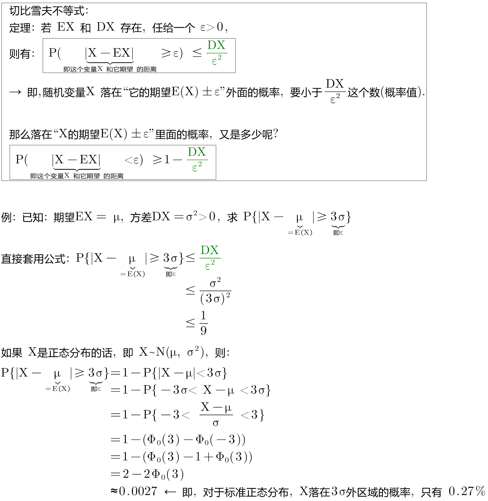

====

---

== 切比雪夫大数定律

*"切比雪夫大数定律"是指，假设存在 n个相互独立的随机变量，当n 趋近于无穷时，这n个随机变量的"平均值", 也会趋近于这n个随机变量"期望"的"平均值".*

切比雪夫大数定律, 相比起一般我们听到的大数定律更一般，不仅能够解释"独立,同分布"随机变量的大数定律，也能够解释"独立,但不同分布"随机变量的大数定律。

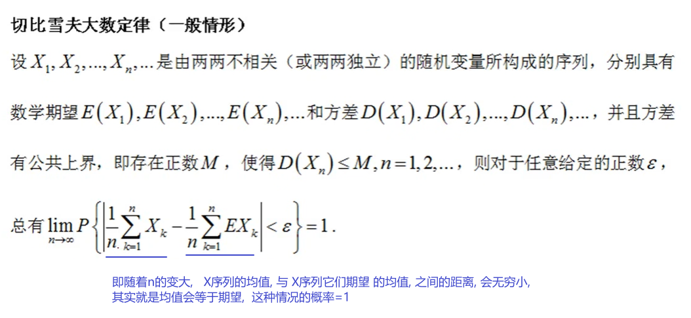

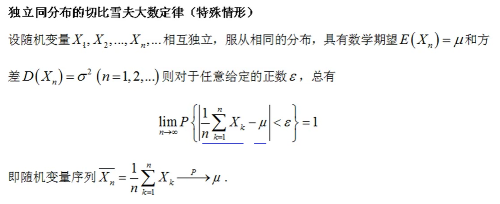

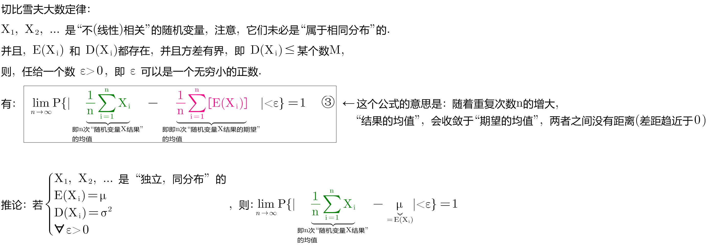

---

== 辛钦大数定律

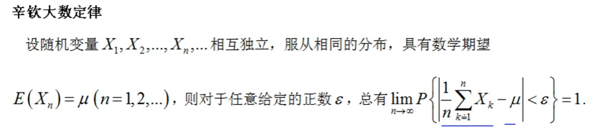

"辛钦大数定律", 和"切比雪夫大数定律"的区别是, 前者没有提到 stem:[ σ^2].

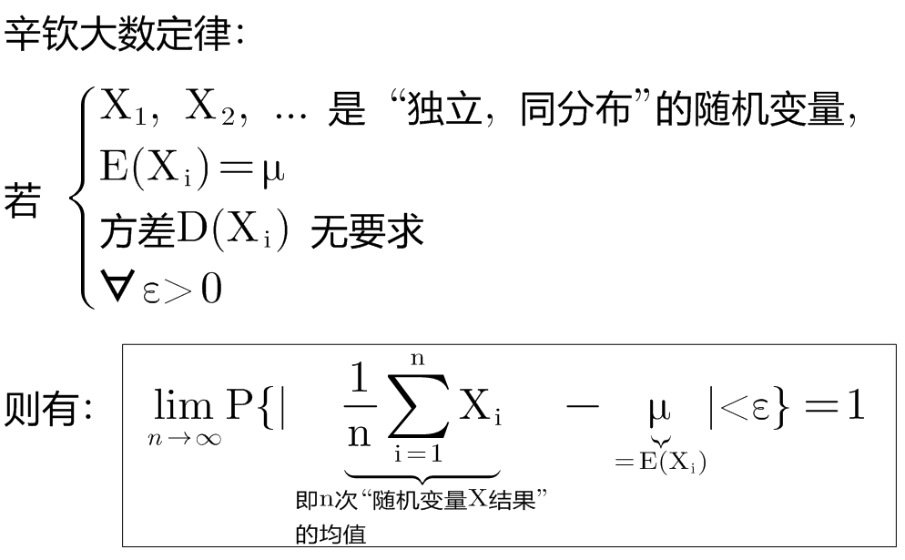

---

---

https://www.bilibili.com/video/BV1ot411y7mU?p=59&vd_source=52c6cb2c1143f8e222795afbab2ab1b5

44.15

