= 中心极限定理
:sectnums:
:toclevels: 3
:toc: left

---

== 中心极限定理 central limit theorem

*"大数定律"说的是当随机事件重复多次时, 频率具有稳定性，即: 随着试验次数的增加，事件发生的频率, 趋近于预期的“概率”。*  +
"大数定律"揭示了大量随机变量的平均结果，但没有涉及到随机变量的"分布"的问题。

而"中心极限定理"说明, 如果一些现象受到"大量相互独立的随机因素"的影响，并且如果每个因素所产生的影响都很微小时， 则: *"中心极限定理"指的是: 给定一个任意分布的总体。我每次从这些总体中随机抽取 n 个抽样，一共抽 m 次。 然后把这 m 组抽样分别求出平均值。 这些平均值的分布, 接近"正态分布"。*

例如: **我们要统计全国的人的体重，看看我国平均体重是多少。**当然，我们把全国所有人的体重都调查一遍是不现实的。所以**我们打算一共调查1000组，每组50个人。 然后，我们求出第一组的体重平均值、第二组的体重平均值，一直到最后一组的体重平均值。"中心极限定理"说：这些平均值是呈现"正态分布"的。并且，随着组数的增加，效果会越好。 最后，当我们再把1000组算出来的平均值加起来, 取个平均值，这个平均值会接近全国平均体重。**

其中要注意的几点：

1. 总体本身的分布, 不要求正态分布 +
上面的例子中，人的体重是正态分布的。但如果我们的例子是掷一个骰子（平均分布），最后每组的平均值, 也会组成一个"正态分布"。（神奇！）

2. 样本每组要足够大，但也不需要太大 +
*取样本的时候，一般认为，每组大于等于30个，即可让"中心极限定理"发挥作用。*

*中心极限定理定义：设从均值为μ、方差为 stem:[ σ^2], (有限)的任意一个总体中, 抽取样本量为n的样本，则: 当n充分大时，样本均值的抽样分布, 会近似服从"均值为μ、方差为 stem:[ σ^2/n] 的正态分布.*

中心极限定理是指，给定足够大的样本量，无论变量在总体中的分布如何，变量均值的抽样分布都将近似于正态分布。详细来讲，给定一个任意分布的总体，从这个总体中抽取n个样本，总共随机抽取m次，计算这m次的样本的平均值，*则这些平均值的分布是正态分布，并且这些平均值的均值, 近似等于总体均值，平均值的方差为总体方差除以n。*

在这里，要把握以下关键点，

第一，总体的分布是任意的，可以是卡方分布，可以是指数分布，可以是均匀分布，可以是……. +
第二，从总体中要抽n个样本，总共要抽m次，这里的m和n都要求越大越好”。 +
第三，这m次样本的平均值的分布是正态分布，这种分布叫做抽样分布。 +
第四，这些样本平均值的均值是近似为总体均值，也就是说，求两次均值。

中心极限定理一个很重要的用途, 就是根据样本均值来估计总体均值。

举个例子，你现在要调查你们整个学校学生的政治成绩，要计算学生政治的平均成绩。你要是去收集每个学生的成绩，然后加总，再除以学生总数，整个工作力度很大，成本也很高。这时候中心极限定理就派上用场了，你先从校园中随机的抽取50个人，然后计算这50个人的平均成绩，记为x1,然后再随机的抽取的50个人，计算平均成绩，记为x2，一直这样随机的抽取，到最后进行了m次，记为xm；中心极限定理说的是x1,x2,x3……xm,它们的分布是正态分布，它们的均值就是该校学生政治的平均成绩。

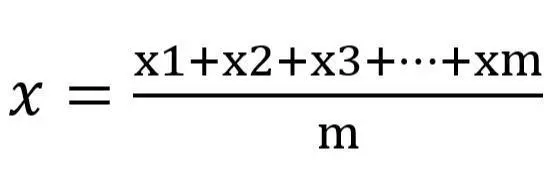

样本平均值的均值计算公式

.标题
====
例如： +
某学校5000名学生, 平均成绩是保密的(其实平均分=137.41分), 但允许你进行抽样来做推测, 即, 你可以计算样本的均值 (stem:[ \overline{X}=\frac{\sum (X_i)} {n}]), 来估计总体的平均值μ.

首先, 我们每次抽样5个学生的成绩, 计算出平均数, 标识在坐标轴上.  共进行1000次抽样.

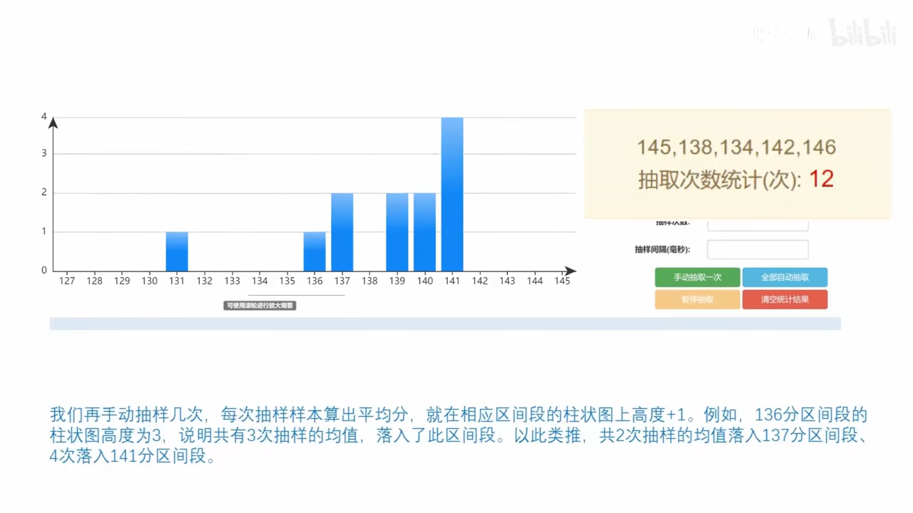

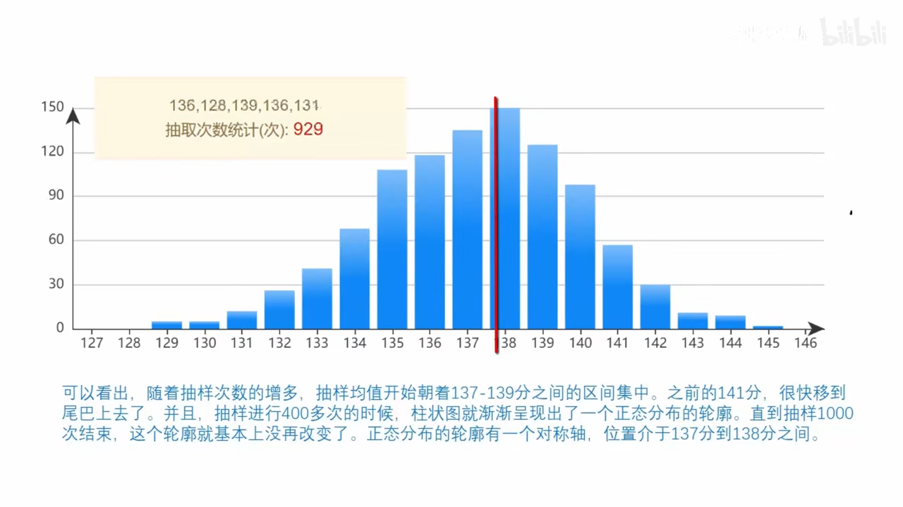

下面, 我们把每次抽样的样本容量, 改成20人. 再来进行1000次抽样.

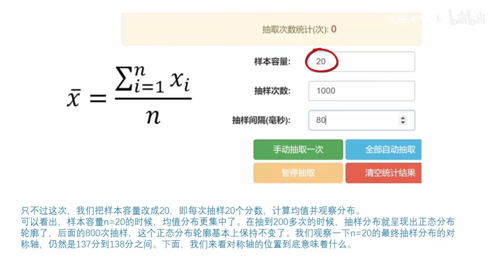

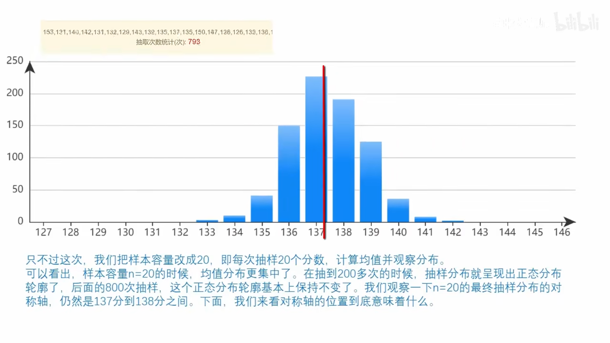

可以看出, 我们两次试验, 得到"正态分布"曲线的"对称轴"所在位置, 正是总体5000人的平均分数!

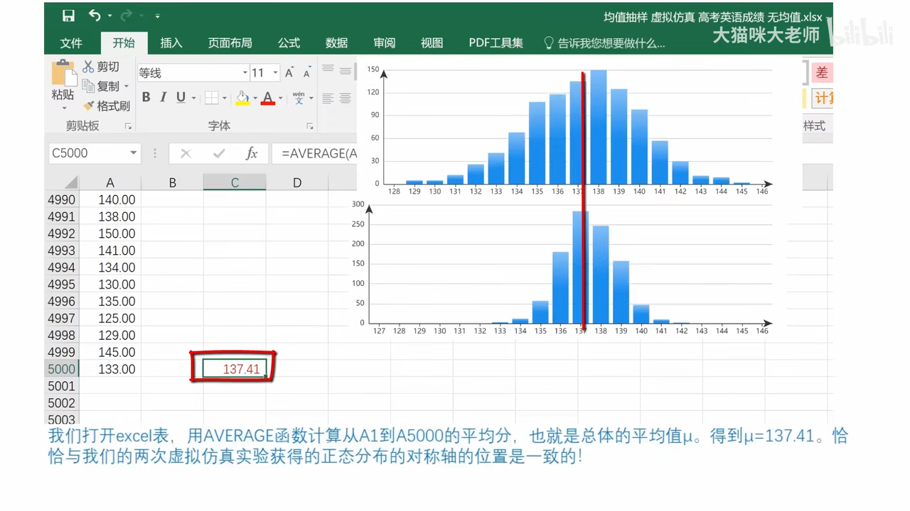

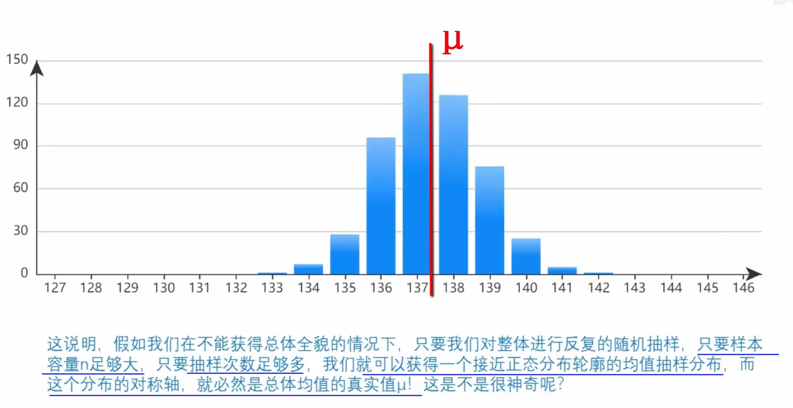

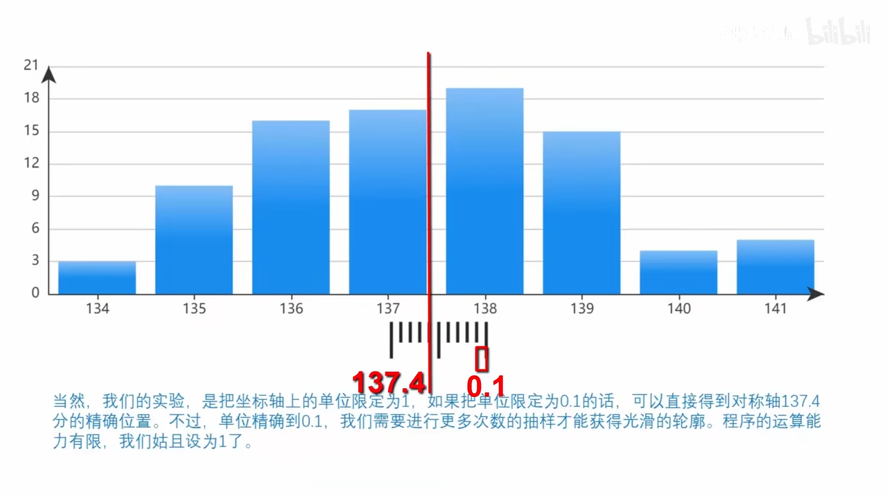

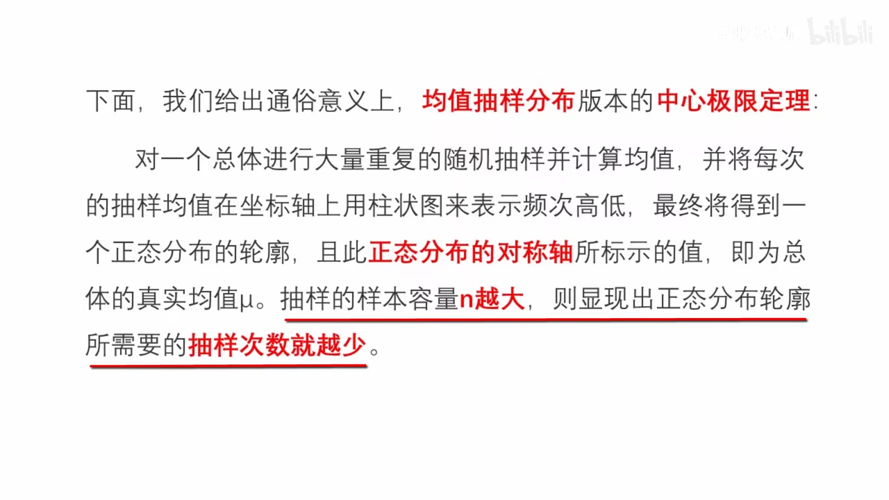

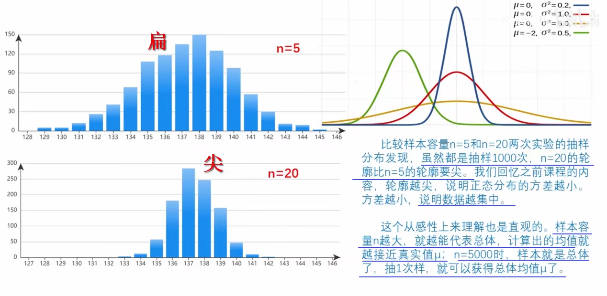

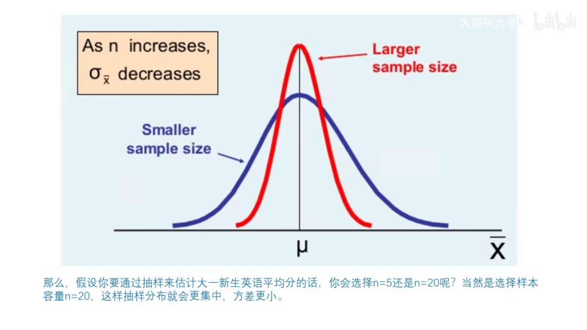

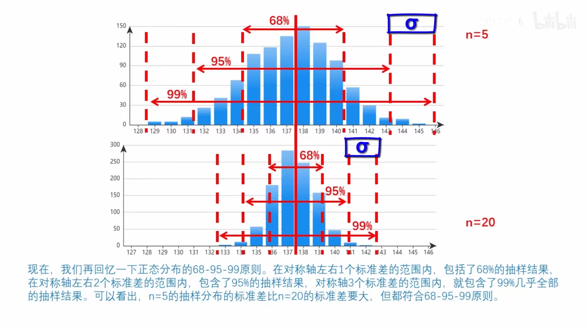

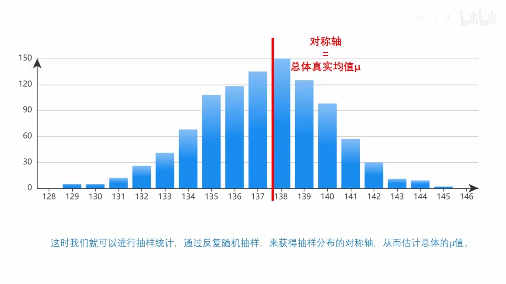

如果我们无法多次抽样, 只能抽样1次, 该怎么处理呢?

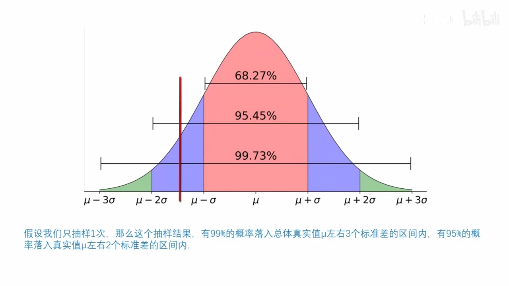

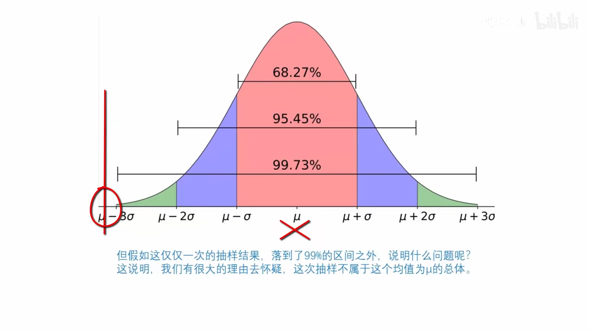

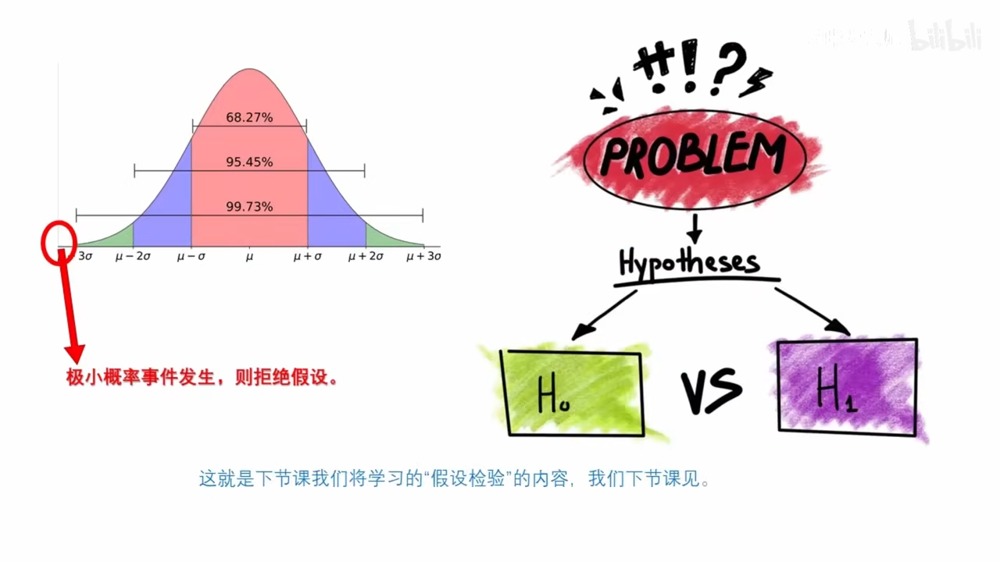
====

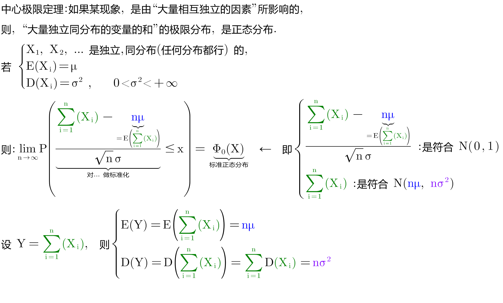

https://www.bilibili.com/video/BV1ot411y7mU?p=60&vd_source=52c6cb2c1143f8e222795afbab2ab1b5

11.10

---

== 棣莫佛－拉普拉斯定理 De Moivre-Laplace

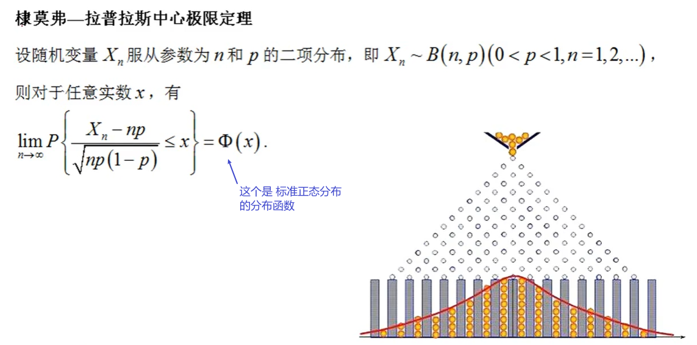

换言之,

---

== 林德贝尔格定理 De Moivre-Laplace

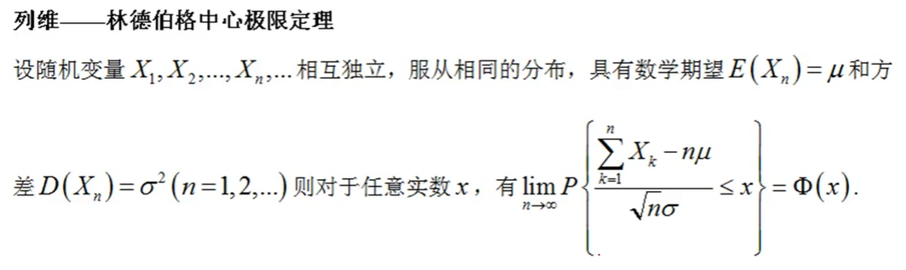

