= 总体与样本
:sectnums:
:toclevels: 3
:toc: left

---

== 概率论 & 数理统计 的关系

联系: 它们都以"随机现象"为对象, 研究其统计规律性.

区别:主要体现在研究方法上: +
-> "概率论": 是在已知随机变量服从某种分布（概率函数、概率密度、分布函数）的情况下，研究随机变量分布的性质，数字特征和它的应用.  +
-> 数理统计: 是通过对样本的数据分析, 来推断其母体的数据规律.

换言之, 数理统计是前提, 人们从中得出的数据规律, 之后才作为概率论的前提知识.

概率论, 我们总是假设随机变量的分布是"已知"的, 再来求其期望, 方差等. 但是, 如果该随机变量的分布是"未知"的(或分布中含有"未知参数"), 那我们如何来推断出这个随机变量的分布, 或其性质和特征呢? 这就是数理统计能做的.

数理统计中, 推断的方法, 可分为两类:

[options="autowidth"]
|===
|Header 1 |Header 2

|1.参数估计
|对分布中的"未知参数", 进行估计.

|2.假设检验
|根据数据，对分布中的"未知参数"的"某种假设", 进行检验．
|===

---

== 总体 & 样本

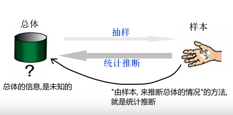

[options="autowidth"]
|===
|Header 1 |Header 2

|X
|所研究对象的全体, 称为总体.

*实际上，我们关心的是总体或个体的"某项数量指标"*，比如, 某批钢筋的强度以及每根钢筋的强度. 所以有时也将"总体"理解为"所研究对象的'某项数量指标'的全体". 用随机变量X表示.

所以, 当我们说到总体、个体和样本时,既指"研究对象", 又指"它们的某项数量指标".

既然总体是一个随机变量X，那它就能分成"离散型数据"的总体, 和"连续性数据"的总体.

并且, 该随机变量X, 就有其"概率分布 f(x)"，故X的分布函数, 称为总体的分布函数.

|stem:[ X_1, X_2, ... X_n]
|
由于抽样的目的是为了推断总体，为了使抽取的样本能很好地反映总体，必须考虑抽样方法.

即: 抽样得到的样本, 要有三个特点: +
1) 随机性:每个个体, 有同等机会被抽取到. +
2) 代表性:每次取出的样本, 与总体有相同的分布. +
3) *独立性: 即从总体中抽取的每个个体, 对其他个体的抽取, 无任何影响。*

具有以上特点的样本抽取方法, 称为"简单随机抽样". 由此得到的样本, 称为"简单随机样本".

从总体中抽取若干个体 stem:[ X_1, X_2, ... X_n], 称为来自总体X的"一个样本". +
如, 为了获得学校总人数的身高分布情况, 就从学校总体中, 抽取100人, 来检测其身高. 这个样本容量就是100人, 每个人分别就是 stem:[X_1=张三, ..., X_{100}=王五]

注意: 样本中的各个元素(即个体), 应该满足: +
(1): stem:[ X_1, X_2, ... X_n] 相互独立 +
(2): stem:[ X_1, X_2, ... X_n] 这每个个体, 与总体X, 应该要服从同样的分布.

即: 各个元素, 因满足: "独立,同分布".

|n
|为"样本的容量", 即样本中个体的数量是多少.

从总体中抽取一个个体, 检测其数量指标, 就是做一次随机试验. 抽取n个个体, 检测其数量指标, 就是做n次随机试验，得到容量为n的样本.

因为抽取是独立的随机的，故n个样本, 可看做n个相互独立的随机变量 stem:[ X_1, X_2, ... X_n],，且与总体X 服从相同的分布.

于是, 容量为n的样本, 可以用与"总体X" 同分布的 n个独立随机变量 stem:[ X_1, X_2, ... X_n]表示.

即: **stem:[ X_1, X_2, ... X_n] 是来自总体X的样本, 就是说: 我们对总体X, 进行了n次重复独立观测.**

|stem:[ x_1, x_2, ... x_n]
|为样本stem:[ X_1, X_2, ... X_n]的一组具体取值, 也称为"样本的观察值". +
比如, 100人容量的一个样本, 每个人的身高的具体值, 是 stem:[x_1=1.7米, x_2=1.68米, ... x_100=1.72米]

对总体X进行一次抽样, 并观察后，得到样本  stem:[ X_1, X_2, ... X_n] 的确切数值 stem:[ x_1, x_2, ... x_n],称为"样本观测值"(简称"样本值").

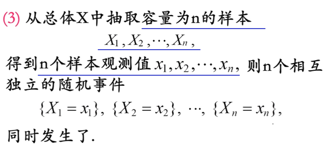
|===

---

== 联合分布函数  F(x,y,z,...) : joint distribution function

实际生活中, 一个随机现象, 常常需要同时用"几个随机变量"去描述. 我们称 n个 随机变量 stem:[ X_1, X_2, ... X_n] 的总体 stem:[ X=(X_1, X_2, …, X_n)] 为 "n维随机变量"(或n元随机变量)，或称"n维随机矢量"。

[options="autowidth"]
|===
| |联合分布函数(又称: 多维分布函数)

|是二元变量的话:
|设（X，Y）是二维随机变量，x，y是任意实数. +
二维随机变量(X，Y)的分布函数，或称为X和Y的"联合分布函数", 就是这个二元函数 :

stem:[ F(x,y)=P({X≤x ∩ Y≤y})=P(X≤x,Y≤y)]

将二维随机变量（X，Y）看成是平面上随机点的坐标，分布函数 F（x，y）在（x，y）处的函数值, 就是随机点（X，Y） 落在如图以（x，y）为顶点而位于该点左下方的"无穷矩形区域"内的概率。

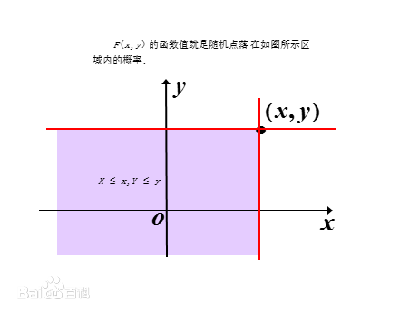

同理, 随机点（X，Y）落在矩形区域  的概率为:

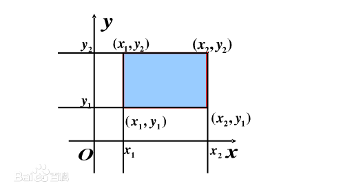

|n维随机变量
|n维随机矢量 stem:[ X=(X_1, X_2, …, X_n)]的联合分布函数, 是:

n元函数：

*它表示事件 stem:[ X1<x1, X2<x2, …, X_n<x_n] 同时出现的概率。*
|===

样本  stem:[ X_1, X_2, ... X_n]  的分布, 与总体X的分布, 会有怎样的关系呢?

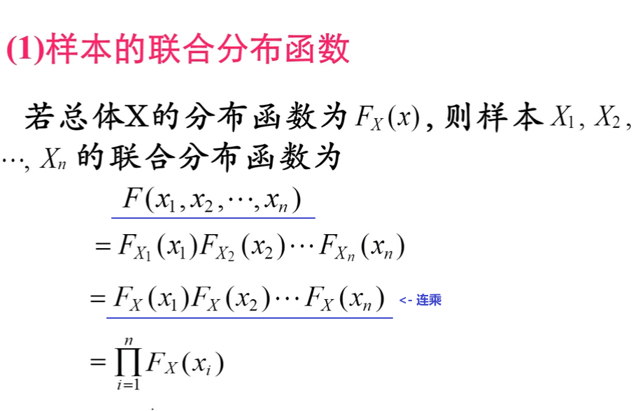

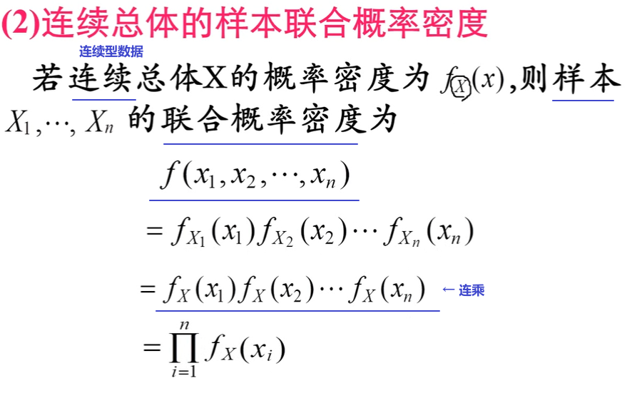

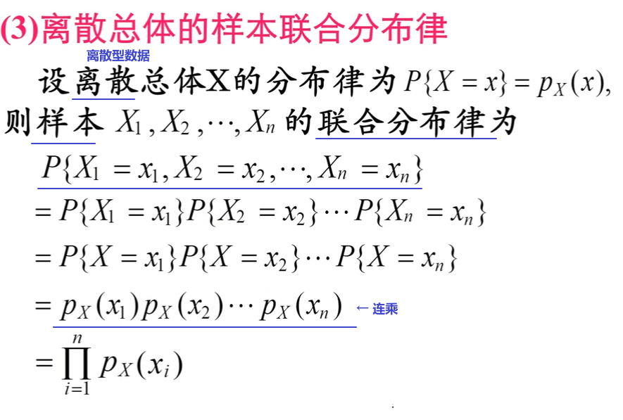

.标题
====
例如： +
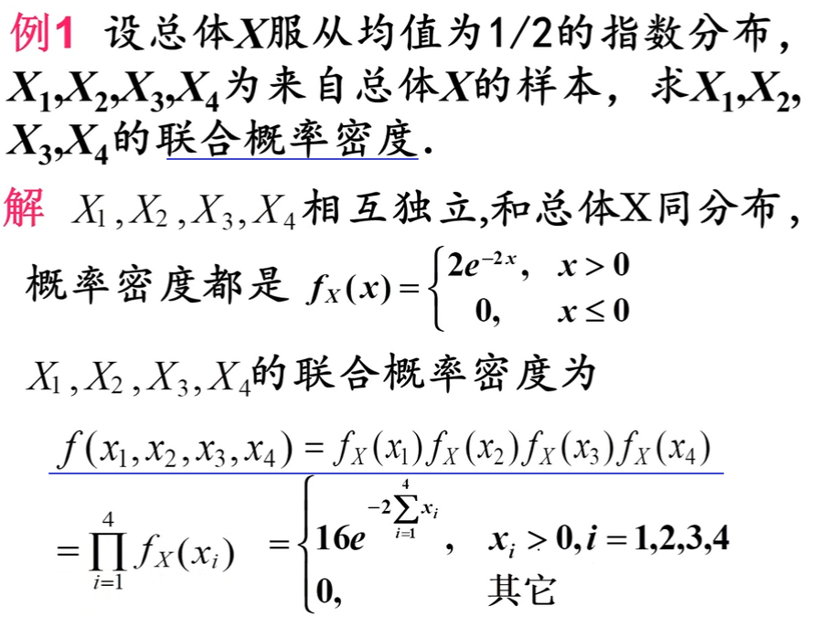
====

.标题
====
例如： +
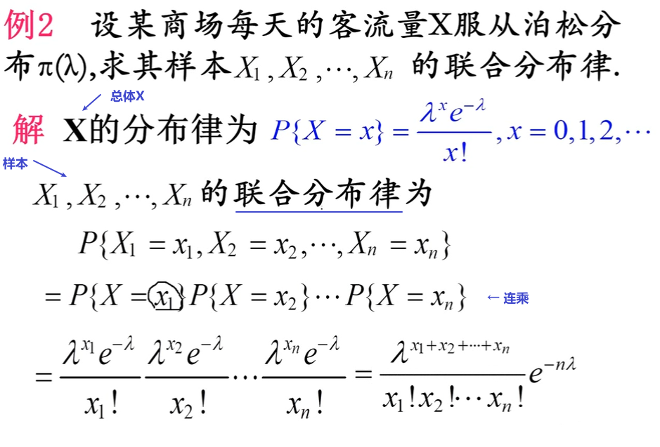
====

---

== 统计量

[options="autowidth"]
|===
|Header 1 |Header 2

|样本函数
|来自总体X 的一个样本 stem:[ X_1, X_2, ... X_n]  , 其函数 stem:[ g( X_1, X_2, ... X_n)], 称为"样本函数".

|统计量 (←它就是一个函数!)
|如果"样本函数" stem:[ g( X_1, X_2, ... X_n)]中, 不含任何未知参数, 那么这个样本函数, 就可以称为"统计量".

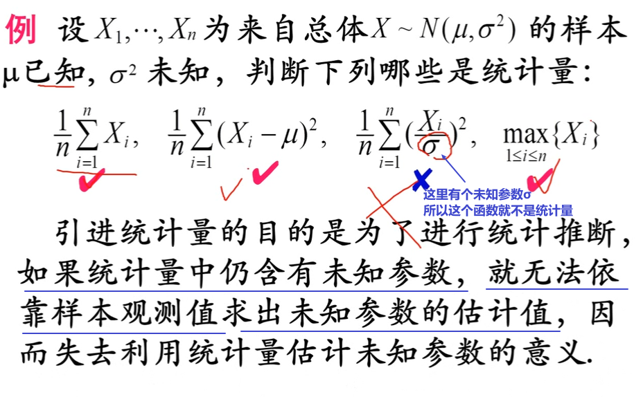

常见的三大统计量是: 样本均值, 样本方差, 次序统计量.

样本是随机变量. *既然样本是随机变量，那么"统计量"作为样本（随机变量）的函数，也是随机变量。既然是随机变量，那么就会有概率分布 F(x)，我们称"统计量的分布"为"抽样分布"。*
|===

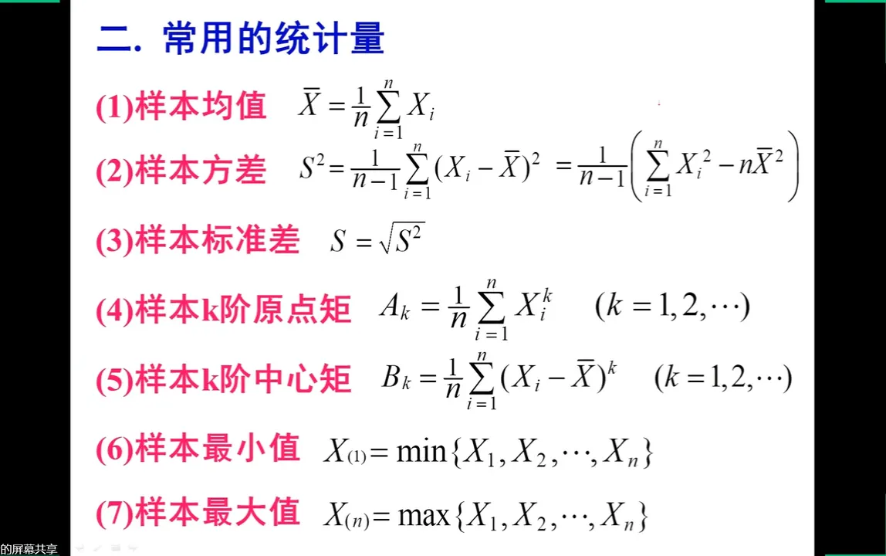

---

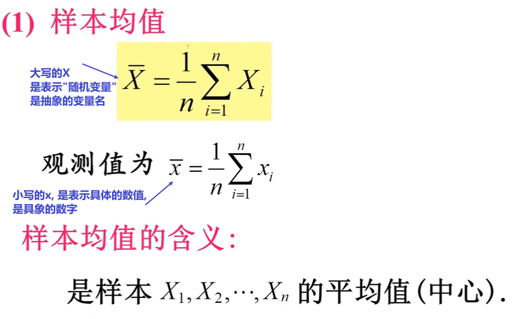

---

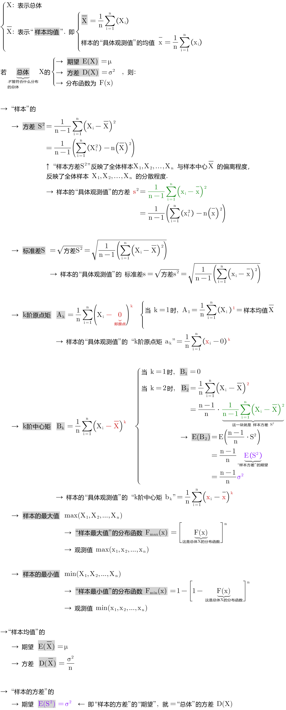

---

== "正态分布的总体"的两个抽样分布定理

https://www.bilibili.com/video/BV1xZ4y1s7Va/?spm_id_from=333.788.recommend_more_video.16&vd_source=52c6cb2c1143f8e222795afbab2ab1b5

1.12.40

---

== 样本函数, 及其概率分布

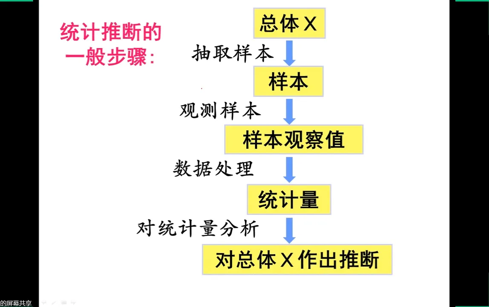

https://www.bilibili.com/video/BV1ot411y7mU?p=61&vd_source=52c6cb2c1143f8e222795afbab2ab1b5

7.46
