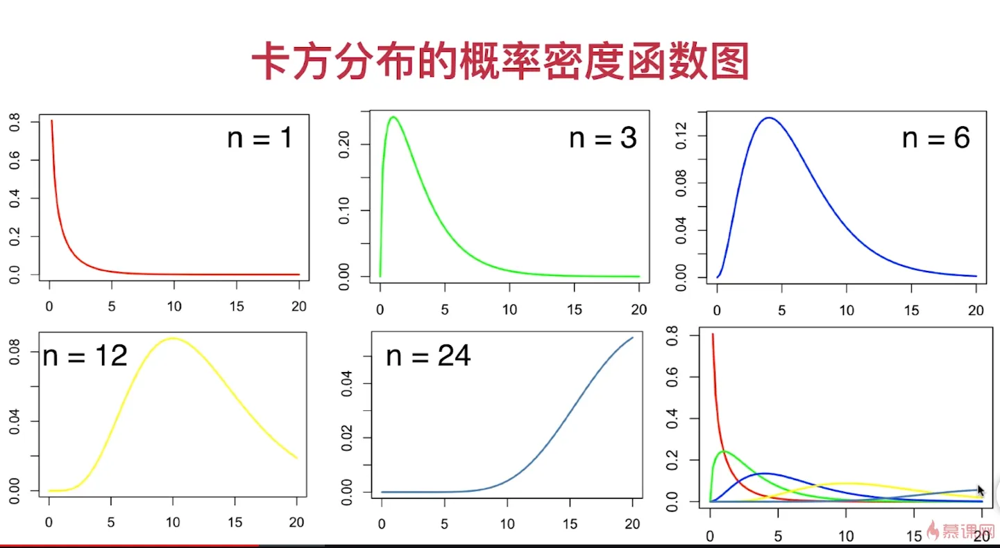
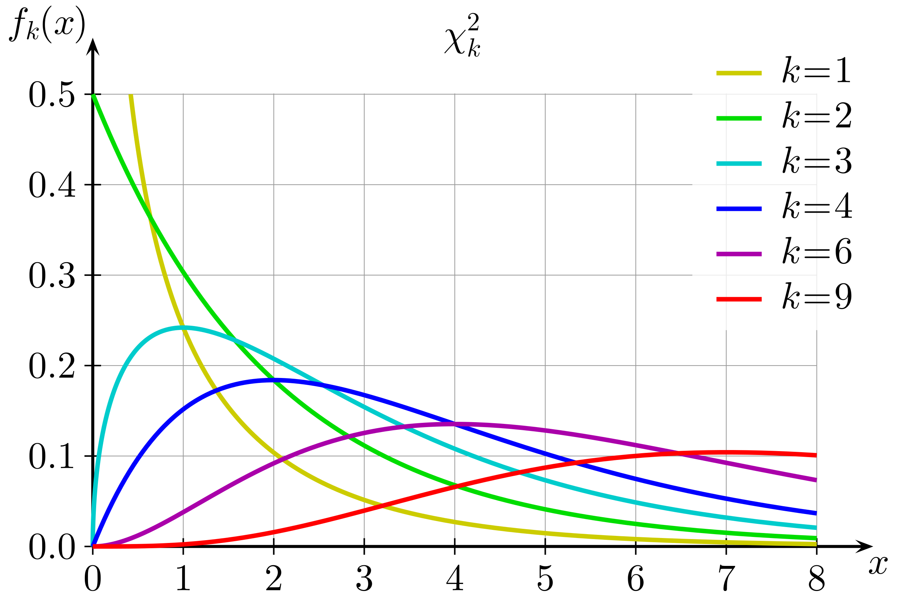
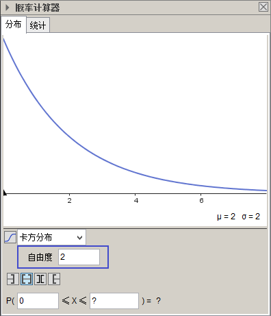
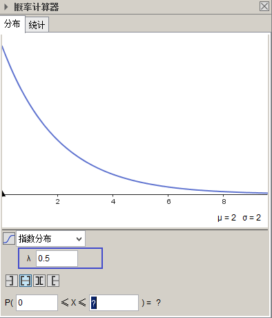
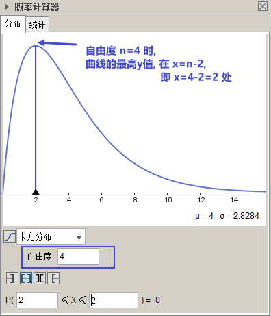
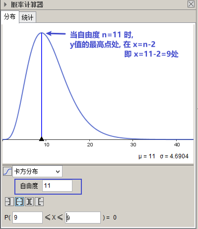

= 抽样分布
:sectnums:
:toclevels: 3
:toc: left

---

== 卡方分布 chi-square distribution → stem:[χ^2]

[options="autowidth" cols="1a,1a"]
|===
|Header 1 |Header 2

|定义 :
|- *如果n个相互独立的随机变量 ξ₁，ξ₂，...,ξn ，均服从"标准正态分布"（也称独立同分布于标准正态分布），则, 这n个随机变量的"平方和", 构成的一个新的随机变量，其分布规律, 就称为"卡方分布"（chi-square distribution）。*

即: 这n个服从"标准正态分布"的随机变量的"平方和" stem:[Q = \sum_{i=1}^n (ξ_i)^2], 会构成一新的随机变量，其分布规律, 称为 stem:[χ^2] 分布（chi-square distribution）.

记为: stem:[Q ~ χ^2(n)] , 或 stem:[Q ~ (χ_n)^2]

|自由度n
|- 卡方分布的 *参数n, (也有用v来表示的)，称为"自由度".*  这个n, 就是 ξ 的个数. 即"n个相互独立的随机变量 ξ".
- 正如"正态分布"中"均"数或"方差"不同, 就是另一个正态分布一样，"自由度v"不同的卡方分布, 就是另一个 stem:[χ^2] 分布。

|卡方分布的"概率函数f(x)" 图像
|

|卡方分布的 f(x)图像的规律
|- 呈正偏态（右偏态）. 自由度n 越小，分布越偏斜。
- **随着参数 n 的增大，函数曲线的的最高峰位置, 会向右移动, 图像会越对称, 即 stem:[χ^2] 分布会趋近于"正态分布". **  换言之, 可用"正态分布"来近似 "自由度n很大时的卡方分布". +
即, 随着自由度 n 的增大，stem:[χ^2] 分布向正无穷方向延伸（因为均值 n 越来越大），分布曲线也越来越低阔（因为方差 越来越大）。
- 卡方分布"概率函数"曲线下的面积都是1.

|
|

|- *当自由度n=2时, 这个卡方分布 stem:[χ^2(2)], 就等于 λ=1/2 时的"指数分布".*
|

|均值和方差
|- *stem:[χ^2] 分布的"均值" = 自由度n.* 记为: stem:[E(χ^2(n))=n]
- *stem:[χ^2]分布的"方差" =2倍的自由度, 即= stem:[2n]*, 记为 stem:[D(χ^2)=2n]

|- 卡方分布, 其f(x)曲线的最高点, 即最高的y值, 在 n-2 处.
|比如, +

|===

---

https://www.bilibili.com/video/BV1aJ411Q7Uf/?spm_id_from=333.337.search-card.all.click&vd_source=52c6cb2c1143f8e222795afbab2ab1b5

https://www.bilibili.com/video/BV1ot411y7mU?p=64&vd_source=52c6cb2c1143f8e222795afbab2ab1b5

10.09
