= 卡方分布
:toc: left
:toclevels: 3
:sectnums:

---

== 卡方分布

=== 解释1

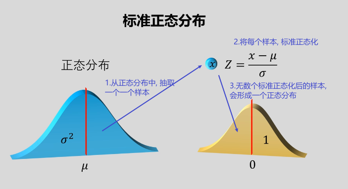

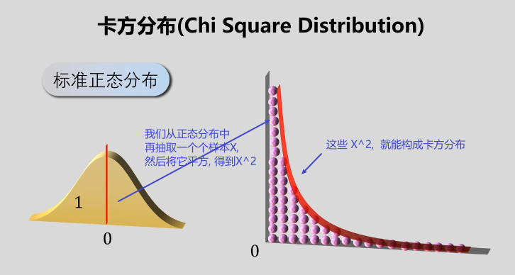

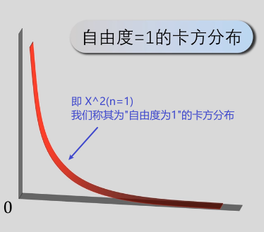

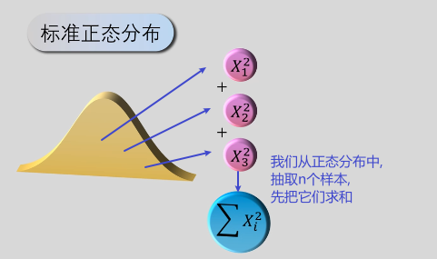

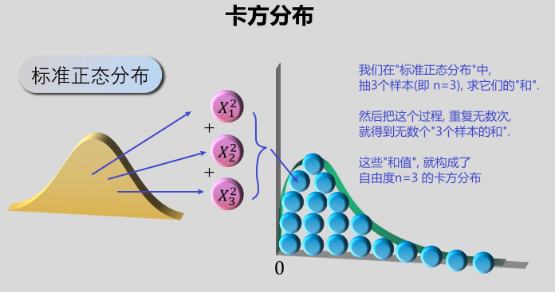

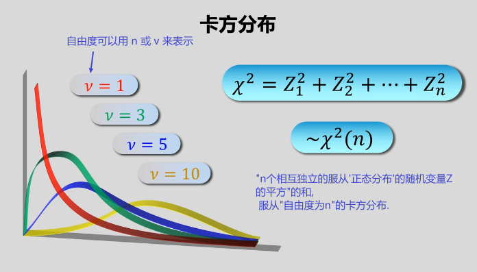

记住: 下面, *样本的方差, 用 stem:[ S^2] 表示.* +
*总体的方差, 用stem:[ σ^2]表示.*

样本方差 stem:[ S^2], 是总体方差 stem:[ σ^2] 的无偏估计量. 即: stem:[ E(S^2) =σ^2]

一般情况下，如果样本很大，就会用S²去比较总体样本的情况。如果样本数量很小，就会用σ2去比较样本情况。

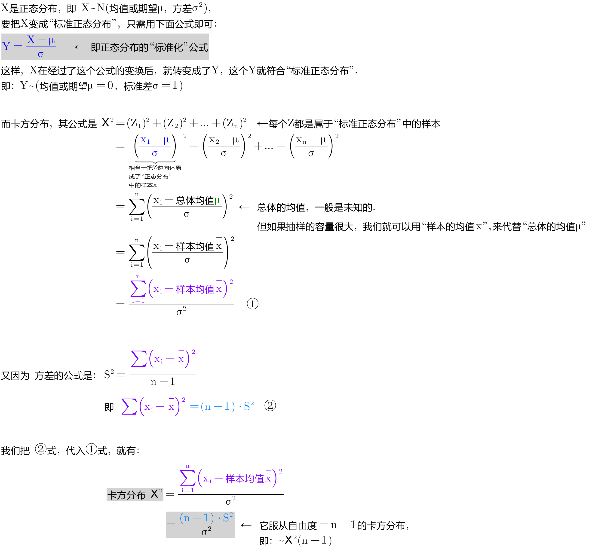

---

==== "卡方分布"有什么用?

[options="autowidth"]
|===
|Header 1 |Header 2

|1.做单样本的方差检验
|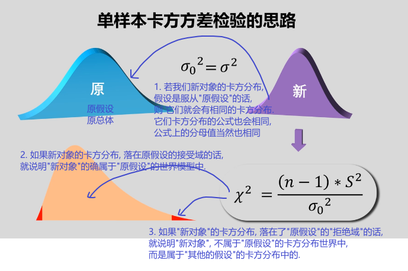

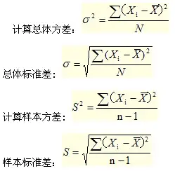

|2.做离散型变量的独立性检验
|

|3.做"拟合优度检验".
|
|===

---

=== 解释2

卡方分布的定义:  当随机变量X, 服从"标准正态分布". 即: stem:[ X~N(0,1)]，则以下的统计量（即样本取平方后求和）：stem:[ Χ^2 = X_1^2 + X_2^2 +... + X_n^2],  服从自由度为n的分布，即"卡方分布"。记为： stem:[Χ^2 ~ Χ^2(n)].

这里的"自由度n"，指的就是独立变量的个数，因此肯定是正整数。

卡方分布的图像如下：

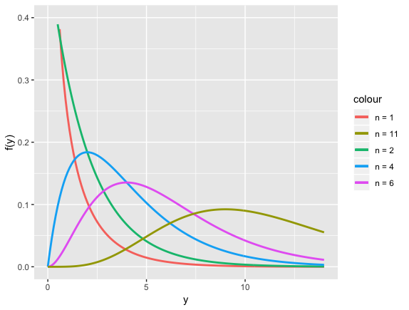

- 当自由度是2的时候，比较特殊，刚好是"指数分布"。
- 当自由度大于2的时候，卡方分布的曲线都是单峰曲线，*在 n-2 处取得峰值*。
- *曲线关于 x=n-2 是不对称的，当n越大，峰向右移动；当n无限大时，可以用"正态分布"近似。*
- "卡方分布"的期望 stem:[E(Χ^2)=n ]
- "卡方分布"的方差, stem:[D(Χ^2)=2n]
- *卡方分布具有"可加性"。当两个（或者多个）随机变量均服从"卡方分布"时，且相互独立，那么"加和"之后的分布, 也服从"卡方分布"，自由度是两个自由度之和*. 即： stem:[ Χ_1^2 + Χ_2^2 "也服从" ~ Χ_2(n_1 + n_2)]

---

== 定理:

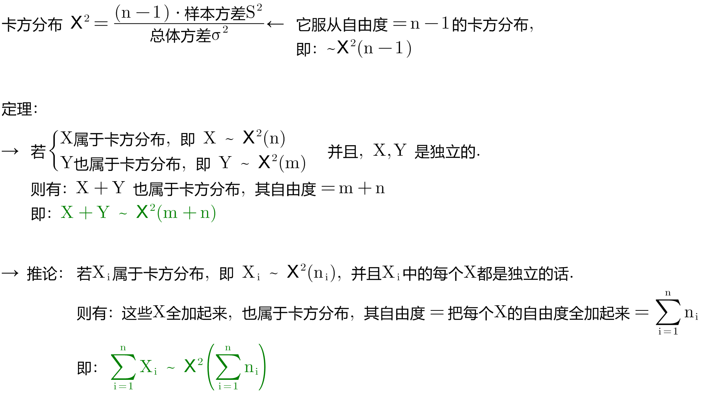

---

== 上α分位数

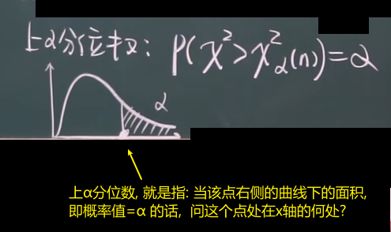

[options="autowidth"]
|===
|Header 1 |Header 2

|例1
|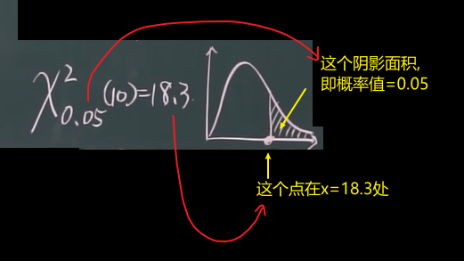
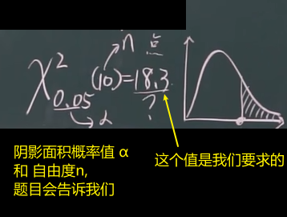
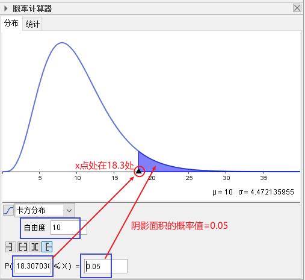

|例2
|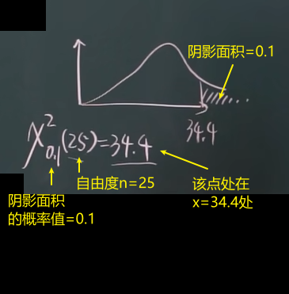
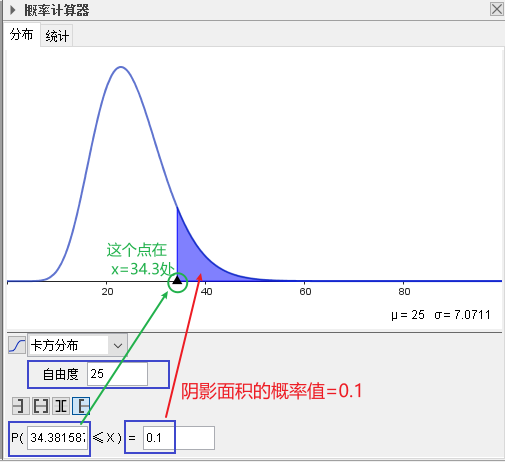
|===

.标题
====
例如： +
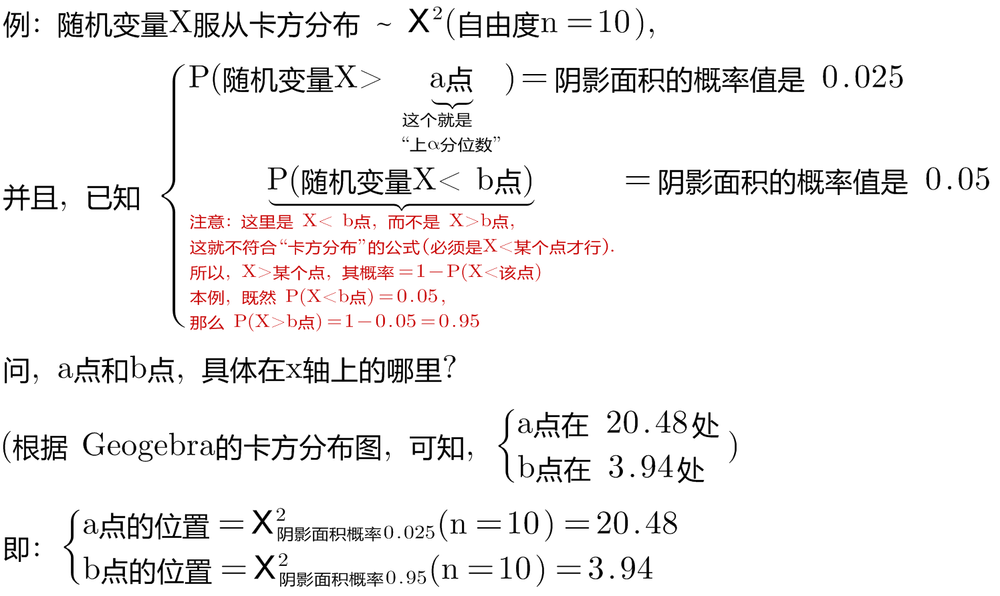

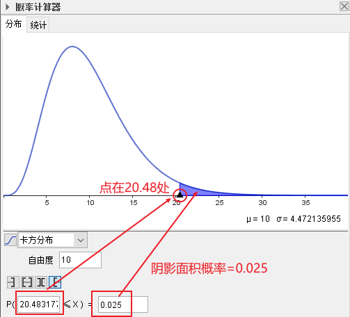

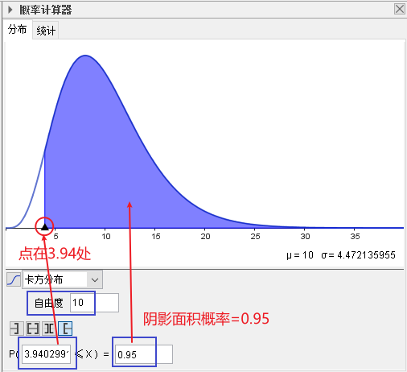
====

.标题
====
例如： +
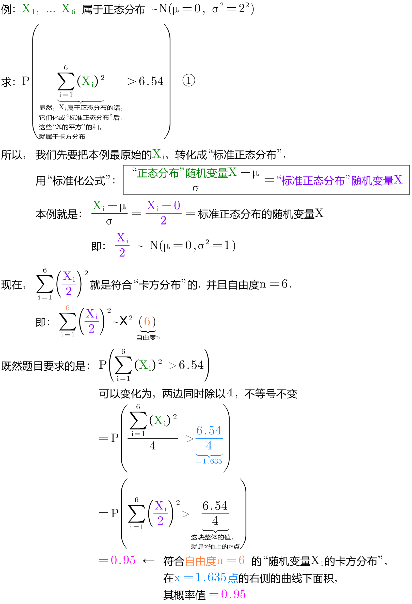

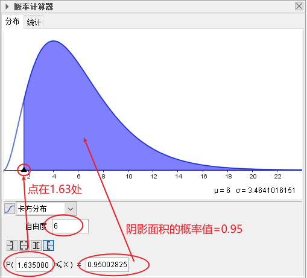
====

---
