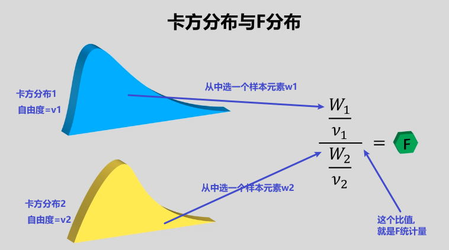
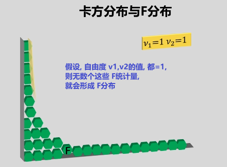
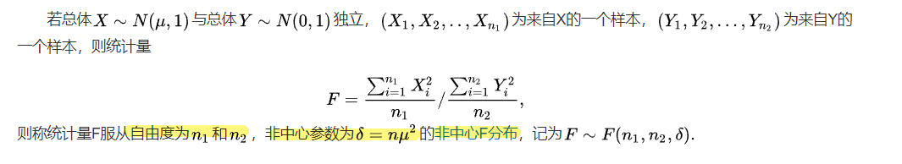

= F分布
:sectnums:
:toclevels: 3
:toc: left

---

== F分布 F-distribution

image:img/221114_042.png[,]

所以, 两个独立"卡方分布"的随机变量, 各自除以其自由度v后, 它们的比值, 就是F分布. 即: "F分布是"两个"卡方分布"除以其"自由度"之后的比值.

image:img/221114_043.png[,]

- F分布, 是一种非对称分布.
- 它有两个自由度，且位置不可互换。

https://www.bilibili.com/video/BV1fJ411q7Yo/?spm_id_from=333.999.0.0&vd_source=52c6cb2c1143f8e222795afbab2ab1b5

1.55

https://www.bilibili.com/video/BV1ot411y7mU/?p=64&vd_source=52c6cb2c1143f8e222795afbab2ab1b5

40.14
