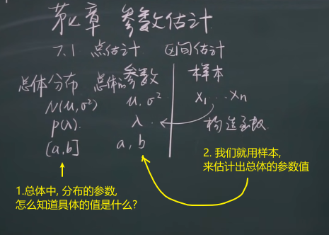
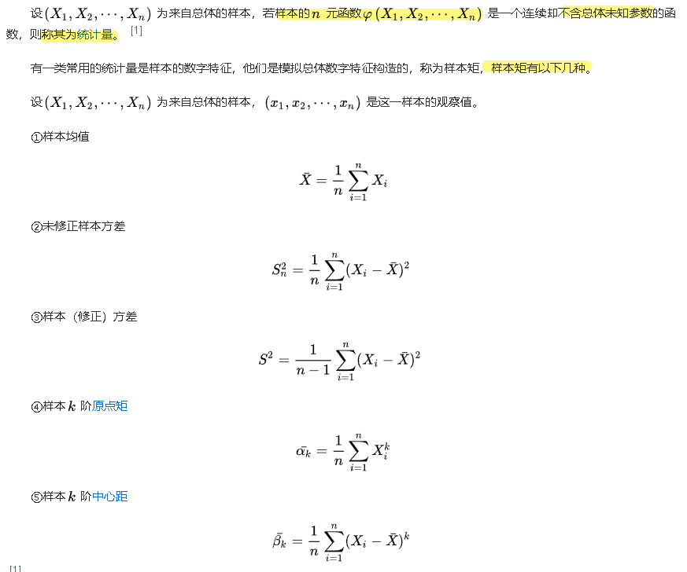
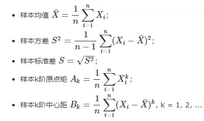
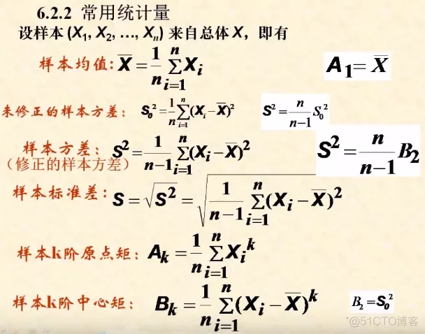
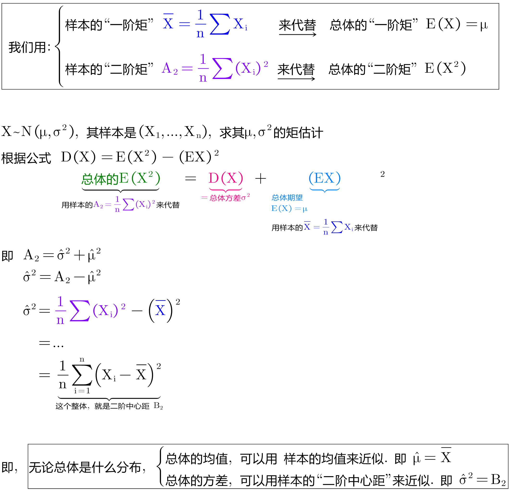
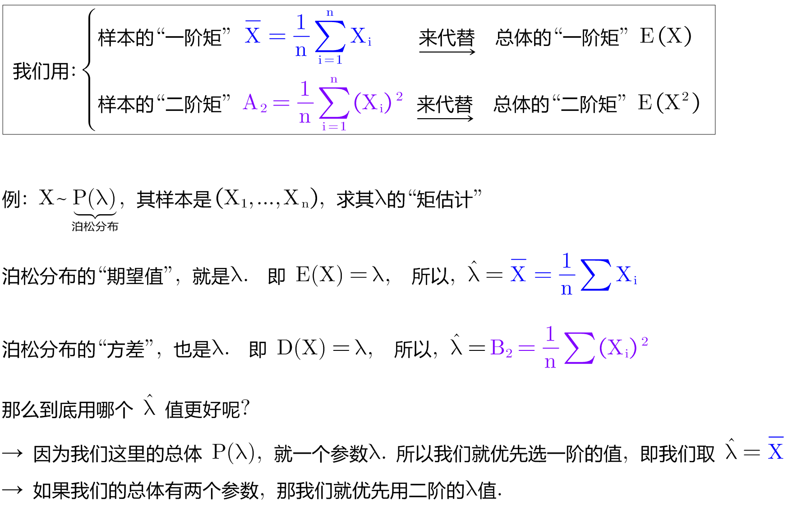
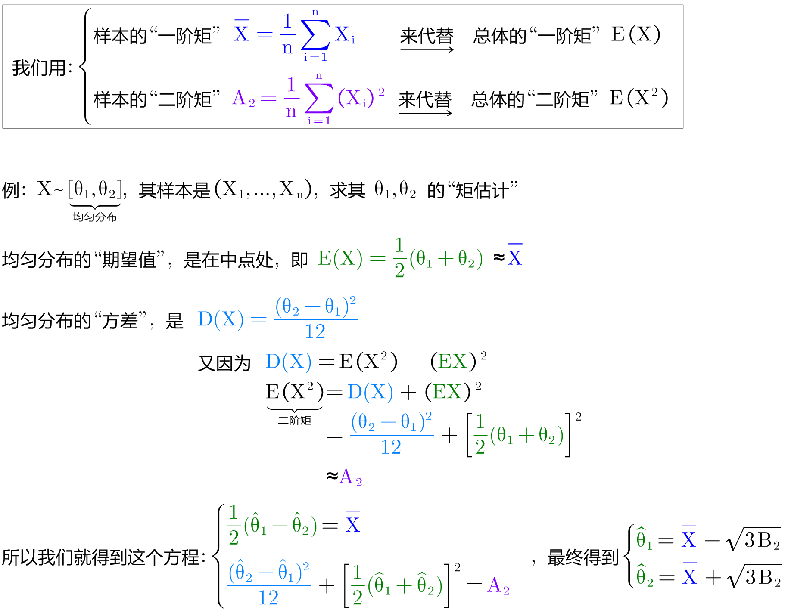
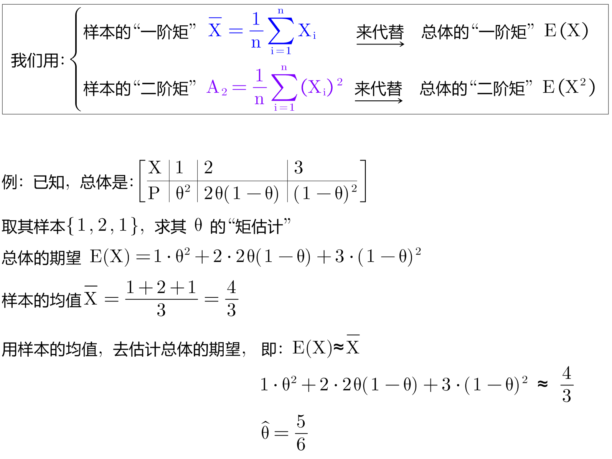

= 参数估计
:sectnums:
:toclevels: 3
:toc: left

---

== 点估计

我们用样本, 来构造出一个函数, 来估计总体的分布的参数的值.  根据要估计的参数的不同, 我们构造的函数, 也不相同. 但可以用 笼统的 stem:[ \hat{θ} = \hat{θ}(X_1,...,X_n)]来表示.  这里的θ**头上有个尖号, 代表它是个"估计值".**

参数的取值范围, 可以称为"参数空间".

[cols="1a,3a,1a"]
|===
|Header 1 |Header 2 |常用方法有

|点估计
|就是精确到某一个数值. +
点估计：依据样本, 来估计总体分布中所含的"未知参数"或"未知参数的函数"。
|- 矩估计法,
- 极大似然估计法,
- 最小二乘法,
- 贝叶斯估计法

|区间估计（置信区间的估计）
|就是精确到某一段数值区间. +

区间估计, 就是依据抽取的样本，根据一定的正确度与精确度的要求，构造出适当的区间，作为总体分布的"未知参数"或"参数的函数"的真值所在范围的估计。 +
例如人们常说的"有百分之多少的把握, 保证某值在某个范围内"，即是"区间估计"的最简单的应用。
|

|===

---

== 矩估计法 Moment estimation

**对于随机变量来说，"矩"是其最广泛，最常用的数字特征，主要有"中心矩"和"原点矩"。** 由"辛钦大数定律"知，简单随机样本的原点矩, 依概率收敛到相应的"总体原点矩".  +
这就启发我们想到用"样本矩", 替换"总体矩"，进而找出未知参数的估计. 基于这种思想求估计量的方法, 称为"矩法"。用矩法求得的估计, 称为"矩法估计"，简称"矩估计"。

该方法,其思想是：如果总体中有 K个未知参数，可以用"前 K阶样本矩", 估计相应的"前k阶总体矩"，然后利用"未知参数"与"总体矩"的函数关系，求出参数的估计量。

[options="autowidth"]
|===
|Header 1 |Header 2

|样本矩
|样本矩: 是指有一类常用的"统计量", 是样本的数字特征，他们是模拟"总体数字特征"构造的。

样本矩主要包括:样本均值、未修正样本方差、样本（修正）方差、样本k阶原点矩, 和样本k阶中心距。

样本来自总体，携带了总体的部分信息。**进行统计分析和推断时，要使用样本携带的信息, 推断总体的概率性质，但样本带来的信息往往是分散凌乱的，需要集中整理加工后才便于利用。**初步整理可以用分组、作图、列表等方法，但进一步深入统计提取样本信息, 就要根据问题的需要, 构造样本函数——统计量。

|矩估计
|矩估计，即矩估计法, 就是利用样本矩来估计总体中相应的参数。

最简单的矩估计法, 是用一阶样本原点矩, 来估计总体的期望; 而用二阶样本中心矩, 来估计总体的方差。

|*一般, 用A代表"原点矩", B代表"中心距"*
|

如上图, 所以 B2是"样本二阶中心矩"，A2是"样本二阶原点矩"
|===

.标题
====
例如： +

====

.标题
====
例如： +

====

.标题
====
例如： +

====

---

== "矩估计法"的优缺点

[options="autowidth" cols="1a,1a"]
|===
|Header 1 |Header 2

|优点
|- 在总体的"分布"未知时, 也能使用"矩估计法".

|缺点
|- 若总体的"原点矩"不存在, 则不能使用"矩估计法".
- 它只涉及总体的一些(而非全部的)数字特征.
|===

---

