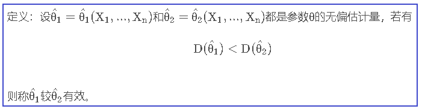
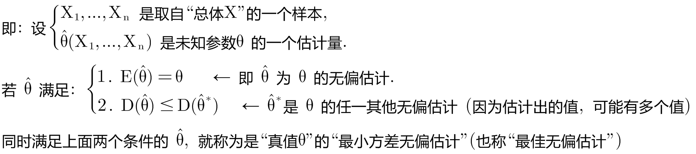
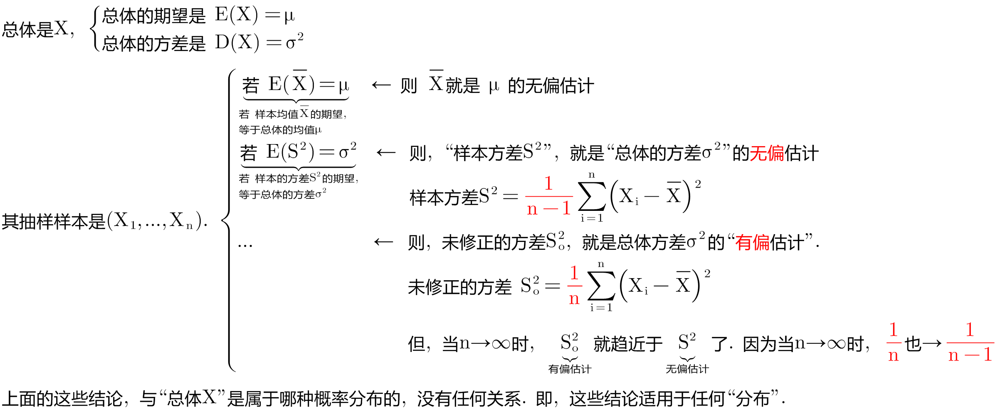
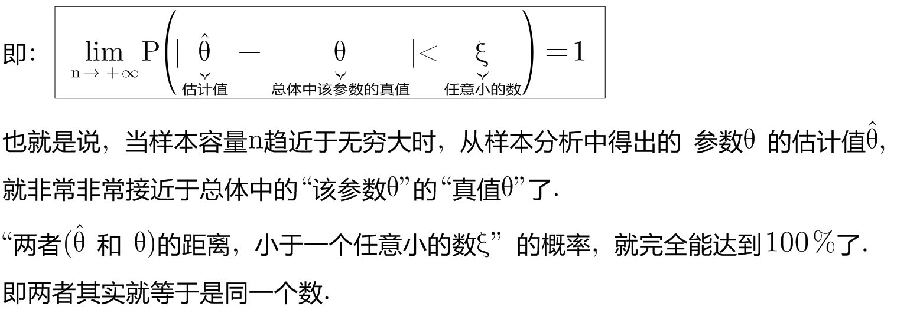

= 点估计的优良性准则
:sectnums:
:toclevels: 3
:toc: left

---

== "点估计"的优良性准则

评价一个"估计量"的好坏，不能仅仅依据一次试验的结果，而必须由多次试验结果来衡量。因为"估计量"是样本的函数，是随机变量。因此，由不同的观测结果，就会求得不同的"参数估计值"。所以一个好的估计，应在多次试验中体现出优良性。

判断其好坏的常用标准, 有几条：

[options="autowidth"]
|===
|Header 1 |Header 2

|无偏性
|设 stem:[ \hat{θ}(X_1, ... , X_n)] 是未知参数 θ 的估计量，若 stem:[ E(\hat{θ})=θ], 就称stem:[ \hat{θ}]为 θ 的无偏估计.

因为"估计量"是随机变量，对于不同的样本取值, 会得到不同的估计值。*我们肯定希望"估计值"在未知参数"真值"附近摆动. 所以, 参数估计值的"数学期望"越趋近于"真值"越好.*

"无偏性"的实际意义, 是指没有"系统性的偏差".

用"样本均值"作为"总体均值"的估计时，这种偏差, 会随机地在0的周围波动. 而对同一统计问题大量重复使用, 就不会产生系统偏差。

|有效性
|一个未知参数,往往有不止一个的无偏估计值，若 stem:[\hat{θ}_1 ] 和 stem:[\hat{θ}_2]  都是参数θ 的无偏估计量，*我们就可以通过比较他们的方差(即"估计值"与"真值"相距距离的波动性), 谁大谁小, 来决定二者的优劣.*

stem:[ D(\hat{θ}_1)=E(\hat{θ}_1 - θ)^2] +
stem:[ D(\hat{θ}_2)=E(\hat{θ}_2 - θ)^2]

两者中, 方差小的那个 stem:[ \hat{θ}], 胜出.

完整的定义就是:

|最小方差无偏估计
|同时满足上面两个条件的 stem:[\hat{θ} ], 该 stem:[ \hat{θ}] 就称为"最佳无偏估计".

|相合性
|
|===

== ① 无偏性. → 即要满足: stem:[ E(\hat{θ})=θ]

---

== ②有效性. → 即取方差小的那个估计值:  若 stem:[ D(\hat{θ}_1) ≤  D(\hat{θ}_2) ], 取前者.

---

== ③ 相合性(或一致性). →

样本取得越大, 它的参数估计值, 肯定就越接近总体的真实值.  +
即: 当样本容量n充分大时，"估计量"可以以任意的精确程度, 逼近被估计参数的"真值"。

---
