= 置信区间
:sectnums:
:toclevels: 3
:toc: left

---

矩估计, 和极大似然估计, 都属于"点估计"。下面我们介绍"区间估计".

== 置信区间 Confidence intervals

比如, 一个正常人的身高. 其身高的具体值, 会以多少概率, 落在 150-200cm 的区间里?  肯定是100%了. 因为正常人的身高肯定在这么大的区间范围里面了. +
但他的身高, 会以多少概率, 落在 180-185cm的区间范围里呢? 这个概率, 肯定就会小很多了.

所以,"区间估计", 有两个重要的数据: 一个就是"区间的范围", 另一个就是"以多少概率, 落在这个区间范围里".

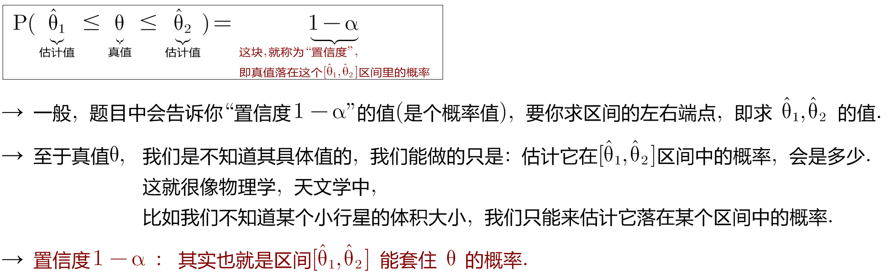

“置信区间” confidence interval，也译为“可信区间”、“信赖区间”, 或“信心区间”。

置信区间, 其实就是表示"总体参数", 其值的可能范围.

很容易想象到，估计的区间越小，越精准。但是明显，相应的，真实参数值落在区间里的概率, 也就越小了。所以两者不可得兼，需要平衡。

因此，区间估计时，两个参数很重要："区间长度"和"参数落在区间的概率（即置信度）"。即：

stem:[ P(θ_1≤ θ ≤θ_2) =1-α]

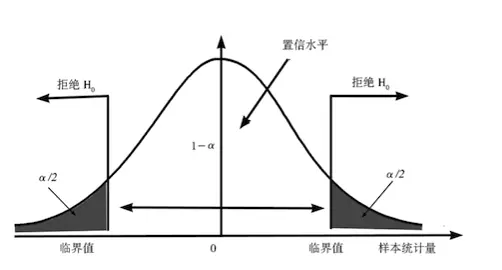

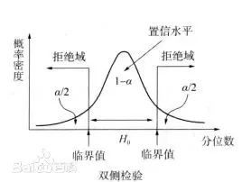

区间 [ θ1,θ2 ] 就是要估计的区间，1-α就是置信度。为啥用1-α呢？因为后面α会用到。

---

== 枢轴变量 Pivot

枢轴变量 : 从θ的一个点估计出发，构造与θ相关的一个函数G，使得G的分布是已知的，而且与θ无关。通常称这种函数为"枢轴变量"。

通俗点讲，*其实"枢轴变量"就是一个函数，这个函数的目的, 是把目前未知的分布, 转化成我们已知的分布（比如正态分布、卡方分布、t分布等）。*

*转化成已知分布干嘛呢？因为已知分布中，"概率密度函数"是已知的，因此可以基于"置信度", 来求得已知分布的区间。已知分布的区间知道了，再根据构造的"枢轴变量"，反推要估计的区间，即完成了"区间估计"的过程。*

这里我们先按照比较容易的情况（一个正态总体）为例，看看如何进行"区间估计"。

既然是一个正态总体了，所以要进行区间估计的参数, 无非两个：均值和方差。首先，有下面的概况表：

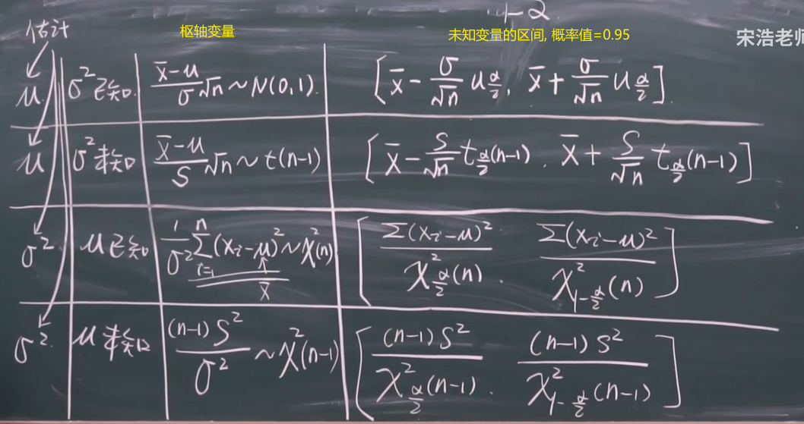

啥意思呢？*对于总体的均值和方差，无非有上图中的几种情况。针对不同情况，我们需要构造不同的枢轴变量，因此也服从了不同的分布。* 这些枢轴变量，它们的作用, 其实主要就是用在"区间估计".

[options="autowidth"]
|===
|Header 1 |Header 2

|（1）"总体方差"已知，估计"总体均值"
|在这种情况下，我们构造的枢轴变量是：

这个服从"标准正态分布"。为啥用这个函数作为枢轴变量呢？仔细看内容便知道，函数共有4个参数： +
- 样本均值X（已知，可以用过样本求出来）， +
- 总体均值μ（未知，是我们要估计的参数）， +
- 样本标准差σ（已知，可以通过样本求出来）， +
- 样本量n（已知，即样本个数）。

因此，只有总体均值μ未知。而波浪线右侧的分布是已知的，那我们就可以用右侧正态分布的特征, 来求出"总体均值"的区间：

|（2）"总体方差"未知，估计"总体均值"
|在这种情况下，我们构造的枢轴变量是：

为啥构造这个枢轴变量呢？因为总体方差是未知的，而（1）中用到了总体方差，所以就出现了两个未知变量（总体方差和总体均值），所以就没法求了。

而这里构造的服从"t分布"的枢轴变量，包括的四个参数，有三个是已知的，只有"总体均值"是未知的，所以可以利用t分布, 来求"总体均值"的区间估计。

|（3）"总体均值 μ"已知，估计"总体方差 stem:[ σ^2]"
|这种情况下构造的枢轴变量是：

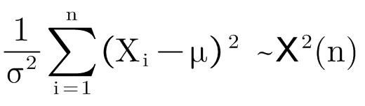

具体的区间估计范围也是参照黑板截图。

|（4）"总体均值"未知，"估计总体"方差
|这种情况，构造的枢轴变量是：

image:img/0807.svg[,]

这里和（3）中的枢轴变量的唯一差别是: 括号中减的是"样本均值"还是"总体均值"。 +
-> 如果是样本均值，则服从"自由度是n-1"的卡方分布； +
-> 如果是总体均值，则服从"自由度是n"的卡方分布。
|===

---

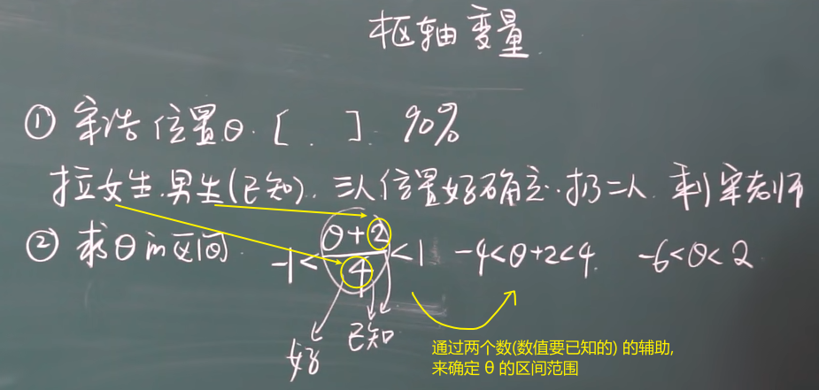

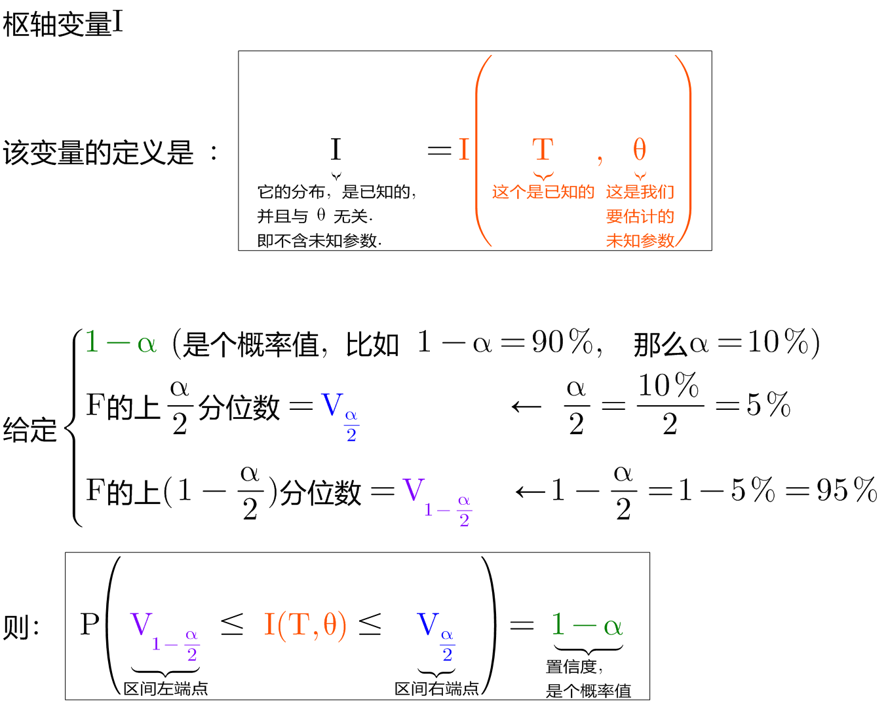

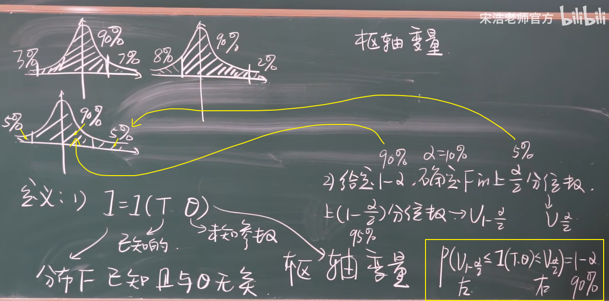

上面三种图, 中间部分的面积都是90%, 但我们为什么只用"左右对称"的那张图? *原因是, 我们要取的这 90% 的这个区间, 它横跨x轴的长度, 越小越好.*

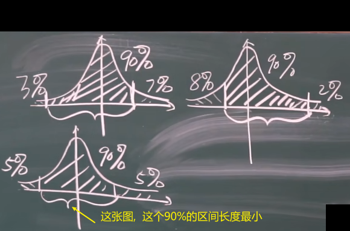

---

== 一个正态总体, 对其均值和方差, 进行区间估计

=== 正态总体, stem:[ σ^2]已知, 求 "未知的μ" 的区间

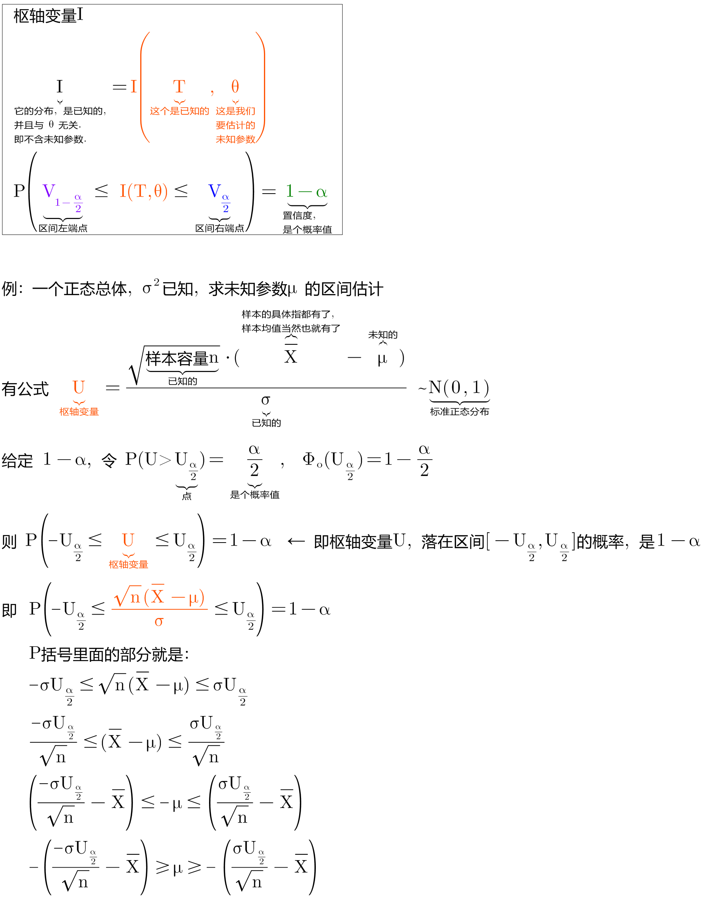

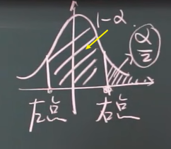

.标题
====
例如： +
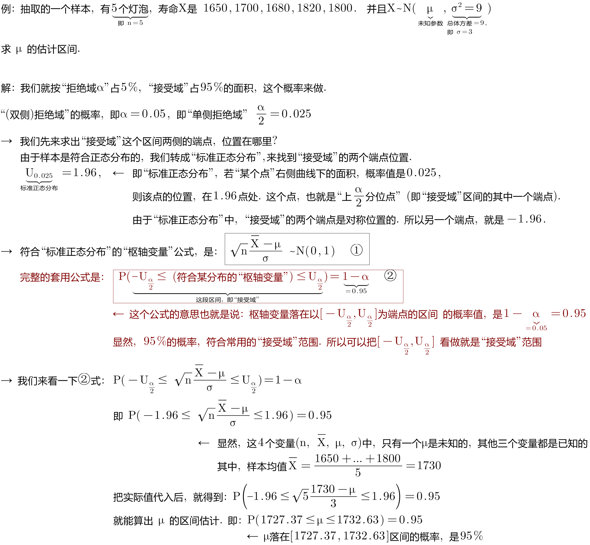

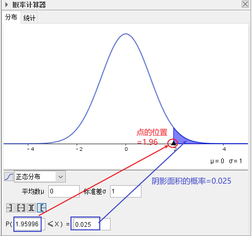
====

---

=== 正态总体, stem:[ σ^2]未知, 求 "未知的μ" 的区间

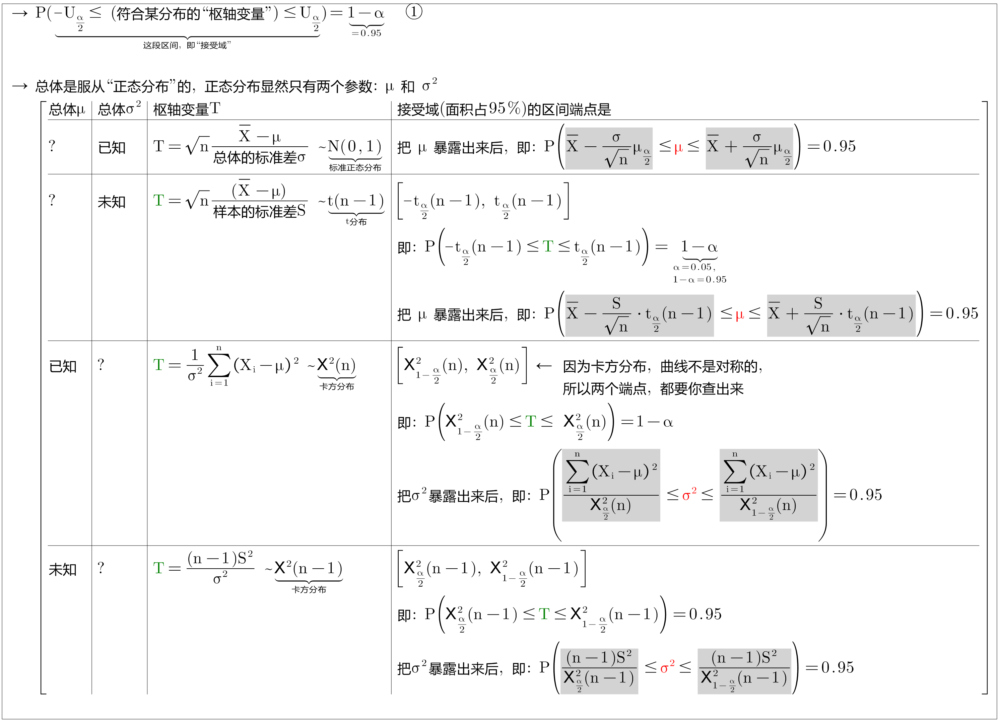

---
