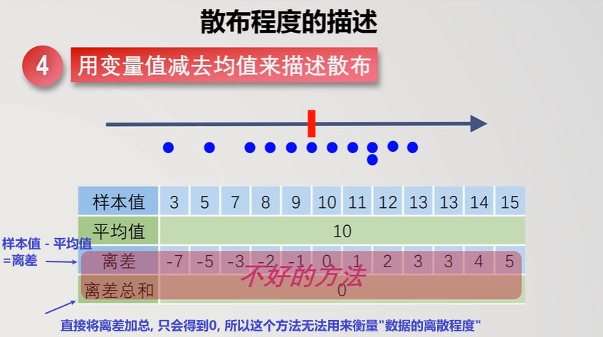
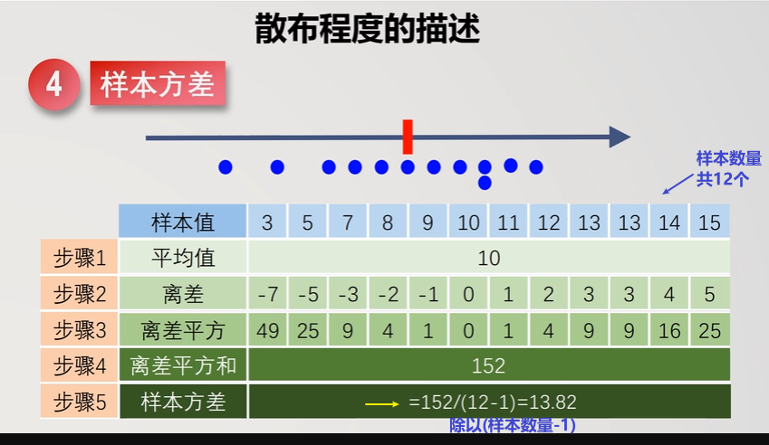
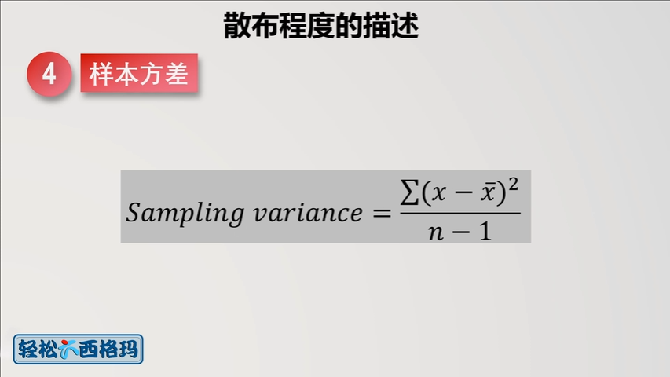
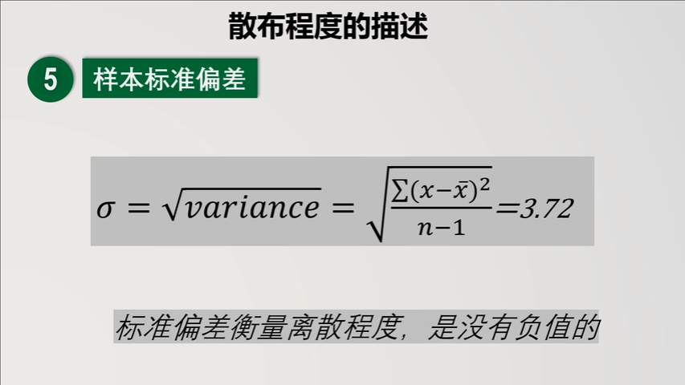
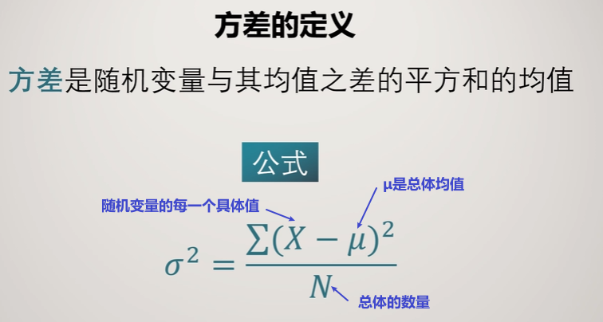
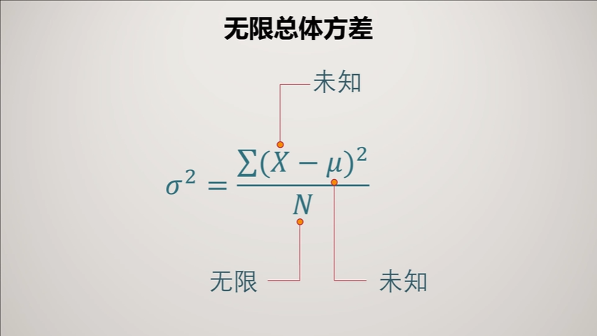
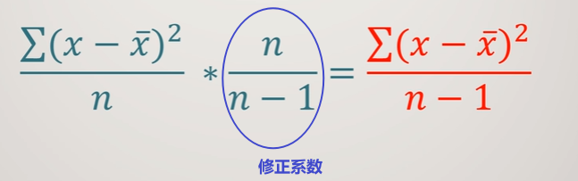

= 统计 - t分布
:sectnums:
:toclevels: 3
:toc: left

---

== 描述"数据的离散程度" -- 方差

[options="autowidth"]
|===
|Header 1 |Header 2

|方差
|

|标准差
|但方差, 由于有平方的操作, 使得单位也变成了平方, 不好理解.

所以, 我们再把"方差"开平方, 让单位回来, 就得到"标准差".

|"有限数据"的方差
|如果数据量是有限的, 我们可以用下面的公式, 来得到"方差":

|"无限数据"的方差
|但是, 对于数据量是无限的, 其总体的方差, 该怎么算呢? 无限数量的数据, 就不存在 "总数n" 了, 也不可能知道其总体均值 μ. 也无法知道所有的具体X值.

此时, 我们就换种方法来算: 用"样本均值", 来代替"总体均值"; 用"抽样数据中的X变量值", 来代替"总体数据中的X变量值"; 用"样本数量", 来代替"无限的总体数量". 但是这样, 从样本算出来的值, 一定是和总体中算出来的客观值, 有差异的. 即, "样本容量"占"总体容量"的比例越小, 偏差越大.

所以, 我们就要再乘上一个修正系数, 才能得到"无限数据"的方差公式:

这个系数 stem:[ \frac{n} {n-1}] 是被数学证明的.
|===

---

