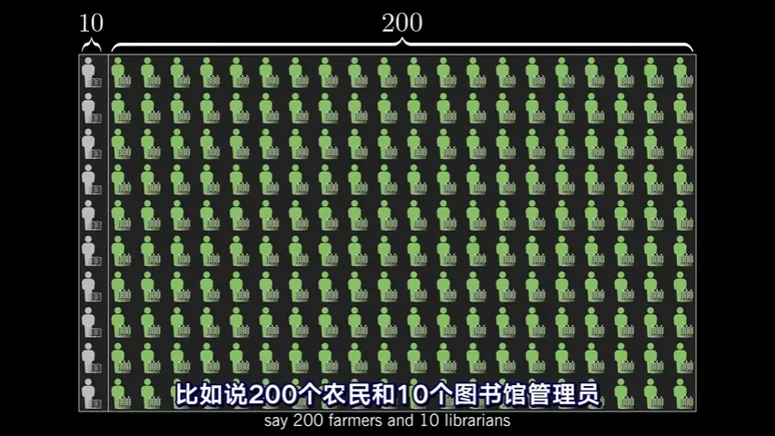
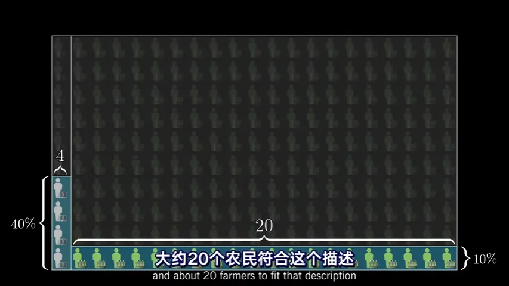
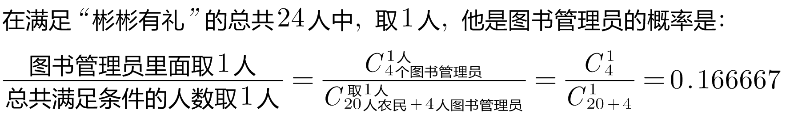

= 贝叶斯定理 Bayes' theorem
:sectnums:
:toclevels: 3
:toc: left

---

== 贝叶斯定理 Bayes' theorem

学习任何一个数学定理, 都要知道以下三点:

1. 该定理解释了什么规律? what is it saying?
2. 它为什么是对的, 数学证明原理是什么? why is it true?
3. 该定理在什么背景条件下, 我们就能使用它? when is it useful?

你的新邻居, Steve is very shy and withdrawn, invariably helpful but with very little interest in people or in the world of reality. A meek and tidy soul, he has a need for order and structure, ant a passion for detail.

你觉得他更可能是 -- 图书管理员, 还是农民?

大多数人可能会说, 他更有可能是图书馆管理员. 其实, 这种判断, 就是"非理性"的. *关键问题不在于人们对图书馆管理员和农民的形象认识, 是否有偏差, 而是说, 在做判断的时候, 你有没有把这两种职业的"人数比例"考虑进去.* 关键不在于你是否知道他们的精确比例数据, 而是你能依此来做出粗略的判断.

即: *理性不是说知道事实数据, 而是认识到: 哪些因素是起到相关作用的.* +
Rationality is not about knowing facts, It's about recognizing which facts are relevant.

在美国, 农民与图书馆管理员的数量之比, 是20:1.

那么在总共300人中, 他们的比例就如下图:

假如你听到"彬彬有礼"这类描述, 你的直觉是: 40%的图书馆管理员符合这个描述,而只有10%的农民符合这个描述. 如果这是你的估计, 那就意味着你的样本中, 会有大约 stem:[10 \cdot 40% = 4]个图书馆管理员, 和大约 stem:[200 \cdot 10% = 20] 个农民, 符合这个描述.

所以, 从满足这个描述的人群中, 随便抽出一个人. 是图书管理员的概率就是 :

所以, 即使你认为"符合这个描述的人是一个图书馆管理员的可能性, 是一个农民的4倍", 也抵不过农民的数量很多.

"贝叶斯定理"最根本的结论也就是说 : 新证据不能直接凭空的决定你的看法, 而是应该更新你的先验着法(之前的经验).

https://www.bilibili.com/video/BV1R7411a76r/?spm_id_from=333.337.search-card.all.click&vd_source=52c6cb2c1143f8e222795afbab2ab1b5

