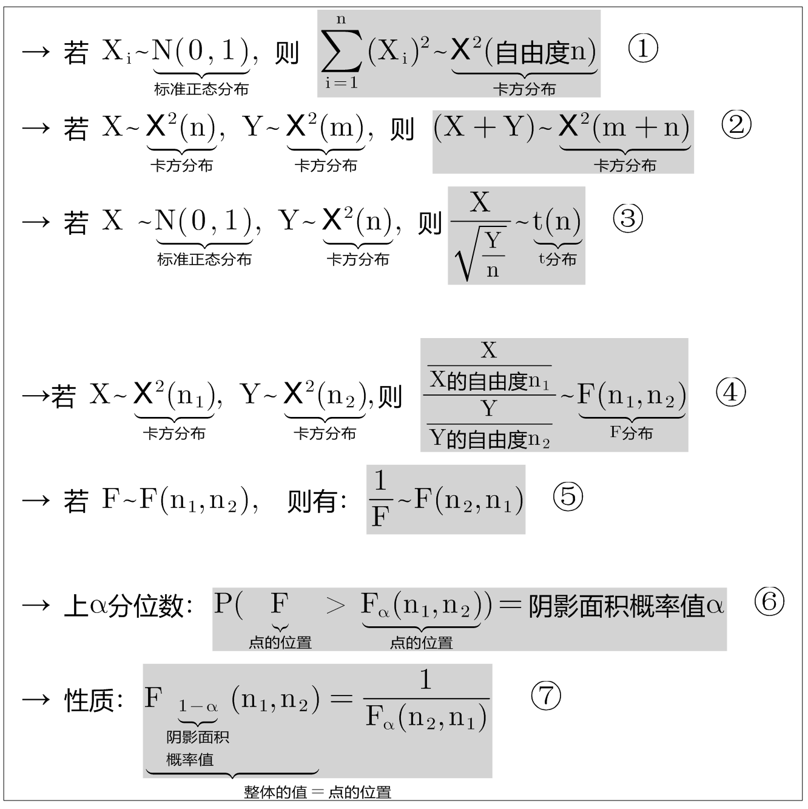
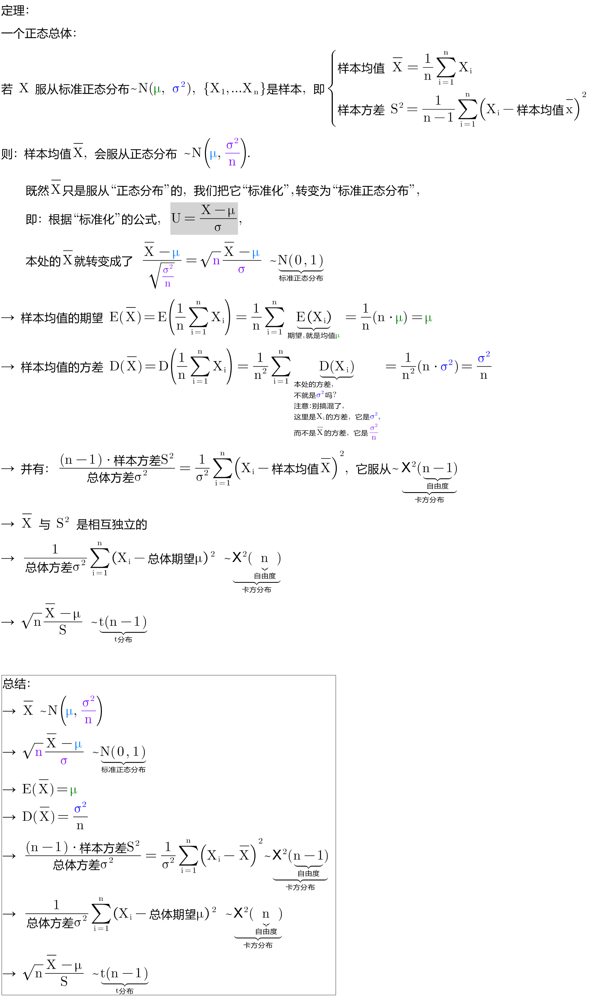
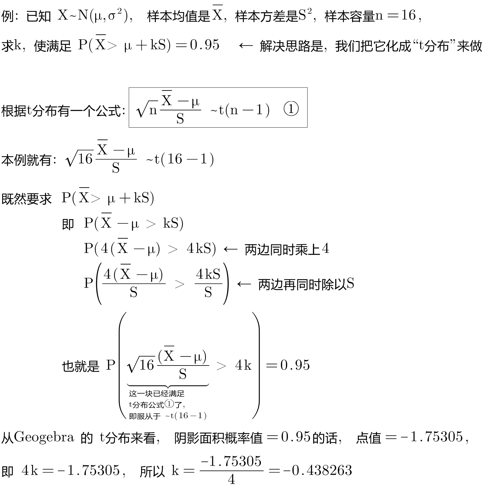
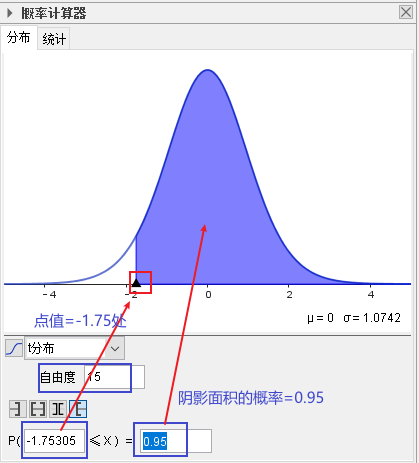
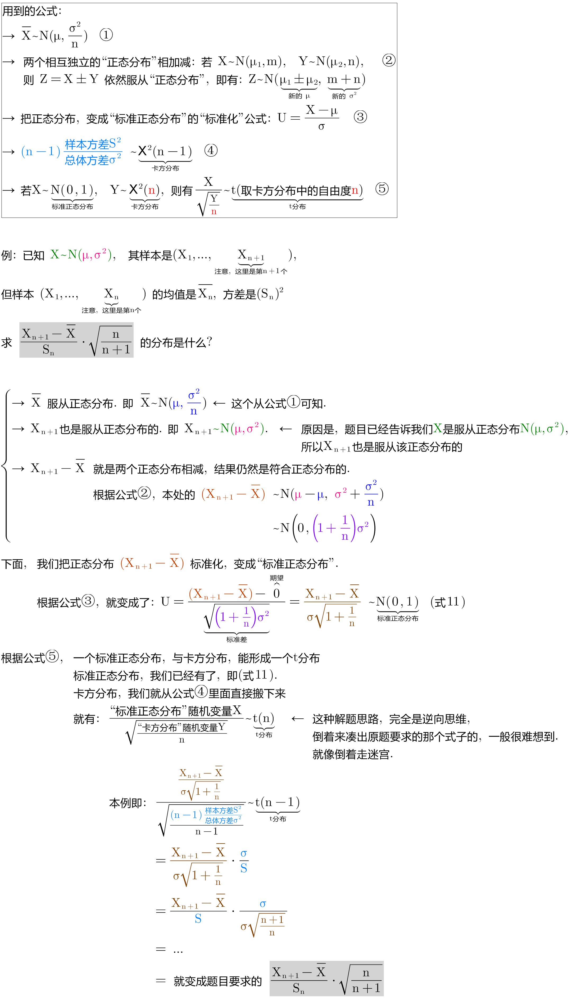
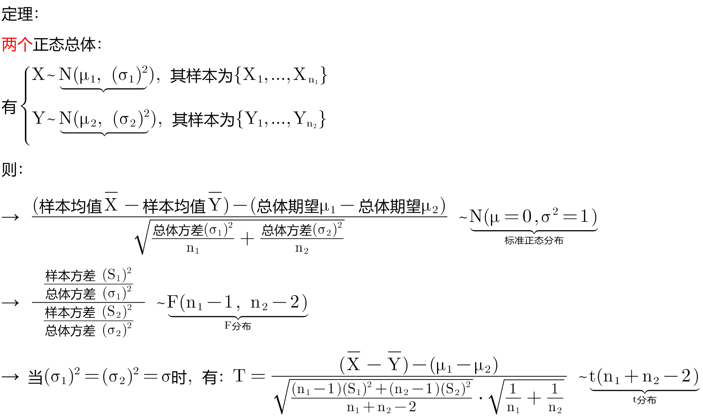

= 正态总体下的抽样分布
:sectnums:
:toclevels: 3
:toc: left

---

== 正态总体下的抽样分布

本节会用到的公式: +

已知, 数据总体是"正态分布", 我们从中抽取样本, 问, 无数这些样本统计量, 会呈现什么分布呢?

---

== 定理1

.标题
====
例如： +

====

.标题
====
例如： +

====

---

== 定理2

---

