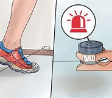

= eco 2020.01 (01)
:toc:

---

== 01. China views Donald Trump’s America with growing distrust and scorn

China *views* Donald Trump’s America *with* growing distrust and scorn(n./v.)(`=*~ (for sb/sth)* a strong feeling that sb/sth is stupid or not good enough, usually shown by the way you speak 轻蔑；鄙视`)

And cynics 愤世engage嫉俗者；悲观者；怀疑者 in Beijing *hope for* his re-election

中国对唐纳德•特朗普(Donald Trump)领导下的美国, 越来越不信任和感到轻蔑 +
北京的愤世嫉俗者则希望他连任

Jan 2nd 2020 | BEIJING

ZOOLOGISTS 动物学家 *USE* a mild-sounding term -- “displacements”(`=the act of displacing sb/sth; the process of being displaced 取代；替代；移位；免职;/逐出家园`) -- for moments when a strong, young mountain(`=a very high hill, often with rocks near the top 高山；山岳`) gorilla  大猩猩 *confronts* the dominant male in his group.

Behind the jargon 行话；黑话；行业术语 *lies* a brutal(`=violent and cruel 残暴的；兽性的`) reality: a drawn-out(`= lasting a very long time, often too long 持续很久的；拖长的`), bloody conflict *looms*.

China’s leaders similarly 同样；也 *use* prim(`=always behaving in a careful and formal way, and easily shocked by anything that is rude 一本正经的；循规蹈矩的；古板的;/formal and neat 正式的；端庄的`), technical-sounding terms *to describe* their confrontation(`=a situation in which there is an angry disagreement between people or groups who have different opinions 对抗；对峙；冲突`) with America.

In closed-door briefings(`=a meeting in which people are given instructions or information 传达指示会；情况介绍会`) and chats(n.) with Western bigwigs(`=bigwig : an important person 要人；大人物`), they *chide*(v.)(`=*~ sb (for sth/for doing sth)* ( formal ) to criticize or blame sb because they have done sth wrong 批评；指责；责备`) the country *led by* President Donald Trump *for(=chide...for...) responding to* China’s rise *with* “strategic anxiety” (ie, fear).

They *insist that* {China’s only crime *is* to have grown so rapidly}.

动物学家们用一个听起来温和的术语——“取代”——来描述当一只强壮的年轻山地大猩猩(指中国), 在与群体中占统治地位的雄性大猩猩(指美国), 对峙的时刻。在这些术语背后隐藏着一个残酷的现实:一场旷日持久的血腥冲突正在逼近。同样，中国领导人也用严肃的、技术性的术语, 来描述他们与美国的对抗。在闭门简报, 和与西方要人的交谈中，他们指责唐纳德•特朗普(Donald Trump)总统领导下的美国, 用“战略焦虑”(即恐惧)来回应中国的崛起。他们坚持认为，中国唯一的过错就是增长得太快了。
====
- jargon => 拟声词，模仿含混不清说话的声音，词源同garrulous.引申词义行话，即外人听不懂的话。
- prim => 来自古法语prim,精致的，精确的，来自拉丁语primus,最早的，最好的，词源同prime.后引申词义过分注重举止的，一本正经的，古板的。

- briefing: n. +
-> *a press briefing*(`=a meeting in which people are given instructions or information 传达指示会；情况介绍会`) 新闻发布会 +
-> Captain Trent *gave his men a full briefing*(`=the detailed instructions or information that are given at such a meeting 详细指示；详情介绍`). 特伦特队长给了他的下属详细的指示。

- bigwig => big, 大。wig, 假发。过去假发象征着一种社会地位。
- chide => 词源不详。可能来自词根cid, 砍，劈，挥舞，词源同decide, excise.
====

However, behind that chilly(a.)(`=not friendly 不友好的；冷淡的；冷漠的;/寒冷的；阴冷的`), self-serving(a.)(`=interested only in gaining an advantage for yourself 只为个人打算的；一心谋私利的`) analysis *lurks*(`=when sth unpleasant or dangerous lurks , it is present but not in an obvious way 潜在；隐藏着`) a series of angrier, more primal(`=connected with the earliest origins of life; very basic 原始的；最初的；根源的；根本的`) calculations about relative heft(n.)(`=The heft of something is its weight or bulk. 重量; 体积 /If something such as an idea or argument has heft, it has the power to influence or impress people. (观点、辩论等的)分量; 影响力; 重要性`).

然而，在这冷漠、自利的分析背后，潜藏着一系列更愤怒, 更原始的计算 -- 关于两国彼此分量(重要性)的计算。
====
- lurk : v. +
=> 来自中古英语luren,等待，潜藏，埋伏，词源同lour,lower(天空变暗，变阴沉),lurch. +
-> Why are you *lurking*(`=to wait somewhere secretly, especially because you are going to do sth bad or illegal （尤指为做不正当的事而）埋伏，潜伏`) *around* outside my house? 你在我房子外面鬼鬼祟祟的，想干什么？ +
-> At night, *danger lurks*(`=when sth unpleasant or dangerous lurks , it is present but not in an obvious way 潜在；隐藏着`) in these streets. 夜晚这些街上隐藏着危险。

- primal :a. connected with the earliest origins of life; very basic 原始的；最初的；根源的；根本的 +
-> *a primal urge/fear* 本能的欲望╱恐惧

- heft => 来自heave(举起) 的古过去分词，后词性由形容词变为做名词。
====

These *began* [before Mr Trump *came to office*], and *will continue* even if `主` an initial trade truce(n.)(`=an agreement between enemies or opponents to stop fighting for an agreed period of time; the period of time that this lasts 停战协定；休战；停战期`) `谓` *is made formal* (Mr Trump *says* he *will sign one* on January 15th).

====
- truce => 来自古英语 treow,事实，承诺，忠诚，条约，词源同 true,truth.-ce,表复数，如 pence 为 penny 复数格。
====

They *will endure long* after November, when American voters *next choose* a president.

这些在特朗普上任之前, 就已经开始了，即使在最初的贸易休战协定, 被正式签署后(特朗普表示, 他将在1月15日签署第一阶段的贸易停战协定). 美中之间的敌对竞争, 也将在11月之后的很长一段时间里继续存在，那时美国选民将选出下一任总统。

China *has spent decades* growing stronger and richer. It already *senses*(`=to become aware of sth even though you cannot see it, hear it, etc. 感觉到；意识到；觉察出`) *that* only one country -- America -- *can defy* Chinese ambitions [with any confidence].

Its leaders *have a bleak(a.)(`= not encouraging or giving any reason to have hope 不乐观的；无望的；暗淡的`) worldview* in which *might(n.)强大力量；威力 makes(v.) right(n.)*(`=what is morally good or correct 正当；公正；正义；正确`) 胜者为王; 强权即公理, and it is a fairy （故事中的）小仙人，仙子，小精灵 tale *to pretend that* universal rules *bind*(`=~ sb (to sth) to force sb to do sth by making them promise to do it or by making it their duty to do it 约束；迫使`) all powers 有影响力的大国；军事强国 *[equally]*.

Increasingly(`=more and more all the time 越来越多地；不断增加地`), they *can imagine* a day when even America *ducks*(`=to avoid sth by moving your head or body out of the way 躲闪；躲避; /*~ (out of) sth* : to avoid a difficult or unpleasant duty or responsibility 逃避，回避，推脱，推诿（职责或责任）`) a direct challenge, and the global balance of power *shifts for ever*.

几十年来，中国变得日益强大和富裕。它已经意识到，世上只有一个国家有信心能挑战中国的野心 -- 即美国。中国的领导人, 有着一种“强权即公理”的悲观世界观. 普世规则对所有的大国力量都具有公平的约束力，这种认识只是个童话。逐渐的, 他们能够想象出，有一天，就连美国也会回避中国提出的直接挑战，全球力量平衡也将永远改变。
====
- *might is right* : having the power to do sth gives you the right to do it 强权即公理

- duck : n. 鸭子 /v. +
-> We *ducked down*(`=*duck (down) /duck (behind/under sth)* : to move your head or body downwards to avoid being hit or seen 低下头，弯下身（以免被打中或看见）`) behind the wall so they wouldn't see us. 我们弓身躲在墙后不让他们看见。 +
-> He *ducked*(`=to avoid sth by moving your head or body out of the way 躲闪；躲避`) the first few blows then started to fight back. 他躲开最先几拳后便开始反击。 +
-> The government *is ducking*(`=*~ (out of) sth* : to avoid a difficult or unpleasant duty or responsibility 逃避，回避，推脱，推诿（职责或责任）`) the issue. 政府在回避这个问题。
====

Getting hairy(a.)(`=dangerous or frightening but often exciting 惊险的；可怕（但刺激）的; /covered with a lot of hair 多毛的`)

====
- hairy +
-> Driving on icy roads *can be pretty hairy*(a.)(`=dangerous or frightening but often exciting 惊险的；可怕（但刺激）的`). 在结冰的道路上开车很惊险。
====

China *does not seek a fight* now. Like a powerful juvenile(`=a young person who is not yet an adult 少年`) warily(ad.)(`=careful when dealing with sb/sth because you think that there may be a danger or problem （对待人或事物时）小心的，谨慎的，留神的，小心翼翼的`) *sizing up*(`=to form a judgement or an opinion about sb/sth 估量；判断`) a silverback 银背大猩猩 gorilla -- his age and status *marked by* the silvery(a.)(`=shiny like silver; having the colour of silver 闪着银光的；银色的`) fur on his back, and his mighty muscles and teeth -- China *knows that* America *can inflict* terrible damage, as it *wields*(`=to have and use power, authority, etc. 拥有，运用，行使，支配（权力等）; /挥，操，使用（武器、工具等）`) still-unrivalled 无与伦比的；无双的 economic, financial and military might.

But officials and scholars in Beijing *no longer bother* to conceal(v.)(`=to hide sb/sth 隐藏；隐瞒；掩盖`) their impatience and *scorn for* an America they *view*(v.) -- with a perilous(`=very dangerous 危险的；艰险的`) mix of hubris(n.)(`=the fact of sb being too proud. In literature, a character with this pride ignores warnings and laws and this usually results in their downfall and death. 傲慢；狂妄`) and paranoia(n.)(`=a mental illness in which a person may wrongly believe that other people are trying to harm them, that they are sb very important, etc. 妄想症；偏执狂; /fear or suspicion of other people when there is no evidence or reason for this （对别人的）无端恐惧，多疑`) -- *as*(这里的as和上面的view构成 view...as... 把...看作为...) old, tired and clumsy 笨拙的；不灵巧的.

中国现在并不寻求同美国开战。就像一位强壮的少年, 小心地估量着一头银背大猩猩一样. -- 银背大猩猩的年龄和地位, 由其背部的银色的皮毛, 强壮的肌肉, 和牙齿, 来作为标志象征 -- 中国知道, 美国能给自己造成巨大的伤害，因为它依然在经济、金融和军事实力上, 拥有者无可匹敌的力量。但是北京的官员和学者们, 也不再费心去掩饰他们对美国的不耐烦和轻蔑, 他们以一种危险的傲慢, 和妄想症的方式, 来将美国看作为是老旧 、疲惫和笨拙的.
====
- wary => 来自 PIE wer,覆盖，保护，看管，看护，词源同 ward,ware.引申词义谨慎的。
- perilous => 来自 peril,危险。先提experience（经验，经历），ex-前缀“出，外”，*per词根“尝试”。* 只有先尝试接触某事物，才会形成对它的经验，比如第一个尝试吃西红柿的人，让我们知道西红柿原来是没有毒的。但他当时那个年代所冒的风险也可想而知。故peril的词根per也是“尝试”。
- hubris => 来自希腊语hybris,对神的放肆无礼。引申词义傲慢，狂妄。
- paranoia => para-,在旁，在周围，-noia,思想，想法，词源同nous,matanoia.即胡思乱想，引申词义妄想症，偏执狂。
====

When *addressing*(`=to say sth directly to sb 向…说话; /作演说；演讲`) foreigners, China’s leaders *talk piously 虔诚地 of*(`=*talking of sb/sth* : ( especially BrE informal ) used when you are going to say more about a subject that has already been mentioned （继续谈论时用）提起，说起，谈及，至于`) their commitment to free trade, market opening and globalisation.

在对外国人讲话时，中国的领导人, 虔诚地谈到他们对自由贸易、市场开放和全球化的承诺。
====
- talk : v. *~ (to/with sb) (about sb/sth); +
~ of/on sth* : to say things; to speak in order to give information or to express feelings, ideas, etc. 说话；讲话；谈话
====

Their domestic actions *betray* a different agenda(`=a list of items to be discussed at a meeting （会议的）议程表，议事日程`): namely, *to make* Chinese companies *dominant*(a.)(`=more important, powerful or noticeable than other things 首要的；占支配地位的；占优势的；显著的`) in high-value manufacturing(n.)制造业 sectors, and *to hasten*(`=to make sth happen sooner or more quickly 促进；使加快`) the day when they *no longer depend on* America for vital technologies.

Long before Mr Trump *was elected*, China *pursued* *[such]* policies *[as]* “indigenous(a.)(`=belonging to a particular place rather than coming to it from somewhere else 本地的；当地的；土生土长的`) innovation” and “civil-military fusion”(n.)(`= the process or result of joining two or more things together to form one 融合；熔接；结合`).

他们在国内的行为, 却泄露出了一个不同于他们口头上所表示的计划: 即,他们实际上想让中国的公司, 在高价值的制造业领域上占据主导地位，加速他们不再依赖美国关键技术的那一天。早在特朗普当选之前，中国就奉行“自主创新”和“军民融合”等政策。
====
- indigenous => indi-,在内，在里，来自in-的扩大形式，-gen,生育，孕育，词源同gene,generate.即本地产的。
- fusion => -fus-熔,注 + -ion名词词尾 +
-> *the fusion of copper and zinc* to produce brass 铜与锌熔合成黄铜 +
-> The movie displayed *a perfect fusion of image and sound*. 这部电影展示了音响与影像的完美结合。
====

Since Mr Trump’s tariff war with China *began* in 2018, President Xi Jinping and his underlings(`=underling : a person with a lower rank or status 走卒；喽啰；手下；下属`) *have accelerated* efforts(n.) *to make* China self-sufficient(a.)(`=*~ (in sth)* : able to do or produce everything that you need without the help of other people 自给自足的；自立的`) in high-value sectors, *creating* supply chains that are “autonomous(a.)(`=able to govern itself or control its own affairs 自治的；有自治权的; /able to do things and make decisions without help from anyone else 自主的；有自主权的`), controllable, safe and effective”, in Mr Xi’s words.

====
- autonomy => auto-自己 + -nom-法则 + -y名词词尾
====
自从2018年开始的特朗普与中国的关税战以来，中国国家主席习近平及其下属, 就加快了让中国在高价值领域自给自足的努力，用习近平的话来说，就是创建了“自主、可控、安全、有效”的供应链。

For decades Chinese officials *have seen* bilateral(`=involving two groups of people or two countries 双方的；双边的`) relations *swinging*, pendulum(n.)钟摆-like, *between* periods of hostility (notably during American elections, when candidates *promise to shield*(`=*~ sb/sth (from sb/sth)* : to protect sb/sth from danger, harm or sth unpleasant 保护某人或某物（免遭危险、伤害或不快）`) workers *from* unfair Chinese competition) *and* a profit-driven willingness *to engage* （使）衔接，啮合;/（使）从事，参加.

Now Chinese and American insiders(n.)(`=insider : a person who knows a lot about a group or an organization, because they are part of it 知内情者；内部的人`) *talk of* a downward spiral(n.)螺旋形；螺旋式;/逐渐加速上升（或下降）.

====
- spiral => 来自拉丁语 spipralis,旋转的，螺旋的，来自 spira,线圈，绕圈，来自 PIE*sper,转动，旋转， 可能来自 PIE*spen,弯，转，纺织，词源同 spider,spin.
====
几十年来，中国官员一直看到双边关系在敌对时期(特别是在美国大选期间，候选人承诺保护工人免受来自中国的不公平竞争)和利润驱动的接触意愿之间摆动，就像钟摆一样。现在，中美两国内部人士都在谈论螺旋式下降。

Both countries *have become quick to assume*(`=to think or accept that sth is true but without having proof of it 假定；假设；认为`) the other *has* malign(a.)(`=causing harm 有害的；引起伤害的`) motives.

两国很快就认定对方有恶意。
====
- malign => mal-,坏的，不良的，-gn,出生，词源同gene,generate.字面意思即出生就坏的，引申词义诽谤，中伤等。
====

Where relations *were once balanced* between co-operation and competition, and China’s rise *seemed* [on balance](`=*on balance* : after considering all the information 总的来说`) *to benefit* both countries, Chinese officials *accuse* Mr Trump and his team *of* seeking(v.) co-operation only when it *serves* a coercive(a.)(`=using force or the threat of force 用武力的；强制的；胁迫的`), short-sighted 目光短浅的；无远见的; 近视的 “America First” agenda.

They *do not see* this changing soon  很快；马上；不久 -- far from it 远非如此. They *view* relations *with*(`=*view sb/sth as sth // view sb/sth with sth* : to think about sb/sth in a particular way 把…视为；以…看待`) sour(a.)(`=having an unpleasant taste or smell because it is not fresh 酸腐的；馊的; /酸的；有酸味的;/not cheerful; bad-tempered and unpleasant 阴郁的；闷闷不乐的；没好气的`) fatalism 宿命论, and America *as* a sore loser 输不起的人.

====
- coercive => co-, 强调。-erk, 限制，保护，词源同ark, arcane. +
-> *coercive measures/powers* 强制的措施╱力量
====
这里的关系一度在合作和竞争之间取得平衡，中国的崛起似乎总体上对两国都有利，而中国官员指责说, 特朗普及其团队只在合作能服务于强制性的、目光短浅的“美国优先”议程的情况下, 才寻求合作。他们认为这种情况不会很快改变 -- 远非如此。他们认为中美关系是令人不快的宿命论，而美国是输不起的一方。

Chinese experts *talk wistfully 伤感的；（对已不可能发生之事）徒然神往的 of* the scores(`=scores : very many 大量；很多`) of dialogues and mechanisms that *used to underpin*(`=to support or form the basis of an argument, a claim, etc. 加强，巩固，构成（…的基础等）;/加固（墙）基`) co-operation with America’s government before Mr Trump *scrapped*(`=to cancel or get rid of sth that is no longer practical or useful 废弃；取消；抛弃；报废`) most of them.

But, when *pressed*, they *struggle*(`=to move somewhere or do sth with difficulty 艰难地行进；吃力地进行`) *to explain* what a useful agenda for future talks *might be*.

Instead, they *prefer to count* the ways in which America *is to blame for* today’s tensions.

In China’s telling, American companies *became accustomed 使习惯于 to* making fat 大量的；值钱的 profits in China, but *see* Chinese rivals *catching them up* and *potentially setting global standards for* future technologies.

Now American businesses *are crying cheat*, and *demanding that* trade rules designed for the rich *world be used to keep China down*(`=If you *keep* the number, size, or amount of something *down*, you do not let it get bigger or go higher. 抑制; /If someone *keeps* a group of people *down*, they prevent them from getting power and status and being completely free. 压制`).

中国专家怀念地谈到，在特朗普废除大部分对话和机制之前，这些对话和机制曾经支撑着与美国政府的合作。但是，当被追问时，他们很难解释未来会谈的有用议程是什么。相反，他们更喜欢计算美国应该为今天的紧张局势承担多少责任。在中国，美国公司已经习惯了在中国赚取丰厚利润，但看到中国的竞争对手正在迎头赶上，并有可能为未来的技术设定全球标准。现在，美国企业叫嚣着中国的舞弊，并要求要利用为发达国家设计的贸易规则来压制中国。

Populist 民粹派 election victories in the West *are ascribed to*(`=*ASCRIBE STH TO SB/STH* : to consider that sth is caused by a particular thing or person 把…归因于；认为…是由于`) domestic failures in the countries concerned.

Chinese officials *say that* America *failed to educate workers*, *allowed inequalities to yawn* and *never built* social safety-nets *to help* victims of globalisation -- and *is now scapegoating* 使成为…的替罪羊 China *for* those ills(`=a problem or harmful thing; an illness 问题；弊端；疾病`).

西方民粹主义选举的胜利, 被归因于相关国家的国内失败。中国官员说，美国未能教育工人，任由不平等现象肆无忌惮，从未建立社会保障网来帮助全球化的受害者，现在正为这些弊病, 找中国来当替罪羊。
====
- ascribe => a（=ad，去）+scribe（写、刻）→写入其中→归入其中→归因于
====

In public, Chinese officials *call* Mr Trump’s tariffs self-defeating 事与愿违的；适得其反的；弄巧成拙的 and *stress*(v.)(`=to emphasize a fact, an idea, etc. 强调；着重`) their country’s economic resilience(`=the ability of people or things to feel better quickly after sth unpleasant, such as shock, injury, etc. 快速恢复的能力；适应力; /还原能力；弹力`).

In private, they *are* both less confident and less focused on tariffs than they *pretend*.

They *are* less bullish(a.)(`=feeling confident and positive about the future 对未来有信心的；积极乐观的`) because economic sentiment(`=a feeling or an opinion, especially one based on emotions （基于情感的）观点，看法；情绪`) in China *was fragile* 不牢固的；脆弱的 before the trade war.

Worse, the tariff feud(n.)(`=an angry and bitter argument between two people or groups of people that continues over a long period of time 长期不和；争吵不休；世仇；夙怨`) *has planted seeds* of uncertainty about the country *in* the heads of every chief executive *pondering*(v.)(`=~ (about/on/over sth) ( formal ) to think about sth carefully for a period of time 沉思；考虑；琢磨`) where *to place* a new factory.

在公开场合，中国官员称特朗普的关税是弄巧成拙，并强调中国有着经济韧性。但私下里，他们都没有假装的那么自信，也没有那么关注关税。他们不那么乐观，因为在贸易战之前，对中国经济的看法, 就很低迷。更糟糕的是，对于每一位正考虑在将在哪里建新工厂的首席执行官来说, 关税之战, 在他们的头脑里播下了关于中国未来不确定性的种子。

Chinese officials *are* less focused on tariffs *than* they *maintain* in public because they *believe* Mr Trump *will lose* his leverage 杠杆作用；杠杆效力;影响力 over time, *as* he *frets about*(`=*fret (about/over sth)* : (especially BrE) to be worried or unhappy and not able to relax 苦恼；烦躁；焦虑不安`) the impact on American farm states and other places where he *needs votes*.

Chinese officials *fear* other forms of competition *more than* any tariff fight. [In Beijing] leaders *do worry about* the consequences *of* a technology war with America or *of* an all-out 全力以赴的 struggle for global influence.

中国官员对关税的关注度, 要比他们在公开场合维持的要低，因为他们相信, 随着时间的推移，特朗普将失去他的筹码，因为对他的票仓, 即美国农业州和其他地方来说, 特朗普担心关税会对这些地方产生负面冲击。 +
与任何关税斗争相比，中国官员更担心其他形式的竞争。北京的领导人确实担心与美国进行科技战的后果, 或者是与美国进行全球影响力之争的后果。
====
- fret => 来自Proto-Germonic fra-etan, 吞噬，吃尽，*fra-, 完全的，词源同per-, *etan, 吃，词源同eat. 用来指魔鬼或维京海盗，后用于心理含义，指焦虑紧张等。
====

It is not just a *figure of speech*(`=*figure of speech* : a word or phrase used in a different way from its usual meaning in order to create a particular mental picture or effect 比喻; 修辞格；修辞手段`) when officials in Beijing *divide* foreign grandees(`=grandee : a person of high social rank and importance 大人物；显要人物`) *into* “friends of China”, and “anti-China forces”.

China’s rulers *take* an intensely(ad.)(`=very great; very strong 很大的；十分强烈的`) personalised(`=personalized 个人化的`) view of foreign relations.

Communist Party bosses *have learned* over decades *that* individual foreign envoys(`=envoy : a person who represents a government or an organization and is sent as a representative to talk to other governments and organizations 使者；使节；（谈判等的）代表`), CEOs and political leaders *can be turned into* reliable advocates(`=a person who supports or speaks in favour of sb or of a public plan or action 拥护者；支持者；提倡者`) for China with the right blend(n.)（不同事物的）和谐结合，融合 of high-level access and reasoned 合乎逻辑的；缜密的 appeals(`=an indirect suggestion that any good, fair or reasonable person would act in a particular way 启发；打动;/呼吁，吁请，恳求`), financial incentives and flattery(n.)(`=praise that is not sincere, especially in order to obtain sth from sb 奉承；阿谀；讨好；恭维`).

北京官员将外国的重要人物, 划分为“中国之友”和“反华势力”，这不仅仅是一种修辞。中国的统治者, 对外交关系有着极为个人化的看法。几十年来，中共领导人已经认识到，只要恰当地结合起各种手段 -- 高层接触、合理的呼吁、经济激励和奉承 -- 就能把单独的外国使节、首席执行官和政治领导人, 转变为中国的可靠支持者。
====
- envoy => en-, 进入，使。-voy, 路，词源同via, way.
====

But Chinese officials *feel sadly* short(a.) of(`= *short (of sth)* : not having enough of sth; lacking sth 不足；短缺`) influential friends in the corridors （建筑物内的）走廊，过道，通道 of American power.

Within the Trump administration, only the treasury secretary 财政部长, Steven Mnuchin, *is seen as* representing(v.) the old, familiar American approach of *putting profit first* when *engaging with* China.

There *are* firms that *rely heavily on* China *as* a supply base and market, *from* Apple *to* General Motors, which *sells* more cars in China *than* in America.

But the profit motive itself *is under suspicion*(`=*UNDER SUSPICION (OF STH)* : suspected of doing sth wrong, illegal or dishonest 有嫌疑；涉嫌`) in the new, populist(`=If you describe a politician or an artist as populist, you mean that they claim to care about the interests and opinions of ordinary people rather than those of a small group. 平民主义的; 民粹主义的`) Washington, where even Republican members of Congress *urge* businessmen *to weigh* America’s national interests *in dealings with* China, and *not just* their shareholders’ dividends 红利；股息；股利.

但令人遗憾的是，中国官员感到他们在美国的权力走廊中, 缺乏有影响力的朋友。在特朗普政府内部，只有财政部长史蒂文·姆努钦(Steven Mnuchin), 被视为代表了美国在与中国打交道时, 会采取将利润放在首位的古老、熟悉的做法。 +
有些公司严重依赖中国作为其供应基地, 和销售目标市场，从苹果到通用汽车，后者在中国的汽车销量, 比在美国还多。但只追求利润动机本身, 在新的民粹主义的华盛顿政府中, 是会受到怀疑的. 在那里，就连共和党的国会议员, 也敦促商人们在与中国打交道时, 要权衡美国的国家利益，而不仅仅是他们股东的红利。

China *can live with*(`=同居; /*LIVE WITH STH* : to accept sth unpleasant 忍受，容忍（不快的事）`)  “Trump first”

After much study, leaders in Beijing *have decided that* Mr Trump *is neither* a friend of China *nor* a traditional anti-China hawk, in the sense 见识；良好的判断；清醒的认识 of someone who *disapproves 不赞成；不同意；反对 of* the party’s policies *on grounds*(`=*~ for sth/for doing sth* :  a good or true reason for saying, doing or believing sth 充分的理由；根据`) *of* principle.

In essence 本质；实质；精髓, Mr Trump *is seen as* a friend of Mr Trump -- a man whose self-interest(`=the fact of sb only considering their own interests and of not caring about things that would help other people 自私自利`) *is* his only reliable guiding instinct  本能；天性;/直觉.

中国能与“特朗普优先”共存 +
经过大量研究后，北京的领导人已经认定，基于某人是根据自己的个人原则, 来反对党派政策的事实来看，特朗普就既不是中国的朋友，也不是传统的反华鹰派. 从本质上讲，特朗普被视为只是他自己的朋友——唯一可靠的, 来指导他会如何行事的因素, 就是他的自利.

`主` Famous scholars at elite universities in China who *have studied* America for years `谓` *tut-tut about*  (书面语中表示反对、厌烦或同情而发出的)啧啧声; 啧啧地表示反对 how that *makes* Mr Trump unpredictable 不可预测的 and *liable*(a.)(`=likely to do sth 可能（做某事）`) *to break any promise* he makes to Mr Xi.

More cynical 悲观的,怀疑的; 认为人皆自私的,愤世嫉俗的 figures, including some close to the national security bureaucracy, unblushingly 不脸红地；脸皮厚地 *root for*(`=*root for sb* : to support or encourage sb in a sports competition or when they are in a difficult situation （体育比赛或遭遇困难时）给…助威，给…加油`) Mr Trump *to win re-election* in 2020, so that he *can continue to upset*(`=to make sb/yourself feel unhappy, anxious or annoyed 使烦恼；使心烦意乱；使生气`) allies /and *cast into doubt* decades-long 长达数十年之久的 American security guarantees in Asia.

中国精英大学里的著名学者, 研究美国多年. 对于特朗普的不可预测性、及他有可能违背他对习近平做出的任何承诺, 他们表示不满。更愤世嫉俗者，包括一些与国家安全机构关系密切的人，他们无耻地去支持特朗普赢得2020年的连任，这样特朗普就可以继续去惹恼美国的盟友，并让人们对美国几十年的亚洲安全保证, 产生怀疑。
====
- *cast doubt/aspersions (on/upon sth)* : to say, do or suggest sth that makes people doubt sth or think that sb is less honest, good, etc. 使人怀疑；造谣中伤 +
-> This latest evidence *casts serious doubt on* his version of events. 最新的证据使人们十分怀疑他对事件的说法。
====

Their great fear *is that* Mr Trump *may be captured by* sincerely(`=in a way that shows what you really feel or think about sb/sth 真诚地；诚实地`) hawkish aides.

That *includes* economic nationalists 民族主义者；怀有本民族优越感者;国家主义者(希望国家独立的人) with trade portfolios(`=the particular area of responsibility of a government minister （部长或大臣的）职责，职务`), like Robert Lighthizer and Peter Navarro.

But unique animus(n.)(`=*~ (against sb/sth)* : ( formal ) a strong feeling of opposition, anger or hatred 仇恨；愤怒；敌意`) *is aimed* 瞄准；对准 *at* the “two Mikes”: the vice-president, Mike Pence, and the secretary of state 国务卿, Mike Pompeo. In Beijing both *are called* anti-communist, evangelical(`=wanting very much to persuade people to accept your views and opinions 热衷于传播自己观点的;/基督教福音派的`) Christian 基督教的；信奉基督教的 zealots （尤指宗教或政治的）狂热分子，狂热者, with ambitions *to succeed*(`=to come next after sb/sth and take their/its place or position 接替；继任；随后出现`) Mr Trump in 2024.

====
- portfolio => 来自拉丁语portare,携带，folio,纸张，文件。引申词义文件夹，公事包等。
- animus => 来自词根anim, 呼吸，风，灵魂，有生命。该词指强烈的感情，词义发生反转，强烈的敌对情绪。anima（生命、呼吸）
====
他们最担心的是，特朗普可能会被真诚的鹰派助手俘获。这包括罗伯特·莱特希泽(Robert Lighthizer)和彼得·纳瓦罗(Peter Navarro)等有着贸易职务大权的经济民族主义者。但北京的学者们更特定的敌意对象, 是针对“两个麦克”：即副总统迈克·彭斯(Mike Pence), 和国务卿迈克·庞皮欧(Mike Pompeo)。两人都被北京称为是反共的、福音派基督教的狂热分子. 他们都雄心勃勃，希望在2024年接替特朗普。

China *is* sure(a.) it is in a worldwide influence war, in which its propaganda about Xinjiang, Hong Kong or Huawei *is pitted(`=to make marks or holes on the surface of sth 使…表面有斑点；在…上打洞`) against*(`=*pit sb/sth against sth* : to test sb or their strength, intelligence, etc. in a struggle or contest against sb/sth else 使竞争；使较量；使经受考验`) an “anti-China” story.

Mr Pence and Mr Pompeo *are semi-openly reviled*(`=to criticize sb/sth in a way that shows how much you dislike them 辱骂；斥责`) *as* crazy, ignorant 无知的；愚昧的 warriors in that conflict.

They *are accused of* slandering(v.)(`=to make a false spoken statement about sb that is intended to damage the good opinion that people have of them 口头诽谤；诋毁；中伤`) China over its iron-fisted(握成拳头的) rule 铁腕政权 in the western region of Xinjiang, and *of* egging(v.) on(`=*egg sb on* : to encourage sb to do sth, especially sth that they should not do 鼓动；怂恿；煽动`) pro-democracy protesters in Hong Kong, whom China *calls* terrorists 恐怖主义者；恐怖分子 and separatists 分离主义者；独立主义者.

====
- *pit sb/sth against sth* : to test sb or their strength, intelligence, etc. in a struggle or contest against sb/sth else 使竞争；使较量；使经受考验 +
-> a chance *to pit your wits against* the world champions (= in a test of your intelligence) 一次与世界冠军斗智的机会

- revile => re-,表强调，vile,邪恶的，卑鄙的。即把别人看做邪恶的，引申词义辱骂，斥责。
====
中国确信自己正处于一场实施全球影响力的战争之中，在这场战争中，中国宣传的新疆、香港, 或华为的故事, 与他指责美国“反华”的故事相竞争。彭斯和庞皮欧在那场冲突中, 被半公开地斥责为是疯狂的、无知的战士。中国指控他们对中国在新疆的铁腕统治进行了诽谤, 并且鼓动了香港支持民主的抗议人士，中国称这些香港的民主派为恐怖分子和分裂分子。

Mr Pence and Mr Pompeo *are also condemned*(`=*~ sb/sth (for/as sth)* : to express very strong disapproval of sb/sth, usually for moral reasons （通常因道义上的原因而）谴责，指责`) *for* leading(v.) a diplomatic charge(`=突然猛冲；猛攻；冲锋;/a task or duty 任务；责任`) *to warn* smaller countries *to beware of* Chinese loans and technology (the results *have been mixed*).

彭斯和蓬佩奥, 还因带头发起外交攻势，警告小国提防中国贷款和技术(该行动的结果好坏参半), 而受到中国谴责。

Chinese officials *have not missed* the factor that *links* all successful efforts at American arm-twisting(n.)(`=the use of a lot of pressure or even physical force to persuade sb to do sth 强迫；强制；施加压力`).

对于美国在施加压力时, 所有导致它能成功的因素, 中国也没有忽略掉.

Countries *have proved* most tractable(a.)(`=easy to deal with or control 易处理的；易驾驭的`) when America *has* real co-operation *to offer* or *to withhold*(`=*~ sth (from sb/sth)* : ( formal ) to refuse to give sth to sb 拒绝给；不给`), [*whether*] that *involves* Poland and its yearning(n.)(`=a strong and emotional desire 渴望；向往`) for a permanent garrison(`=a group of soldiers living in a town or fort to defend it; the buildings these soldiers live in 卫戍部队；守备部队；卫戍区；驻防地`) of American troops *to act as* a tripwire(`=a wire that is stretched close to the ground as part of a device for catching sb/sth if they touch it 绊索；绊网`) against Russian aggression(`=a violent attack or threats by one person against another person or by one country against another country 侵犯；挑衅；侵略`), [*or*] Brexit Britain *dreaming of* a free-trade deal with Mr Trump.

====
- tripwire +

====

当美国有着真正的合作利益, 能施于给其他国家, 或从其他国家收回时, 这些国家就被证明是最容易被控制的. 无论这些国家是波兰, 还是英国, 都是如此. 波兰渴望着美国的长期驻军, 以作为绊网, 来抵御俄罗斯的侵略. 英国则希望脱欧后能与美国达成自由贸易协定.

Where American envoys(n.)(`=envoy : a person who represents a government or an organization and is sent as a representative to talk to other governments and organizations 使者；使节；（谈判等的）代表`) *merely nag*(`=to keep complaining to sb about their behaviour or keep asking them to do sth 唠叨；不停地抱怨;/to worry or irritate you continuously 不断困扰；老使人烦恼`) countries *to shun*(`=to avoid sb/sth 避开；回避；避免`) China’s investments *without offering* concrete alternatives, they *have fared*(v.)(`=*~ well, badly, better, etc.* :  to be successful/unsuccessful in a particular situation 成功（或不成功、更好等）`) *less well*. *As* one Chinese insider *crows*(`=（尤指在清晨）啼叫，打鸣;/*~ (about/over sth)* :  ( disapproving ) to talk too proudly about sth you have achieved, especially when sb else has been unsuccessful （尤指在其他人不成功时）扬扬自得地夸口，自鸣得意`), America under Mr Trump *looks* “self-isolating”.

但当美国的使节们只是在喋喋不休地让各国避开中国的投资，却不提供具体的替代性解决方案时，他们的做事结果就不那么好了。正如一位中国内部人士所言，特朗普领导下的美国, 看起来是“自我孤立”的。
====
- tractable => -tract-拉 + -able → 可以被拉过来的
- tripwire => trip,绊倒，wire,线，丝。
- shun => 来自古英语 scunian,逃避，避免，隐藏，词源不详。可能最终来自 PIE*skeu,隐藏，遮蔽，*词源同 hide, shame.* +

- fare : v. *~ well, badly, better, etc.* : to be successful/unsuccessful in a particular situation 成功（或不成功、更好等） +
=> 来自PIE per,穿过，跨过，向前，词源同ford, forth.引申词义远行，后也用来指旅费。 +
-> The party *fared(v.) very badly* in the last election. 该党上次竞选情况很糟。
====

Chinese officials who *favour* Mr Trump’s re-election *hope that* he *will feel free* in his second term *to disavow*(`=to state publicly that you have no knowledge of sth or that you are not responsible for sth/sb 不承认；否认；拒绝对…承担责任`) hawks around him and *pursue*(`= to do sth or try to achieve sth over a period of time 追求；致力于；执行；贯彻`) transactional(a.)交易型的；事务性的；事务处理的 policies.

They *fret*(v.)(`=to be worried or unhappy and not able to relax 苦恼；烦躁；焦虑不安`) that a Democratic president *may place more weight on* human, labour and environmental rights.

====
- disavow => dis-, 不，非，使相反。avow, 承认。 前缀ad-,向。词根voc,声音。
====
支持特朗普(是共和党)连任的中国官员, 希望他在第二个任期内能够自由地否定身边的鹰派人士，并推行务实的交易型政策。(如果共和党的特朗普不能连任,) 他们担心来自民主党派系的总统, 可能会更加重视人权、劳工和环境权利。

All this fulminating(`= fulminate : to criticize sb/sth angrily 愤怒谴责；怒斥`) *does not mean that* China *seeks to match*(`=*match sb/sth against/with sb/sth* : to arrange for sb to compete in a game or competition against sb else 让…同…较量`) the hawks in Washington /and *drag* their two countries *into* a new cold war, in which the world *is divided into* rival camps.

China *believes that* most other nations *do not want to choose* between it and America, at least for now.

China *is playing for time* 为争取时间而拖延, *as* it *builds* its strength and *tries to construct* alternatives to such potent tools of American power as the dollar-denominated 美元标价的 financial system.

`主` China’s interest in *developing* its own blockchain 区块链 technology and international payment systems `系` *is* in part a sign 迹象；征兆；预兆 of its fear of American sanctions that *would expel*(`=to officially make sb leave a school or an organization 把…开除（或除名）`) Chinese banks *from* American markets.

所有这些严厉的批评, 并不意味着中国试图与华盛顿的鹰派相抗衡，并将两国拖入一场新的冷战中，在这场冷战中，世界被划分为敌对阵营。中国认为，至少目前，大多数其他国家都不想在中国和美国之间做出选择。中国正在拖延时间，因为它正在增强实力，并试图构建替代美国实力的有力工具，如以美元计价的金融体系。中国对发展自己的区块链技术和国际支付系统的兴趣，在一定程度上表明，它担心美国的制裁会将中国的银行驱逐出美国市场。

Some Chinese voices *say* their country *has not lost interest in* an offer(`=an act of saying that you are willing to do sth for sb or give sth to sb 主动提议；建议`) (China *made to* Mr Trump’s predecessors), *involving* a “new model of great-power 强国的 relations”: code 道德准则,行为规范; 法典,法规 for *carving* 雕刻 the world *into* spheres(n.)(`=an area of activity, influence or interest; a particular section of society 范围；领域；阶层；界;/球体；球形`) of geopolitical influence, and an end to American *carping*(`=carp : *~ (at sb) (about sth)* : to keep complaining about sb/sth in an annoying way 不停地抱怨；唠叨`) *about* China’s ways.

====
- carp => 英语单词carp往往被翻译为“鲤鱼”，实际上指的是整个鲤科。→鲤鱼刺多→所以要“挑刺”→找茬. carping（吹毛求疵的）
====

Others *stress* China’s right *to help* write(v.) the rules of globalisation. That *would be* reasonable, *were* it *not that* {China’s aim *is* to make the world safe for techno-authoritarian 独裁的 state capitalism}.

Chinese officials *want to avoid confronting America* for now. But few silverbacks *gracefully retire*. Increasingly, America *is seen as* an obstacle to China’s rise. That *means* trouble *looms*.

一些中国声音表示，对于中国曾经向特朗普的前任们提出过的提议, 中国并未失去兴趣，该提议涉及一种“新型的大国关系模式”：即, 将根据地缘政治, 将世界划分为不同的势力范围; 并结束美国对中国做事方式的吹毛求疵的指责。其他来自中国的声音则强调, 中国有权来制定全球化规则。如果中国的目的不是为让技术独裁的国家资本主义, 在世界上拥有安全感的话. 这个提议才是合理的. 但至少现在, 中国官员还是希望避免与美国的直接对抗。但面对新人挑战时, 银背大猩猩很少能够优雅地直接退休。中国也越来越将美国看成是自己崛起的障碍, 这意味着问题越来越显现。

---

== 01. China views Donald Trump’s America with growing distrust and scorn 纯净版

And cynics in Beijing *hope for* his re-election

Jan 2nd 2020 | BEIJING

ZOOLOGISTS *USE* a mild-sounding term -- “displacements” -- for moments when a strong, young mountain gorilla *confronts* the dominant male in his group. Behind the jargon *lies* a brutal reality: a drawn-out, bloody conflict *looms*. China’s leaders *similarly use* prim, technical-sounding terms *to describe* their confrontation with America. In closed-door briefings and chats with Western bigwigs, they *chide* the country (*led by* President Donald Trump) *for* responding(v.) to China’s rise with “strategic anxiety” (ie, fear). They *insist that* China’s only crime *is* to have grown(v.) so rapidly.

However, behind that chilly, self-serving analysis *lurks* a series of angrier, more primal calculations about relative heft. These *began* before Mr Trump *came to office*, and *will continue* even if an initial trade truce *is made formal* (Mr Trump *says* he *will sign one* on January 15th). They *will endure* long after November, when American voters next *choose* a president. China *has spent* decades *growing* stronger and richer. It *already senses that* only one country -- America -- *can defy* Chinese ambitions [with any confidence]. Its leaders *have a bleak worldview* in which *might(n.) makes(v.) right(n.)*, and *it is a fairy tale* to pretend(v.) that {universal rules *bind all powers [equally]*}. Increasingly, they *can imagine a day* when even America *ducks(v.) a direct challenge*, and the global balance of power *shifts for ever*.

Getting hairy

China *does not seek a fight* now. Like a powerful juvenile(n.) *warily(ad.) sizing up* a silverback gorilla -- his age and status *marked by* the silvery fur on his back, and his mighty muscles and teeth -- China *knows that* America *can inflict terrible damage*, as it *wields* still-unrivalled economic, financial and military might. But officials and scholars in Beijing *no longer bother to conceal their impatience* and *scorn for* an America they *view*(v.) -- with a perilous mix of hubris and paranoia -- *as* old, tired and clumsy.

When *addressing*(v.) foreigners, China’s leaders *talk piously of* their commitment to free trade, market opening and globalisation. Their domestic actions *betray* a different agenda: namely, *to make* Chinese companies dominant(a.) in high-value manufacturing sectors, and *to hasten the day* when they *no longer depend on* America for vital technologies. Long before Mr Trump *was elected*, China *pursued* such policies as “indigenous innovation” and “civil-military fusion”. Since Mr Trump’s tariff war with China *began* in 2018, President Xi Jinping and his underlings *have accelerated* efforts *to make* China self-sufficient in high-value sectors, *creating supply chains* that are “autonomous, controllable, safe and effective”, in Mr Xi’s words.

For decades Chinese officials *have seen* bilateral relations *swinging*, pendulum-like, [*between*] periods of hostility (notably during American elections, when candidates *promise to shield* workers *from* unfair Chinese competition) [*and*] a profit-driven willingness *to engage*. Now Chinese and American insiders *talk of* a downward spiral. Both countries *have become quick to assume* the other *has* malign motives. Where relations *were once balanced* between co-operation and competition, and China’s rise *seemed [on balance] to benefit* both countries, Chinese officials *accuse* Mr Trump and his team *of* seeking(v.) co-operation only when it *serves* a coercive, short-sighted “America First” agenda. They *do not see* {this *changing*(v.) soon} -- *far from it*. They *view*(v.) relations *with* sour fatalism, and America *as* a sore loser.

Chinese experts *talk wistfully of* the scores of dialogues /and mechanisms that *used to underpin* co-operation with America’s government before Mr Trump *scrapped* most of them. But, when *pressed*, they *struggle to explain* {what a useful agenda for future talks *might be*}. Instead, they *prefer to count the ways* in which America *is* to blame for today’s tensions. In China’s telling, American companies *became accustomed to* making fat profits in China, but *see* Chinese rivals *catching them up* and *potentially setting global standards for* future technologies. Now American businesses *are crying cheat*, and *demanding that* `主` trade rules *designed for* the rich `谓` *world be used to keep China down*.

`主` Populist election victories in the West `谓` *are ascribed to* domestic failures in the countries (concerned). Chinese officials *say that* America *failed to educate* workers, *allowed inequalities to yawn* and *never built* social safety-nets *to help* victims of globalisation -- and *is now scapegoating China* for those ills.

In public, Chinese officials *call* Mr Trump’s tariffs self-defeating /and *stress* their country’s economic resilience. In private, they *are* both *less confident* and *less focused on* tariffs *than* they pretend. They *are* less bullish because `主` economic sentiment(n.) in China `系` *was fragile* before the trade war. Worse, the tariff feud *has planted seeds of* uncertainty about the country *in* the heads of every chief executive *pondering* where to place(v.) a new factory.

Chinese officials *are less focused on* tariffs *than* they *maintain* in public because they *believe* Mr Trump *will lose his leverage* over time, as he *frets about* the impact on American farm states and other places *where he needs votes*. Chinese officials *fear* other forms of competition *more than* any tariff fight. In Beijing leaders *do worry about* the consequences *of* a technology war with America or *of* an all-out struggle for global influence.

It is not just *a figure of speech* when officials in Beijing *divide* foreign grandees *into* “friends of China”, and “anti-China forces”. China’s rulers *take an intensely personalised view of* foreign relations. Communist Party bosses *have learned* over decades *that* `系` individual foreign envoys, CEOs and political leaders 热*can be turned into* reliable advocates for China 方式状 with the right blend of high-level access and reasoned appeals, financial incentives and flattery.

But Chinese officials *feel sadly* short(a.) of influential friends in the corridors of American power. Within the Trump administration, only `主` the treasury secretary, Steven Mnuchin, `谓` *is seen as* representing(v.) the old, familiar American approach of *putting profit first* when *engaging with* China. There *are* firms(n.) that *rely heavily on* China *as* a supply base and market, from Apple to General Motors, which *sells* more cars in China *than* in America. But `主` the profit motive itself `系` *is under suspicion* in the new, populist Washington, where even Republican members of Congress *urge* businessmen *to weigh* America’s national interests *in dealings with* China, and *not just* their shareholders’ dividends.

China *can live with* “Trump first”

After much study, leaders in Beijing *have decided that* Mr Trump *is neither* a friend of China *nor* a traditional anti-China hawk, *in the sense of* someone who *disapproves of* the party’s policies *on grounds of* principle. In essence, Mr Trump *is seen as* a friend of Mr Trump -- a man whose self-interest *is* his only reliable guiding instinct. `主` Famous scholars at elite universities in China *who have studied America* for years `谓` *tut-tut about* how that *makes* Mr Trump unpredictable and *liable(a.) to break any promise* he makes to Mr Xi. `主` More cynical figures, *including* some close to the national security bureaucracy, `谓` *unblushingly root for* Mr Trump *to win* re-election in 2020, so that he *can continue to upset allies* and *cast into doubt* decades-long American security guarantees in Asia. Their great fear *is that* Mr Trump *may be captured by* sincerely hawkish aides. That *includes* economic nationalists with trade portfolios, like Robert Lighthizer and Peter Navarro. But unique animus *is aimed at* the “two Mikes”: the vice-president, Mike Pence, and the secretary of state, Mike Pompeo. In Beijing both *are called* anti-communist, evangelical Christian zealots, with ambitions *to succeed* Mr Trump in 2024.

China *is sure* it is in a worldwide influence war, in which its propaganda about Xinjiang, Hong Kong or Huawei *is pitted against* an “anti-China” story. Mr Pence and Mr Pompeo *are semi-openly reviled as* crazy, ignorant warriors in that conflict. They *are accused of* slandering(v.) China over its iron-fisted rule in the western region of Xinjiang, and *of* egging on pro-democracy protesters in Hong Kong, whom China *calls* terrorists and separatists. Mr Pence and Mr Pompeo *are also condemned for* leading a diplomatic charge *to warn* smaller countries *to beware of* Chinese loans and technology (the results *have been mixed*). Chinese officials *have not missed* the factor (that *links* all successful efforts at American arm-twisting). Countries *have proved* most tractable when America *has* real co-operation *to offer* or *to withhold*, whether that *involves* Poland and its yearning for a permanent garrison of American troops *to act as* a tripwire *against* Russian aggression, or Brexit Britain *dreaming of* a free-trade deal with Mr Trump. Where American envoys *merely nag* countries *to shun* China’s investments *without offering* concrete alternatives, they *have fared less well*. As one Chinese insider *crows*, America under Mr Trump *looks* “self-isolating”.

Chinese officials who *favour* Mr Trump’s re-election *hope that* he *will feel free* in his second term *to disavow* hawks around him and *pursue* transactional policies. They *fret that* a Democratic president *may place* more weight on human, labour and environmental rights.

All this fulminating *does not mean that* China *seeks to match* the hawks in Washington and *drag* their two countries *into* a new cold war, in which the world *is divided into* rival camps. China *believes that* most other nations *do not want to choose* between it and America, at least for now. China *is playing for time*, as it *builds* its strength and *tries to construct* alternatives *to* such potent tools of American power *as* the dollar-denominated financial system. `主` China’s interest in developing its own blockchain technology and international payment systems `系` *is* in part a sign of its fear of American sanctions that *would expel* Chinese banks *from* American markets.

Some Chinese voices *say* their country *has not lost interest in* an offer (China *made to* Mr Trump’s predecessors), *involving* a “new model of great-power relations”: code for *carving* the world *into* spheres of geopolitical influence, and an end to American *carping about* China’s ways. Others *stress* China’s right *to help* write the rules of globalisation. That *would be* reasonable, *were it not that* China’s aim *is* to make the world safe for techno-authoritarian state capitalism. Chinese officials *want to avoid confronting* America for now. But few silverbacks *gracefully retire*. Increasingly, America *is seen as* an obstacle to China’s rise. That means *trouble looms*.

---

== 熟听单词

|===
|Header 1 |Header 2

|cynics
|

|gorilla
|

|jargon
|

|prim
|

|bigwig
|

|chide
|

|strategic
|

|anxiety
|

|analysis
|

|primal
|

|heft
|

|hairy
|

|juvenile
|

|warily
|

|silvery
|

|wield
|

|perilous
|

|hubris
|

|paranoia
|

|piously
|

|dominant
|

|manufacturing
|

|hasten
|

|vital
|

|indigenous
|

|military
|

|tariff
|

|autonomous
|

|bilateral
|

|pendulum
|

|hostility
|

|profit
|

|willingness
|

|spiral
|

|malign
|

|coercive
|

|fatalism
|

|wistfully
|

|mechanism
|

|underpin
|

|globalisation 
|

|scapegoat
|

|resilience|

|bullish|

|sentiment|

|fragile|

|feud|

|ponder|

|leverage|

|fret|苦恼；烦躁；焦虑不安

|grandee
|

|personalized
|

|envoy|使者；使节；（谈判等的）代表
|advocate|拥护者；支持者；提倡者
|flattery|阿谀奉承
|corridor|走廊，过道
|secretary|
|dividend|红利；股息；股利
|essence|本质；实质；精髓
|elite|
|cynical|悲观的,怀疑的; 认为人皆自私的,愤世嫉俗的
|bureaucracy|
|unblushingly |不脸红地；脸皮厚地
|guarantee|
|aspersions|
|sincerely |真诚地；诚实地
|portfolio |（部长或大臣的）职责，职务
|animus|仇恨；愤怒；敌意
|evangelical|热衷于传播自己观点的;/基督教福音派的
|Christian|基督教的；信奉基督教的
|zealot |（尤指宗教或政治的）狂热分子，狂热者
|revile|辱骂；斥责
|slander|口头诽谤；诋毁；中伤
|terrorist|恐怖主义者；恐怖分子
|separatist| 分离主义者；独立主义者
|twisting|强迫；强制；施加压力
|tractable|易处理的；易驾驭的
|withhold|拒绝给；不给
|yearning|渴望；向往
|garrison|卫戍部队；守备部队；卫戍区；驻防地
|tripwire|绊索；绊网
|aggression|侵犯；挑衅；侵略
|nag| 唠叨；不停地抱怨
|shun|避开；回避；避免
|fare|成功（或不成功、更好等）
|crow|（尤指在清晨）啼叫，打鸣;/（尤指在其他人不成功时）扬扬自得地夸口，自鸣得意
|disavow|不承认；否认；拒绝对…承担责任
|transactional|交易型的；事务性的；事务处理的
|fulminate|愤怒谴责；怒斥
|denominated|
|expel|把…开除（或除名）
|sphere|范围；领域；阶层；界;/球体；球形
|geopolitical|
|carp|不停地抱怨；唠叨
|authoritarian|独裁的

|===

....

---